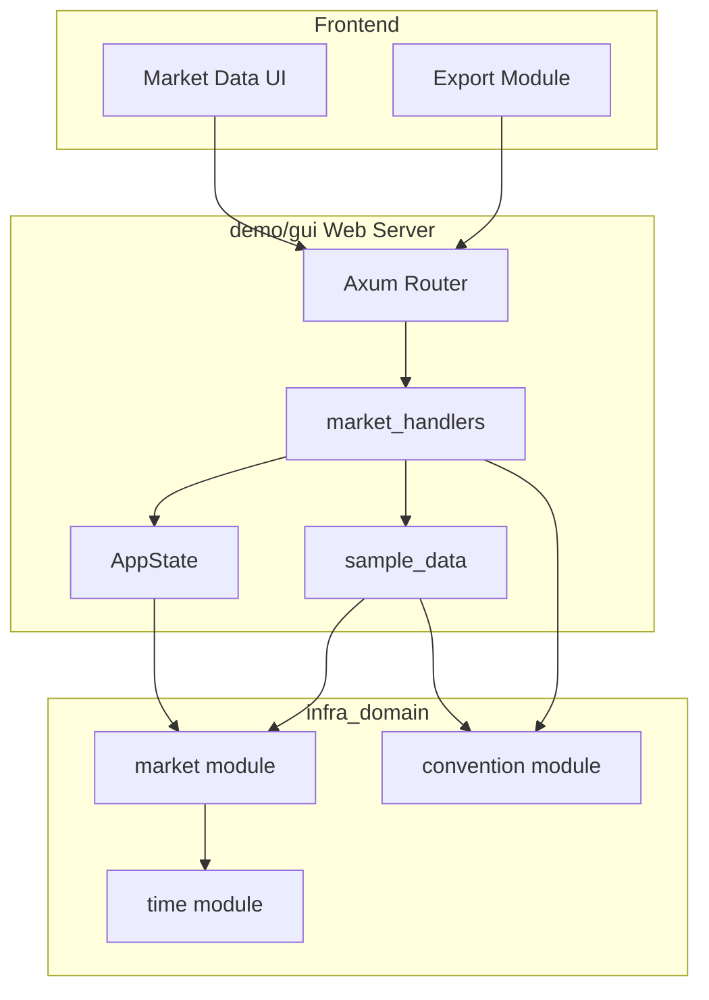
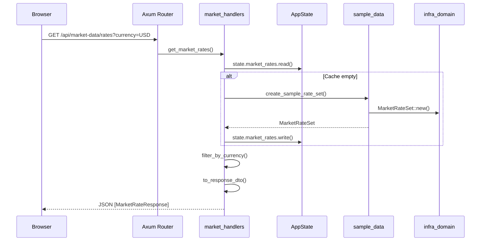
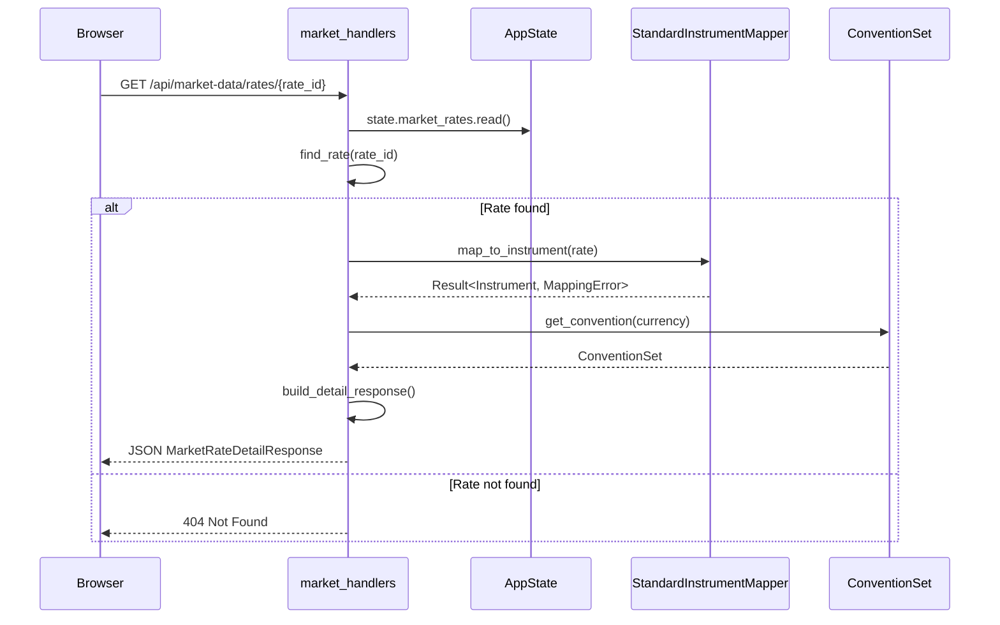
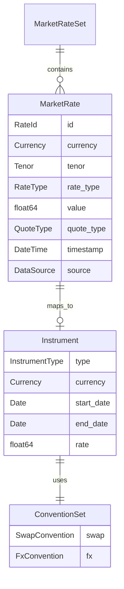

# Technical Design: Market Data Viewer WebApp

## Overview

**Purpose**: 本機能は、Frictional Bank Web App にマーケットデータ閲覧機能を提供し、リスクマネージャーおよびクオンツ開発者が USD/EUR/JPY の主要マーケットレートを効率的に確認できるようにする。

**Users**:
- **リスクマネージャー**: マーケット状況の迅速な把握、データエクスポート
- **クオンツ開発者**: Instrument/Convention 紐付け情報の確認、カーブ構築の検証

**Impact**: 既存の `demo/gui` Web インフラに新規 API エンドポイントと UI セクションを追加。`infra_domain::market` および `infra_domain::trade::convention` モジュールを活用し、バックエンドからフロントエンドへの一貫したデータフローを実現する。

### Goals

- USD/EUR/JPY の主要マーケットレート（SOFR、EURIBOR、TONAR、Swap rates、FX forward points）を体系的に表示
- 各レートに紐付く Instrument 情報と Convention 設定を詳細パネルで閲覧可能にする
- REST API 経由でプログラマティックアクセスを提供
- CSV/JSON 形式でのデータエクスポート機能を実装

### Non-Goals

- リアルタイムマーケットデータフィードの接続（`adapter_feeds` の責務）
- マーケットレートの編集・更新機能（読み取り専用ビューア）
- ヒストリカルデータの表示（本フェーズはスナップショットデータのみ）
- カーブ構築・キャリブレーション機能（既存の Bootstrap 画面の責務）
- 認証・認可機能（デモアプリケーションのため）

---

## Architecture

### Existing Architecture Analysis

本機能は既存の `demo/gui` Web インフラを拡張する。

**既存パターンの活用**:
- Axum ベースの REST API ハンドラー（`handlers.rs`, `trade_handlers.rs`）
- `AppState` による共有状態管理（`Arc<RwLock<T>>`）
- 静的ファイル配信（`tower-http::ServeDir`）
- Glass morphism デザインシステム（`index.html`, `style.css`）

**統合ポイント**:
- `infra_domain::market`: `MarketRate`, `MarketRateSet`, `RateId`, `RateType`, `StandardInstrumentMapper`
- `infra_domain::trade::convention`: `SwapConvention`, `FxConvention`, `ConventionSet`
- `infra_domain::time`: `Date`, `Tenor`

### Architecture Pattern & Boundary Map



**Architecture Integration**:
- **Selected pattern**: Layered Architecture（既存の demo/gui パターン踏襲）
- **Domain boundaries**:
  - `market_types.rs` - Web API 専用 DTO
  - `market_handlers.rs` - REST エンドポイントハンドラー
  - `sample_data.rs` - デモ用サンプルデータ生成
- **Existing patterns preserved**:
  - Axum State extraction パターン
  - JSON シリアライゼーション（serde + camelCase）
  - Result-based エラーハンドリング
- **New components rationale**:
  - 既存の pricer_types.rs / trade_handlers.rs パターンを踏襲した専用モジュール追加
- **Steering compliance**: A-I-P-S 依存ルール遵守（demo/gui は S 層として I 層の infra_domain に依存）

### Technology Stack

| Layer | Choice / Version | Role in Feature | Notes |
|-------|------------------|-----------------|-------|
| Frontend | Vanilla JS + D3.js | テーブル描画、ソート、フィルタリング | 既存ライブラリ活用 |
| Frontend | XLSX.js | CSV/Excel エクスポート | 既存ライブラリ活用 |
| Backend | Axum 0.7+ | REST API ルーティング | 既存依存 |
| Backend | Serde | JSON シリアライゼーション | `serde` feature 必須 |
| Data | infra_domain | MarketRateSet, ConventionSet | 既存クレート |
| Data | In-memory cache | RwLock<MarketRateSet> | AppState 拡張 |

---

## System Flows

### Market Data Loading Flow



### Rate Detail with Instrument/Convention Flow



---

## Requirements Traceability

| Requirement | Summary | Components | Interfaces | Flows |
|-------------|---------|------------|------------|-------|
| 1.1-1.5 | マーケットレートデータセット定義 | sample_data, MarketRateResponse | GET /api/market-data/rates | Loading Flow |
| 2.1-2.5 | Instrument 紐付け情報表示 | market_handlers, InstrumentResponse | GET /api/market-data/rates/{id} | Detail Flow |
| 3.1-3.5 | Convention 情報表示 | ConventionResponse, ConventionField | GET /api/market-data/rates/{id} | Detail Flow |
| 4.1-4.6 | Web App データ閲覧画面 | Market Data UI (HTML/JS) | - | - |
| 5.1-5.7 | REST API エンドポイント | market_handlers | All API endpoints | All Flows |
| 6.1-6.6 | データ更新とリフレッシュ | Market Data UI, refresh handler | GET /api/market-data/rates | Loading Flow |
| 7.1-7.5 | データエクスポート機能 | Export Module (JS) | - | - |

---

## Components and Interfaces

### Summary Table

| Component | Domain/Layer | Intent | Req Coverage | Key Dependencies | Contracts |
|-----------|--------------|--------|--------------|------------------|-----------|
| market_types | Web/DTO | API レスポンス型定義 | 1.1-1.5, 2.1-2.5, 3.1-3.5 | serde (P0) | - |
| market_handlers | Web/Handler | REST API ハンドラー | 5.1-5.7 | AppState (P0), market_types (P0) | API |
| sample_data | Web/Data | サンプルレートセット生成 | 1.2 | infra_domain::market (P0) | Service |
| Market Data UI | Frontend | データ閲覧画面 | 4.1-4.6, 6.1-6.6 | market_handlers API (P0) | - |
| Export Module | Frontend | CSV/JSON エクスポート | 7.1-7.5 | XLSX.js (P1) | - |

---

### Web/DTO Layer

#### market_types

| Field | Detail |
|-------|--------|
| Intent | Web API 用リクエスト/レスポンス DTO 定義 |
| Requirements | 1.1-1.5, 2.1-2.5, 3.1-3.5, 5.4 |

**Responsibilities & Constraints**
- `infra_domain` 型から Web API 用 DTO への変換責務
- JSON シリアライゼーション（camelCase）
- フロントエンド JavaScript との互換性確保

**Dependencies**
- Outbound: `serde` — JSON シリアライズ (P0)
- Outbound: `infra_domain::market` — ドメイン型参照 (P0)

**Contracts**: Service [x]

##### Service Interface

```rust
/// マーケットレート API レスポンス
#[derive(Debug, Clone, Serialize, Deserialize)]
#[serde(rename_all = "camelCase")]
pub struct MarketRateResponse {
    pub id: String,
    pub currency: String,
    pub tenor: String,
    pub rate_type: String,
    pub value: f64,
    pub quote_type: String,
    pub timestamp: i64,
    pub source: String,
    pub is_stale: bool,
}

/// マーケットレート詳細レスポンス（Instrument/Convention 含む）
#[derive(Debug, Clone, Serialize, Deserialize)]
#[serde(rename_all = "camelCase")]
pub struct MarketRateDetailResponse {
    pub rate: MarketRateResponse,
    pub instrument: Option<InstrumentResponse>,
    pub convention: Option<ConventionResponse>,
}

/// Instrument レスポンス
#[derive(Debug, Clone, Serialize, Deserialize)]
#[serde(rename_all = "camelCase")]
pub struct InstrumentResponse {
    pub instrument_type: String,
    pub currency: String,
    pub start_date: String,
    pub end_date: String,
    pub rate: f64,
    pub parameters: HashMap<String, serde_json::Value>,
}

/// Convention レスポンス
#[derive(Debug, Clone, Serialize, Deserialize)]
#[serde(rename_all = "camelCase")]
pub struct ConventionResponse {
    pub convention_type: String,
    pub fields: Vec<ConventionField>,
}

/// Convention フィールド（キー/値ペア）
#[derive(Debug, Clone, Serialize, Deserialize)]
#[serde(rename_all = "camelCase")]
pub struct ConventionField {
    pub label: String,
    pub value: String,
}

/// レート一覧レスポンス（メタデータ含む）
#[derive(Debug, Clone, Serialize, Deserialize)]
#[serde(rename_all = "camelCase")]
pub struct MarketRatesListResponse {
    pub rates: Vec<MarketRateResponse>,
    pub last_updated: i64,
    pub total_count: usize,
}

/// クエリパラメータ
#[derive(Debug, Clone, Deserialize)]
#[serde(rename_all = "camelCase")]
pub struct MarketRateQuery {
    pub currency: Option<String>,
    pub rate_type: Option<String>,
    pub index: Option<String>,
}

/// Convention 一覧レスポンス
#[derive(Debug, Clone, Serialize, Deserialize)]
#[serde(rename_all = "camelCase")]
pub struct ConventionsListResponse {
    pub conventions: Vec<ConventionSummary>,
}

/// Convention サマリ
#[derive(Debug, Clone, Serialize, Deserialize)]
#[serde(rename_all = "camelCase")]
pub struct ConventionSummary {
    pub id: String,
    pub currency: String,
    pub convention_type: String,
    pub is_default: bool,
}

/// API エラーレスポンス
#[derive(Debug, Clone, Serialize, Deserialize)]
#[serde(rename_all = "camelCase")]
pub struct ApiError {
    pub error: String,
    pub message: String,
    pub details: Option<String>,
}
```

- Preconditions: 入力データは JSON パース可能
- Postconditions: 全フィールドは camelCase でシリアライズ
- Invariants: Option<T> フィールドは null として出力

---

### Web/Handler Layer

#### market_handlers

| Field | Detail |
|-------|--------|
| Intent | マーケットデータ REST API エンドポイントハンドラー |
| Requirements | 5.1-5.7 |

**Responsibilities & Constraints**
- HTTP リクエストのパース、バリデーション
- AppState からのデータ取得
- DTO 変換とレスポンス生成
- エラーハンドリング（404, 400, 500）

**Dependencies**
- Inbound: Axum Router — HTTP ルーティング (P0)
- Outbound: AppState — MarketRateSet キャッシュ (P0)
- Outbound: market_types — DTO 型 (P0)
- Outbound: sample_data — サンプルデータ生成 (P1)

**Contracts**: API [x]

##### API Contract

| Method | Endpoint | Request | Response | Errors |
|--------|----------|---------|----------|--------|
| GET | /api/market-data/rates | MarketRateQuery (query) | MarketRatesListResponse | 400 (invalid query) |
| GET | /api/market-data/rates/{rate_id} | rate_id (path) | MarketRateDetailResponse | 404 (not found), 400 (invalid id) |
| GET | /api/market-data/conventions | - | ConventionsListResponse | - |
| GET | /api/market-data/conventions/{convention_id} | convention_id (path) | ConventionResponse | 404 (not found) |

##### Handler Signatures

```rust
/// GET /api/market-data/rates
pub async fn get_market_rates(
    State(state): State<Arc<AppState>>,
    Query(params): Query<MarketRateQuery>,
) -> Result<Json<MarketRatesListResponse>, (StatusCode, Json<ApiError>)>;

/// GET /api/market-data/rates/{rate_id}
pub async fn get_market_rate_detail(
    State(state): State<Arc<AppState>>,
    Path(rate_id): Path<String>,
) -> Result<Json<MarketRateDetailResponse>, (StatusCode, Json<ApiError>)>;

/// GET /api/market-data/conventions
pub async fn get_conventions(
    State(state): State<Arc<AppState>>,
) -> Json<ConventionsListResponse>;

/// GET /api/market-data/conventions/{convention_id}
pub async fn get_convention_detail(
    State(state): State<Arc<AppState>>,
    Path(convention_id): Path<String>,
) -> Result<Json<ConventionResponse>, (StatusCode, Json<ApiError>)>;
```

**Implementation Notes**
- Integration: 既存の `trade_handlers.rs` パターンを踏襲
- Validation: rate_id フォーマット検証（`{CURRENCY}-{TENOR}-{TYPE}`）
- Risks: サンプルデータ初期化の競合（RwLock で保護）

---

### Web/Data Layer

#### sample_data

| Field | Detail |
|-------|--------|
| Intent | デモ用マーケットレートセットの生成 |
| Requirements | 1.2 |

**Responsibilities & Constraints**
- USD/EUR/JPY の主要レートデータ生成
- リアルな市場レート値の設定
- Convention プリセットの紐付け

**Dependencies**
- Outbound: `infra_domain::market` — MarketRateSet, MarketRate (P0)
- Outbound: `infra_domain::trade::convention` — ConventionSet (P0)
- Outbound: `infra_domain::time` — Date, Tenor (P0)

**Contracts**: Service [x]

##### Service Interface

```rust
/// サンプルマーケットレートセットを生成
pub fn create_sample_rate_set(valuation_date: Date) -> MarketRateSet;

/// 通貨別コンベンションセットを取得
pub fn get_convention_sets() -> HashMap<String, ConventionSet>;

/// サンプルレートデータ定義
struct SampleRateData {
    currency: Currency,
    index: Option<RateIndex>,
    tenor: Tenor,
    rate_type: RateType,
    value: f64,
}
```

##### Sample Data Specification

| Currency | Index | Tenors | Rate Type | Value Range |
|----------|-------|--------|-----------|-------------|
| USD | SOFR | ON, 1W, 1M, 3M, 6M, 1Y | Ois | 4.25% - 4.75% |
| USD | - | 2Y, 3Y, 5Y, 7Y, 10Y, 15Y, 20Y, 30Y | Swap | 3.80% - 4.50% |
| EUR | EURIBOR | 1M, 3M, 6M, 1Y | Deposit | 3.50% - 4.00% |
| EUR | - | 2Y, 3Y, 5Y, 7Y, 10Y, 15Y, 20Y, 30Y | Swap | 2.80% - 3.50% |
| JPY | TONAR | ON, 1W, 1M, 3M, 6M, 1Y | Ois | -0.10% - 0.25% |
| JPY | - | 2Y, 3Y, 5Y, 7Y, 10Y, 15Y, 20Y, 30Y | Swap | 0.30% - 1.50% |
| - | - | USDJPY Spot | FxSpot | 150.00 |
| - | - | EURUSD Spot | FxSpot | 1.0850 |

**Implementation Notes**
- Integration: `MarketRateSet::builder()` パターン使用
- Validation: 全レートに有効なタイムスタンプ設定
- Risks: ハードコードされたレート値（将来的には JSON 設定ファイル化を検討）

---

### Frontend Layer

#### Market Data UI

| Field | Detail |
|-------|--------|
| Intent | マーケットデータ閲覧画面の提供 |
| Requirements | 4.1-4.6, 6.1-6.6 |

**Responsibilities & Constraints**
- 通貨セレクタ、タイプフィルタ、検索ボックスの提供
- ソート可能なデータテーブル表示
- レート詳細パネル（Instrument/Convention 情報）
- リフレッシュ機能とローディング表示

**Dependencies**
- Outbound: market_handlers API — データ取得 (P0)
- Outbound: D3.js — テーブル描画 (P1)

**Implementation Notes**
- Integration: 既存の `index.html` に Market Data セクション追加
- Validation: 入力フィールドのクライアントサイドバリデーション
- Risks: 大量レート表示時のパフォーマンス（ページングまたは仮想スクロール検討）

##### UI Component Structure

```
Market Data Section
├── Header
│   ├── Title: "Market Data"
│   ├── Last Updated timestamp
│   └── Refresh Button
├── Filters
│   ├── Currency Tabs (USD | EUR | JPY | All)
│   ├── Rate Type Multi-select
│   └── Search Input
├── Rate Table
│   ├── Columns: Rate ID, Currency, Tenor, Type, Value, Quote, Timestamp
│   ├── Sortable headers
│   └── Clickable rows → Detail Panel
├── Detail Panel (side panel or modal)
│   ├── Rate Metadata
│   ├── Instrument Details
│   └── Convention Table
└── Export Section
    ├── CSV Button
    └── JSON Button
```

#### Export Module

| Field | Detail |
|-------|--------|
| Intent | マーケットデータの CSV/JSON エクスポート |
| Requirements | 7.1-7.5 |

**Responsibilities & Constraints**
- 現在のフィルタ設定を反映したデータエクスポート
- CSV: ヘッダー行 + データ行
- JSON: メタデータセクション + rates 配列

**Dependencies**
- Outbound: XLSX.js — Excel/CSV 生成 (P1)

**Implementation Notes**
- Integration: 既存の XLSX ライブラリ活用
- Validation: エクスポート前にデータ存在確認
- Risks: 大量データエクスポート時のブラウザメモリ使用

---

## Data Models

### Domain Model



**Aggregates**:
- `MarketRateSet`: レートコレクションの集約ルート
- `ConventionSet`: コンベンション設定の集約

**Invariants**:
- `RateId` は一意（Currency + Tenor + RateType の複合キー）
- `MarketRate.value` は有効な数値（NaN/Inf 不可）
- `timestamp` は現在時刻以前

### Data Contracts & Integration

**API Data Transfer**

Request/Response は market_types セクションで定義済み。

**Serialization Format**: JSON (Content-Type: application/json)

**Validation Rules**:
- `currency`: ISO 4217 コード (USD, EUR, JPY)
- `rate_id`: `{CURRENCY}-{TENOR}-{TYPE}` フォーマット
- `convention_id`: `{CURRENCY}-{TYPE}` フォーマット

---

## Error Handling

### Error Categories and Responses

**User Errors (4xx)**:
- 400 Bad Request: 不正なクエリパラメータ、無効な rate_id フォーマット
- 404 Not Found: 存在しない rate_id または convention_id

**System Errors (5xx)**:
- 500 Internal Server Error: Instrument マッピング失敗、予期しないエラー

### Error Response Format

```json
{
  "error": "not_found",
  "message": "Rate with ID 'USD-99Y-Swap' not found",
  "details": null
}
```

### Monitoring

- API レスポンスタイム計測（既存の metrics インフラ活用）
- エラーログ出力（tracing クレート）

---

## Testing Strategy

### Unit Tests

- `market_types`: DTO シリアライズ/デシリアライズ検証
- `sample_data`: サンプルデータ生成の網羅性検証
- `market_handlers`: クエリパラメータパース、フィルタリングロジック

### Integration Tests

- API エンドポイント全体フロー（GET /api/market-data/rates）
- Instrument マッピング成功/失敗ケース
- Convention 取得フロー

### E2E Tests (Manual)

- 通貨タブ切り替えとフィルタリング
- レート行クリック → 詳細パネル表示
- CSV/JSON エクスポートダウンロード

---

## Performance & Scalability

**Target Metrics**:
- 初期ページロード: < 2 秒
- API レスポンス: < 500ms
- テーブル描画: 500 行まで遅延なし

**Optimization Techniques**:
- `MarketRateSet` のインメモリキャッシュ（RwLock）
- HashMap ベースの O(1) レート検索
- 遅延 Instrument マッピング（詳細リクエスト時のみ）

---

## Supporting References

### AppState Extension

```rust
// demo/gui/src/web/mod.rs への追加
pub struct AppState {
    // 既存フィールド...

    /// Market rate cache
    pub market_rates: RwLock<Option<MarketRateSet>>,
    /// Convention cache
    pub conventions: RwLock<HashMap<String, ConventionSet>>,
    /// Last update timestamp
    pub market_data_updated_at: RwLock<Option<i64>>,
}
```

### Router Extension

```rust
// demo/gui/src/web/mod.rs - build_router への追加
let api_routes = Router::new()
    // 既存ルート...

    // Market Data API
    .route("/market-data/rates", get(market_handlers::get_market_rates))
    .route("/market-data/rates/:rate_id", get(market_handlers::get_market_rate_detail))
    .route("/market-data/conventions", get(market_handlers::get_conventions))
    .route("/market-data/conventions/:convention_id", get(market_handlers::get_convention_detail));
```

### Cargo.toml Dependency

```toml
# demo/gui/Cargo.toml - serde feature 確認
[dependencies]
infra_domain = { path = "../../crates/infra_domain", features = ["serde"] }
```
