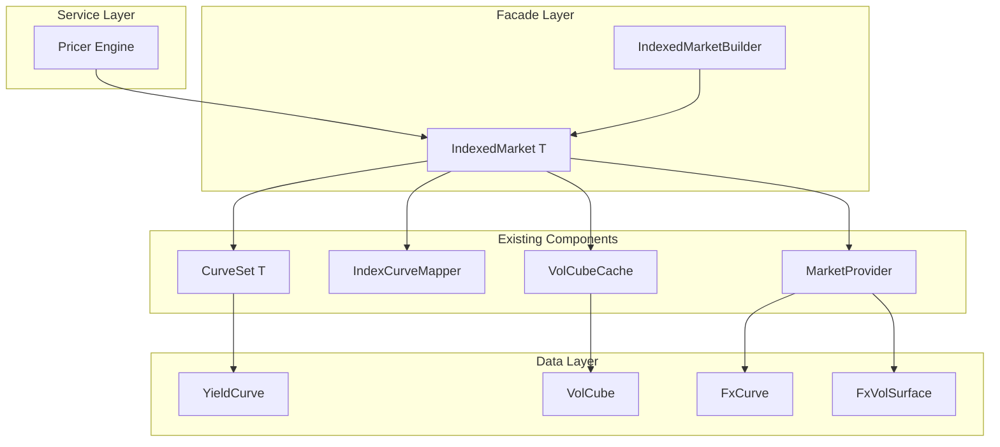
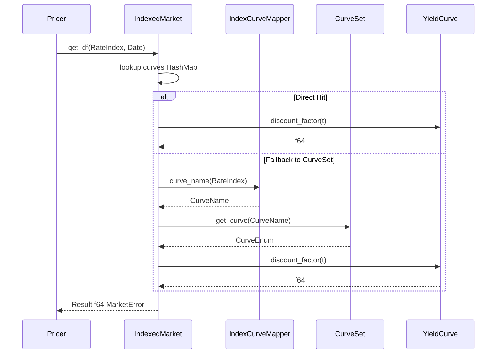
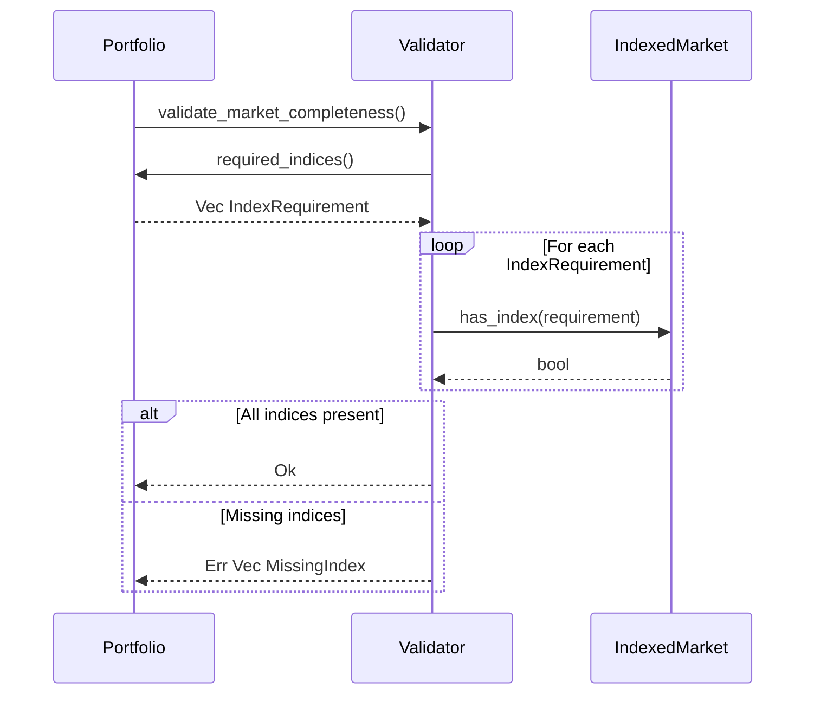
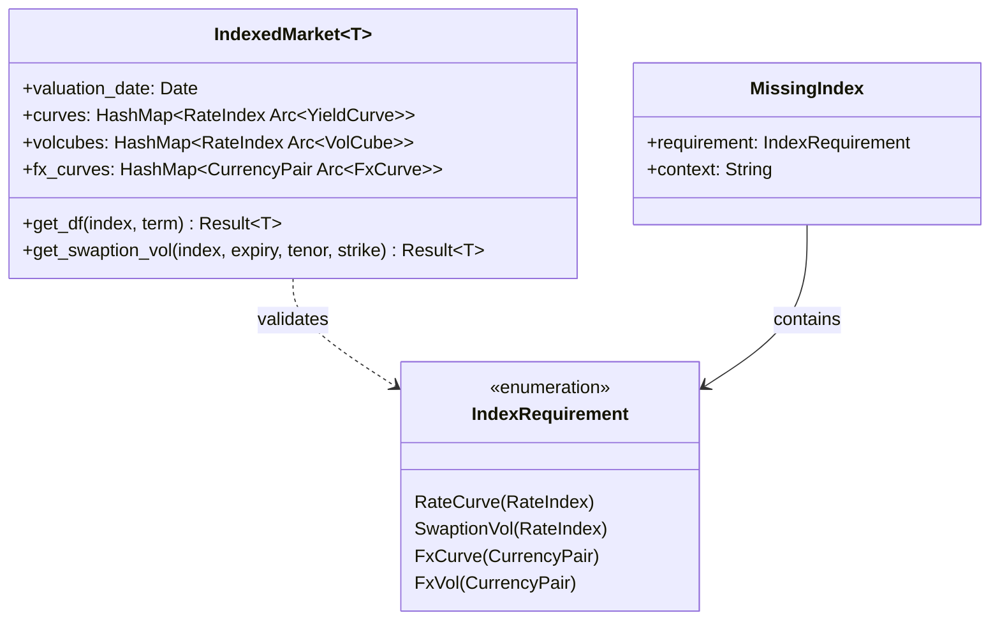

# Technical Design: Market Index-Keyed Access

## Overview

**Purpose**: 本機能は、PricerにおけるMarketデータアクセスをIndex単位で統一化するためのファサード層を提供する。これにより、Curve（含Builder）やVolCube（含Builder）への`get_df(index, term)`や`get_bs_vol(index, tenor, term)`といったIndex-keyedな直感的APIを実現する。

**Users**: クオンツ開発者、Pricingエンジン、リスク管理者が、統一されたMarket APIを通じて効率的にMarketデータにアクセスできる。

**Impact**: 既存のCurveSet/MarketProvider/IndexCurveMapperを内部で活用しつつ、新規`IndexedMarket<T>`構造体によるファサードパターンで統一APIを提供。後方互換性を維持しながら段階的移行を可能にする。

### Goals

- Index（RateIndex, CurrencyPair）をキーとした統一Market API提供
- O(1) ルックアップ性能の維持（内部HashMap活用）
- 既存CurveSet/MarketProvider/VolCubeキャッシュとの互換性維持
- Trade/Portfolio単位での網羅性検証機能の提供

### Non-Goals

- 既存CurveSet/MarketProviderの内部構造変更（Phase 1では行わない）
- Equity/Commodity VolatilityIndex対応（将来フェーズ）
- リアルタイムMarketデータストリーミング統合

## Architecture

### Existing Architecture Analysis

**現状のデータフロー**:
```
RateIndex → IndexCurveMapper → CurveName → CurveSet → CurveEnum
                                                      ↓
                                               discount_factor(t)
```

**既存パターン**:
- `CurveSet<T>`: HashMap<CurveName, CurveEnum<T>>でCurve保持
- `IndexCurveMapper`: RateIndex→CurveNameのマッピングtrait
- `MarketProvider`: Currency単位のキャッシュ機構
- `VolCubeProviderKey`: (Currency, UnderlyingIndex)でVolCubeキー化

**維持すべき制約**:
- A-I-P-S依存方向（Pricer層はAdapterに依存しない）
- Static dispatch（Enzyme AD互換性）
- Arc<T>による共有所有権パターン

### Architecture Pattern & Boundary Map



**Architecture Integration**:
- **Selected pattern**: Facade Pattern — 既存コンポーネントをラップして統一API提供
- **Domain boundaries**: IndexedMarketはpricer_models::market内に配置、infra_masterには最小限の型定義のみ追加
- **Existing patterns preserved**: CurveSet, IndexCurveMapper, MarketProviderの内部実装は変更なし
- **New components rationale**: IndexedMarket（統一ファサード）、IndexRequirement（Trade検証用）、MarketValidationError（検証エラー）
- **Steering compliance**: A-I-P-S依存方向維持、Static dispatch維持

### Technology Stack

| Layer | Choice / Version | Role in Feature | Notes |
|-------|------------------|-----------------|-------|
| Data Structure | `std::collections::HashMap` | Index→Data O(1)ルックアップ | 既存CurveSetと同一パターン |
| Shared Ownership | `std::sync::Arc` | Thread-safe共有 | 既存パターン継続 |
| Error Handling | `thiserror` | 構造化エラー型 | MarketValidationError追加 |
| Type Safety | `#[derive(Hash, Eq)]` | HashMap key互換 | RateIndex, CurrencyPair既存 |

## System Flows

### Market Data Access Flow



### Market Validation Flow



## Requirements Traceability

| Requirement | Summary | Components | Interfaces | Flows |
|-------------|---------|------------|------------|-------|
| 1.1-1.5 | Index型標準化 | IndexRequirement | - | - |
| 2.1-2.6 | Curve Index-Keyed API | IndexedMarket | get_df, get_forward_rate, get_zero_rate | Market Data Access |
| 3.1-3.6 | VolCube Index-Keyed API | IndexedMarket | get_bs_vol, get_swaption_vol, get_fx_vol | Market Data Access |
| 4.1-4.6 | IndexCurveMapper統合 | IndexedMarket, IndexMarketMapper | register_*, get_* | - |
| 5.1-5.6 | Market構造体設計 | IndexedMarket | curves, volcubes, fx_curves, fx_vol_surfaces | - |
| 6.1-6.6 | Builder API | IndexedMarketBuilder | for_index, for_pair, build | - |
| 7.1-7.5 | 網羅性検証 | TradeIndexRequirements, MarketValidator | required_indices, validate_completeness | Market Validation |
| 8.1-8.5 | 後方互換性 | - | deprecated属性 | - |

## Components and Interfaces

### Component Summary

| Component | Domain/Layer | Intent | Req Coverage | Key Dependencies | Contracts |
|-----------|--------------|--------|--------------|-----------------|-----------|
| IndexedMarket | pricer_models::market | 統一Market API提供 | 1-5 | CurveSet (P0), VolCubeCache (P1), MarketProvider (P1) | Service |
| IndexedMarketBuilder | pricer_models::market | IndexedMarket構築 | 6 | CurveBuilder (P1), VolCubeBuilder (P1) | Service |
| IndexRequirement | infra_master::trade | Trade必要Index型 | 7.3 | RateIndex (P0), CurrencyPair (P0) | - |
| TradeIndexRequirements | infra_master::trade | Trade Index抽出trait | 7.3 | Trade (P0), Cashflow (P0) | Service |
| MarketValidator | pricer_models::market | Market網羅性検証 | 7.1-7.5 | IndexedMarket (P0), Portfolio (P1) | Service |
| MarketValidationError | pricer_models::market | 検証エラー型 | 1.4, 7.5 | - | - |

### pricer_models::market

#### IndexedMarket<T>

| Field | Detail |
|-------|--------|
| Intent | Index-keyedな統一Market API提供（ファサード） |
| Requirements | 1.1-1.5, 2.1-2.6, 3.1-3.6, 4.1-4.6, 5.1-5.6 |

**Responsibilities & Constraints**
- 全MarketデータへのIndex-keyed統一アクセス提供
- 内部でCurveSet, VolCubeCache, MarketProviderを保持・活用
- Thread-safe（Arc<T>による共有、Immutable after build）

**Dependencies**
- Inbound: Pricer Engine — Market data access (P0)
- Internal: CurveSet<T> — Yield curve storage (P0)
- Internal: IndexCurveMapper — RateIndex→CurveName mapping (P0)
- Internal: VolCubeCache — VolCube caching (P1)
- Internal: MarketProvider — FX curve/vol caching (P1)

**Contracts**: Service [x]

##### Service Interface

```rust
pub struct IndexedMarket<T: Float + Send + Sync> {
    valuation_date: Date,
    curves: HashMap<RateIndex, Arc<dyn YieldCurve<T> + Send + Sync>>,
    volcubes: HashMap<RateIndex, Arc<VolCube<T>>>,
    fx_curves: HashMap<CurrencyPair, Arc<dyn FxCurve<T> + Send + Sync>>,
    fx_vol_surfaces: HashMap<CurrencyPair, Arc<dyn VolatilitySurface<T> + Send + Sync>>,
    // Fallback to existing components
    curve_set: Option<CurveSet<T>>,
    index_mapper: Arc<dyn IndexCurveMapper + Send + Sync>,
}

impl<T: Float + Send + Sync> IndexedMarket<T> {
    // Curve Access (Req 2.1-2.6)
    pub fn get_df(&self, index: &RateIndex, term: Date) -> Result<T, MarketError>;
    pub fn get_forward_rate(&self, index: &RateIndex, start: Date, end: Date) -> Result<T, MarketError>;
    pub fn get_zero_rate(&self, index: &RateIndex, term: Date) -> Result<T, MarketError>;

    // VolCube Access (Req 3.1-3.6)
    pub fn get_swaption_vol(&self, index: &RateIndex, expiry: Period, tenor: Period, strike: T) -> Result<T, MarketError>;

    // FX Access (Req 3.2-3.3)
    pub fn get_fx_forward(&self, pair: &CurrencyPair, term: Date) -> Result<T, MarketError>;
    pub fn get_fx_vol(&self, pair: &CurrencyPair, expiry: Date, strike: T) -> Result<T, MarketError>;

    // Validation (Req 7.1)
    pub fn validate_completeness(&self, required: &[IndexRequirement]) -> Result<(), Vec<MissingIndex>>;

    // Index Query
    pub fn has_curve(&self, index: &RateIndex) -> bool;
    pub fn has_volcube(&self, index: &RateIndex) -> bool;
    pub fn has_fx_curve(&self, pair: &CurrencyPair) -> bool;
    pub fn has_fx_vol(&self, pair: &CurrencyPair) -> bool;

    // Accessors
    pub fn valuation_date(&self) -> Date;
    pub fn available_rate_indices(&self) -> Vec<RateIndex>;
    pub fn available_currency_pairs(&self) -> Vec<CurrencyPair>;
}
```

- Preconditions: IndexedMarketBuilderによる構築完了
- Postconditions: Thread-safe、Immutable
- Invariants: valuation_dateは全term計算の基準、HashMapキーは一意

**Implementation Notes**
- Integration: CurveSet fallbackにより既存コードとの互換性維持
- Validation: get_*メソッドはキー不在時にIndexNotFoundエラー返却
- Risks: VolCube lazy evaluationとの統合に注意

#### IndexedMarketBuilder<T>

| Field | Detail |
|-------|--------|
| Intent | IndexedMarket構築用Builder API |
| Requirements | 6.1-6.6 |

**Responsibilities & Constraints**
- Builder pattern によるIndexedMarket構築
- Index指定必須の強制（for_index/for_pair）
- 構築時検証（重複Index検出）

**Dependencies**
- Outbound: IndexedMarket<T> — Build target (P0)
- External: CurveBuilder — Curve construction (P1)
- External: VolCubeBuilder — VolCube construction (P1)

**Contracts**: Service [x]

##### Service Interface

```rust
pub struct IndexedMarketBuilder<T: Float + Send + Sync> {
    valuation_date: Date,
    curves: HashMap<RateIndex, Arc<dyn YieldCurve<T> + Send + Sync>>,
    volcubes: HashMap<RateIndex, Arc<VolCube<T>>>,
    fx_curves: HashMap<CurrencyPair, Arc<dyn FxCurve<T> + Send + Sync>>,
    fx_vol_surfaces: HashMap<CurrencyPair, Arc<dyn VolatilitySurface<T> + Send + Sync>>,
    index_mapper: Option<Arc<dyn IndexCurveMapper + Send + Sync>>,
}

impl<T: Float + Send + Sync> IndexedMarketBuilder<T> {
    pub fn new(valuation_date: Date) -> Self;

    // Curve registration (Req 6.1)
    pub fn with_curve(self, index: RateIndex, curve: Arc<dyn YieldCurve<T> + Send + Sync>) -> Result<Self, MarketBuildError>;

    // VolCube registration (Req 6.2)
    pub fn with_volcube(self, index: RateIndex, volcube: Arc<VolCube<T>>) -> Result<Self, MarketBuildError>;

    // FX registration (Req 6.3-6.4)
    pub fn with_fx_curve(self, pair: CurrencyPair, curve: Arc<dyn FxCurve<T> + Send + Sync>) -> Result<Self, MarketBuildError>;
    pub fn with_fx_vol_surface(self, pair: CurrencyPair, surface: Arc<dyn VolatilitySurface<T> + Send + Sync>) -> Result<Self, MarketBuildError>;

    // Optional: existing component integration
    pub fn with_curve_set(self, curve_set: CurveSet<T>) -> Self;
    pub fn with_index_mapper(self, mapper: Arc<dyn IndexCurveMapper + Send + Sync>) -> Self;

    // Build (Req 6.6)
    pub fn build(self) -> Result<IndexedMarket<T>, MarketBuildError>;
}
```

- Preconditions: valuation_dateが有効な日付
- Postconditions: buildはImmutableなIndexedMarketを返却
- Invariants: 同一Indexへの重複登録はエラー

**Implementation Notes**
- Integration: with_curve_set()で既存CurveSetを統合可能
- Validation: build()時にvaluation_date整合性検証
- Risks: 大量Index登録時のメモリ使用量

#### MarketValidator

| Field | Detail |
|-------|--------|
| Intent | Market網羅性検証 |
| Requirements | 7.1-7.5 |

**Contracts**: Service [x]

##### Service Interface

```rust
pub struct MarketValidator<'a, T: Float + Send + Sync> {
    market: &'a IndexedMarket<T>,
}

impl<'a, T: Float + Send + Sync> MarketValidator<'a, T> {
    pub fn new(market: &'a IndexedMarket<T>) -> Self;

    // Single trade validation
    pub fn validate_trade<Tr: TradeIndexRequirements>(&self, trade: &Tr) -> Result<(), Vec<MissingIndex>>;

    // Portfolio validation (Req 7.4)
    pub fn validate_portfolio<Tr: TradeIndexRequirements>(&self, trades: &[Tr]) -> Result<(), Vec<MissingIndex>>;

    // Direct index validation
    pub fn validate_indices(&self, required: &[IndexRequirement]) -> Result<(), Vec<MissingIndex>>;
}
```

### infra_master::trade

#### IndexRequirement

| Field | Detail |
|-------|--------|
| Intent | Trade/Cashflowが必要とするIndexの型表現 |
| Requirements | 7.3 |

**Contracts**: State [x]

##### State Definition

```rust
#[derive(Debug, Clone, PartialEq, Eq, Hash)]
pub enum IndexRequirement {
    /// Rate index for discount/projection curves
    RateCurve(RateIndex),
    /// Rate index for swaption volatility cube
    SwaptionVol(RateIndex),
    /// Currency pair for FX forward curve
    FxCurve(CurrencyPair),
    /// Currency pair for FX volatility surface
    FxVol(CurrencyPair),
}
```

#### TradeIndexRequirements (trait extension)

| Field | Detail |
|-------|--------|
| Intent | Trade構造体へのrequired_indices()機能追加 |
| Requirements | 7.3 |

**Contracts**: Service [x]

##### Service Interface

```rust
pub trait TradeIndexRequirements {
    fn required_indices(&self) -> Vec<IndexRequirement>;
}

// Blanket implementation for Trade
impl TradeIndexRequirements for Trade {
    fn required_indices(&self) -> Vec<IndexRequirement> {
        let mut indices = Vec::new();
        for leg in &self.legs {
            for cashflow in &leg.cashflows {
                if let Some(obs) = &cashflow.index_observation {
                    match &obs.index_type {
                        IndexType::Rate(rate_index) => {
                            indices.push(IndexRequirement::RateCurve(rate_index.clone()));
                        }
                        IndexType::Fx { base, quote } => {
                            let pair = CurrencyPair::new(
                                Currency::from_code(base).unwrap(),
                                Currency::from_code(quote).unwrap(),
                            );
                            indices.push(IndexRequirement::FxCurve(pair));
                        }
                        _ => {}
                    }
                }
            }
        }
        indices.sort();
        indices.dedup();
        indices
    }
}
```

## Data Models

### Domain Model



**Aggregates and boundaries**:
- `IndexedMarket<T>`: Market集約ルート、全Marketデータの一貫性保証
- `IndexRequirement`: Value Object、イミュータブル

**Business rules**:
- 同一Indexへの重複登録禁止
- valuation_dateは構築後変更不可
- get_*メソッドはIndex不在時にエラー（パニックしない）

## Error Handling

### Error Categories and Responses

**MarketError variants** (pricer_models::market::error.rs 拡張):

```rust
#[derive(Error, Debug, Clone, PartialEq)]
pub enum MarketError {
    // Existing variants...

    // New Index-related variants (Req 1.4)
    #[error("Index not found: {index:?}")]
    IndexNotFound { index: String },

    #[error("Curve not built for index: {index:?}")]
    CurveNotBuilt { index: String },

    #[error("VolCube not calibrated for index: {index:?}")]
    VolCubeNotCalibrated { index: String },
}
```

**MarketBuildError** (新規):

```rust
#[derive(Error, Debug, Clone, PartialEq)]
pub enum MarketBuildError {
    #[error("Duplicate index mapping: {index:?}")]
    DuplicateIndexMapping { index: String },

    #[error("Index not specified for builder")]
    IndexNotSpecified,

    #[error("Invalid valuation date: {date}")]
    InvalidValuationDate { date: String },
}
```

### Monitoring

- エラー発生時のログ出力（`tracing::warn!`）
- MissingIndex一覧のJSON形式エクスポート対応

## Testing Strategy

### Unit Tests
- `IndexedMarket::get_df()` — 正常系・異常系（IndexNotFound）
- `IndexedMarketBuilder::build()` — 重複Index検出、正常構築
- `TradeIndexRequirements::required_indices()` — 各Cashflowタイプ
- `MarketValidator::validate_portfolio()` — 複数Trade、部分欠損

### Integration Tests
- CurveSet fallback動作検証
- VolCubeCache統合（lazy evaluation）
- MarketProvider FxCurve統合

### Performance Tests
- HashMap lookup overhead（1000 Index）
- 大規模Portfolio検証（10000 trades）

## Optional Sections

### Migration Strategy

**Phase 1: ファサード導入**
1. IndexedMarket, IndexedMarketBuilder実装
2. IndexRequirement, TradeIndexRequirements実装
3. 新規コードはIndexedMarket APIを使用
4. 既存コードは変更なし（CurveSet直接使用継続）

**Phase 2: 内部最適化**
1. IndexedMarket内部でHashMap<RateIndex, Arc<CurveEnum>>に最適化
2. CurveSet fallback依存度低減
3. パフォーマンスベンチマーク

**Phase 3: 非推奨化**
1. CurveSet直接アクセスAPIに`#[deprecated]`属性追加
2. Migration guide公開
3. 警告期間後の削除検討

### Performance & Scalability

**Target metrics**:
- get_df() latency: < 100ns（HashMap lookup + discount_factor計算）
- validate_completeness(): < 1ms per 1000 trades

**Optimization**:
- HashMap pre-allocation（with_capacityでIndex数を指定）
- Arc<T>による参照共有（Clone不要）

