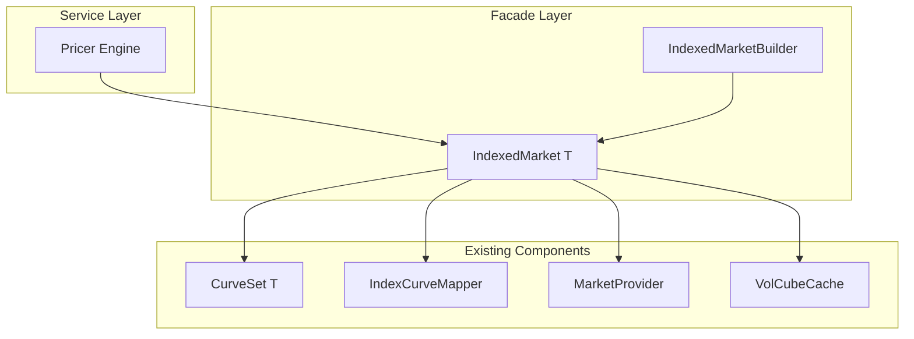

# Technical Design: Market Index-Keyed Access

## Overview

**Purpose**: 本機能は、PricerにおけるMarketデータアクセスをIndex単位で統一化するためのファサード層を提供する。これにより、Curve（含Builder）やVolCube（含Builder）への`get_df(index, term)`や`get_bs_vol(index, tenor, term)`といったIndex-keyedな直感的APIを実現する。

**Users**: クオンツ開発者、Pricingエンジン、リスク管理者が、統一されたMarket APIを通じて効率的にMarketデータにアクセスできる。

**Impact**: 既存のCurveSet/MarketProvider/IndexCurveMapperを内部で活用しつつ、新規`IndexedMarket<T>`構造体によるファサードパターンで統一APIを提供。後方互換性を維持しながら段階的移行を可能にする。

### Goals

- Index（RateIndex, CurrencyPair）をキーとした統一Market API提供
- O(1) ルックアップ性能の維持（内部HashMap活用）
- 既存CurveSet/MarketProvider/VolCubeキャッシュとの互換性維持
- Trade/Portfolio単位での網羅性検証機能の提供

## Architecture

### Existing Architecture Analysis

**現状のデータフロー**:
```
RateIndex → IndexCurveMapper → CurveName → CurveSet → CurveEnum
                                                      ↓
                                               discount_factor(t)
```

**既存パターン**:
- `CurveSet<T>`: HashMap<CurveName, CurveEnum<T>>でCurve保持
- `IndexCurveMapper`: RateIndex→CurveNameのマッピングtrait
- `MarketProvider`: Currency単位のキャッシュ機構
- `VolCubeProviderKey`: (Currency, UnderlyingIndex)でVolCubeキー化

**維持すべき制約**:
- A-I-P-S依存方向（Pricer層はAdapterに依存しない）
- Static dispatch（Enzyme AD互換性）
- Arc<T>による共有所有権パターン

### Architecture Pattern & Boundary Map



**Architecture Integration**:
- **Selected pattern**: Facade Pattern — 既存コンポーネントをラップして統一API提供
- **Domain boundaries**: IndexedMarketはpricer_models::market内に配置、infra_domainには最小限の型定義のみ追加
- **Existing patterns preserved**: CurveSet, IndexCurveMapper, MarketProviderの内部実装は変更なし
- **New components rationale**: IndexedMarket（統一ファサード）、IndexRequirement（Trade検証用）、MarketValidationError（検証エラー）
- **Steering compliance**: A-I-P-S依存方向維持、Static dispatch維持

## Requirements Traceability

| Requirement | Summary | Components | Interfaces | Flows |
|-------------|---------|------------|------------|-------|
| 1.1-1.5 | Index型標準化 | IndexRequirement | - | - |
| 2.1-2.6 | Curve Index-Keyed API | IndexedMarket | get_df, get_forward_rate, get_zero_rate | Market Data Access |
| 3.1-3.6 | VolCube Index-Keyed API | IndexedMarket | get_bs_vol, get_swaption_vol, get_fx_vol | Market Data Access |
| 4.1-4.6 | IndexCurveMapper統合 | IndexedMarket, IndexMarketMapper | register_*, get_* | - |
| 5.1-5.6 | Market構造体設計 | IndexedMarket | curves, volcubes, fx_curves, fx_vol_surfaces | - |
| 6.1-6.6 | Builder API | IndexedMarketBuilder | for_index, for_pair, build | - |
| 7.1-7.5 | 網羅性検証 | TradeIndexRequirements, MarketValidator | required_indices, validate_completeness | Market Validation |
| 8.1-8.5 | 後方互換性 | - | deprecated属性 | - |

## Components and Interfaces

### Component Summary

| Component | Domain/Layer | Intent | Req Coverage | Key Dependencies | Contracts |
|-----------|--------------|--------|--------------|-----------------|-----------|
| IndexedMarket | pricer_models::market | 統一Market API提供 | 1-5 | CurveSet (P0), VolCubeCache (P1), MarketProvider (P1) | Service |
| IndexedMarketBuilder | pricer_models::market | IndexedMarket構築 | 6 | CurveBuilder (P1), VolCubeBuilder (P1) | Service |
| IndexRequirement | infra_domain::trade | Trade必要Index型 | 7.3 | RateIndex (P0), CurrencyPair (P0) | - |
| TradeIndexRequirements | infra_domain::trade | Trade Index抽出trait | 7.3 | Trade (P0), Cashflow (P0) | Service |
| MarketValidator | pricer_models::market | Market網羅性検証 | 7.1-7.5 | IndexedMarket (P0), Portfolio (P1) | Service |
| MarketValidationError | pricer_models::market | 検証エラー型 | 1.4, 7.5 | - | - |

### pricer_models::market

#### IndexedMarket<T>

**Intent**: Index-keyedな統一Market API提供（ファサード）

**Responsibilities & Constraints**
- 全MarketデータへのIndex-keyed統一アクセス提供
- 内部でCurveSet, VolCubeCache, MarketProviderを保持・活用
- Thread-safe（Arc<T>による共有、Immutable after build）

**Service Interface**

```rust
pub struct IndexedMarket<T: Float + Send + Sync> {
    valuation_date: Date,
    curves: HashMap<RateIndex, Arc<dyn YieldCurve<T> + Send + Sync>>,
    volcubes: HashMap<RateIndex, Arc<VolCube<T>>>,
    fx_curves: HashMap<CurrencyPair, Arc<dyn FxCurve<T> + Send + Sync>>,
    fx_vol_surfaces: HashMap<CurrencyPair, Arc<dyn VolatilitySurface<T> + Send + Sync>>,
    curve_set: Option<CurveSet<T>>,
    index_mapper: Arc<dyn IndexCurveMapper + Send + Sync>,
}

impl<T: Float + Send + Sync> IndexedMarket<T> {
    pub fn get_df(&self, index: &RateIndex, term: Date) -> Result<T, MarketError>;
    pub fn get_forward_rate(&self, index: &RateIndex, start: Date, end: Date) -> Result<T, MarketError>;
    pub fn get_zero_rate(&self, index: &RateIndex, term: Date) -> Result<T, MarketError>;
    pub fn get_swaption_vol(&self, index: &RateIndex, expiry: Period, tenor: Period, strike: T) -> Result<T, MarketError>;
    pub fn get_fx_forward(&self, pair: &CurrencyPair, term: Date) -> Result<T, MarketError>;
    pub fn get_fx_vol(&self, pair: &CurrencyPair, expiry: Date, strike: T) -> Result<T, MarketError>;
    pub fn validate_completeness(&self, required: &[IndexRequirement]) -> Result<(), Vec<MissingIndex>>;
    pub fn has_curve(&self, index: &RateIndex) -> bool;
    pub fn has_volcube(&self, index: &RateIndex) -> bool;
    pub fn has_fx_curve(&self, pair: &CurrencyPair) -> bool;
    pub fn has_fx_vol(&self, pair: &CurrencyPair) -> bool;
    pub fn valuation_date(&self) -> Date;
    pub fn available_rate_indices(&self) -> Vec<RateIndex>;
    pub fn available_currency_pairs(&self) -> Vec<CurrencyPair>;
}
```

#### IndexedMarketBuilder<T>

**Intent**: IndexedMarket構築用Builder API

**Service Interface**

```rust
pub struct IndexedMarketBuilder<T: Float + Send + Sync> {
    valuation_date: Date,
    curves: HashMap<RateIndex, Arc<dyn YieldCurve<T> + Send + Sync>>,
    volcubes: HashMap<RateIndex, Arc<VolCube<T>>>,
    fx_curves: HashMap<CurrencyPair, Arc<dyn FxCurve<T> + Send + Sync>>,
    fx_vol_surfaces: HashMap<CurrencyPair, Arc<dyn VolatilitySurface<T> + Send + Sync>>,
    index_mapper: Option<Arc<dyn IndexCurveMapper + Send + Sync>>,
}

impl<T: Float + Send + Sync> IndexedMarketBuilder<T> {
    pub fn new(valuation_date: Date) -> Self;
    pub fn with_curve(self, index: RateIndex, curve: Arc<dyn YieldCurve<T> + Send + Sync>) -> Result<Self, MarketBuildError>;
    pub fn with_volcube(self, index: RateIndex, volcube: Arc<VolCube<T>>) -> Result<Self, MarketBuildError>;
    pub fn with_fx_curve(self, pair: CurrencyPair, curve: Arc<dyn FxCurve<T> + Send + Sync>) -> Result<Self, MarketBuildError>;
    pub fn with_fx_vol_surface(self, pair: CurrencyPair, surface: Arc<dyn VolatilitySurface<T> + Send + Sync>) -> Result<Self, MarketBuildError>;
    pub fn with_curve_set(self, curve_set: CurveSet<T>) -> Self;
    pub fn with_index_mapper(self, mapper: Arc<dyn IndexCurveMapper + Send + Sync>) -> Self;
    pub fn build(self) -> Result<IndexedMarket<T>, MarketBuildError>;
}
```

#### MarketValidator

**Service Interface**

```rust
pub struct MarketValidator<'a, T: Float + Send + Sync> {
    market: &'a IndexedMarket<T>,
}

impl<'a, T: Float + Send + Sync> MarketValidator<'a, T> {
    pub fn new(market: &'a IndexedMarket<T>) -> Self;
    pub fn validate_trade<Tr: TradeIndexRequirements>(&self, trade: &Tr) -> Result<(), Vec<MissingIndex>>;
    pub fn validate_portfolio<Tr: TradeIndexRequirements>(&self, trades: &[Tr]) -> Result<(), Vec<MissingIndex>>;
    pub fn validate_indices(&self, required: &[IndexRequirement]) -> Result<(), Vec<MissingIndex>>;
}
```

### infra_domain::trade

#### IndexRequirement

```rust
#[derive(Debug, Clone, PartialEq, Eq, Hash)]
pub enum IndexRequirement {
    RateCurve(RateIndex),
    SwaptionVol(RateIndex),
    FxCurve(CurrencyPair),
    FxVol(CurrencyPair),
}
```

#### TradeIndexRequirements (trait extension)

```rust
pub trait TradeIndexRequirements {
    fn required_indices(&self) -> Vec<IndexRequirement>;
}

impl TradeIndexRequirements for Trade {
    fn required_indices(&self) -> Vec<IndexRequirement> {
        // Implementation extracts IndexRequirement from cashflows
    }
}
```

## Data Models

### Domain Model

**Aggregates and boundaries**:
- `IndexedMarket<T>`: Market集約ルート、全Marketデータの一貫性保証
- `IndexRequirement`: Value Object、イミュータブル

**Business rules**:
- 同一Indexへの重複登録禁止
- valuation_dateは構築後変更不可
- get_*メソッドはIndex不在時にエラー（パニックしない）

## Error Handling

### Error Categories and Responses

**MarketError variants**:

```rust
#[derive(Error, Debug, Clone, PartialEq)]
pub enum MarketError {
    #[error("Index not found: {index:?}")]
    IndexNotFound { index: String },

    #[error("Curve not built for index: {index:?}")]
    CurveNotBuilt { index: String },

    #[error("VolCube not calibrated for index: {index:?}")]
    VolCubeNotCalibrated { index: String },
}
```

**MarketBuildError**:

```rust
#[derive(Error, Debug, Clone, PartialEq)]
pub enum MarketBuildError {
    #[error("Duplicate index mapping: {index:?}")]
    DuplicateIndexMapping { index: String },

    #[error("Index not specified for builder")]
    IndexNotSpecified,

    #[error("Invalid valuation date: {date}")]
    InvalidValuationDate { date: String },
}
```

## Testing Strategy

### Unit Tests
- `IndexedMarket::get_df()` — 正常系・異常系（IndexNotFound）
- `IndexedMarketBuilder::build()` — 重複Index検出、正常構築
- `TradeIndexRequirements::required_indices()` — 各Cashflowタイプ
- `MarketValidator::validate_portfolio()` — 複数Trade、部分欠損

### Integration Tests
- CurveSet fallback動作検証
- VolCubeCache統合（lazy evaluation）
- MarketProvider FxCurve統合

### Performance Tests
- HashMap lookup overhead（1000 Index）
- 大規模Portfolio検証（10000 trades）
