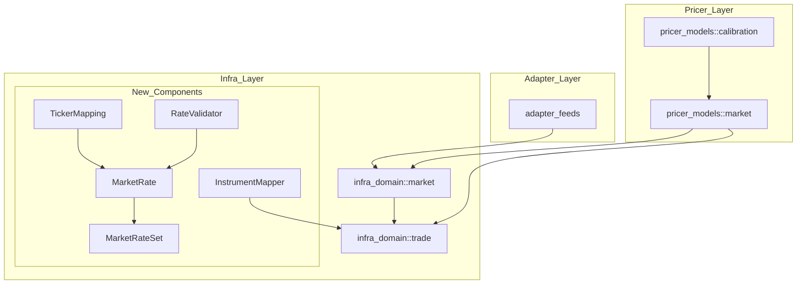
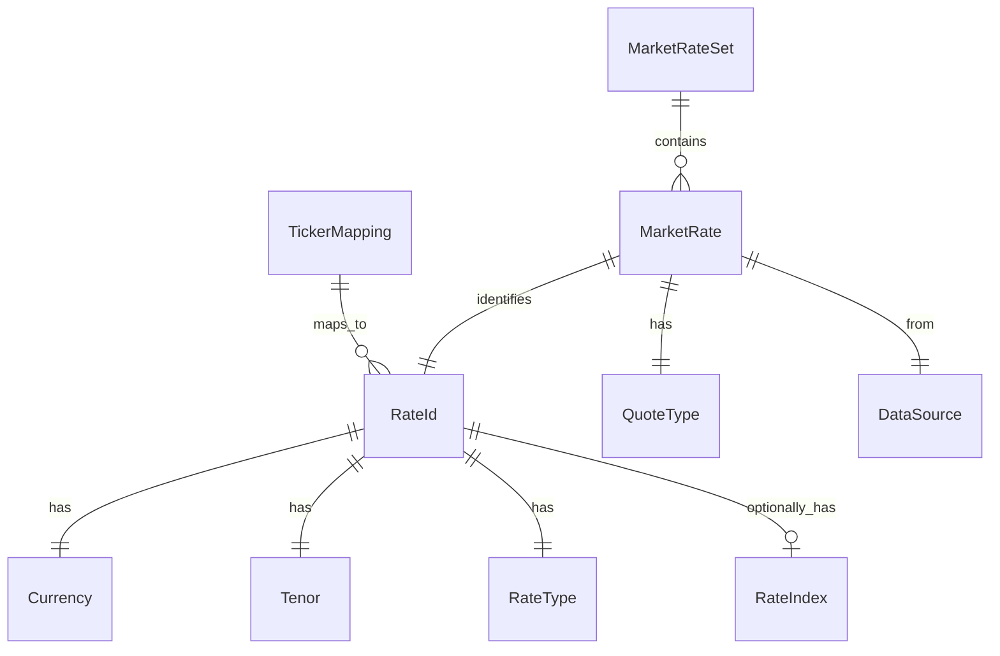

# Technical Design: market-rate-infrastructure

## Overview

**Purpose**: 本機能は、外部マーケットデータプロバイダー（Reuters、Bloomberg 等）からのレート入力を正規化し、適切な `Instrument` にマッピングして `MarketRateSet` として Pricer レイヤーに提供するインフラストラクチャを構築する。

**Users**: Quant Developer、Pricing Engineer が以下のワークフローで使用：
- 外部データフィードから受信したレートを標準形式に変換
- カーブ構築用の Instrument セットを自動生成
- 複数データソースからのレートをマージして一貫したマーケットデータを提供

**Impact**: `infra_domain::market` モジュールに 10 個の新規ファイルを追加。既存 API への破壊的変更なし。

### Goals

- マーケットレートの型安全な表現（`MarketRate`, `RateType`, `QuoteType`）
- 外部ティッカーと内部識別子の柔軟なマッピング（`TickerMapping`）
- Pricer レイヤーへのシームレスな `Instrument` 変換（`InstrumentMapper`）
- 入力データの堅牢なバリデーション（`RateValidator`）

### Non-Goals

- リアルタイムデータフィード接続（adapter_feeds の責務）
- カーブ構築ロジック（pricer_models::market::calibration の責務）
- ヒストリカルデータ永続化（infra_store の責務）
- `adapter_feeds::QuoteType` の移行（Phase 2 で対応）

---

## Architecture

### Existing Architecture Analysis

**現状**:
- `infra_domain::market` には `Currency` と `RateIndex` のみ存在
- `infra_domain::trade::Instrument` が 7 種類の金融商品を定義済み
- `adapter_feeds::QuoteType` が quote 分類を定義済み（依存方向の観点で移動推奨）

**制約**:
- A-I-P-S 依存ルール: `infra_domain` は `pricer_*` に依存不可
- 既存の `MarketDataError`（pricer_models）との名前衝突回避が必要

### Architecture Pattern & Boundary Map



**Architecture Integration**:
- **Selected pattern**: Module Extension（既存 `infra_domain::market` への型追加）
- **Domain boundaries**: レート入力（本仕様）と曲線構築（pricer_models）を明確に分離
- **Existing patterns preserved**: thiserror エラー、serde feature gate、enum 設計パターン
- **New components rationale**: 各型は単一責務を持ち、テスト可能な単位として設計
- **Steering compliance**: A-I-P-S 依存ルール遵守、British English 表記

### Technology Stack

| Layer | Choice / Version | Role in Feature | Notes |
|-------|------------------|-----------------|-------|
| Data / Storage | `std::collections::HashMap` | `MarketRateSet` の内部ストレージ | O(1) ルックアップ（NFR 1.1） |
| Serialisation | `serde` (feature-gated) | JSON シリアライゼーション | 既存パターン準拠 |
| Error Handling | `thiserror` | `MarketRateError` 構造化エラー | steering/error-handling.md 準拠 |
| Time | `std::time::Duration` | stale_rates 判定 | 外部依存なし |

---

## Requirements Traceability

| Requirement | Summary | Components | Interfaces | Flows |
|-------------|---------|------------|------------|-------|
| 1.1 | MarketRate struct | `MarketRate` | - | - |
| 1.2 | レート値バリデーション | `MarketRate::new()` | `RateValidator` | - |
| 1.3 | RateType enum | `RateType` | - | - |
| 1.4 | QuoteType enum | `QuoteType` | - | - |
| 1.5 | serde 対応 | 全型 | - | - |
| 2.1 | RateId type | `RateId` | - | - |
| 2.2 | TickerMapping | `TickerMapping` | `lookup()` | Ticker → RateId |
| 2.3 | ルックアップ API | `TickerMapping` | `lookup()` | - |
| 2.4 | 標準マッピング | `TickerMapping::with_defaults()` | - | - |
| 3.1 | MarketRateSet | `MarketRateSet` | - | - |
| 3.2 | bid/ask/mid 個別保持 | `MarketRateSet` | `insert()` | - |
| 3.3 | get_rate | `MarketRateSet` | `get_rate()` | - |
| 3.4 | get_mid_rate | `MarketRateSet` | `get_mid_rate()` | - |
| 3.5 | RateType イテレータ | `MarketRateSet` | `rates_by_type()` | - |
| 3.6 | stale_rates | `MarketRateSet` | `stale_rates()` | - |
| 4.1 | InstrumentMapper trait | `InstrumentMapper` | `map_to_instrument()` | - |
| 4.2 | StandardInstrumentMapper | `StandardInstrumentMapper` | - | Rate → Instrument |
| 4.3-4.6 | マッピング実装 | `StandardInstrumentMapper` | - | - |
| 4.7 | MappingError | `MarketRateError::MappingFailed` | - | - |
| 5.1 | MarketRateError | `MarketRateError` | - | - |
| 5.2-5.3 | バリデーションロジック | `StandardRateValidator` | - | - |
| 5.4 | RateValidator trait | `RateValidator` | `validate()` | - |
| 5.5 | StandardRateValidator | `StandardRateValidator` | - | - |
| 6.1 | DataSource enum | `DataSource` | - | - |
| 6.2 | SourcePriority | `SourcePriority` | - | - |
| 6.3-6.4 | マージロジック | `MarketRateSet::merge()` | - | - |
| 7.1 | Clone, Debug | 全型 | - | - |
| 7.2 | to_instruments | `MarketRateSet` | `to_instruments()` | - |
| 7.3 | filter_by_currency | `MarketRateSet` | `filter_by_currency()` | - |
| 7.4 | as_of | `MarketRateSet` | `as_of()` | - |
| 7.5 | JSON シリアライゼーション | `MarketRateSet` | - | - |

---

## Components and Interfaces

### Component Summary

| Component | Domain/Layer | Intent | Req Coverage | Key Dependencies | Contracts |
|-----------|--------------|--------|--------------|------------------|-----------|
| `QuoteType` | market | Quote 分類（Bid/Ask/Mid/Last） | 1.4 | - | - |
| `RateType` | market | レート種別分類 | 1.3 | - | - |
| `RateId` | market | レート一意識別子 | 2.1 | Currency, Tenor, RateType | - |
| `MarketRate` | market | 単一レート表現 | 1.1, 1.2, 1.5 | RateId, QuoteType, DataSource | - |
| `MarketRateSet` | market | レートコレクション管理 | 3.1-3.6, 7.1-7.5 | MarketRate, HashMap | Service |
| `TickerMapping` | market | 外部ティッカーマッピング | 2.2-2.4 | RateId, HashMap | Service |
| `InstrumentMapper` | market | マッピングトレイト | 4.1 | MarketRate, Instrument | Service |
| `StandardInstrumentMapper` | market | 標準マッピング実装 | 4.2-4.7 | InstrumentMapper | - |
| `RateValidator` | market | バリデーショントレイト | 5.4 | MarketRate | Service |
| `StandardRateValidator` | market | 標準バリデーション実装 | 5.5 | RateValidator | - |
| `DataSource` | market | データソース識別 | 6.1 | - | - |
| `SourcePriority` | market | ソース優先順位 | 6.2 | DataSource | - |
| `MarketRateError` | market | エラー型 | 5.1-5.3 | thiserror | - |

---

### Core Types

#### QuoteType

| Field | Detail |
|-------|--------|
| Intent | マーケットクォートの種別を分類 |
| Requirements | 1.4 |

```rust
#[derive(Debug, Clone, Copy, PartialEq, Eq, Hash)]
#[cfg_attr(feature = "serde", derive(serde::Serialize, serde::Deserialize))]
pub enum QuoteType {
    Bid,
    Ask,
    Mid,
    Last,
}
```

---

#### RateType

| Field | Detail |
|-------|--------|
| Intent | マーケットレートの商品種別を分類 |
| Requirements | 1.3 |

```rust
#[derive(Debug, Clone, Copy, PartialEq, Eq, Hash)]
#[cfg_attr(feature = "serde", derive(serde::Serialize, serde::Deserialize))]
#[non_exhaustive]
pub enum RateType {
    Deposit,
    Fra,
    Futures,
    Swap,
    Ois,
    BasisSwap,
    FxSpot,
    FxForward,
    Vol,
}
```

---

#### RateId

| Field | Detail |
|-------|--------|
| Intent | マーケットレートを一意に識別 |
| Requirements | 2.1 |

```rust
#[derive(Debug, Clone, PartialEq, Eq, Hash)]
#[cfg_attr(feature = "serde", derive(serde::Serialize, serde::Deserialize))]
pub struct RateId {
    pub currency: Currency,
    pub tenor: Tenor,
    pub rate_type: RateType,
    pub rate_index: Option<RateIndex>,
}

impl RateId {
    pub fn new(currency: Currency, tenor: Tenor, rate_type: RateType) -> Self;
    pub fn with_index(self, index: RateIndex) -> Self;
}
```

---

#### DataSource

| Field | Detail |
|-------|--------|
| Intent | マーケットデータの出所を識別 |
| Requirements | 6.1 |

```rust
#[derive(Debug, Clone, Copy, PartialEq, Eq, Hash)]
#[cfg_attr(feature = "serde", derive(serde::Serialize, serde::Deserialize))]
#[non_exhaustive]
pub enum DataSource {
    Reuters,
    Bloomberg,
    Internal,
    Manual,
}
```

---

#### MarketRate

| Field | Detail |
|-------|--------|
| Intent | 単一のマーケットレートをメタデータとともに表現 |
| Requirements | 1.1, 1.2, 1.5 |

**Responsibilities & Constraints**:
- レート値、タイムスタンプ、ソース、品質情報を保持
- 作成時にバリデーション実行（NaN/Infinite チェック）
- 不変（immutable）設計

```rust
#[derive(Debug, Clone, PartialEq)]
#[cfg_attr(feature = "serde", derive(serde::Serialize, serde::Deserialize))]
pub struct MarketRate {
    pub id: RateId,
    pub quote_type: QuoteType,
    pub value: f64,
    pub timestamp: i64,  // Unix milliseconds
    pub source: DataSource,
}

impl MarketRate {
    pub fn new(
        id: RateId,
        quote_type: QuoteType,
        value: f64,
        timestamp: i64,
        source: DataSource,
    ) -> Result<Self, MarketRateError>;

    pub fn with_timestamp(self, timestamp: i64) -> Self;
    pub fn with_source(self, source: DataSource) -> Self;
}
```

---

### Service Components

#### MarketRateSet

| Field | Detail |
|-------|--------|
| Intent | 複数のマーケットレートをコレクションとして管理 |
| Requirements | 3.1-3.6, 7.1-7.5 |

**Responsibilities & Constraints**:
- `(RateId, QuoteType)` 複合キーで O(1) ルックアップ
- 同一 `RateId` に対して複数の `QuoteType` を保持可能
- スレッドセーフではない（シングルスレッド使用を想定）

**Dependencies**:
- Inbound: `MarketRate` — レートエントリ（P0）
- Outbound: `Instrument` — 変換先（P0）
- External: なし

**Contracts**: Service [x]

##### Service Interface

```rust
#[derive(Debug, Clone, Default)]
#[cfg_attr(feature = "serde", derive(serde::Serialize, serde::Deserialize))]
pub struct MarketRateSet {
    rates: HashMap<(RateId, QuoteType), MarketRate>,
}

impl MarketRateSet {
    // Construction
    pub fn new() -> Self;

    // CRUD
    pub fn insert(&mut self, rate: MarketRate);
    pub fn get_rate(&self, id: &RateId, quote_type: QuoteType) -> Option<&MarketRate>;
    pub fn get_mid_rate(&self, id: &RateId) -> Option<f64>;
    pub fn remove(&mut self, id: &RateId, quote_type: QuoteType) -> Option<MarketRate>;

    // Query
    pub fn rates_by_type(&self, rate_type: RateType) -> impl Iterator<Item = &MarketRate>;
    pub fn stale_rates(&self, threshold: Duration) -> Vec<RateId>;
    pub fn len(&self) -> usize;
    pub fn is_empty(&self) -> bool;

    // Filter
    pub fn filter_by_currency(&self, currency: Currency) -> MarketRateSet;
    /// Returns rates with timestamp <= date.end_of_day() (timestamp-based filtering)
    pub fn as_of(&self, date: &Date) -> MarketRateSet;

    // Conversion
    pub fn to_instruments(&self, valuation_date: &Date) -> Result<Vec<Instrument>, MarketRateError>;

    // Merge
    pub fn merge(&mut self, other: &MarketRateSet, priority: &SourcePriority);
}
```

- **Preconditions**: `rate` は有効な値（バリデーション済み）
- **Postconditions**: `get_rate()` は O(1) で結果を返す
- **Invariants**: 同一 `(RateId, QuoteType)` は最大 1 エントリ

**Implementation Notes**:
- Integration: `pricer_models::market::calibration` がこの型を消費
- Validation: `insert()` 時に追加バリデーションは行わない（`MarketRate::new()` で実施済み）
- Risks: 大量レート挿入時のメモリ使用量（10,000 レートで約 1MB 見込み）
- `as_of()` Semantics: タイムスタンプベースのフィルタ。`timestamp <= date.end_of_day_ms()` を満たすレートのみを返す。有効期間（valid_from/valid_to）は使用しない。

---

#### TickerMapping

| Field | Detail |
|-------|--------|
| Intent | 外部ティッカー（Reuters RIC、Bloomberg ticker）を内部 RateId にマッピング |
| Requirements | 2.2-2.4 |

**Responsibilities & Constraints**:
- ランタイムで設定可能なマッピングテーブル
- 主要通貨のデフォルトマッピングを提供

**Dependencies**:
- Outbound: `RateId` — マッピング先（P0）

**Contracts**: Service [x]

##### Service Interface

```rust
#[derive(Debug, Clone, Default)]
pub struct TickerMapping {
    mapping: HashMap<String, RateId>,
}

impl TickerMapping {
    pub fn new() -> Self;
    pub fn with_defaults() -> Self;  // USD, EUR, GBP, JPY, CHF の標準マッピング

    pub fn register(&mut self, ticker: impl Into<String>, rate_id: RateId);
    pub fn lookup(&self, ticker: &str) -> Option<&RateId>;
    pub fn contains(&self, ticker: &str) -> bool;
}
```

- **Preconditions**: `ticker` は空文字列でない
- **Postconditions**: `lookup()` は O(1) で結果を返す

---

#### InstrumentMapper

| Field | Detail |
|-------|--------|
| Intent | MarketRate から Instrument への変換インターフェース |
| Requirements | 4.1 |

**Contracts**: Service [x]

##### Service Interface

```rust
pub trait InstrumentMapper {
    fn map_to_instrument(
        &self,
        rate: &MarketRate,
        valuation_date: &Date,
    ) -> Result<Instrument, MarketRateError>;
}
```

---

#### StandardInstrumentMapper

| Field | Detail |
|-------|--------|
| Intent | 標準的なレート→Instrument マッピングの実装 |
| Requirements | 4.2-4.7 |

**Responsibilities & Constraints**:
- Deposit, Swap, OIS, Futures のマッピングをサポート
- サポート外の RateType は `MappingFailed` エラー

```rust
#[derive(Debug, Clone, Default)]
pub struct StandardInstrumentMapper;

impl InstrumentMapper for StandardInstrumentMapper {
    fn map_to_instrument(
        &self,
        rate: &MarketRate,
        valuation_date: &Date,
    ) -> Result<Instrument, MarketRateError>;
}
```

**Implementation Notes**:
- Deposit: `Instrument::Deposit { currency, start_date: valuation_date, tenor, rate: value }`
- Swap: `Instrument::ParSwap { currency, start_date: valuation_date, tenor, rate: value }`
- OIS: `Instrument::Ois { currency, start_date: valuation_date, tenor, rate: value }`
- Futures: `Instrument::Futures { currency, expiry: valuation_date + tenor, price: 100.0 - value * 100.0 }`

---

#### RateValidator

| Field | Detail |
|-------|--------|
| Intent | マーケットレートのバリデーションインターフェース |
| Requirements | 5.4 |

**Contracts**: Service [x]

##### Service Interface

```rust
pub trait RateValidator {
    fn validate(&self, rate: &MarketRate) -> Result<(), MarketRateError>;
}
```

---

#### StandardRateValidator

| Field | Detail |
|-------|--------|
| Intent | 標準的なレートバリデーションの実装 |
| Requirements | 5.5 |

```rust
#[derive(Debug, Clone, Default)]
pub struct StandardRateValidator;

impl RateValidator for StandardRateValidator {
    fn validate(&self, rate: &MarketRate) -> Result<(), MarketRateError>;
}
```

**Implementation Notes**:
- NaN/Infinite チェック
- レート種別ごとの閾値チェック:
  - Interest rates: -0.10 ～ 1.00 (-10% ～ 100%)
  - FX rates: 0.0001 ～ 100000.0
  - Volatility: 0.0 ～ 5.0 (0% ～ 500%)

---

#### SourcePriority

| Field | Detail |
|-------|--------|
| Intent | データソースの優先順位を定義 |
| Requirements | 6.2 |

```rust
#[derive(Debug, Clone)]
pub struct SourcePriority {
    priorities: Vec<DataSource>,
}

impl SourcePriority {
    pub fn new(priorities: Vec<DataSource>) -> Self;
    pub fn default_priority() -> Self;  // [Bloomberg, Reuters, Internal, Manual]
    pub fn compare(&self, a: DataSource, b: DataSource) -> std::cmp::Ordering;
}
```

---

### Error Types

#### MarketRateError

| Field | Detail |
|-------|--------|
| Intent | マーケットレート操作のエラーを構造化 |
| Requirements | 5.1-5.3, 4.7 |

```rust
use thiserror::Error;

#[derive(Error, Debug, Clone, PartialEq)]
pub enum MarketRateError {
    #[error("Invalid rate value: {value} ({reason})")]
    InvalidRate { value: f64, reason: String },

    #[error("Stale data: rate for {rate_id:?} is older than {threshold_ms}ms")]
    StaleData { rate_id: RateId, threshold_ms: i64 },

    #[error("Missing rate: {rate_id:?} not found")]
    MissingRate { rate_id: RateId },

    #[error("Mapping failed: cannot convert {rate_type:?} to Instrument")]
    MappingFailed { rate_type: RateType, reason: String },

    #[error("Validation failed: {0}")]
    ValidationFailed(String),
}
```

---

## Data Models

### Domain Model



**Aggregates**:
- `MarketRateSet` がアグリゲートルート
- `MarketRate` はエンティティ（`RateId + QuoteType` で識別）
- `RateId`, `QuoteType`, `DataSource`, `RateType` は値オブジェクト

**Business Rules**:
- 同一 `(RateId, QuoteType)` は `MarketRateSet` 内で一意
- `MarketRate::value` は有限の実数値でなければならない
- `mid` が存在しない場合、`(bid + ask) / 2` で計算可能

---

## Error Handling

### Error Strategy

- **Fail Fast**: `MarketRate::new()` で NaN/Infinite を即座に拒否
- **Graceful Degradation**: `get_mid_rate()` は mid がなければ bid/ask から計算
- **Structured Errors**: `thiserror` による型安全なエラー伝播

### Error Categories and Responses

| Category | Variant | Response |
|----------|---------|----------|
| User Errors | `InvalidRate` | 入力値を修正して再試行 |
| User Errors | `MappingFailed` | サポートされる RateType を使用 |
| System Errors | `StaleData` | データフィードを確認 |
| Business Logic | `MissingRate` | 必要なレートを追加 |

---

## Testing Strategy

### Unit Tests

1. `MarketRate::new()` バリデーション（NaN, Infinite, 正常値）
2. `MarketRateSet` CRUD 操作（insert, get, remove）
3. `get_mid_rate()` 計算ロジック（mid 存在/bid-ask から計算）
4. `StandardInstrumentMapper` 各 RateType の変換
5. `StandardRateValidator` 閾値チェック

### Integration Tests

1. `TickerMapping` + `MarketRateSet` の連携（ティッカー → レート → セット）
2. `MarketRateSet::to_instruments()` 全体フロー
3. `MarketRateSet::merge()` ソース優先順位による選択
4. `filter_by_currency()` + `as_of()` チェーンフィルタ

### Performance Tests

1. `MarketRateSet` に 10,000 レート挿入時のメモリ使用量
2. `get_rate()` 10,000 回呼び出し時のレイテンシ
3. `to_instruments()` 1,000 レート変換時の処理時間

---

## File Structure

```text
crates/infra_domain/src/market/
├── mod.rs              # 既存（拡張）
├── currency.rs         # 既存
├── rate_index.rs       # 既存
├── quote_type.rs       # 新規: QuoteType enum
├── rate_type.rs        # 新規: RateType enum
├── rate_id.rs          # 新規: RateId struct
├── data_source.rs      # 新規: DataSource enum, SourcePriority
├── rate.rs             # 新規: MarketRate struct
├── rate_set.rs         # 新規: MarketRateSet struct
├── ticker.rs           # 新規: TickerMapping struct
├── mapper.rs           # 新規: InstrumentMapper trait + StandardInstrumentMapper
├── validation.rs       # 新規: RateValidator trait + StandardRateValidator
└── error.rs            # 新規: MarketRateError enum
```
