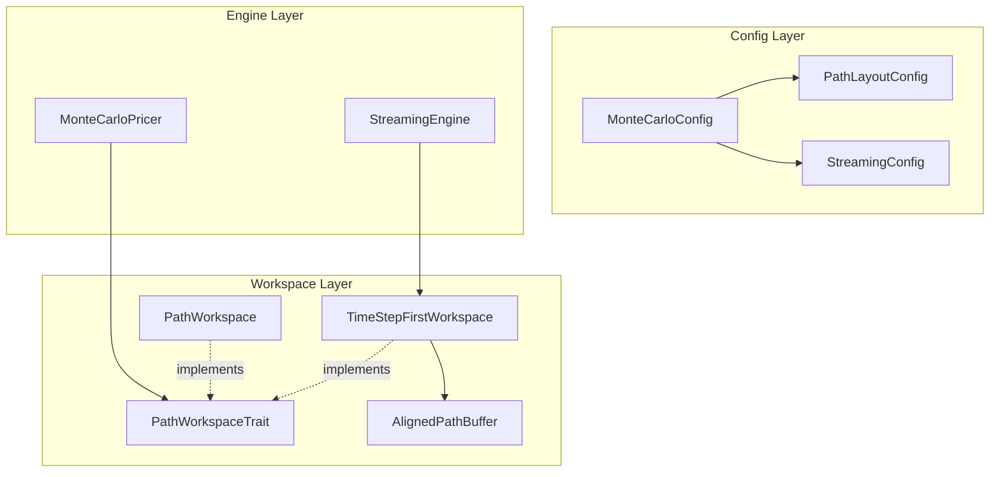

# Design Document: MC Memory Layout Optimisation

## Overview

**Purpose**: モンテカルロ・シミュレーションのメモリレイアウトを最適化し、キャッシュ効率とメモリ使用量を大幅に改善する。

**Users**: クオンツ開発者、リスク計算担当者、パフォーマンスエンジニアが大規模シミュレーション（100万パス以上）を効率的に実行するために利用する。

**Impact**: `pricer_pricing/src/mc/` モジュールに Time Step First レイアウトとストリーミング型エンジンを追加し、既存 API との完全な後方互換性を維持する。

### Goals
- Time Step First レイアウト（`[step][path]`）によるキャッシュ局所性向上
- ストリーミング処理によるメモリ使用量 O(Steps × Paths) → O(Paths) への削減
- 64バイトアラインメントによるSIMD（AVX-512）最適化
- 既存 `MonteCarloPricer` API の完全な後方互換性維持

## Architecture

### Existing Architecture Analysis

```text
pricer_pricing/src/mc/
├── config.rs          → MonteCarloConfig
├── workspace.rs       → PathWorkspace (Path First レイアウト)
├── paths.rs           → generate_gbm_paths
├── pricer.rs          → MonteCarloPricer
├── thread_local.rs    → ThreadLocalWorkspacePool
└── workspace_checkpoint.rs → CheckpointWorkspace
```

**現行制約**:
- `PathWorkspace` は `[path][step]` レイアウト固定
- 全パス・全ステップをメモリ保持（O(Steps × Paths)）
- アラインメント未指定（デフォルト8バイト）

### Architecture Pattern & Boundary Map



**Architecture Integration**:
- **Selected pattern**: Strategy Pattern（PathWorkspaceTrait による実装切り替え）
- **Domain boundaries**: Workspace（データ保持）/ Engine（処理制御）/ Config（設定）の分離
- **Existing patterns preserved**: ビルダーパターン、RAII バッファ管理、T: Float ジェネリクス
- **New components rationale**: 後方互換性維持のため既存コンポーネントと並行導入

## Requirements Traceability

| Requirement | Summary | Components | Interfaces | Flows |
|-------------|---------|------------|------------|-------|
| 1.1-1.4 | Time Step First レイアウト | TimeStepFirstWorkspace, PathGenerator | PathWorkspaceTrait | - |
| 2.1-2.4 | ストリーミング処理 | StreamingEngine | StreamingEngineConfig | Streaming Flow |
| 3.1-3.4 | ベクトル化対応 | AlignedPathBuffer | - | - |
| 4.1-4.4 | PathObserver 統合 | StreamingEngine | PathObserver | Streaming Flow |
| 5.1-5.4 | 設定とAPI | PathLayoutConfig, StreamingConfig | MonteCarloConfigBuilder | - |
| 6.1-6.4 | 性能要件 | All, WorkspaceEnum | Benchmark suite | - |
| 7.1-7.4 | 後方互換性 | PathWorkspace, PathGenerator, WorkspaceEnum | MonteCarloPricer | - |

## Components and Interfaces

### Component Summary

| Component | Domain/Layer | Intent | Req Coverage |
|-----------|--------------|--------|--------------|
| PathLayoutConfig | Config | レイアウトモード設定 | 5.1 |
| StreamingConfig | Config | ストリーミングモード設定 | 5.2, 5.4 |
| PathWorkspaceTrait | Workspace | Workspace 抽象化 | 1.4, 7.4 |
| WorkspaceEnum | Workspace | 静的ディスパッチによる Workspace 切り替え | 6.3, 7.4 |
| TimeStepFirstWorkspace | Workspace | Time Step First レイアウト実装 | 1.1-1.3 |
| AlignedPathBuffer | Workspace | アラインドメモリバッファ | 3.1-3.4 |
| PathGenerator | Engine | ジェネリックパス生成 | 1.1-1.4, 7.1-7.4 |
| StreamingEngine | Engine | ストリーミング処理制御 | 2.1-2.4, 4.1-4.4 |

### Config Layer

#### PathLayoutConfig

```rust
#[derive(Clone, Copy, Debug, Default, PartialEq, Eq)]
pub enum PathLayout {
    #[default]
    PathFirst,
    TimeStepFirst,
}

#[derive(Clone, Copy, Debug)]
pub struct PathLayoutConfig {
    pub layout: PathLayout,
    pub alignment: usize,  // Default: 64 (AVX-512)
}
```

#### StreamingConfig

```rust
#[derive(Clone, Copy, Debug)]
pub struct StreamingConfig {
    pub enabled: bool,
    pub buffer_steps: usize,  // Default: 2 (current + previous)
}
```

### Workspace Layer

#### PathWorkspaceTrait

```rust
pub trait PathWorkspaceTrait<T: Float>: Send + Sync {
    fn num_paths(&self) -> usize;
    fn num_steps(&self) -> usize;
    fn get_path_value(&self, path_idx: usize, step_idx: usize) -> T;
    fn set_path_value(&mut self, path_idx: usize, step_idx: usize, value: T);
    fn get_step_slice(&self, step_idx: usize) -> Option<&[T]>;
    fn get_step_slice_mut(&mut self, step_idx: usize) -> Option<&mut [T]>;
    fn layout(&self) -> PathLayout;
    fn clear(&mut self);
}
```

#### WorkspaceEnum

```rust
pub enum WorkspaceEnum<T: Float> {
    PathFirst(PathWorkspace),
    TimeStepFirst(TimeStepFirstWorkspace<T>),
}

impl<T: Float + Send + Sync> PathWorkspaceTrait<T> for WorkspaceEnum<T> {
    // Delegates to the appropriate variant via match
}
```

#### TimeStepFirstWorkspace

```rust
pub struct TimeStepFirstWorkspace<T: Float> {
    buffer: AlignedPathBuffer<T>,  // [num_steps + 1][num_paths]
    randoms: AlignedPathBuffer<T>,
    payoffs: AlignedPathBuffer<T>,
    num_paths: usize,
    num_steps: usize,
}

impl<T: Float + Send + Sync> TimeStepFirstWorkspace<T> {
    pub fn new(num_paths: usize, num_steps: usize) -> Self;
    pub fn with_alignment(num_paths: usize, num_steps: usize, alignment: usize) -> Self;
    pub fn alignment(&self) -> usize;
    pub fn get_aligned_step_slice(&self, step_idx: usize) -> &[T];
    pub fn get_aligned_step_slice_mut(&mut self, step_idx: usize) -> &mut [T];
}
```

#### AlignedPathBuffer

```rust
#[cfg(feature = "simd-aligned")]
pub struct AlignedPathBuffer<T: Float> {
    inner: aligned_vec::AVec<T, aligned_vec::ConstAlign<64>>,
    len: usize,
}

#[cfg(not(feature = "simd-aligned"))]
pub struct AlignedPathBuffer<T: Float> {
    inner: Vec<T>,
    len: usize,
}

impl<T: Float> AlignedPathBuffer<T> {
    pub fn new(capacity: usize) -> Self;
    pub fn with_alignment(capacity: usize, alignment: usize) -> Self;
    pub fn as_slice(&self) -> &[T];
    pub fn as_mut_slice(&mut self) -> &mut [T];
    pub fn alignment(&self) -> usize;
}
```

### Engine Layer

#### PathGenerator

```rust
pub fn generate_gbm_paths_generic<W>(
    workspace: &mut W,
    params: &GbmParams,
    rng: &mut impl Rng,
) -> Result<(), PathError>
where
    W: PathWorkspaceTrait<f64>,
{
    match workspace.layout() {
        PathLayout::TimeStepFirst => {
            // SIMD-friendly: process all paths at each step
            for step in 0..n_steps {
                let current = workspace.get_step_slice_mut(step).unwrap();
                let next = workspace.get_step_slice_mut(step + 1).unwrap();
                for path_idx in 0..n_paths {
                    let z: f64 = rng.sample(StandardNormal);
                    next[path_idx] = current[path_idx] * (drift_dt + vol_sqrt_dt * z).exp();
                }
            }
        }
        PathLayout::PathFirst => {
            // Fallback: element-wise access
        }
    }
    Ok(())
}

#[inline]
pub fn generate_gbm_paths(
    workspace: &mut PathWorkspace,
    params: &GbmParams,
    rng: &mut impl Rng,
) -> Result<(), PathError> {
    generate_gbm_paths_generic(workspace, params, rng)
}
```

#### StreamingEngine

```rust
pub struct StreamingEngine<T: Float, R: Rng> {
    current: AlignedPathBuffer<T>,
    previous: AlignedPathBuffer<T>,
    rng: R,
    config: StreamingConfig,
    current_step: usize,
    num_paths: usize,
    num_steps: usize,
}

impl<T: Float + Send + Sync, R: Rng + SeedableRng + Send> StreamingEngine<T, R> {
    pub fn new(num_paths: usize, num_steps: usize, config: StreamingConfig) -> Self;
    pub fn run<M, O>(&mut self, model: &M, observer: &mut O) -> StreamingResult<T>
    where
        M: StochasticModel<T>,
        O: StreamingObserver<T>;
    pub fn memory_usage(&self) -> usize;
}

pub trait StreamingObserver<T: Float>: Send + Sync {
    fn observe_step(&mut self, step_idx: usize, values: &[T]);
    fn finalize(&mut self) -> ObservationResult<T>;
    fn reset(&mut self);
}
```

## Error Handling

### Error Categories and Responses

```rust
#[derive(Debug, thiserror::Error)]
pub enum LayoutConfigError {
    #[error("Streaming mode requires TimeStepFirst layout")]
    StreamingRequiresTimeStepFirst,

    #[error("Alignment must be a power of 2, got {0}")]
    InvalidAlignment(usize),

    #[error("Buffer steps must be at least 2, got {0}")]
    InvalidBufferSteps(usize),
}
```

## Testing Strategy

### Unit Tests
- `PathLayoutConfig` / `StreamingConfig` のデフォルト値とバリデーション
- `TimeStepFirstWorkspace` のインデックス計算正確性
- `AlignedPathBuffer` のアラインメント検証
- `StreamingEngine` のダブルバッファスワップ

### Integration Tests
- `MonteCarloPricer` + `TimeStepFirstWorkspace` での European option pricing
- `StreamingEngine` + `PathObserver` での Asian option pricing
- PathFirst vs TimeStepFirst での数値一致検証
- ストリーミング vs 一括処理での数値一致検証

### Performance Tests (Criterion)
- `bench_timestep_first_vs_path_first`: レイアウト別スループット比較
- `bench_streaming_memory`: メモリ使用量測定（1M paths × 100 steps）
- `bench_aligned_vs_unaligned`: アラインメント効果測定
- `bench_cache_miss_rate`: キャッシュミス率比較（perf stat 統合）
- `bench_static_vs_dyn_dispatch`: WorkspaceEnum vs dyn PathWorkspaceTrait
