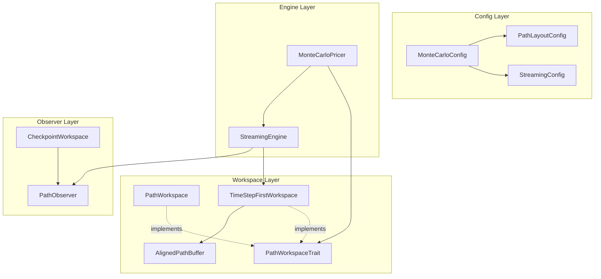
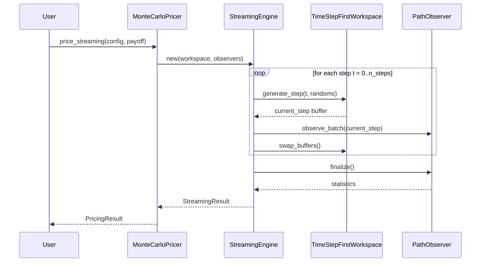
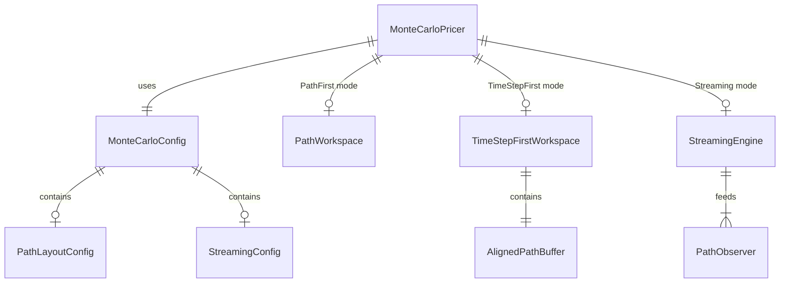

# Design Document: MC Memory Layout Optimisation

## Overview

**Purpose**: モンテカルロ・シミュレーションのメモリレイアウトを最適化し、キャッシュ効率とメモリ使用量を大幅に改善する。

**Users**: クオンツ開発者、リスク計算担当者、パフォーマンスエンジニアが大規模シミュレーション（100万パス以上）を効率的に実行するために利用する。

**Impact**: `pricer_pricing/src/mc/` モジュールに Time Step First レイアウトとストリーミング型エンジンを追加し、既存 API との完全な後方互換性を維持する。

### Goals

- Time Step First レイアウト（`[step][path]`）によるキャッシュ局所性向上
- ストリーミング処理によるメモリ使用量 O(Steps × Paths) → O(Paths) への削減
- 64バイトアラインメントによるSIMD（AVX-512）最適化
- 既存 `MonteCarloPricer` API の完全な後方互換性維持

### Non-Goals

- 既存 `PathWorkspace` の破壊的変更
- GPGPU（CUDA/OpenCL）対応
- 分散処理（複数ノード）対応
- Enzyme AD の新規実装（既存パターン踏襲のみ）

## Architecture

### Existing Architecture Analysis

```text
pricer_pricing/src/mc/
├── config.rs          → MonteCarloConfig (現行設定)
├── workspace.rs       → PathWorkspace (Path First レイアウト)
├── paths.rs           → generate_gbm_paths (パス生成)
├── pricer.rs          → MonteCarloPricer (オーケストレーション)
├── thread_local.rs    → ThreadLocalWorkspacePool (並列処理)
└── workspace_checkpoint.rs → CheckpointWorkspace (AD チェックポイント)
```

**現行制約**:
- `PathWorkspace` は `[path][step]` レイアウト固定
- 全パス・全ステップをメモリ保持（O(Steps × Paths)）
- アラインメント未指定（デフォルト8バイト）

### Architecture Pattern & Boundary Map



**Architecture Integration**:
- **Selected pattern**: Strategy Pattern（PathWorkspaceTrait による実装切り替え）
- **Domain boundaries**: Workspace（データ保持）/ Engine（処理制御）/ Config（設定）の分離
- **Existing patterns preserved**: ビルダーパターン、RAII バッファ管理、T: Float ジェネリクス
- **New components rationale**: 後方互換性維持のため既存コンポーネントと並行導入
- **Steering compliance**: A-I-P-S アーキテクチャ維持（Pricer L3 内での変更）

### Technology Stack

| Layer | Choice / Version | Role in Feature | Notes |
|-------|------------------|-----------------|-------|
| Core | Rust Edition 2021 | 実装言語 | 既存踏襲 |
| Memory | `aligned-vec` (optional) | 64バイトアラインメント | Feature flag `simd-aligned` |
| Numeric | `num-traits` | T: Float ジェネリクス | 既存踏襲 |
| Parallel | `rayon` | パス並列処理 | 既存踏襲 |
| Testing | `criterion` | 性能ベンチマーク | 既存踏襲 |

## System Flows

### Streaming Processing Flow



**Key Decisions**:
- ダブルバッファリング（current/previous）でゼロコピースワップ
- PathObserver によるインクリメンタル統計累積
- 各ステップ完了後に前ステップバッファを破棄可能

## Requirements Traceability

| Requirement | Summary | Components | Interfaces | Flows |
|-------------|---------|------------|------------|-------|
| 1.1-1.4 | Time Step First レイアウト | TimeStepFirstWorkspace, PathGenerator | PathWorkspaceTrait | - |
| 2.1-2.4 | ストリーミング処理 | StreamingEngine | StreamingEngineConfig | Streaming Flow |
| 3.1-3.4 | ベクトル化対応 | AlignedPathBuffer | - | - |
| 4.1-4.4 | PathObserver 統合 | StreamingEngine | PathObserver | Streaming Flow |
| 5.1-5.4 | 設定とAPI | PathLayoutConfig, StreamingConfig | MonteCarloConfigBuilder | - |
| 6.1-6.4 | 性能要件 | All, WorkspaceEnum | Benchmark suite | - |
| 7.1-7.4 | 後方互換性 | PathWorkspace, PathGenerator, WorkspaceEnum | MonteCarloPricer | - |

## Components and Interfaces

### Component Summary

| Component | Domain/Layer | Intent | Req Coverage | Key Dependencies | Contracts |
|-----------|--------------|--------|--------------|------------------|-----------|
| PathLayoutConfig | Config | レイアウトモード設定 | 5.1 | - | State |
| StreamingConfig | Config | ストリーミングモード設定 | 5.2, 5.4 | - | State |
| PathWorkspaceTrait | Workspace | Workspace 抽象化 | 1.4, 7.4 | - | Service |
| WorkspaceEnum | Workspace | 静的ディスパッチによる Workspace 切り替え | 6.3, 7.4 | PathWorkspace (P0), TimeStepFirstWorkspace (P0) | Service, State |
| TimeStepFirstWorkspace | Workspace | Time Step First レイアウト実装 | 1.1-1.3 | AlignedPathBuffer (P1) | Service, State |
| AlignedPathBuffer | Workspace | アラインドメモリバッファ | 3.1-3.4 | aligned-vec (P1) | State |
| PathGenerator | Engine | ジェネリックパス生成 | 1.1-1.4, 7.1-7.4 | WorkspaceEnum (P0) | Service |
| StreamingEngine | Engine | ストリーミング処理制御 | 2.1-2.4, 4.1-4.4 | TimeStepFirstWorkspace (P0), PathObserver (P0) | Service |

### Config Layer

#### PathLayoutConfig

| Field | Detail |
|-------|--------|
| Intent | メモリレイアウトモードを設定 |
| Requirements | 5.1 |

**Responsibilities & Constraints**
- レイアウトモード（PathFirst / TimeStepFirst）の保持
- アラインメントバイト数の指定
- 不変オブジェクト（作成後変更不可）

**Contracts**: State [x]

##### State Management

```rust
#[derive(Clone, Copy, Debug, Default, PartialEq, Eq)]
pub enum PathLayout {
    #[default]
    PathFirst,
    TimeStepFirst,
}

#[derive(Clone, Copy, Debug)]
pub struct PathLayoutConfig {
    pub layout: PathLayout,
    pub alignment: usize,  // Default: 64 (AVX-512)
}

impl Default for PathLayoutConfig {
    fn default() -> Self {
        Self {
            layout: PathLayout::PathFirst,
            alignment: 64,
        }
    }
}
```

- **Persistence**: インメモリのみ（設定値）
- **Consistency**: 不変
- **Concurrency**: Clone + Send + Sync

#### StreamingConfig

| Field | Detail |
|-------|--------|
| Intent | ストリーミング処理モードを設定 |
| Requirements | 5.2, 5.4 |

**Contracts**: State [x]

##### State Management

```rust
#[derive(Clone, Copy, Debug)]
pub struct StreamingConfig {
    pub enabled: bool,
    pub buffer_steps: usize,  // Default: 2 (current + previous)
}

impl Default for StreamingConfig {
    fn default() -> Self {
        Self {
            enabled: false,
            buffer_steps: 2,
        }
    }
}
```

**Implementation Notes**
- **Validation**: `buffer_steps >= 2` を実行時検証
- **Integration**: `MonteCarloConfigBuilder` に `.streaming(config)` メソッド追加

### Workspace Layer

#### PathWorkspaceTrait

| Field | Detail |
|-------|--------|
| Intent | Workspace 実装の抽象化インターフェース |
| Requirements | 1.4, 7.4 |

**Responsibilities & Constraints**
- PathWorkspace と TimeStepFirstWorkspace の共通インターフェース
- MonteCarloPricer からの実装非依存アクセス
- ジェネリック `T: Float` のサポート

**Contracts**: Service [x]

##### Service Interface

```rust
pub trait PathWorkspaceTrait<T: Float>: Send + Sync {
    /// Returns the number of paths.
    fn num_paths(&self) -> usize;

    /// Returns the number of steps.
    fn num_steps(&self) -> usize;

    /// Returns the path value at (path_idx, step_idx).
    fn get_path_value(&self, path_idx: usize, step_idx: usize) -> T;

    /// Sets the path value at (path_idx, step_idx).
    fn set_path_value(&mut self, path_idx: usize, step_idx: usize, value: T);

    /// Returns a slice of all path values at a given step (Time Step First only).
    /// Returns None for PathFirst layout.
    fn get_step_slice(&self, step_idx: usize) -> Option<&[T]>;

    /// Returns a mutable slice of all path values at a given step.
    fn get_step_slice_mut(&mut self, step_idx: usize) -> Option<&mut [T]>;

    /// Returns the layout type.
    fn layout(&self) -> PathLayout;

    /// Clears all path data for reuse.
    fn clear(&mut self);
}
```

- **Preconditions**: `path_idx < num_paths()`, `step_idx <= num_steps()`
- **Postconditions**: データ整合性維持
- **Invariants**: capacity ≥ size

#### WorkspaceEnum

| Field | Detail |
|-------|--------|
| Intent | 静的ディスパッチによる Workspace 実装切り替え |
| Requirements | 6.3, 7.4 |

**Responsibilities & Constraints**
- `dyn Trait` の仮想ディスパッチオーバーヘッドを回避
- コンパイラによるインライン化を促進
- Enzyme AD 最適化との互換性維持

**Dependencies**
- Outbound: PathWorkspace — PathFirst モード (P0)
- Outbound: TimeStepFirstWorkspace — TimeStepFirst モード (P0)

**Contracts**: Service [x] / State [x]

##### Service Interface

```rust
/// Static dispatch enum for workspace implementations.
/// Avoids dyn Trait overhead in hot paths.
pub enum WorkspaceEnum<T: Float> {
    PathFirst(PathWorkspace),
    TimeStepFirst(TimeStepFirstWorkspace<T>),
}

impl<T: Float + Send + Sync> PathWorkspaceTrait<T> for WorkspaceEnum<T> {
    fn num_paths(&self) -> usize {
        match self {
            Self::PathFirst(ws) => ws.num_paths(),
            Self::TimeStepFirst(ws) => ws.num_paths(),
        }
    }

    fn num_steps(&self) -> usize {
        match self {
            Self::PathFirst(ws) => ws.num_steps(),
            Self::TimeStepFirst(ws) => ws.num_steps(),
        }
    }

    fn get_step_slice(&self, step_idx: usize) -> Option<&[T]> {
        match self {
            Self::PathFirst(_) => None,
            Self::TimeStepFirst(ws) => Some(ws.get_aligned_step_slice(step_idx)),
        }
    }

    // ... other trait methods follow same pattern
}
```

- **Preconditions**: 各バリアントは有効な Workspace インスタンス
- **Postconditions**: match 展開によりコンパイラがインライン化可能
- **Invariants**: 同一インスタンスで複数バリアントを持たない

**Implementation Notes**
- **Integration**: `MonteCarloPricer` は `WorkspaceEnum` を直接保持
- **Validation**: match exhaustiveness によるコンパイル時検証
- **Risks**: 新しいレイアウトモード追加時に全 match を更新必要

#### TimeStepFirstWorkspace

| Field | Detail |
|-------|--------|
| Intent | Time Step First レイアウトでパスデータを保持 |
| Requirements | 1.1, 1.2, 1.3 |

**Responsibilities & Constraints**
- `[step][path]` メモリレイアウトの維持
- 64バイトアラインメントの保証
- PathWorkspaceTrait の実装

**Dependencies**
- Inbound: MonteCarloPricer — パス生成・アクセス (P0)
- Outbound: AlignedPathBuffer — アラインドメモリ確保 (P1)

**Contracts**: Service [x] / State [x]

##### Service Interface

```rust
impl<T: Float + Send + Sync> PathWorkspaceTrait<T> for TimeStepFirstWorkspace<T> {
    // ... trait implementation
}

impl<T: Float + Send + Sync> TimeStepFirstWorkspace<T> {
    /// Creates a new workspace with given capacity.
    pub fn new(num_paths: usize, num_steps: usize) -> Self;

    /// Creates a new workspace with custom alignment.
    pub fn with_alignment(num_paths: usize, num_steps: usize, alignment: usize) -> Self;

    /// Returns the alignment in bytes.
    pub fn alignment(&self) -> usize;

    /// Returns a contiguous slice for SIMD processing at step t.
    /// Guaranteed to be aligned to self.alignment() bytes.
    pub fn get_aligned_step_slice(&self, step_idx: usize) -> &[T];

    /// Mutable version of get_aligned_step_slice.
    pub fn get_aligned_step_slice_mut(&mut self, step_idx: usize) -> &mut [T];
}
```

##### State Management

```rust
pub struct TimeStepFirstWorkspace<T: Float> {
    /// Aligned buffer: [num_steps + 1][num_paths]
    /// Layout: step_idx * num_paths + path_idx
    buffer: AlignedPathBuffer<T>,

    /// Randoms buffer: [num_steps][num_paths]
    randoms: AlignedPathBuffer<T>,

    /// Payoffs buffer: [num_paths]
    payoffs: AlignedPathBuffer<T>,

    num_paths: usize,
    num_steps: usize,
}
```

- **Persistence**: インメモリのみ
- **Consistency**: RAII によるバッファ管理
- **Concurrency**: T: Send + Sync で並列アクセス可能

**Implementation Notes**
- **Integration**: 既存 `generate_gbm_paths` を Time Step First 用に拡張
- **Validation**: アラインメントは2のべき乗を検証
- **Risks**: AVX-512 未対応 CPU ではアラインメント効果が限定的

#### AlignedPathBuffer

| Field | Detail |
|-------|--------|
| Intent | 指定アラインメントでメモリを確保 |
| Requirements | 3.1, 3.2 |

**Contracts**: State [x]

##### State Management

```rust
#[cfg(feature = "simd-aligned")]
pub struct AlignedPathBuffer<T: Float> {
    inner: aligned_vec::AVec<T, aligned_vec::ConstAlign<64>>,
    len: usize,
}

#[cfg(not(feature = "simd-aligned"))]
pub struct AlignedPathBuffer<T: Float> {
    inner: Vec<T>,
    len: usize,
}

impl<T: Float> AlignedPathBuffer<T> {
    pub fn new(capacity: usize) -> Self;
    pub fn with_alignment(capacity: usize, alignment: usize) -> Self;
    pub fn as_slice(&self) -> &[T];
    pub fn as_mut_slice(&mut self) -> &mut [T];
    pub fn alignment(&self) -> usize;
}
```

**Implementation Notes**
- **Integration**: Feature flag `simd-aligned` で `aligned-vec` 依存を制御
- **Validation**: フォールバック時は通常の `Vec<T>` を使用

### Engine Layer

#### PathGenerator

| Field | Detail |
|-------|--------|
| Intent | ジェネリックなパス生成関数を提供し、既存 API との後方互換性を維持 |
| Requirements | 1.1-1.4, 7.1-7.4 |

**Responsibilities & Constraints**
- `WorkspaceEnum` を受け取るジェネリック版パス生成
- 既存 `generate_gbm_paths` の後方互換エイリアス維持
- ホットパス内ではトレイトメソッドではなくスライス一括アクセスを使用

**Dependencies**
- Inbound: MonteCarloPricer — パス生成要求 (P0)
- Outbound: WorkspaceEnum — Workspace アクセス (P0)
- External: PricerRng — 乱数生成 (P1)

**Contracts**: Service [x]

##### Service Interface

```rust
/// Generic path generation for any workspace implementation.
/// Uses slice-based access in hot paths to avoid trait method overhead.
pub fn generate_gbm_paths_generic<W>(
    workspace: &mut W,
    params: &GbmParams,
    rng: &mut impl Rng,
) -> Result<(), PathError>
where
    W: PathWorkspaceTrait<f64>,
{
    let n_paths = workspace.num_paths();
    let n_steps = workspace.num_steps();
    let dt = params.maturity / n_steps as f64;
    let drift_dt = (params.rate - 0.5 * params.volatility.powi(2)) * dt;
    let vol_sqrt_dt = params.volatility * dt.sqrt();

    // Hot path: use get_step_slice_mut for TimeStepFirst, fallback for PathFirst
    match workspace.layout() {
        PathLayout::TimeStepFirst => {
            // SIMD-friendly: process all paths at each step
            for step in 0..n_steps {
                let current = workspace.get_step_slice_mut(step).unwrap();
                let next = workspace.get_step_slice_mut(step + 1).unwrap();
                for path_idx in 0..n_paths {
                    let z: f64 = rng.sample(StandardNormal);
                    next[path_idx] = current[path_idx] * (drift_dt + vol_sqrt_dt * z).exp();
                }
            }
        }
        PathLayout::PathFirst => {
            // Fallback: element-wise access
            for path_idx in 0..n_paths {
                for step in 0..n_steps {
                    let z: f64 = rng.sample(StandardNormal);
                    let current = workspace.get_path_value(path_idx, step);
                    let next = current * (drift_dt + vol_sqrt_dt * z).exp();
                    workspace.set_path_value(path_idx, step + 1, next);
                }
            }
        }
    }

    Ok(())
}

/// Backward-compatible alias for existing code.
/// Delegates to generic version with PathFirst workspace.
#[inline]
pub fn generate_gbm_paths(
    workspace: &mut PathWorkspace,
    params: &GbmParams,
    rng: &mut impl Rng,
) -> Result<(), PathError> {
    generate_gbm_paths_generic(workspace, params, rng)
}
```

- **Preconditions**: `workspace` は適切な容量で初期化済み
- **Postconditions**: 全パス・全ステップが GBM に従って生成
- **Invariants**: 乱数シードが同一なら同一パスを生成

**Implementation Notes**
- **Integration**: 既存の `paths.rs` を拡張し、ジェネリック版を追加
- **Validation**: LayoutConfig と実際の Workspace 型の整合性を検証
- **Risks**: PathFirst モードでの性能低下（要ベンチマーク検証）

#### StreamingEngine

| Field | Detail |
|-------|--------|
| Intent | ストリーミング型パス処理を制御 |
| Requirements | 2.1, 2.2, 2.3, 2.4, 4.1, 4.2, 4.3, 4.4 |

**Responsibilities & Constraints**
- ダブルバッファリングによるメモリ効率化
- PathObserver への逐次フィード
- 各ステップの生成・消費・破棄サイクル制御

**Dependencies**
- Inbound: MonteCarloPricer — ストリーミング処理要求 (P0)
- Outbound: TimeStepFirstWorkspace — バッファ管理 (P0)
- Outbound: PathObserver — 統計累積 (P0)
- External: RNG — 乱数生成 (P1)

**Contracts**: Service [x] / State [x]

##### Service Interface

```rust
pub struct StreamingEngine<T: Float, R: Rng> {
    // ... internal state
}

impl<T: Float + Send + Sync, R: Rng + SeedableRng + Send> StreamingEngine<T, R> {
    /// Creates a new streaming engine.
    pub fn new(
        num_paths: usize,
        num_steps: usize,
        config: StreamingConfig,
    ) -> Self;

    /// Runs streaming simulation with the given model and observer.
    pub fn run<M, O>(
        &mut self,
        model: &M,
        observer: &mut O,
    ) -> StreamingResult<T>
    where
        M: StochasticModel<T>,
        O: StreamingObserver<T>;

    /// Returns current memory usage in bytes.
    pub fn memory_usage(&self) -> usize;
}

/// Trait for streaming-compatible observers.
pub trait StreamingObserver<T: Float>: Send + Sync {
    /// Observes a batch of path values at the current step.
    fn observe_step(&mut self, step_idx: usize, values: &[T]);

    /// Finalizes observation and returns aggregated statistics.
    fn finalize(&mut self) -> ObservationResult<T>;

    /// Resets observer state for reuse.
    fn reset(&mut self);
}
```

- **Preconditions**: `num_paths > 0`, `num_steps > 0`
- **Postconditions**: 全ステップ処理完了後に統計返却
- **Invariants**: メモリ使用量 ≤ O(2 × num_paths)

##### State Management

```rust
struct StreamingEngine<T: Float, R: Rng> {
    /// Current step buffer (aligned)
    current: AlignedPathBuffer<T>,

    /// Previous step buffer (aligned)
    previous: AlignedPathBuffer<T>,

    /// Random number generator
    rng: R,

    /// Configuration
    config: StreamingConfig,

    /// Current step index
    current_step: usize,

    num_paths: usize,
    num_steps: usize,
}
```

- **Persistence**: インメモリのみ
- **Consistency**: ステップ順序保証
- **Concurrency**: 内部バッファはスレッドローカル、PathObserver は並列対応

**Implementation Notes**
- **Integration**: `MonteCarloPricer::price_streaming()` から呼び出し
- **Validation**: ストリーミングモードでは全履歴アクセス不可を文書化
- **Risks**: 全履歴が必要なペイオフ（一部の Lookback）は従来モード推奨

## Data Models

### Domain Model



**Aggregates**:
- `MonteCarloPricer`: シミュレーション実行の集約ルート
- `StreamingEngine`: ストリーミング処理の集約ルート

**Invariants**:
- `PathLayout::PathFirst` + `StreamingConfig::enabled = true` は無効な組み合わせ
- アラインメントは常に2のべき乗

## Error Handling

### Error Categories and Responses

**Configuration Errors** (起動時):
- 無効なレイアウト/ストリーミング組み合わせ → `InvalidConfigError`
- アラインメントが2のべき乗でない → `InvalidAlignmentError`

**Runtime Errors** (実行時):
- メモリ確保失敗 → `AllocationError` with graceful degradation
- バッファオーバーフロー → panic（プログラミングエラー）

```rust
#[derive(Debug, thiserror::Error)]
pub enum LayoutConfigError {
    #[error("Streaming mode requires TimeStepFirst layout")]
    StreamingRequiresTimeStepFirst,

    #[error("Alignment must be a power of 2, got {0}")]
    InvalidAlignment(usize),

    #[error("Buffer steps must be at least 2, got {0}")]
    InvalidBufferSteps(usize),
}
```

## Testing Strategy

### Unit Tests

- `PathLayoutConfig` / `StreamingConfig` のデフォルト値とバリデーション
- `TimeStepFirstWorkspace` のインデックス計算正確性
- `AlignedPathBuffer` のアラインメント検証
- `StreamingEngine` のダブルバッファスワップ

### Integration Tests

- `MonteCarloPricer` + `TimeStepFirstWorkspace` での European option pricing
- `StreamingEngine` + `PathObserver` での Asian option pricing
- PathFirst vs TimeStepFirst での数値一致検証
- ストリーミング vs 一括処理での数値一致検証

### Performance Tests (Criterion)

- `bench_timestep_first_vs_path_first`: レイアウト別スループット比較
- `bench_streaming_memory`: メモリ使用量測定（1M paths × 100 steps）
- `bench_aligned_vs_unaligned`: アラインメント効果測定
- `bench_cache_miss_rate`: キャッシュミス率比較（perf stat 統合）
- `bench_static_vs_dyn_dispatch`: WorkspaceEnum（静的）vs dyn PathWorkspaceTrait（動的）のディスパッチオーバーヘッド比較

## Performance & Scalability

### Target Metrics

| Metric | Current | Target | Measurement |
|--------|---------|--------|-------------|
| Peak Memory (1M × 100) | ~800 MB | < 80 MB (streaming) | `/proc/self/status` |
| Cache Miss Rate | TBD | 50% reduction | `perf stat` |
| Throughput Degradation | - | < 10% | Criterion |

### Scaling Approach

- **Horizontal**: Rayon による パス並列処理（既存パターン維持）
- **Vertical**: AVX-512 SIMD によるステップ内ベクトル化

### Optimisation Techniques

- 64バイトアラインメント → キャッシュライン効率化
- ダブルバッファスワップ → ゼロコピー更新
- 連続メモリアクセス → プリフェッチ効率化
