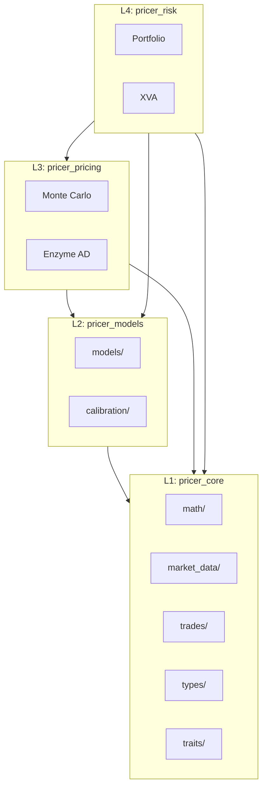
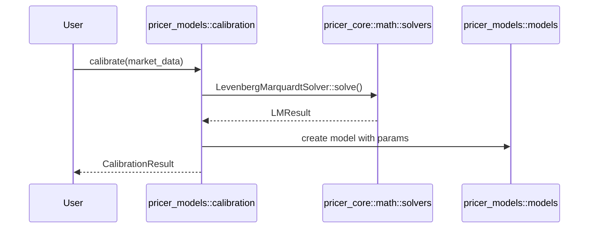
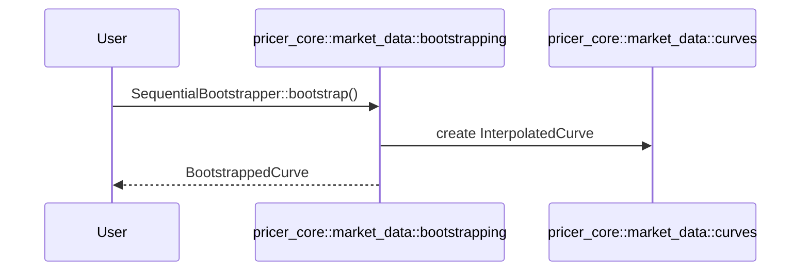

# Design Document

## Overview

**Purpose**: Pricerレイヤーのアーキテクチャを簡素化し、`pricer_optimiser`クレートを廃止して明確な責務分離を実現する。

**Users**: Neutryx開発者がコードの発見性と理解を向上させ、重複を解消する。

**Impact**: pricer_optimiser (L2.5) を廃止し、4層構造（L1-L4）に簡素化。trades モジュールを pricer_core に新設。

### Goals

- pricer_optimiser の廃止と機能の適切な再配置
- モデル定義の論理的カテゴリ整理（equity/, rates/, hybrid/）
- trades（instruments + schedules）の pricer_core への移動
- LMソルバーの重複解消
- 後方互換性の維持（re-export）

### Non-Goals

- 新規モデルの追加
- パフォーマンス最適化
- API の破壊的変更（内部移動のみ）

## Architecture

### Existing Architecture Analysis

**現状（L2.5あり）**:
```
pricer_core (L1) ← pricer_models (L2) ← pricer_optimiser (L2.5) ← pricer_pricing (L3) ← pricer_risk (L4)
```

**問題点**:
- pricer_optimiser の責務が不明確（bootstrapping, solvers, calibration の混在）
- LMソルバーが pricer_core と pricer_optimiser の両方に存在
- trades（instruments, schedules）がモデル層に存在

### Architecture Pattern & Boundary Map

**新アーキテクチャ（L2.5廃止）**:



**Architecture Integration**:
- Selected pattern: 責務分離によるレイヤー簡素化
- Domain boundaries: L1（基盤）、L2（モデル）、L3（プライシング）、L4（リスク）
- Existing patterns preserved: A-I-P-S、enum dispatch、Float generic
- New components rationale: trades/ は キャッシュフロー定義を集約
- Steering compliance: 単方向依存、循環依存禁止

### Technology Stack

| Layer | Choice / Version | Role in Feature | Notes |
|-------|------------------|-----------------|-------|
| pricer_core | Rust | 数学基盤、マーケットデータ、trades | L1 |
| pricer_models | Rust | モデル定義、キャリブレーション | L2 |
| num-traits | 0.2 | Float trait | AD互換 |
| thiserror | 1.x | エラー型 | 各クレート |

## System Flows

### Calibration Flow（移行後）



### Bootstrapping Flow（移行後）



## Requirements Traceability

| Requirement | Summary | Components | Interfaces | Flows |
|-------------|---------|------------|------------|-------|
| 1 | pricer_optimiser廃止 | bootstrapping, provider, solvers | re-exports | Bootstrapping Flow |
| 2 | モデル構造整理 | models/equity/, models/rates/ | StochasticModel | - |
| 3 | キャリブレーション整理 | calibration/ | Calibrator trait | Calibration Flow |
| 4 | Bootstrapping移動 | market_data/bootstrapping/ | BootstrappedCurve | Bootstrapping Flow |
| 5 | 依存関係整理 | Cargo.toml | - | - |
| 6 | ドキュメント更新 | steering/, CHANGELOG | - | - |
| 7 | trades新設 | trades/instruments/, trades/schedules/ | Instrument, Schedule | - |

## Components and Interfaces

| Component | Domain/Layer | Intent | Req Coverage | Key Dependencies | Contracts |
|-----------|--------------|--------|--------------|------------------|-----------|
| trades/instruments | pricer_core/L1 | キャッシュフロー構造定義 | 7 | types (P0) | Service |
| trades/schedules | pricer_core/L1 | 支払日計算 | 7 | types (P0) | Service |
| market_data/bootstrapping | pricer_core/L1 | Yield Curve構築 | 1, 4 | math/solvers (P0) | Service |
| market_data/provider | pricer_core/L1 | マーケットデータキャッシュ | 1 | curves (P0) | Service |
| models/equity | pricer_models/L2 | 株式系モデル | 2 | pricer_core (P0) | Service |
| models/rates | pricer_models/L2 | 金利系モデル | 2 | pricer_core (P0) | Service |
| calibration | pricer_models/L2 | モデルキャリブレーション | 3 | math/solvers (P0) | Service |

### L1: pricer_core

#### trades/instruments

| Field | Detail |
|-------|--------|
| Intent | 取引構造とキャッシュフローの定義 |
| Requirements | 7.1, 7.2, 7.5, 7.6 |

**Responsibilities & Constraints**
- Payoff、Exercise、Forward、Swap、VanillaOption等の定義
- Asset class別サブモジュール（equity/, rates/, credit/, fx/）
- Feature flag による条件コンパイル

**Dependencies**
- Inbound: pricer_models (re-export), pricer_pricing (P0)
- Outbound: types/Currency, types/time (P0)

**Contracts**: Service [x]

##### Service Interface
```rust
pub trait InstrumentTrait<T: Float> {
    fn payoff(&self, spot: T) -> T;
    fn expiry(&self) -> T;
    fn currency(&self) -> Currency;
    fn type_name(&self) -> &'static str;
}

pub enum Instrument<T: Float> {
    Vanilla(VanillaOption<T>),
    Forward(Forward<T>),
    Swap(Swap<T>),
}

pub enum InstrumentEnum<T: Float> {
    #[cfg(feature = "equity")]
    Equity(EquityInstrument<T>),
    #[cfg(feature = "rates")]
    Rates(RatesInstrument<T>),
    #[cfg(feature = "credit")]
    Credit(CreditInstrument<T>),
    #[cfg(feature = "fx")]
    Fx(FxInstrument<T>),
}
```

**Implementation Notes**
- 移動後は `crate::types::Currency` を使用（クレート内参照）
- pricer_models から re-export して後方互換性を維持

#### trades/schedules

| Field | Detail |
|-------|--------|
| Intent | 支払日と期間の計算 |
| Requirements | 7.1, 7.3 |

**Responsibilities & Constraints**
- Schedule、Period、Frequency の定義
- ScheduleBuilder パターン

**Dependencies**
- Inbound: trades/instruments (P1)
- Outbound: types/time/Date (P0)

**Contracts**: Service [x]

##### Service Interface
```rust
pub struct Schedule { /* ... */ }

pub struct ScheduleBuilder {
    pub fn new() -> Self;
    pub fn start(self, date: Date) -> Self;
    pub fn end(self, date: Date) -> Self;
    pub fn frequency(self, freq: Frequency) -> Self;
    pub fn build(self) -> Result<Schedule, ScheduleError>;
}

pub enum Frequency {
    Annual,
    SemiAnnual,
    Quarterly,
    Monthly,
}
```

#### market_data/bootstrapping

| Field | Detail |
|-------|--------|
| Intent | Yield Curve構築（OIS/Swap rates から） |
| Requirements | 1.1, 4.1, 4.2, 4.3 |

**Responsibilities & Constraints**
- SequentialBootstrapper、CachedBootstrapper
- Multi-curve framework（OIS + tenor curves）
- AAD sensitivity computation

**Dependencies**
- Inbound: pricer_risk (P0)
- Outbound: math/solvers (P0), market_data/curves (P0)

**Contracts**: Service [x]

##### Service Interface
```rust
pub struct SequentialBootstrapper<T: Float> { /* ... */ }

impl<T: Float> SequentialBootstrapper<T> {
    pub fn new(config: GenericBootstrapConfig<T>) -> Self;
    pub fn bootstrap(&self, instruments: &[BootstrapInstrument<T>])
        -> Result<GenericBootstrapResult<T>, BootstrapError>;
}

pub struct BootstrappedCurve<T: Float> { /* ... */ }

impl<T: Float> YieldCurve<T> for BootstrappedCurve<T> {
    fn discount_factor(&self, t: T) -> T;
    fn forward_rate(&self, t1: T, t2: T) -> T;
}
```

**Implementation Notes**
- pricer_optimiser から移動時、内部 import を `crate::` に変更
- pricer_models への依存がある場合は削除（pricer_core 内で完結）

#### market_data/provider

| Field | Detail |
|-------|--------|
| Intent | マーケットデータのスレッドセーフキャッシュ |
| Requirements | 1.4 |

**Responsibilities & Constraints**
- Arc<RwLock> による lazy evaluation
- Double-check locking パターン

**Dependencies**
- Outbound: market_data/curves (P0), market_data/surfaces (P0)

**Contracts**: Service [x]

##### Service Interface
```rust
pub struct MarketProvider { /* ... */ }

impl MarketProvider {
    pub fn new() -> Self;
    pub fn get_curve(&self, currency: Currency) -> Arc<CurveEnum>;
    pub fn get_vol(&self, currency: Currency) -> Arc<VolSurfaceEnum>;
}
```

### L2: pricer_models

#### models/equity

| Field | Detail |
|-------|--------|
| Intent | 株式系確率モデル |
| Requirements | 2.1, 2.2, 2.4 |

**Responsibilities & Constraints**
- GBM、Heston、SABR モデル
- Feature flag: `equity` (default)

**Dependencies**
- Inbound: calibration (P0), pricer_pricing (P0)
- Outbound: pricer_core::types (P0)

**Contracts**: Service [x]

##### Service Interface
```rust
// models/equity/mod.rs
pub use gbm::{GBMModel, GBMParams};
pub use heston::{HestonModel, HestonParams, HestonError};
pub use sabr::{SABRModel, SABRParams, SABRError};

// models/mod.rs (re-export for backward compatibility)
pub use equity::{GBMModel, GBMParams, HestonModel, HestonParams, SABRModel, SABRParams};
```

#### models/rates

| Field | Detail |
|-------|--------|
| Intent | 金利系確率モデル |
| Requirements | 2.1, 2.4 |

**Responsibilities & Constraints**
- Hull-White、CIR モデル
- Feature flag: `rates`

**Dependencies**
- Inbound: calibration (P0)
- Outbound: pricer_core::types (P0)

**Contracts**: Service [x]

##### Service Interface
```rust
// models/rates/mod.rs
pub use hull_white::{HullWhiteModel, HullWhiteParams};
pub use cir::{CIRModel, CIRParams};
```

#### calibration

| Field | Detail |
|-------|--------|
| Intent | モデルパラメータのマーケットフィッティング |
| Requirements | 3.1, 3.2, 3.3, 3.4 |

**Responsibilities & Constraints**
- モデル固有キャリブレータ（Heston, SABR, Hull-White）
- 汎用 CalibrationEngine
- CalibrationScope（Global/TermByTerm/Piecewise）

**Dependencies**
- Inbound: pricer_risk (P1)
- Outbound: pricer_core::math::solvers (P0), models (P0)

**Contracts**: Service [x]

##### Service Interface
```rust
pub trait Calibrator<T: Float> {
    type Params;
    type MarketData;

    fn calibrate(&self, data: &Self::MarketData) -> Result<CalibrationResult<Self::Params>, CalibrationError>;
}

pub enum CalibrationScope {
    Global,
    TermByTerm,
    Piecewise,
}

pub struct CalibrationEngine { /* ... */ }

impl CalibrationEngine {
    pub fn new(config: ModelCalibratorConfig) -> Self;
    pub fn calibrate<F>(&self, residual_fn: F, initial: Vec<f64>)
        -> Result<CalibrationResult<f64>, CalibrationError>
    where
        F: Fn(&[f64]) -> Vec<f64>;
}
```

**Implementation Notes**
- `pricer_optimiser::solvers` への依存を `pricer_core::math::solvers` に変更
- `ModelCalibrator` を `CalibrationEngine` にリネーム

## Data Models

### Domain Model

**Aggregates**:
- `Instrument`: 取引構造（Vanilla, Forward, Swap）
- `Schedule`: 支払期間の集合
- `StochasticModel`: 確率過程（GBM, Heston, SABR, Hull-White, CIR）
- `YieldCurve`: 割引曲線

**Value Objects**:
- `Currency`, `Date`, `Frequency`, `PayoffType`, `ExerciseStyle`

**Domain Events**: なし（状態変更なし）

### Logical Data Model

**取引定義の関係**:
```
Instrument 1---* Cashflow
Schedule 1---* Period
Period 1---1 Date (start, end, payment)
```

**モデルとキャリブレーションの関係**:
```
Calibrator 1---1 Model
Calibrator *---1 Solver
CalibrationResult 1---1 ModelParams
```

## Error Handling

### Error Categories and Responses

**User Errors**:
- `InstrumentError`: 無効なパラメータ（負のストライク等）
- `ScheduleError`: 無効な日付範囲
- `CalibrationError::InvalidMarketData`: 不正なマーケットデータ

**System Errors**:
- `BootstrapError::ConvergenceFailure`: 収束失敗
- `CalibrationError::SolverFailure`: ソルバー収束失敗

**Business Logic Errors**:
- `CalibrationError::InfeasibleParameters`: 制約違反

## Testing Strategy

### Unit Tests
- trades/instruments: Payoff計算、Exercise style
- trades/schedules: Schedule生成、Frequency変換
- models/equity: GBM, Heston, SABR のパラメータ検証
- calibration: 各キャリブレータの収束

### Integration Tests
- bootstrapping → curves: Yield Curve 構築フロー
- calibration → models: キャリブレーション → モデル生成
- re-export 互換性: `pricer_models::instruments::*` が動作確認

### E2E Tests
- 全 feature flag 組み合わせでのビルド
- `cargo build --workspace` の成功
- `cargo tree` で循環依存なし

## Migration Strategy

### Phase 1: trades モジュール移動
1. `pricer_core/src/trades/` を新設
2. instruments と schedules をコピー
3. 内部 import を `crate::` に変更
4. pricer_models から re-export
5. テスト実行

### Phase 2: bootstrapping 移動
1. `pricer_core/src/market_data/bootstrapping/` を新設
2. pricer_optimiser からコピー
3. pricer_models 依存を削除
4. provider.rs を market_data/ に移動
5. テスト実行

### Phase 3: モデル構造整理
1. `heston.rs`, `sabr.rs`, `gbm.rs` を equity/ に移動
2. mod.rs の re-export を更新
3. テスト実行

### Phase 4: キャリブレーション整理
1. `ModelCalibrator` を `CalibrationEngine` にリネーム
2. ソルバー依存を pricer_core に統一
3. テスト実行

### Phase 5: pricer_optimiser 削除
1. 依存クレートの Cargo.toml 更新
2. workspace から削除
3. `cargo build --workspace`
4. `cargo tree` で循環依存確認

### Rollback Triggers
- テスト失敗
- 循環依存の発生
- ビルドエラー
