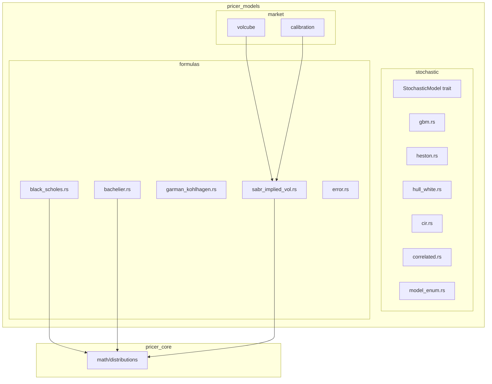
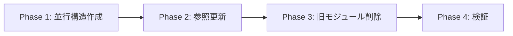

# Design Document: models-module-refactor

## Overview

**Purpose**: `pricer_models` クレート内の `models/` および `analytical/` モジュールを `stochastic/` および `formulas/` に再構成し、責務の明確化と重複排除を実現する。

**Users**: Neutryx ライブラリの開発者および利用者が、確率過程モデル（MC用）と閉形式公式を明確に区別して使用できるようになる。

**Impact**: 既存の import パスが変更されるが、deprecated re-export により後方互換性を維持。

### Goals
- `stochastic/`: 確率過程モデル（`StochasticModel` trait 実装）のみを配置
- `formulas/`: 閉形式解析公式（価格計算、IV 計算）をフラット構造で配置
- 重複排除: `analytical/distributions.rs` を削除し、`pricer_core` を直接参照
- SABR 整理: 未使用の SDE 実装を削除し、Hagan 公式のみを抽出

### Non-Goals
- `pricer_core` への新規モジュール追加
- パフォーマンス最適化
- 新規モデルの追加
- `market/` モジュールの構造変更

---

## Architecture

### Existing Architecture Analysis

現在の `pricer_models/src/` 構成:

```
models/           # 確率過程 + SABR混在
├── stochastic.rs # StochasticModel trait
├── gbm.rs, heston.rs, hull_white.rs, cir.rs, correlated.rs
├── sabr.rs       # StochasticModel + Hagan公式 (混在)
└── model_enum.rs # 静的ディスパッチ enum

analytical/       # 価格公式
├── black_scholes.rs, bachelier.rs, garman_kohlhagen.rs
├── distributions.rs  # pricer_core の re-export (冗長)
└── error.rs
```

**問題点**:
1. `models/sabr.rs` が2つの責務を持つ（約2600行）
2. `analytical/distributions.rs` は単なる re-export
3. ディレクトリ名が概念的に曖昧

### Architecture Pattern & Boundary Map



**Architecture Integration**:
- Selected pattern: Flat module structure（フラットモジュール構造）
- Domain boundaries: `stochastic/` = MC用、`formulas/` = 閉形式解
- Existing patterns preserved: feature flags (`equity`, `rates`, `exotic`)
- New components rationale: `sabr_implied_vol.rs` = Hagan 公式の抽出
- Steering compliance: A-I-P-S アーキテクチャの L1/L2 境界を維持

### Technology Stack

| Layer | Choice / Version | Role in Feature | Notes |
|-------|------------------|-----------------|-------|
| Language | Rust | 全体 | 既存 |
| Math Library | `pricer_core::math` | 確率分布関数 | `norm_cdf`, `norm_pdf`, `norm_inv_cdf` |
| Smoothing | `pricer_core::math::smoothing` | AD 互換演算 | `smooth_log`, `smooth_pow` |
| Traits | `pricer_core::traits::Float` | ジェネリック浮動小数点 | AD 互換 |

---

## Requirements Traceability

| Requirement | Summary | Components | Interfaces | Flows |
|-------------|---------|------------|------------|-------|
| 1.1 | 確率過程を stochastic/ に配置 | stochastic/mod.rs | — | — |
| 1.2 | 閉形式公式を formulas/ に配置 | formulas/mod.rs | — | — |
| 1.3 | SABR 分離 | formulas/sabr_implied_vol.rs | SabrImpliedVol | — |
| 2.1 | distributions.rs 削除 | formulas/mod.rs | — | — |
| 3.1 | SABRModel (MC用) 削除 | stochastic/model_enum.rs | — | — |
| 3.2 | SabrImpliedVol 提供 | formulas/sabr_implied_vol.rs | implied_vol() | — |
| 5.1 | 後方互換 API | lib.rs | deprecated re-export | — |
| 6.1 | テスト通過 | 全体 | — | — |

---

## Components and Interfaces

| Component | Domain/Layer | Intent | Req Coverage | Key Dependencies | Contracts |
|-----------|--------------|--------|--------------|------------------|-----------|
| stochastic/mod.rs | L2/Stochastic | 確率過程モジュール定義 | 1.1 | pricer_core::traits | Module |
| formulas/mod.rs | L2/Formulas | 閉形式公式モジュール定義 | 1.2, 2.1 | pricer_core::math | Module |
| formulas/sabr_implied_vol.rs | L2/Formulas | SABR Hagan公式 | 1.3, 3.2 | pricer_core::math | Service |
| lib.rs (deprecations) | L2/API | 後方互換 re-export | 5.1 | — | API |

### L2 / Stochastic Layer

#### stochastic/mod.rs

| Field | Detail |
|-------|--------|
| Intent | 確率過程モジュールのエントリーポイント |
| Requirements | 1.1 |

**Responsibilities & Constraints**
- `StochasticModel` trait と状態型の公開
- 各モデル（GBM, Heston, Hull-White, CIR, Correlated）の re-export
- **SABR を含めない**（`model_enum.rs` から SABR variant を除去）

**Dependencies**
- Inbound: `pricer_pricing`, `pricer_risk` — MC エンジン (P0)
- Outbound: `pricer_core::traits::Float` — 型制約 (P0)

**Contracts**: Module [ ✓ ]

**Implementation Notes**
- 既存 `models/mod.rs` を `stochastic/mod.rs` にリネーム
- `pub mod sabr;` と `pub use sabr::*;` を削除
- `model_enum.rs` から `SABR` variant を削除

### L2 / Formulas Layer

#### formulas/mod.rs

| Field | Detail |
|-------|--------|
| Intent | 閉形式公式モジュールのエントリーポイント |
| Requirements | 1.2, 2.1 |

**Responsibilities & Constraints**
- Black-Scholes, Bachelier, Garman-Kohlhagen, SabrImpliedVol の公開
- `distributions.rs` を廃止し、`pricer_core::math::distributions` を直接参照

**Dependencies**
- Inbound: `market/volcube`, `market/calibration` — IV 計算 (P0)
- Outbound: `pricer_core::math::distributions` — 正規分布関数 (P0)

**Contracts**: Module [ ✓ ]

##### Module Interface
```rust
// formulas/mod.rs
pub mod error;
mod bachelier;
mod black_scholes;
pub mod garman_kohlhagen;
mod sabr_implied_vol;

// Re-exports
pub use bachelier::Bachelier;
pub use black_scholes::BlackScholes;
pub use error::AnalyticalError;
pub use garman_kohlhagen::{fx_call_price, fx_put_price, GarmanKohlhagen, GarmanKohlhagenParams};
pub use sabr_implied_vol::{SabrImpliedVol, SabrParams, SabrError};

// distributions は再エクスポートしない
// 使用側で pricer_core::math::distributions を直接参照
```

**Implementation Notes**
- `distributions.rs` ファイルを削除
- `black_scholes.rs`, `bachelier.rs` 内の `use super::distributions::*` を `use pricer_core::math::distributions::*` に変更

---

#### formulas/sabr_implied_vol.rs

| Field | Detail |
|-------|--------|
| Intent | SABR Hagan公式によるインプライドボラティリティ計算 |
| Requirements | 1.3, 3.2 |

**Responsibilities & Constraints**
- `SabrParams<T>`: SABR パラメータ構造体
- `SabrImpliedVol<T>`: Hagan 公式によるIV計算
- `SabrError`: エラー型
- **StochasticModel 実装を含めない**

**Dependencies**
- Inbound: `market/volcube`, `market/calibration/sabr` — IV 計算 (P0)
- Outbound: `pricer_core::math::smoothing` — AD 互換演算 (P0)
- Outbound: `pricer_core::traits::Float` — 型制約 (P0)

**Contracts**: Service [ ✓ ]

##### Service Interface
```rust
/// SABR パラメータ
#[derive(Clone, Copy, Debug, PartialEq)]
pub struct SabrParams<T: Float> {
    pub forward: T,
    pub alpha: T,
    pub nu: T,
    pub rho: T,
    pub beta: T,
    pub maturity: T,
    pub atm_threshold: T,
    pub smoothing_epsilon: T,
}

impl<T: Float> SabrParams<T> {
    pub fn new(
        forward: f64,
        alpha: f64,
        nu: f64,
        rho: f64,
        beta: f64,
        maturity: f64,
    ) -> Result<Self, SabrError>;

    pub fn validate(&self) -> Result<(), SabrError>;
    pub fn is_normal(&self) -> bool;
    pub fn is_lognormal(&self) -> bool;
}

/// SABR インプライドボラティリティ計算
#[derive(Clone, Debug)]
pub struct SabrImpliedVol<T: Float> {
    params: SabrParams<T>,
}

impl<T: Float> SabrImpliedVol<T> {
    pub fn new(params: SabrParams<T>) -> Result<Self, SabrError>;
    pub fn params(&self) -> &SabrParams<T>;

    /// ATM インプライドボラティリティ
    pub fn atm_vol(&self) -> T;

    /// 任意ストライクのインプライドボラティリティ
    pub fn implied_vol(&self, strike: T) -> Result<T, SabrError>;

    /// フロア付きインプライドボラティリティ
    pub fn implied_vol_with_floor(&self, strike: T, floor: T) -> Result<T, SabrError>;
}

/// SABR エラー型
#[derive(Error, Debug, Clone, PartialEq)]
pub enum SabrError {
    InvalidForward(f64),
    InvalidAlpha(f64),
    InvalidNu(f64),
    InvalidBeta(f64),
    InvalidRho(f64),
    InvalidMaturity(f64),
    InvalidStrike(f64),
    NegativeImpliedVol(f64),
    NumericalInstability(String),
    NonFinite(String),
}
```

- Preconditions: パラメータが有効範囲内
- Postconditions: 返却値が正の有限値
- Invariants: `SabrImpliedVol` は検証済みパラメータのみを保持

**Implementation Notes**
- 既存 `models/sabr.rs` から以下を抽出:
  - `SABRParams` → `SabrParams` (命名規則統一)
  - `SABRModel` の `implied_vol()` 関連メソッド群
  - `SABRError` → `SabrError`
- `StochasticModel` 実装は**含めない**
- テストも同時に移行

---

### L2 / API Layer (Deprecations)

#### lib.rs

| Field | Detail |
|-------|--------|
| Intent | 後方互換性のための deprecated re-export |
| Requirements | 5.1 |

**Responsibilities & Constraints**
- 旧パス (`models::*`, `analytical::*`) から新パスへの re-export
- `#[deprecated]` 属性で警告を表示

**Contracts**: API [ ✓ ]

##### Deprecated Re-exports
```rust
// lib.rs

pub mod stochastic;
pub mod formulas;
pub mod market;
pub mod compiler;

// === Backward Compatibility (Deprecated) ===

#[deprecated(since = "0.x.0", note = "Use `pricer_models::stochastic` instead")]
pub mod models {
    pub use crate::stochastic::*;
}

#[deprecated(since = "0.x.0", note = "Use `pricer_models::formulas` instead")]
pub mod analytical {
    pub use crate::formulas::*;

    // distributions は formulas に含めないため、直接 re-export
    #[deprecated(
        since = "0.x.0",
        note = "Use `pricer_core::math::distributions` directly"
    )]
    pub mod distributions {
        pub use pricer_core::math::distributions::{norm_cdf, norm_inv_cdf, norm_pdf};
    }
}

// SABR 互換 (models 経由で使用していたユーザー向け)
#[deprecated(since = "0.x.0", note = "Use `pricer_models::formulas::SabrParams` instead")]
pub use formulas::{SabrParams as SABRParams, SabrImpliedVol as SABRModel, SabrError as SABRError};
```

**Implementation Notes**
- 非推奨警告は cargo build 時に表示
- 次期メジャーバージョンで deprecated モジュールを削除予定

---

## Data Models

### Domain Model

本リファクタリングでは新規データモデルを追加しない。既存の型を移動・リネームするのみ。

**移動対象**:
| 旧パス | 新パス | 変更 |
|--------|--------|------|
| `models::SABRParams<T>` | `formulas::SabrParams<T>` | リネーム |
| `models::SABRModel<T>` | `formulas::SabrImpliedVol<T>` | リネーム + StochasticModel 削除 |
| `models::SABRError` | `formulas::SabrError` | リネーム |

**削除対象**:
- `models::sabr.rs` 全体（新規ファイルで置換）
- `analytical::distributions.rs`
- `model_enum::SABR` variant

---

## Error Handling

### Error Strategy

既存のエラー型を維持:
- `SabrError`: パラメータ検証 + 計算エラー
- `AnalyticalError`: 価格公式の入力検証エラー

### Error Categories and Responses

| Error Type | 原因 | 対応 |
|------------|------|------|
| `SabrError::InvalidForward` | forward ≤ 0 | パラメータ検証で拒否 |
| `SabrError::NegativeImpliedVol` | 計算結果が負 | Result::Err を返却 |
| `SabrError::NonFinite` | NaN/Inf 検出 | Result::Err を返却 |

---

## Testing Strategy

### Unit Tests
- `formulas/sabr_implied_vol.rs`: 既存 `models/sabr.rs` のテストを移行
- `formulas/mod.rs`: distributions 削除後の import 正常性
- `stochastic/model_enum.rs`: SABR variant 削除後の enum 動作

### Integration Tests
- `pricer_pricing` との統合: MC エンジンが SABR 非依存で動作
- `market/volcube` との統合: `SabrImpliedVol` 経由での IV 計算
- `market/calibration/sabr` との統合: キャリブレーション正常動作

### Regression Tests
- 全既存テストの通過確認
- deprecated 警告の発生確認（CI での警告カウント）

---

## Migration Strategy

### Phase 1: 並行構造作成
1. `stochastic/` ディレクトリ作成、`models/` からファイルコピー
2. `formulas/` ディレクトリ作成、`analytical/` からファイルコピー
3. `formulas/sabr_implied_vol.rs` を新規作成

### Phase 2: 参照更新
1. `formulas/` 内の import を `pricer_core::math::distributions` に変更
2. `market/volcube`, `market/calibration` の SABR 参照を更新
3. `stochastic/model_enum.rs` から SABR variant を削除

### Phase 3: 旧モジュール削除
1. `models/` ディレクトリ削除
2. `analytical/` ディレクトリ削除
3. `lib.rs` に deprecated re-export を追加

### Phase 4: 検証
1. `cargo test --all-features`
2. `cargo clippy --all-features`
3. `cargo doc` でドキュメントリンク確認



**Rollback Trigger**: いずれのフェーズでもテスト失敗時は前フェーズにロールバック
