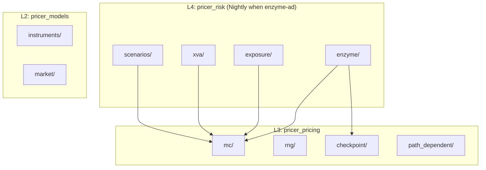
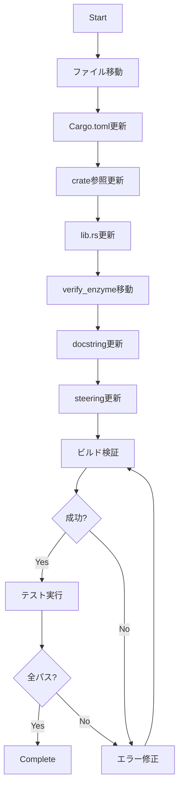
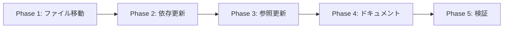

# Design Document: move-enzyme-to-pricer-risk

## Overview

**Purpose**: enzymeモジュール（AAD自動微分インフラ）をpricer_pricing (L3)からpricer_risk (L4)へ移動し、リスク計算機能とAAD機能のアーキテクチャ上の整合性を向上させる。

**Users**: Neutryx開発者、pricer_riskを使用するアプリケーション

**Impact**: L3/L4の責務境界を変更し、AADをリスク計算レイヤーに統合。Nightly Rust要件がpricer_riskに伝播（enzyme-ad feature有効時のみ）。

### Goals

- enzymeモジュール全11ファイルをpricer_riskに移動
- 移動後のコンパイル成功とテストパス
- steeringドキュメントの整合性維持
- enzyme-ad featureによるstable/nightly分離維持

### Non-Goals

- enzymeモジュールの機能変更・拡張
- MonteCarloPricerの移動
- 新規クレートの作成
- 後方互換性のためのre-export（完全移行）

## Architecture

### Existing Architecture Analysis

**現状（L3にenzyme配置）**:

```
L4: pricer_risk (Stable)
  ├── exposure/, xva/, scenarios/, parallel/
  └── depends on: pricer_pricing

L3: pricer_pricing (Nightly + Enzyme)
  ├── enzyme/  ← AADモジュール
  ├── mc/, rng/, path_dependent/, graph/
  └── depends on: pricer_core, pricer_models
```

**課題**:
- AADはリスク計算（Greeks）のための機能
- L3にあることでL4での使用時に間接依存
- アーキテクチャ上の責務が不明瞭

### Architecture Pattern & Boundary Map

**移動後のアーキテクチャ**:



**Architecture Integration**:
- **Selected pattern**: Dependency Inversion（L4がL3のMCを使用）
- **Domain boundaries**: enzyme = AAD基盤、mc = モンテカルロエンジン（分離維持）
- **Existing patterns preserved**: A-I-P-S unidirectional flow
- **New components rationale**: 新規コンポーネントなし、配置変更のみ
- **Steering compliance**: L4→L3依存は許可されている

### Technology Stack

| Layer | Choice / Version | Role in Feature | Notes |
|-------|------------------|-----------------|-------|
| Runtime | Rust nightly-2025-01-15 | Enzyme `#![feature(autodiff)]` | enzyme-ad feature有効時のみ |
| Dependencies | llvm-sys 180 | Enzyme LLVM統合 | pricer_riskに移動 |
| Build | Cargo features | enzyme-ad/stable分離 | 既存パターン踏襲 |

## System Flows

### モジュール移動フロー



## Requirements Traceability

| Requirement | Summary | Components | Interfaces | Flows |
|-------------|---------|------------|------------|-------|
| 1.1 | enzyme全ファイルがpricer_riskに存在 | pricer_risk/src/enzyme/ | - | ファイル移動 |
| 1.2 | pricer_pricingからenzyme削除 | pricer_pricing/src/ | - | ファイル削除 |
| 1.3 | enzymeをpublic export | pricer_risk/src/lib.rs | pub mod enzyme | lib.rs更新 |
| 2.1 | llvm-sys依存追加 | pricer_risk/Cargo.toml | [dependencies] | Cargo更新 |
| 2.2 | llvm-sys依存削除 | pricer_pricing/Cargo.toml | [dependencies] | Cargo更新 |
| 2.3 | nightlyビルドサポート | pricer_risk/src/lib.rs | cfg_attr | lib.rs更新 |
| 2.4 | enzyme-ad feature定義 | pricer_risk/Cargo.toml | [features] | Cargo更新 |
| 3.1 | パス参照更新 | enzyme/*.rs | use pricer_pricing:: | コード更新 |
| 3.2 | テストコード更新 | tests/ | use pricer_risk::enzyme | テスト更新 |
| 3.3 | デモコード更新 | demo/ | use pricer_risk::enzyme | デモ更新 |
| 3.4 | re-export禁止 | pricer_pricing/src/lib.rs | - | lib.rs更新 |
| 4.1 | structure.md更新 | .kiro/steering/ | - | ドキュメント |
| 4.2 | structure.mdからenzyme削除 | .kiro/steering/ | - | ドキュメント |
| 4.3 | tech.md nightly記載 | .kiro/steering/ | - | ドキュメント |
| 5.1-5.4 | ビルド・テスト検証 | CI | cargo build/test | 検証 |

## Components and Interfaces

| Component | Domain/Layer | Intent | Req Coverage | Key Dependencies | Contracts |
|-----------|--------------|--------|--------------|------------------|-----------|
| enzyme module | L4/Risk | AAD自動微分インフラ | 1.1, 1.3, 2.3, 2.4 | pricer_pricing::mc (P0) | Service |
| Cargo.toml (risk) | L4/Config | 依存関係定義 | 2.1, 2.4 | llvm-sys (P0) | - |
| Cargo.toml (pricing) | L3/Config | 依存関係定義 | 2.2 | - | - |
| lib.rs (risk) | L4/Entry | モジュールエクスポート | 1.3, 2.3 | - | - |
| lib.rs (pricing) | L3/Entry | re-export削除 | 3.4 | - | - |
| verify_enzyme | L4/Test | gradient検証テスト | 3.2 | enzyme, verify, path_dependent | - |

### L4: pricer_risk

#### enzyme module

| Field | Detail |
|-------|--------|
| Intent | Enzyme自動微分インフラをpricer_riskに提供 |
| Requirements | 1.1, 1.3, 2.3, 2.4, 3.1 |

**Responsibilities & Constraints**
- AAD（自動微分）の基盤機能提供
- MonteCarloPricerへの依存を`pricer_pricing::`経由で維持
- enzyme-ad feature有効時のみnightly Rust必須

**Dependencies**
- Outbound: `pricer_pricing::mc` — MonteCarloPricer, GbmParams, PayoffParams (P0)
- Outbound: `pricer_pricing::checkpoint` — CheckpointManager, CheckpointStrategy (P1)
- External: `llvm-sys 180` — Enzyme LLVM統合 (P0)

**Contracts**: Service [x]

##### Service Interface

```rust
// crates/pricer_risk/src/enzyme/mod.rs

/// ADモード（Forward/Reverse）
pub enum ADMode {
    Forward,
    Reverse,
    Auto,
}

/// パラメータのアクティビティ
pub enum Activity {
    Active,
    Const,
}

/// 勾配計算（有限差分近似、Enzyme AD統合時は実ADに置換）
pub fn gradient<F>(f: F, x: f64) -> f64
where
    F: Fn(f64) -> f64;

/// ステップサイズ指定の勾配計算
pub fn gradient_with_step<F>(f: F, x: f64, step: f64) -> f64
where
    F: Fn(f64) -> f64;
```

- Preconditions: 関数`f`は微分可能
- Postconditions: 勾配値を返却
- Invariants: enzyme-ad無効時は有限差分近似

**Implementation Notes**
- Integration: `use pricer_pricing::mc::`への参照変更が必要
- Validation: enzyme-ad feature有効時のみ`#![feature(autodiff)]`
- Risks: MonteCarloPricerのAPI変更時に影響

#### Cargo.toml (pricer_risk)

| Field | Detail |
|-------|--------|
| Intent | enzyme依存関係とfeature定義 |
| Requirements | 2.1, 2.4 |

**変更内容**

```toml
[dependencies]
# 既存依存に追加
llvm-sys = { version = "180", features = ["prefer-dynamic"], optional = true }

[features]
# 既存featureに追加
enzyme-ad = ["dep:llvm-sys"]
```

#### lib.rs (pricer_risk)

| Field | Detail |
|-------|--------|
| Intent | enzymeモジュールのエクスポートとnightly feature |
| Requirements | 1.3, 2.3 |

**変更内容**

```rust
// ファイル先頭に追加
#![cfg_attr(feature = "enzyme-ad", feature(autodiff))]

// モジュール宣言に追加
pub mod enzyme;

// re-export（オプション）
pub use enzyme::{gradient, gradient_with_step, ADMode, Activity};
```

### L3: pricer_pricing

#### lib.rs (pricer_pricing) 変更

| Field | Detail |
|-------|--------|
| Intent | enzymeモジュールとre-exportの削除 |
| Requirements | 1.2, 3.4 |

**削除内容**

```rust
// 削除: pub mod enzyme;
// 削除: pub use enzyme::{gradient, gradient_with_step, ADMode, Activity};
```

#### Cargo.toml (pricer_pricing) 変更

| Field | Detail |
|-------|--------|
| Intent | llvm-sys依存の削除 |
| Requirements | 2.2 |

**削除内容**

```toml
# 削除（enzyme-ad featureがpricer_riskに移動するため）
# llvm-sys = { version = "180", features = ["prefer-dynamic"], optional = true }
# enzyme-ad = ["dep:llvm-sys"]
```

**Note**: `#![cfg_attr(feature = "enzyme-ad", feature(autodiff))]`も削除

### Test: verify_enzyme

| Field | Detail |
|-------|--------|
| Intent | enzyme gradient関数の検証テスト |
| Requirements | 3.2 |

**移動先**: `crates/pricer_risk/tests/verify_enzyme.rs`

**インポート変更**:

```rust
// 変更前
use crate::{enzyme::gradient, verify::{square, square_gradient}};
use crate::path_dependent::PathPayoffType;

// 変更後
use pricer_risk::enzyme::gradient;
use pricer_pricing::verify::{square, square_gradient};
use pricer_pricing::path_dependent::PathPayoffType;
```

## Data Models

本フィーチャーはモジュール配置変更のみのため、データモデルの変更なし。

## Error Handling

### Error Strategy

移動に伴うエラーは主にコンパイルエラーとして顕在化。

### Error Categories and Responses

- **Import Error**: `crate::mc`が見つからない → `pricer_pricing::mc`に変更
- **Feature Error**: `#![feature(autodiff)]`が解決できない → enzyme-ad feature有効化確認
- **Dependency Error**: llvm-sys未解決 → Cargo.toml確認

## Testing Strategy

### Unit Tests

- enzyme/mod.rs内の既存テスト（移動後も動作確認）
- greeks.rs内のGreeksEnzymeテスト（インポートパス変更後）

### Integration Tests

- verify_enzyme.rs（pricer_risk/tests/に移動）
- gradient計算の精度検証
- path_dependent連携テスト

### Build Verification

- `cargo build -p pricer_risk` — 通常ビルド
- `cargo build -p pricer_risk --features enzyme-ad` — nightlyビルド
- `cargo build --workspace` — ワークスペース全体
- `cargo test -p pricer_risk` — テスト実行

## Migration Strategy



### Phase 1: ファイル移動
- `crates/pricer_pricing/src/enzyme/` → `crates/pricer_risk/src/enzyme/`
- verify_enzyme.rs → `crates/pricer_risk/tests/verify_enzyme.rs`

### Phase 2: 依存関係更新
- pricer_risk/Cargo.toml: llvm-sys追加、enzyme-ad feature定義
- pricer_pricing/Cargo.toml: llvm-sys削除、enzyme-ad feature削除

### Phase 3: コード参照更新
- enzyme/*.rs: `crate::mc` → `pricer_pricing::mc`
- enzyme/*.rs: `crate::checkpoint` → `pricer_pricing::checkpoint`
- pricer_pricing/lib.rs: enzyme関連削除
- pricer_risk/lib.rs: enzyme追加、nightly feature追加

### Phase 4: ドキュメント更新
- docstring内の`pricer_pricing::enzyme` → `pricer_risk::enzyme`
- .kiro/steering/structure.md更新
- .kiro/steering/tech.md更新

### Phase 5: 検証
- 全ビルドターゲット確認
- テスト実行
- CI/CDパイプライン確認

### Rollback Triggers
- ワークスペースビルド失敗
- 既存テスト失敗
- 他クレートからの予期しない依存エラー
