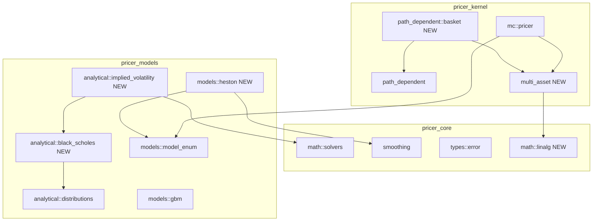
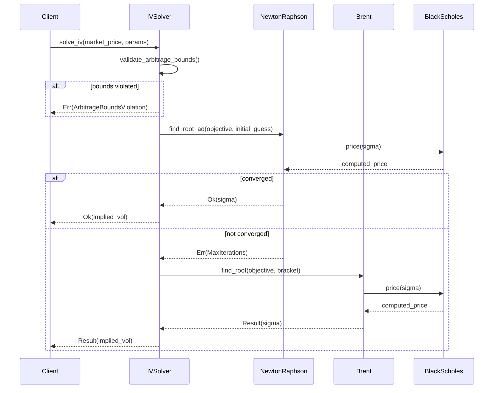
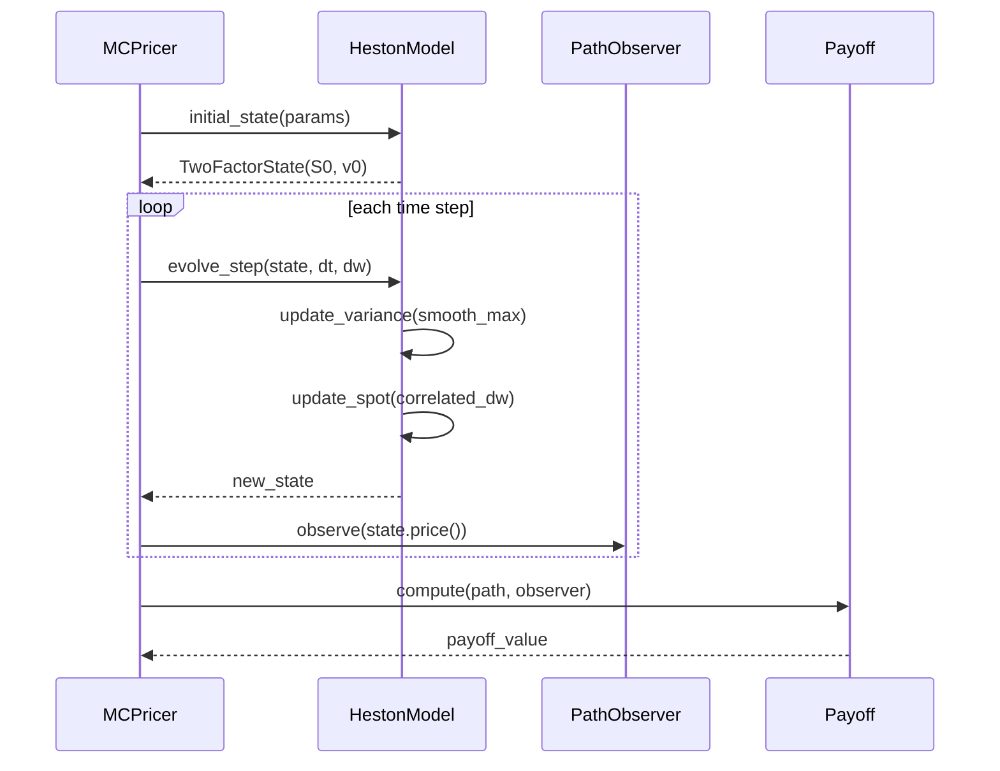
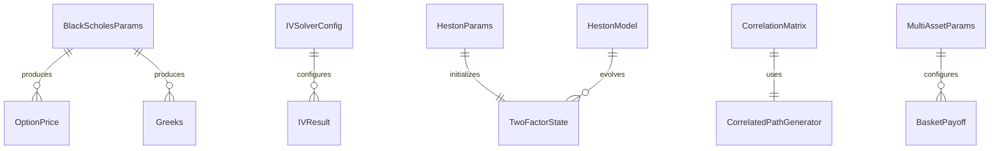

# Technical Design: new-option-pricer

## Overview

**Purpose**: 本機能は、neutryx-rust XVAプライシングライブラリにBlack-Scholes解析プライシング、インプライドボラティリティソルバー、Hestonストキャスティックボラティリティモデル、およびバスケットオプションサポートを追加する。

**Users**: クオンツアナリスト、マーケットデータエンジニア、デリバティブトレーダー、ポートフォリオマネージャーが、高速な解析プライシング、ボラティリティサーフェスのキャリブレーション、リアルなボラティリティダイナミクスのモデリング、および複数資産のヘッジ戦略評価に使用する。

**Impact**: 既存の`pricer_models`および`pricer_kernel`クレートに新規モジュールを追加。既存のGBMモンテカルロインフラストラクチャを拡張し、多資産サポートを導入する。

### Goals
- Black-Scholes公式による高速な解析プライシングとギリシャ計算を提供
- 市場価格からのインプライドボラティリティ逆算機能を実装
- Hestonストキャスティックボラティリティモデルをモンテカルロエンジンに統合
- 相関付き複数資産のバスケットオプションプライシングをサポート
- すべての新機能でEnzyme AD互換性を維持

### Non-Goals
- SABRモデルの実装（将来の拡張として検討）
- ボラティリティサーフェスの自動キャリブレーション
- アメリカンオプションの早期行使最適化
- リアルタイムマーケットデータフィード統合

## Architecture

### Existing Architecture Analysis

現在のシステムは4層アーキテクチャを採用：

| Layer | Crate | 役割 |
|-------|-------|------|
| 1 | pricer_core | 基盤（型、トレイト、数学ユーティリティ、カーブ） |
| 2 | pricer_models | ビジネスロジック（商品、モデル、解析） |
| 3 | pricer_kernel | ADエンジン（モンテカルロ、Enzyme統合） |
| 4 | Applications | 統合レイヤー |

**既存パターン**:
- 静的ディスパッチ: `StochasticModelEnum`による列挙型ベースのディスパッチ（Enzyme互換）
- Float型ジェネリック: `T: Float`でf64/Dual64のAD互換性
- Smooth approximation: `smooth_max`等で不連続点を微分可能に

**統合ポイント**:
- `pricer_models::analytical`: 解析プライシング関数（norm_cdf/norm_pdf実装済み）
- `pricer_models::models`: 確率モデル（StochasticModel trait, GBM実装済み）
- `pricer_kernel::path_dependent`: パス依存ペイオフ（PathDependentPayoff trait実装済み）
- `pricer_core::math::solvers`: 数値ソルバー（Newton-Raphson, Brent実装済み）

### Architecture Pattern & Boundary Map



**Architecture Integration**:
- **Selected pattern**: 既存レイヤー構造の拡張（ハイブリッドアプローチ）
- **Domain boundaries**: 解析プライシング（Layer2）、確率モデル（Layer2）、多資産MC（Layer3）
- **Existing patterns preserved**: 静的ディスパッチ、Float型ジェネリック、Smooth approximation
- **New components rationale**: 各要件に対応する最小限の新規モジュール
- **Steering compliance**: 4層アーキテクチャ維持、Enzyme AD互換性維持

### Technology Stack

| Layer | Choice / Version | Role in Feature | Notes |
|-------|------------------|-----------------|-------|
| Core Math | pricer_core::math | ソルバー、分布関数 | 既存活用 |
| Linear Algebra | nalgebra (純Rust) | Cholesky分解 | 新規依存 |
| Parallel Processing | rayon | バッチIV計算 | 既存依存 |
| AD Engine | Enzyme LLVM | 自動微分 | 既存活用 |
| Testing | criterion | ベンチマーク | 既存活用 |

## System Flows

### IV Solver Flow



### Heston MC Simulation Flow



## Requirements Traceability

| Requirement | Summary | Components | Interfaces | Flows |
|-------------|---------|------------|------------|-------|
| 1.1-1.6 | Black-Scholes解析プライシング | BlackScholesPricer | BlackScholesParams, OptionPrice, Greeks | - |
| 2.1-2.6 | インプライドボラティリティソルバー | ImpliedVolatilitySolver | IVSolverConfig, IVResult | IV Solver Flow |
| 3.1-3.7 | Hestonモデル | HestonModel, HestonParams | StochasticModel trait | Heston MC Flow |
| 4.1-4.7 | バスケットオプション | BasketPayoff, CorrelatedPathGenerator | MultiAssetParams, CorrelationMatrix | - |
| 5.1-5.6 | テストとベンチマーク | 各コンポーネントのテスト | - | - |

## Components and Interfaces

### Summary

| Component | Domain/Layer | Intent | Req Coverage | Key Dependencies | Contracts |
|-----------|--------------|--------|--------------|------------------|-----------|
| BlackScholesPricer | analytical/L2 | BS公式によるプライシング | 1.1-1.6 | distributions (P0) | Service |
| ImpliedVolatilitySolver | analytical/L2 | 市場価格からIV計算 | 2.1-2.6 | BlackScholesPricer (P0), Solvers (P0) | Service |
| HestonModel | models/L2 | SVモデルのMC実装 | 3.1-3.7 | smoothing (P0), ModelEnum (P0) | Service |
| HestonParams | models/L2 | Hestonパラメータ検証 | 3.2, 3.6 | - | State |
| CorrelatedPathGenerator | multi_asset/L3 | 相関付きBM生成 | 4.3, 4.6 | nalgebra (P0) | Service |
| BasketPayoff | path_dependent/L3 | バスケットペイオフ計算 | 4.1-4.7 | PathDependentPayoff (P0) | Service |

### Analytical Layer (pricer_models::analytical)

#### BlackScholesPricer

| Field | Detail |
|-------|--------|
| Intent | Black-Scholes公式によるヨーロピアンオプションの解析プライシング |
| Requirements | 1.1, 1.2, 1.3, 1.4, 1.5, 1.6 |

**Responsibilities & Constraints**
- ヨーロピアンコール/プットオプションの価格計算
- 解析的ギリシャ（Delta, Gamma, Vega, Theta, Rho）の計算
- Float型ジェネリックによるAD互換性維持

**Dependencies**
- Inbound: なし
- Outbound: `distributions::norm_cdf`, `distributions::norm_pdf` — 正規分布関数 (P0)
- External: なし

**Contracts**: Service [x]

##### Service Interface
```rust
/// Black-Scholes価格計算パラメータ
pub struct BlackScholesParams<T: Float> {
    pub spot: T,           // スポット価格
    pub strike: T,         // ストライク価格
    pub time_to_maturity: T, // 満期までの時間（年）
    pub rate: T,           // 無リスク金利
    pub volatility: T,     // ボラティリティ
}

/// オプション価格結果
pub struct OptionPrice<T: Float> {
    pub call: T,
    pub put: T,
}

/// ギリシャ
pub struct Greeks<T: Float> {
    pub delta: T,
    pub gamma: T,
    pub vega: T,
    pub theta: T,
    pub rho: T,
}

/// Black-Scholes Pricer
impl<T: Float> BlackScholesPricer<T> {
    /// コール価格を計算
    pub fn call_price(params: &BlackScholesParams<T>) -> T;

    /// プット価格を計算
    pub fn put_price(params: &BlackScholesParams<T>) -> T;

    /// コールとプット両方を計算
    pub fn price(params: &BlackScholesParams<T>) -> OptionPrice<T>;

    /// コールのギリシャを計算
    pub fn call_greeks(params: &BlackScholesParams<T>) -> Greeks<T>;

    /// プットのギリシャを計算
    pub fn put_greeks(params: &BlackScholesParams<T>) -> Greeks<T>;
}
```

- **Preconditions**: spot > 0, strike > 0, volatility > 0, time_to_maturity >= 0
- **Postconditions**: 価格は非負、Put-Call Parityを満たす
- **Invariants**: Float型ジェネリックでAD互換

**Implementation Notes**
- 満期 <= 0 の場合はイントリンシック価値を返す
- d1, d2計算を共通化してコール/プットで再利用

#### ImpliedVolatilitySolver

| Field | Detail |
|-------|--------|
| Intent | 市場価格からインプライドボラティリティを逆算 |
| Requirements | 2.1, 2.2, 2.3, 2.4, 2.5, 2.6 |

**Responsibilities & Constraints**
- Newton-Raphson法（AD付き）による高速IV計算
- Brent法へのフォールバック
- アービトラージ境界のバリデーション
- 並列バッチ処理サポート

**Dependencies**
- Inbound: なし
- Outbound: `BlackScholesPricer` — 目的関数評価 (P0)
- Outbound: `pricer_core::math::solvers::NewtonRaphsonSolver` — 主ソルバー (P0)
- Outbound: `pricer_core::math::solvers::BrentSolver` — フォールバック (P0)
- External: `rayon` — 並列バッチ処理 (P1)

**Contracts**: Service [x]

##### Service Interface
```rust
/// IVソルバー設定
pub struct IVSolverConfig {
    pub tolerance: f64,        // 収束許容誤差（デフォルト: 1e-8）
    pub max_iterations: usize, // 最大反復回数（デフォルト: 100）
    pub initial_guess: f64,    // 初期推定値（デフォルト: 0.2）
}

/// IV計算結果
pub struct IVResult {
    pub implied_volatility: f64,
    pub iterations: usize,
    pub solver_used: SolverType, // NewtonRaphson or Brent
}

pub enum SolverType {
    NewtonRaphson,
    Brent,
}

impl ImpliedVolatilitySolver {
    /// 単一オプションのIVを計算
    pub fn solve(
        market_price: f64,
        is_call: bool,
        spot: f64,
        strike: f64,
        time_to_maturity: f64,
        rate: f64,
        config: Option<IVSolverConfig>,
    ) -> Result<IVResult, PricingError>;

    /// バッチIV計算（並列処理）
    pub fn solve_batch(
        requests: &[IVRequest],
        config: Option<IVSolverConfig>,
    ) -> Vec<Result<IVResult, PricingError>>;
}
```

- **Preconditions**: market_price > 0, 他パラメータはBS制約に準拠
- **Postconditions**: 0 < IV < 5.0（妥当な範囲）
- **Invariants**: フォールバック時もエラーを適切に伝播

**Implementation Notes**
- アービトラージ境界: コール価格 > max(S - K*exp(-rT), 0)、プット価格 > max(K*exp(-rT) - S, 0)
- 境界違反時は `PricingError::ArbitrageBoundsViolation` を返す

### Models Layer (pricer_models::models)

#### HestonModel

| Field | Detail |
|-------|--------|
| Intent | Hestonストキャスティックボラティリティモデルのモンテカルロ実装 |
| Requirements | 3.1, 3.2, 3.3, 3.4, 3.5, 3.6, 3.7 |

**Responsibilities & Constraints**
- `StochasticModel`トレイトの実装
- Milstein + Full Truncation離散化
- `TwoFactorState<T>`による価格・分散の同時管理
- Feller条件のバリデーション

**Dependencies**
- Inbound: `StochasticModelEnum` — 静的ディスパッチ (P0)
- Outbound: `pricer_core::smoothing::smooth_max` — 非負性保証 (P0)
- External: なし

**Contracts**: Service [x] / State [x]

##### Service Interface
```rust
/// Hestonモデルパラメータ
#[derive(Clone, Debug)]
pub struct HestonParams<T: Float> {
    pub spot: T,        // 初期スポット価格
    pub rate: T,        // 無リスク金利
    pub kappa: T,       // 平均回帰速度
    pub theta: T,       // 長期分散
    pub sigma: T,       // ボラティリティのボラティリティ (vol of vol)
    pub rho: T,         // スポットと分散の相関
    pub v0: T,          // 初期分散
}

impl<T: Float> HestonParams<T> {
    /// パラメータを検証して生成
    pub fn new(...) -> Result<Self, PricingError>;

    /// Feller条件をチェック (2κθ > σ²)
    pub fn feller_condition_satisfied(&self) -> bool;
}

/// Hestonモデル
pub struct HestonModel<T: Float> {
    smoothing_epsilon: T,
}

impl<T: Float + Default> StochasticModel<T> for HestonModel<T> {
    type State = TwoFactorState<T>;
    type Params = HestonParams<T>;

    fn evolve_step(state: Self::State, dt: T, dw: &[T], params: &Self::Params) -> Self::State;
    fn initial_state(params: &Self::Params) -> Self::State;
    fn brownian_dim() -> usize { 2 }
    fn model_name() -> &'static str { "Heston" }
}
```

- **Preconditions**: kappa > 0, theta > 0, sigma > 0, v0 > 0, -1 <= rho <= 1
- **Postconditions**: 分散は常に非負（smooth_maxにより保証）
- **Invariants**: dw[0]はスポット用、dw[1]は分散用（相関付き）

##### State Management
```rust
/// Milstein + Full Truncation離散化
fn evolve_step(state: TwoFactorState<T>, dt: T, dw: &[T], params: &HestonParams<T>) -> TwoFactorState<T> {
    let (s, v) = (state.first, state.second);

    // 相関付きブラウン運動
    let dw_s = dw[0];
    let dw_v = params.rho * dw[0] + (T::one() - params.rho * params.rho).sqrt() * dw[1];

    // 分散プロセス（Milstein + Full Truncation）
    let v_plus = smooth_max(v, T::zero(), epsilon);
    let sqrt_v = v_plus.sqrt();
    let v_new = v + params.kappa * (params.theta - v_plus) * dt
              + params.sigma * sqrt_v * dt.sqrt() * dw_v
              + T::from(0.25).unwrap() * params.sigma * params.sigma * dt * (dw_v * dw_v - T::one());
    let v_new_plus = smooth_max(v_new, T::zero(), epsilon);

    // スポットプロセス（log-space）
    let drift = (params.rate - T::from(0.5).unwrap() * v_plus) * dt;
    let diffusion = sqrt_v * dt.sqrt() * dw_s;
    let s_new = s * (drift + diffusion).exp();

    TwoFactorState { first: s_new, second: v_new_plus }
}
```

**Implementation Notes**
- `smooth_max`のepsilonはモデル構築時に設定（デフォルト: 1e-6）
- Feller条件を満たさない場合は警告ログを出力

### Multi-Asset Layer (pricer_kernel::multi_asset)

#### CorrelatedPathGenerator

| Field | Detail |
|-------|--------|
| Intent | 相関付き複数資産のブラウン運動生成 |
| Requirements | 4.3, 4.5, 4.6 |

**Responsibilities & Constraints**
- Cholesky分解による相関付きBM生成
- 相関行列の正定値検証
- 複数資産のパス同時生成

**Dependencies**
- Inbound: `MCPricer` — パス生成要求 (P0)
- Outbound: なし
- External: `nalgebra::linalg::Cholesky` — Cholesky分解 (P0)

**Contracts**: Service [x]

##### Service Interface
```rust
use nalgebra::{DMatrix, DVector};

/// 相関行列（対称正定値）
pub struct CorrelationMatrix {
    matrix: DMatrix<f64>,
    cholesky_lower: DMatrix<f64>, // 事前計算済みL
}

impl CorrelationMatrix {
    /// 相関行列を検証して生成
    pub fn new(matrix: DMatrix<f64>) -> Result<Self, PricingError>;

    /// 独立乱数を相関付き乱数に変換
    pub fn correlate(&self, independent: &DVector<f64>) -> DVector<f64>;
}

/// 複数資産パラメータ
pub struct MultiAssetParams<T: Float> {
    pub spots: Vec<T>,
    pub rates: Vec<T>,       // 各資産の金利（通常同一）
    pub volatilities: Vec<T>,
    pub correlation: CorrelationMatrix,
}

/// 相関付きパス生成器
pub struct CorrelatedPathGenerator {
    n_assets: usize,
    correlation: CorrelationMatrix,
}

impl CorrelatedPathGenerator {
    pub fn new(correlation: CorrelationMatrix) -> Self;

    /// 1ステップの相関付き乱数生成
    pub fn generate_step(&self, independent_randoms: &[f64]) -> Vec<f64>;

    /// 全パス生成
    pub fn generate_paths(
        &self,
        params: &MultiAssetParams<f64>,
        n_steps: usize,
        dt: f64,
        all_randoms: &[f64],
    ) -> Vec<Vec<f64>>; // [asset_idx][step]
}
```

- **Preconditions**: correlation matrixは対称正定値、n_assets >= 2
- **Postconditions**: 生成された乱数は指定相関を持つ
- **Invariants**: Cholesky分解は構築時に一度だけ実行

**Implementation Notes**
- `nalgebra::linalg::Cholesky::new()`がNoneを返す場合は`PricingError::InvalidCorrelationMatrix`
- 相関行列は構築時に一度だけCholesky分解してキャッシュ

#### BasketPayoff

| Field | Detail |
|-------|--------|
| Intent | バスケットオプションのペイオフ計算 |
| Requirements | 4.1, 4.2, 4.4, 4.7 |

**Responsibilities & Constraints**
- 加重平均に対するコール/プットペイオフ
- `PathDependentPayoff`トレイトの実装
- スプレッドオプションのサポート（2資産の場合）

**Dependencies**
- Inbound: `MCPricer` — ペイオフ評価 (P0)
- Outbound: `pricer_core::smoothing::smooth_max` — AD互換max (P0)
- External: なし

**Contracts**: Service [x]

##### Service Interface
```rust
/// バスケットオプションの種類
pub enum BasketType {
    Call,
    Put,
    Spread, // 2資産の場合のみ
}

/// バスケットペイオフ
pub struct BasketPayoff<T: Float> {
    pub weights: Vec<T>,
    pub strike: T,
    pub basket_type: BasketType,
    pub smoothing_epsilon: T,
}

impl<T: Float> BasketPayoff<T> {
    pub fn new(weights: Vec<T>, strike: T, basket_type: BasketType) -> Result<Self, PricingError>;
}

/// 多資産版PathDependentPayoff
pub trait MultiAssetPayoff<T: Float>: Send + Sync {
    /// 複数資産の終値からペイオフを計算
    fn compute(&self, terminal_prices: &[T]) -> T;
}

impl<T: Float> MultiAssetPayoff<T> for BasketPayoff<T> {
    fn compute(&self, terminal_prices: &[T]) -> T {
        let basket_value = self.weights.iter()
            .zip(terminal_prices.iter())
            .map(|(w, p)| *w * *p)
            .fold(T::zero(), |acc, x| acc + x);

        match self.basket_type {
            BasketType::Call => smooth_max(basket_value - self.strike, T::zero(), self.smoothing_epsilon),
            BasketType::Put => smooth_max(self.strike - basket_value, T::zero(), self.smoothing_epsilon),
            BasketType::Spread => {
                // asset1 - asset2 - strike
                smooth_max(terminal_prices[0] - terminal_prices[1] - self.strike, T::zero(), self.smoothing_epsilon)
            }
        }
    }
}
```

- **Preconditions**: weights.len() == n_assets, sum(weights) > 0
- **Postconditions**: ペイオフは非負
- **Invariants**: スプレッドオプションはn_assets == 2の場合のみ

## Data Models

### Domain Model



### Error Types Extension

```rust
/// PricingErrorへの追加バリアント
pub enum PricingError {
    // 既存バリアント...
    InvalidInput(String),
    NumericalInstability(String),
    ModelFailure(String),
    UnsupportedInstrument(String),

    // 新規追加
    /// IV計算時のアービトラージ境界違反
    ArbitrageBoundsViolation {
        market_price: f64,
        lower_bound: f64,
        upper_bound: f64,
    },

    /// 相関行列が正定値でない
    InvalidCorrelationMatrix(String),

    /// Feller条件違反（警告レベル）
    FellerConditionViolation {
        kappa: f64,
        theta: f64,
        sigma: f64,
    },
}
```

## Error Handling

### Error Strategy
- **Validation Errors**: パラメータ構築時に早期検出
- **Solver Errors**: Newton-Raphson失敗時はBrentにフォールバック
- **Numerical Errors**: smooth_maxで発散を防止

### Error Categories and Responses

| Error Type | Condition | Response |
|------------|-----------|----------|
| ArbitrageBoundsViolation | 市場価格が理論境界外 | IVソルバーから即座にErr返却 |
| InvalidCorrelationMatrix | Cholesky分解失敗 | CorrelationMatrix::newからErr返却 |
| FellerConditionViolation | 2κθ <= σ² | 警告ログ出力、処理継続 |
| MaxIterationsExceeded | ソルバー未収束 | Brentフォールバック or Err返却 |

## Testing Strategy

### Unit Tests
- `black_scholes::tests` — BS公式の既知解との照合（Hull教科書例題）
- `implied_volatility::tests` — ラウンドトリップテスト（BS価格→IV→BS価格）
- `heston::tests` — σ=0でGBMに帰着することの検証
- `basket::tests` — 単一資産ケースでバニラと比較

### Integration Tests
- `heston_mc_integration` — Hestonモデルのフルモンテカルロパス
- `basket_mc_integration` — 複数資産バスケットのモンテカルロ
- `iv_solver_edge_cases` — 極端なマネーネス・満期でのIV計算

### AD Verification Tests
- `greeks_ad_vs_analytical` — 解析ギリシャとEnzyme ADギリシャの比較
- `heston_ad_gradient` — Hestonパラメータに対するAD勾配検証

### Benchmark Tests (criterion)
- `bench_black_scholes` — BS価格計算のスループット
- `bench_iv_solver` — IV計算の収束速度
- `bench_heston_path` — Hestonパス生成の性能
- `bench_basket_mc` — バスケットMCの並列効率

## Performance & Scalability

### Target Metrics
| Operation | Target | Measurement |
|-----------|--------|-------------|
| BS単一価格 | < 100ns | criterion |
| IV単一計算 | < 10μs | criterion |
| Heston 252ステップパス | < 50μs | criterion |
| バスケット10資産MC 10k paths | < 100ms | criterion |

### Optimization Considerations
- BS/IVはインライン化とSIMD最適化の恩恵を受ける
- バッチIVはrayon並列化で線形スケール
- Cholesky分解はパス生成前に一度だけ実行してキャッシュ
