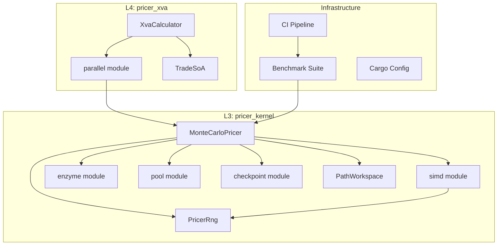
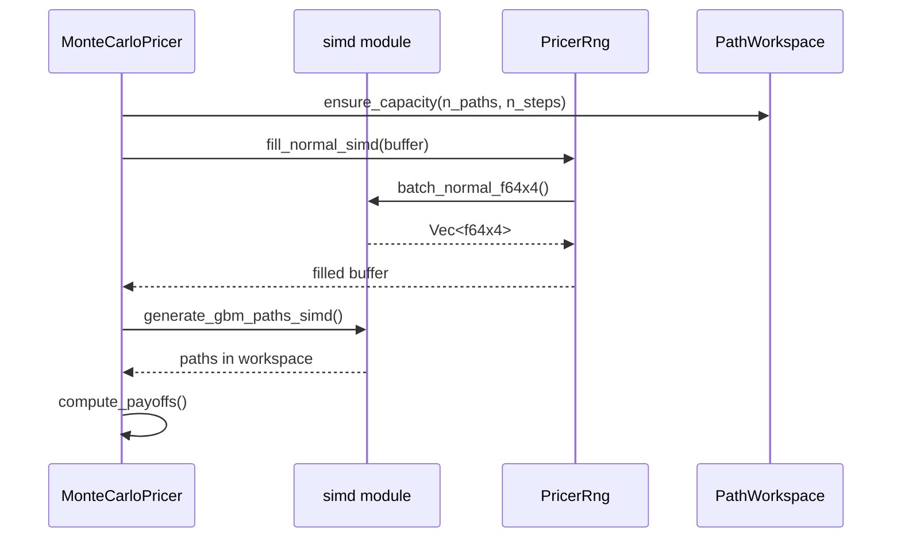
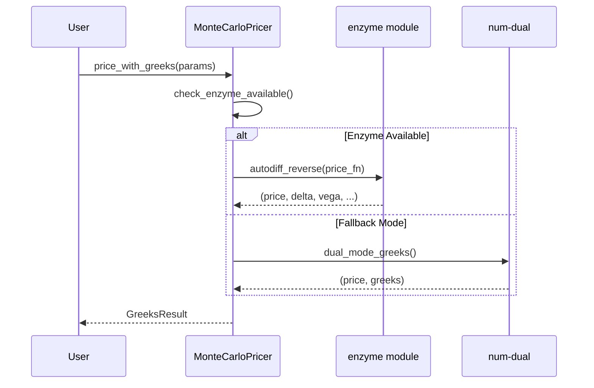
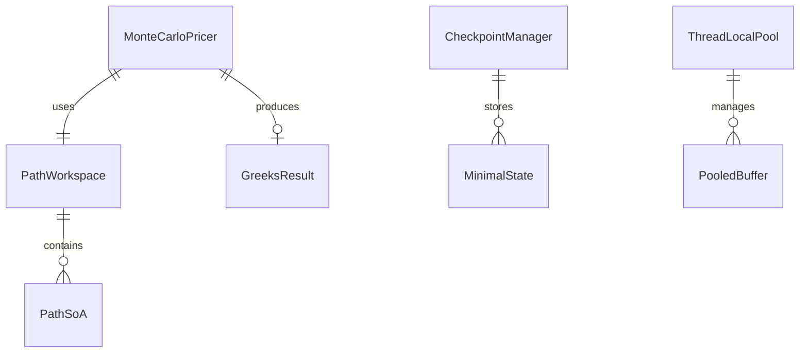

# Technical Design: performance-optimization-2

## Overview

**Purpose**: Neutryx XVAプライシングライブラリのパフォーマンスを体系的に改善し、Monte Carloシミュレーション、自動微分、メモリ効率、並列処理の各領域で定量的な改善を達成する。

**Users**: クオンツ開発者、リスク管理者、システム管理者がリアルタイムに近い速度でポートフォリオ計算とリスク分析を実行する。

**Impact**: 既存の4層アーキテクチャ（L1-L4）を維持しながら、L3（pricer_kernel）を中心にパフォーマンス最適化を適用。既存APIとの互換性を保持。

### Goals

- Monte Carloシミュレーション速度を2倍以上に向上
- Enzyme ADによるGreeks計算で有限差分比5倍以上の高速化
- メモリ使用量の90%削減（パス依存オプション）
- 80%以上の並列効率達成
- CIでのパフォーマンスリグレッション自動検出

### Non-Goals

- L1/L2/L4のアーキテクチャ変更
- GPU対応（将来検討）
- リアルタイムストリーミングAPI
- Windows環境でのEnzymeサポート（LLVMの制約）

---

## Architecture

### Existing Architecture Analysis

現行の4層アーキテクチャを維持し、各層の責務を尊重する：

| Layer | Crate | Role | Toolchain | 変更範囲 |
|-------|-------|------|-----------|----------|
| L1 | pricer_core | 数学基盤・型 | Stable | 最小限 |
| L2 | pricer_models | ビジネスロジック | Stable | 変更なし |
| L3 | pricer_kernel | AD Engine・MC | Nightly | 重点対象 |
| L4 | pricer_xva | ポートフォリオ分析 | Stable | 並列処理強化 |

**既存パターン**:
- 静的ディスパッチ（enum）によるEnzyme最適化
- PathWorkspaceによるゼロアロケーション設計
- Rayonによる並列処理

### Architecture Pattern & Boundary Map



**Architecture Integration**:
- **Selected pattern**: Hybrid Phased（段階的実装）
- **Domain boundaries**: L3に最適化ロジックを集約、L4は並列オーケストレーションに専念
- **Existing patterns preserved**: 静的ディスパッチ、4層分離、ゼロアロケーション
- **New components rationale**: SIMD/Pool/強化Enzymeモジュールで責務分離
- **Steering compliance**: Enzyme分離原則、nightly依存のL3限定を維持

### Technology Stack

| Layer | Choice / Version | Role in Feature | Notes |
|-------|------------------|-----------------|-------|
| SIMD | `std::simd` (nightly) | ベクトル化パス生成 | L3限定、スカラーフォールバック付き |
| AD | Enzyme (`-Zautodiff`) | 自動微分 | `#[autodiff_forward/reverse]`マクロ |
| Parallel | `rayon 1.10` | 並列処理 | 既存、チューニング |
| Benchmark | `criterion 0.5` + `iai 0.1` | パフォーマンス計測 | Iai追加（CI用） |
| PGO | `cargo-pgo` | プロファイル最適化 | 新規導入 |

---

## System Flows

### Monte Carlo SIMD Path Generation Flow



**Key Decisions**:
- SIMDバッチサイズはf64x4（256bit AVX2）をデフォルト
- AVX-512対応はfeature flagで有効化

### Enzyme AD Greeks Calculation Flow



---

## Requirements Traceability

| Requirement | Summary | Components | Interfaces | Flows |
|-------------|---------|------------|------------|-------|
| 1.1 | 2倍速度向上 | simd, PathWorkspace | SimdOps trait | MC SIMD Flow |
| 1.2 | ゼロアロケーション | PathWorkspace, Pool | BufferPool trait | - |
| 1.3 | Ziggurat法 | PricerRng | fill_normal_simd() | - |
| 1.4 | SIMD命令 | simd module | SimdOps trait | MC SIMD Flow |
| 1.5 | バッファ再利用 | PathWorkspace | reset_fast() | - |
| 2.1 | 5倍高速AD | enzyme module | autodiff_reverse() | AD Flow |
| 2.2 | メモリ最小化 | enzyme module | TapeManager | - |
| 2.3 | バッチGreeks | enzyme module | batch_greeks() | AD Flow |
| 2.4 | #[autodiff]マクロ | enzyme module | macro usage | - |
| 2.5 | フォールバック | enzyme module | EnzymeResult | AD Flow |
| 3.1 | ストリーミング統計 | PathObserver | (既存) | - |
| 3.2 | SoAレイアウト | TradeSoA, PathSoA | SoA trait | - |
| 3.3 | 線形以下メモリ | pool module | ThreadLocalPool | - |
| 3.4 | チェックポイント最小化 | checkpoint module | CheckpointStrategy | - |
| 3.5 | スレッドローカルバッファ | pool module | ThreadLocalPool | - |
| 4.1 | 80%並列効率 | parallel module | ParallelConfig | - |
| 4.2 | ワークスチーリング | parallel module | (Rayon内蔵) | - |
| 4.3 | XVA並列計算 | XvaCalculator | par_compute_xva() | - |
| 4.4 | スレッドセーフRNG | PricerRng, pool | ThreadRng | - |
| 4.5 | 動的スケーリング | parallel module | set_num_threads() | - |
| 5.1 | LTO有効化 | Cargo.toml | (既存) | - |
| 5.2 | codegen-units=1 | Cargo.toml | (既存) | - |
| 5.3 | target-cpu=native | .cargo/config.toml | RUSTFLAGS | - |
| 5.4 | 静的ディスパッチ | (既存enum設計) | - | - |
| 5.5 | PGOサポート | cargo-pgo, scripts | pgo_build.sh | - |
| 6.1 | Criterion使用 | benches/ | (既存) | - |
| 6.2 | CIリグレッション | ci.yml, iai | iai benchmarks | - |
| 6.3 | 領域カバレッジ | benches/ | benchmark groups | - |
| 6.4 | 履歴比較 | ci.yml | criterion-compare | - |
| 6.5 | 閾値アラート | ci.yml | threshold config | - |

---

## Components and Interfaces

### Component Summary

| Component | Domain/Layer | Intent | Req Coverage | Key Dependencies | Contracts |
|-----------|--------------|--------|--------------|------------------|-----------|
| simd module | L3/Performance | SIMDベクトル化操作 | 1.1, 1.3, 1.4 | std::simd (P0) | Service |
| pool module | L3/Memory | スレッドローカルバッファプール | 1.2, 3.3, 3.5 | - | Service |
| enzyme module (enhanced) | L3/AD | Enzyme AD統合 | 2.1-2.5 | rustc autodiff (P0) | Service |
| checkpoint module (enhanced) | L3/Memory | 最小状態チェックポイント | 3.4 | - | Service |
| parallel module (enhanced) | L4/Parallel | 並列処理最適化 | 4.1-4.5 | rayon (P0) | Service |
| Benchmark Suite (enhanced) | Infra | Iai追加、CI統合 | 6.1-6.5 | iai, criterion | - |
| Build Config | Infra | PGO、target-cpu設定 | 5.3, 5.5 | cargo-pgo | - |

---

### L3: pricer_kernel

#### simd module

| Field | Detail |
|-------|--------|
| Intent | SIMDベクトル化によるパス生成・数値計算の高速化 |
| Requirements | 1.1, 1.3, 1.4 |

**Responsibilities & Constraints**
- SIMD演算の抽象化とフォールバック提供
- Enzyme AD互換性の維持（分岐なし実装）
- x86_64 AVX2/AVX-512サポート

**Dependencies**
- Inbound: MonteCarloPricer — SIMD演算呼び出し (P0)
- External: std::simd — SIMD primitives (P0)

**Contracts**: Service [x]

##### Service Interface

```rust
/// SIMD operations for Monte Carlo simulation
pub trait SimdOps {
    /// Generate batch of normal random numbers using SIMD
    fn fill_normal_simd(rng: &mut PricerRng, buffer: &mut [f64]) -> SimdResult<()>;

    /// Generate GBM paths using SIMD operations
    fn generate_gbm_paths_simd(
        spot: f64,
        drift: f64,
        vol: f64,
        dt: f64,
        randoms: &[f64],
        paths: &mut [f64],
        n_paths: usize,
        n_steps: usize,
    ) -> SimdResult<()>;

    /// Check SIMD capability at runtime
    fn simd_level() -> SimdLevel;
}

pub enum SimdLevel {
    Scalar,
    Avx2,
    Avx512,
}

pub type SimdResult<T> = Result<T, SimdError>;

pub enum SimdError {
    UnsupportedPlatform,
    BufferMisaligned,
    InsufficientLength,
}
```

- **Preconditions**: バッファはSIMDアライメント推奨
- **Postconditions**: 結果は同等のスカラー実装と数値的に等価
- **Invariants**: フォールバック時もAPI互換性維持

**Implementation Notes**
- Integration: `#[cfg(target_feature = "avx2")]`でコンパイル時分岐
- Validation: スカラー実装との数値比較テスト必須
- Risks: Enzyme ADがSIMDコードを微分できない可能性 → スカラー版でAD

---

#### pool module

| Field | Detail |
|-------|--------|
| Intent | スレッドローカルバッファプールによるアロケーション削減 |
| Requirements | 1.2, 3.3, 3.5 |

**Responsibilities & Constraints**
- スレッドごとに再利用可能なバッファを管理
- ロックフリー設計でアロケーション競合を回避
- 容量超過時のみ新規アロケーション

**Dependencies**
- Inbound: MonteCarloPricer, PathObserver — バッファ取得 (P0)
- External: なし（std::thread_local!のみ）

**Contracts**: Service [x]

##### Service Interface

```rust
/// Thread-local buffer pool for allocation-free simulation
pub struct ThreadLocalPool {
    // Internal: thread_local! storage
}

impl ThreadLocalPool {
    /// Get a buffer from the pool, allocating if necessary
    pub fn get_buffer(&self, min_capacity: usize) -> PooledBuffer;

    /// Return a buffer to the pool
    pub fn return_buffer(&self, buffer: PooledBuffer);

    /// Clear all pooled buffers (for memory pressure)
    pub fn clear(&self);

    /// Get pool statistics
    pub fn stats(&self) -> PoolStats;
}

/// RAII buffer that auto-returns to pool on drop
pub struct PooledBuffer {
    inner: Vec<f64>,
    pool: *const ThreadLocalPool,
}

impl Drop for PooledBuffer {
    fn drop(&mut self) {
        // Return to pool
    }
}

pub struct PoolStats {
    pub buffers_in_pool: usize,
    pub total_capacity: usize,
    pub allocations_avoided: usize,
}
```

- **Preconditions**: なし
- **Postconditions**: 返却されたバッファは次回取得時に再利用される
- **Invariants**: プール内バッファは常に有効な状態

**Implementation Notes**
- Integration: `PooledBuffer`のDrop実装で自動返却
- Validation: マルチスレッドテストで競合なしを検証
- Risks: メモリリーク防止のため定期的なクリア機構を検討

---

#### enzyme module (enhanced)

| Field | Detail |
|-------|--------|
| Intent | Enzyme ADによる高速Greeks計算 + 自動フォールバック |
| Requirements | 2.1, 2.2, 2.3, 2.4, 2.5 |

**Responsibilities & Constraints**
- `#[autodiff]`マクロを使用した宣言的AD定義
- Enzyme利用不可時のnum-dual自動フォールバック
- バッチGreeks計算の効率化

**Dependencies**
- Inbound: MonteCarloPricer — Greeks計算 (P0)
- External: rustc autodiff feature — Enzyme backend (P0)
- External: num-dual — fallback AD (P1)

**Contracts**: Service [x]

##### Service Interface

```rust
/// Unified result type for AD operations
pub type EnzymeResult<T> = Result<T, AdError>;

pub enum AdError {
    EnzymeNotAvailable,
    DifferentiationFailed(String),
    NumericalInstability,
}

/// Greeks calculation result
#[derive(Clone, Debug)]
pub struct GreeksResult {
    pub price: f64,
    pub delta: f64,
    pub gamma: Option<f64>,
    pub vega: f64,
    pub theta: Option<f64>,
    pub rho: Option<f64>,
}

/// AD mode selection
pub enum AdMode {
    Enzyme,
    NumDual,
    Auto, // Try Enzyme, fallback to NumDual
}

/// Enhanced enzyme module interface
pub trait AutoDiff {
    /// Check if Enzyme is available at runtime
    fn enzyme_available() -> bool;

    /// Compute price with first-order Greeks
    fn price_with_greeks<F>(
        price_fn: F,
        params: &PricingParams,
        mode: AdMode,
    ) -> EnzymeResult<GreeksResult>
    where
        F: Fn(&PricingParams) -> f64;

    /// Batch Greeks for multiple underlyings
    fn batch_greeks<F>(
        price_fn: F,
        params_batch: &[PricingParams],
        mode: AdMode,
    ) -> EnzymeResult<Vec<GreeksResult>>
    where
        F: Fn(&PricingParams) -> f64 + Sync;
}

/// Macro usage example (actual implementation uses #[autodiff])
/// ```rust,ignore
/// #![feature(autodiff)]
///
/// #[autodiff(d_price, Reverse, Duplicated, Active)]
/// fn price(params: &PricingParams) -> f64 {
///     // pricing logic
/// }
/// ```
```

- **Preconditions**: Enzymeモード使用時は`-Zautodiff=Enable`フラグ必須
- **Postconditions**: num-dualフォールバック時もGreeks精度維持
- **Invariants**: AdMode::Autoは常に結果を返す

**Implementation Notes**
- Integration: CIでのEnzyme検出は既存ワークフロー活用
- Validation: Enzyme vs num-dual結果の数値比較テスト
- Risks: Enzyme破壊的変更時はバージョン固定で対応

---

#### checkpoint module (enhanced)

| Field | Detail |
|-------|--------|
| Intent | 勾配計算用の最小状態チェックポイント |
| Requirements | 3.4 |

**Responsibilities & Constraints**
- O(√n)メモリでreverse-mode AD実現
- 必要最小限の状態のみ保存
- recomputation戦略の最適化

**Dependencies**
- Inbound: enzyme module — 状態保存/復元 (P0)
- Inbound: PathObserver — オブザーバー状態 (P1)

**Contracts**: Service [x]

##### Service Interface

```rust
/// Checkpoint strategy for memory-efficient AD
pub enum CheckpointStrategy {
    /// Uniform interval checkpointing
    Uniform { interval: usize },
    /// Binomial checkpointing (optimal for fixed memory budget)
    Binomial { memory_slots: usize },
    /// Adaptive based on computational cost
    Adaptive { recompute_ratio: f64 },
}

/// Minimal simulation state for checkpointing
#[derive(Clone)]
pub struct MinimalState {
    pub step: usize,
    pub rng_state: u64,  // RNG seed at checkpoint
    pub observer_snapshot: PathObserverState<f64>,
}

impl CheckpointManager {
    /// Create manager with strategy
    pub fn new(strategy: CheckpointStrategy, total_steps: usize) -> Self;

    /// Check if checkpoint should be saved
    pub fn should_checkpoint(&self, step: usize) -> bool;

    /// Save minimal state
    pub fn save(&mut self, step: usize, state: MinimalState) -> CheckpointResult<()>;

    /// Find nearest checkpoint for reverse pass
    pub fn nearest_before(&self, step: usize) -> Option<usize>;

    /// Restore state from checkpoint
    pub fn restore(&self, step: usize) -> CheckpointResult<MinimalState>;

    /// Memory usage statistics
    pub fn memory_usage(&self) -> MemoryStats;
}
```

- **Preconditions**: total_stepsは事前に既知
- **Postconditions**: restore後の状態はsave時と同一
- **Invariants**: チェックポイント数 ≤ √total_steps（Binomial時）

---

### L4: pricer_xva

#### parallel module (enhanced)

| Field | Detail |
|-------|--------|
| Intent | Rayon並列処理の最適化とスケーラビリティ向上 |
| Requirements | 4.1, 4.2, 4.3, 4.4, 4.5 |

**Responsibilities & Constraints**
- 80%以上の並列効率達成
- スレッドセーフなRNG状態管理
- 動的スレッド数調整

**Dependencies**
- Inbound: XvaCalculator — 並列XVA計算 (P0)
- External: rayon — work-stealing runtime (P0)

**Contracts**: Service [x]

##### Service Interface

```rust
/// Enhanced parallel configuration
#[derive(Clone, Debug)]
pub struct ParallelConfig {
    pub batch_size: usize,
    pub parallel_threshold: usize,
    pub thread_count: Option<usize>,  // None = auto-detect
}

impl ParallelConfig {
    /// Set thread count dynamically
    pub fn set_num_threads(&mut self, n: usize);

    /// Get current thread count
    pub fn num_threads(&self) -> usize;
}

/// Thread-safe RNG provider for parallel simulations
pub struct ThreadRngProvider {
    base_seed: u64,
}

impl ThreadRngProvider {
    pub fn new(seed: u64) -> Self;

    /// Get RNG for current thread (deterministic based on thread index)
    pub fn get_rng(&self) -> PricerRng;
}

/// Parallel XVA computation
impl XvaCalculator {
    pub fn par_compute_xva(
        &self,
        portfolio: &Portfolio,
        config: &ParallelConfig,
    ) -> XvaResult;
}
```

---

### Infrastructure

#### Benchmark Suite (enhanced)

| Field | Detail |
|-------|--------|
| Intent | Iai追加によるCI安定性向上 + リグレッション検出 |
| Requirements | 6.1, 6.2, 6.3, 6.4, 6.5 |

**Responsibilities & Constraints**
- Criterion: ローカル詳細分析（統計的測定）
- Iai: CI用（命令数ベース、再現性高）
- 閾値超過時のCI失敗

**Files Structure**
```
crates/pricer_kernel/
├── benches/
│   ├── kernel_benchmarks.rs  # Criterion (既存)
│   └── kernel_iai.rs         # Iai (新規)
.github/workflows/
└── ci.yml                    # Iai統合、閾値チェック
```

**CI Integration**
```yaml
# .github/workflows/ci.yml (追加部分)
benchmark-iai:
  runs-on: ubuntu-latest
  steps:
    - name: Run Iai benchmarks
      run: cargo bench --bench kernel_iai
    - name: Compare with baseline
      run: |
        # 命令数10%以上増加でfail
        scripts/check_iai_regression.sh --threshold 10
```

---

#### Build Configuration

| Field | Detail |
|-------|--------|
| Intent | target-cpu=nativeとPGOサポート |
| Requirements | 5.3, 5.5 |

**Files Structure**
```
.cargo/
└── config.toml      # target-cpu設定
scripts/
├── pgo_build.sh     # PGOビルドスクリプト
└── pgo_profile.sh   # プロファイル収集
```

**.cargo/config.toml**
```toml
[target.'cfg(target_arch = "x86_64")']
rustflags = ["-C", "target-cpu=native"]

[profile.pgo-generate]
inherits = "release"
# PGO instrumentation is added via RUSTFLAGS
```

**PGO Workflow**
```bash
# scripts/pgo_build.sh
#!/bin/bash
cargo pgo build
./target/release/run_benchmarks  # プロファイル収集
cargo pgo optimize
```

---

## Data Models

### Domain Model

パフォーマンス改善のためデータモデル変更は最小限：

- **PathSoA**: パス生成用Structure of Arrays（新規、L3）
  - `spots: Vec<f64>`
  - `randoms: Vec<f64>`
  - レイアウトはSIMD効率を優先

- **GreeksResult**: Greeks計算結果（新規、L3）
  - 全Greeksを単一構造体で返却
  - Optionalフィールドで計算範囲を制御

### Logical Data Model



---

## Error Handling

### Error Strategy

- **SIMD**: プラットフォーム非対応時はスカラーフォールバック（エラーではない）
- **Enzyme**: 利用不可時はnum-dualフォールバック、`EnzymeResult`で通知
- **Pool**: メモリ不足時は標準アロケーション（警告ログ出力）
- **Benchmark**: リグレッション検出時はCI失敗

### Error Categories and Responses

| Category | Trigger | Response |
|----------|---------|----------|
| SIMD非対応 | 実行時検出 | スカラーフォールバック |
| Enzyme非可用 | コンパイル/実行時 | num-dual使用、ログ出力 |
| 数値不安定 | NaN/Inf検出 | `AdError::NumericalInstability` |
| ベンチマークリグレッション | 閾値超過 | CI失敗 + アラート |

---

## Testing Strategy

### Unit Tests

- `simd::fill_normal_simd` — スカラー実装との数値一致
- `pool::ThreadLocalPool` — マルチスレッド取得/返却
- `enzyme::AutoDiff` — Enzyme vs num-dual結果比較
- `checkpoint::MinimalState` — save/restore整合性

### Integration Tests

- SIMD → PathWorkspace → MonteCarloPricer フロー
- Enzyme Greeks計算 → フォールバック動作
- 並列XVA計算 → 結果整合性

### Performance Tests

- Iai: 命令数ベンチマーク（CI用）
- Criterion: 時間ベンチマーク（ローカル）
- カバレッジ: MC pricing, Greeks, portfolio XVA

---

## Performance & Scalability

### Target Metrics

| Metric | Target | Measurement |
|--------|--------|-------------|
| MC速度向上 | 2x | Criterion before/after |
| Enzyme vs 有限差分 | 5x | Criterion Greeks group |
| 並列効率 | 80% | 8コアでの測定 |
| メモリ削減（パス依存） | 90% | プロファイラ |

### Optimization Techniques

- **SIMD**: AVX2/AVX-512でバッチ処理
- **LTO + codegen-units=1**: 既存設定維持
- **PGO**: ベンチマークワークロードでプロファイル
- **SoA**: キャッシュ効率的メモリレイアウト

---

## Supporting References

### Iai Benchmark Example

```rust
// crates/pricer_kernel/benches/kernel_iai.rs
use iai::black_box;

fn bench_gbm_path_generation() {
    let config = MonteCarloConfig::default();
    let mut pricer = MonteCarloPricer::new(config).unwrap();
    black_box(pricer.generate_paths(GbmParams::default()));
}

iai::main!(bench_gbm_path_generation);
```

### Research References

詳細な調査結果は [research.md](research.md) を参照。
