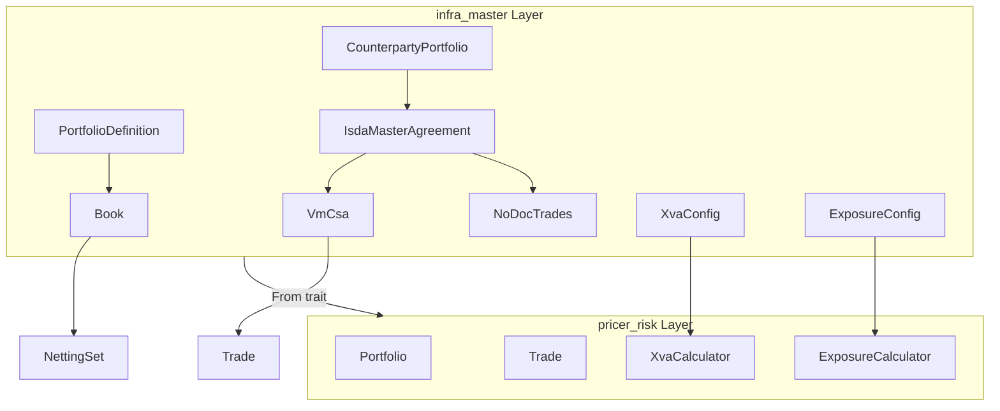
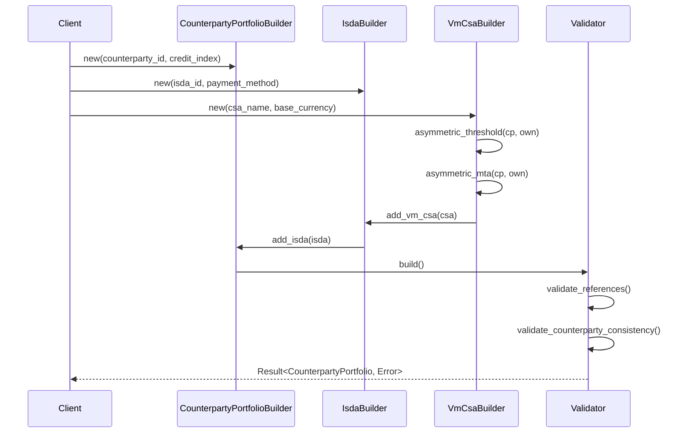
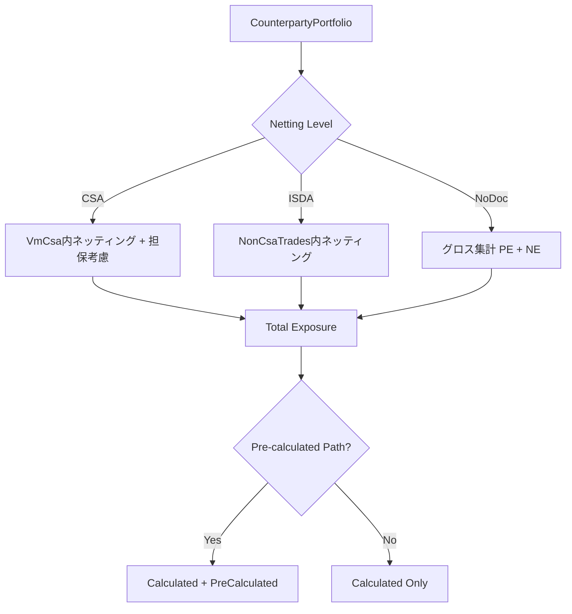
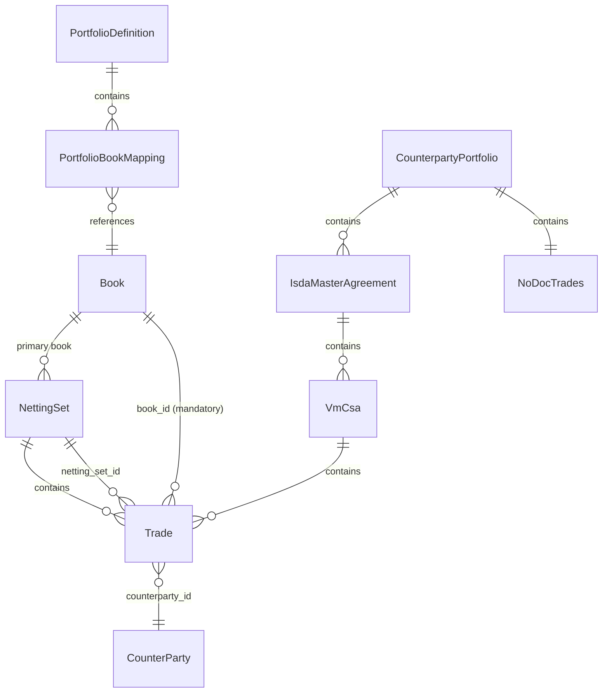

# Technical Design Document: Portfolio-Book-Model

## Overview

**Purpose**: `infra_master`クレートにPortfolioおよびBook定義を実装し、XVA計算（CVA/DVA/FVA/KVA/MVA）、Exposure計算（EE/EPE/PFE/ENE/EEPE）、Netting計算の基盤構造を提供する。

**Users**: XVAデスク、リスク管理者、トレーダー、レポーティングチームがポートフォリオ階層構造とリスク集計機能を利用する。

**Impact**: 既存の`pricer_risk::portfolio`との統合、`TradeMetadata.book`の必須化、CounterpartyPortfolio階層構造の新規追加。

### Goals

- Book概念の型安全な定義とPortfolioとの階層関係確立
- CounterpartyPortfolio → ISDA → CSA → Trade の完全な階層構造実装
- XVA/Exposure/Netting計算に必要な設定構造の提供
- 非対称CSA条件（Counterparty vs Own）のモデル化
- 事前計算Exposureパスのサポート

### Non-Goals

- 実際のXVA/Exposure計算ロジック（`pricer_risk`の責務）
- Monte Carloシミュレーションエンジン
- 市場データ取得・キャリブレーション
- REST API/gRPCエンドポイント定義

## Architecture

### Existing Architecture Analysis

**Current State**:
- `infra_master::counterparty`: CounterParty, NettingSet, CsaTerms, MarginTerms（対称条件のみ）
- `infra_master::ids`: BookId, PortfolioId定義済みだが未統合
- `infra_master::trade::TradeMetadata`: `book: Option<BookId>`（オプショナル）
- `pricer_risk::portfolio`: Portfolio, Trade, Counterparty, NettingSet（計算最適化版）

**Integration Points**:
- `infra_master` → `pricer_risk`: 定義 → 計算用構造体への変換（`From`トレイト）
- TradeMetadata.book_id: 必須化に伴う既存コード更新

### Architecture Pattern & Boundary Map



**Architecture Integration**:
- **Selected pattern**: Reference Graph（ID参照による関係表現）
- **Domain boundaries**: infra_master（静的定義）/ pricer_risk（計算ロジック）
- **Existing patterns preserved**: 型安全ID、Builderパターン、thiserrorエラー型
- **New components rationale**: CounterpartyPortfolio階層はXVA計算入力構造として必須
- **Steering compliance**: A-I-P-S階層分離原則維持

### Technology Stack

| Layer | Choice / Version | Role in Feature | Notes |
|-------|------------------|-----------------|-------|
| Core Types | Rust std | ID型、コレクション | HashMap, BTreeMap |
| Error Handling | thiserror 1.x | 構造化エラー型 | 既存パターン継続 |
| Serialization | serde 1.x (optional) | JSON/YAML互換 | feature flag |
| Date/Time | chrono (workspace) | Exposure日付管理 | 既存依存 |
| Parallelism | rayon (workspace) | 並列イテレーション | pricer_riskで使用 |

## System Flows

### CounterpartyPortfolio構築フロー



### Exposure計算入力構造フロー



## Requirements Traceability

| Requirement | Summary | Components | Interfaces | Flows |
|-------------|---------|------------|------------|-------|
| 1.1-1.8 | Book概念定義 | Book, BookBuilder, BookType, BookOwnership | BookService | - |
| 2.1-2.8 | Portfolio定義 | PortfolioDefinition, PortfolioBuilder | PortfolioService | - |
| 3.1-3.7 | Book-Trade関連 | TradeMetadata (更新), TradeBookAssignment | TradeService | - |
| 4.1-4.7 | Book-NettingSet | NettingSet (拡張), BookNettingConfig | - | - |
| 5.1-5.8 | XVA計算構造 | XvaScope, XvaConfig, FundingConfig, CapitalConfig | - | - |
| 6.1-6.8 | Exposure計算構造 | ExposureProfile, ExposureConfig, MporConfig | - | Exposure計算フロー |
| 7.1-7.8 | Netting計算構造 | NettingAgreement, CloseoutNetting, NettingJurisdiction | - | - |
| 8.1-8.7 | 階層集計 | AggregationHierarchy, AggregationConfig | - | - |
| 9.1-9.7 | エラーハンドリング | BookError, PortfolioError, NettingError | - | - |
| 10.1-10.6 | シリアライゼーション | serde derives | - | - |
| 11.1-11.6 | 既存統合 | From impls, TradeMetadata更新 | - | - |
| 12.1-12.7 | ISDA構造 | IsdaMasterAgreement, IsdaPaymentMethod | IsdaService | CounterpartyPortfolio構築 |
| 13.1-13.8 | VM CSA詳細 | VmCsa, IndependentAmountConfig | - | - |
| 14.1-14.6 | NoDoc取引 | NoDocTrades, NettingEligibility | - | - |
| 15.1-15.6 | CounterpartyPortfolio | CounterpartyPortfolio, 階層構造 | - | CounterpartyPortfolio構築 |
| 16.1-16.6 | 事前計算Exposure | PreCalculatedExposurePath, ExposurePathBuilder | - | Exposure計算フロー |
| 17.1-17.6 | MPOR決定 | MporDetermination, MporResult | - | - |

## Components and Interfaces

### Component Summary

| Component | Domain/Layer | Intent | Req Coverage | Key Dependencies | Contracts |
|-----------|--------------|--------|--------------|------------------|-----------|
| Book | book/ | トレーディングブック定義 | 1.1-1.8 | BookId (P0) | State |
| PortfolioDefinition | portfolio/ | ポートフォリオ定義 | 2.1-2.8 | Book, BookId (P0) | State |
| IsdaMasterAgreement | counterparty/ | ISDA契約定義 | 12.1-12.7 | VmCsa, CounterPartyId (P0) | State |
| VmCsa | counterparty/ | VM CSA詳細条件 | 13.1-13.8 | CsaTerms (P1) | State |
| NoDocTrades | counterparty/ | ネッティング不可取引 | 14.1-14.6 | TradeId (P0) | State |
| CounterpartyPortfolio | counterparty/ | CP単位階層構造 | 15.1-15.6 | ISDA, NoDoc (P0) | State, Service |
| XvaConfig | xva/ | XVA計算設定 | 5.1-5.8 | - | State |
| ExposureConfig | exposure/ | Exposure計算設定 | 6.1-6.8 | - | State |
| PreCalculatedExposurePath | exposure/ | 事前計算Exposure | 16.1-16.6 | Date, Currency (P0) | State |

---

### Book Domain

#### Book

| Field | Detail |
|-------|--------|
| Intent | トレーディングブックの概念を表現し、トレードの論理的グループ化を提供 |
| Requirements | 1.1, 1.2, 1.3, 1.4, 1.5, 1.7, 1.8 |

**Responsibilities & Constraints**
- Bookの一意識別子、名称、タイプ、所有権情報の管理
- BookTypeのデフォルト値（Trading）適用
- RegulatoryBookType（TB/NTBR/BB）の規制分類サポート

**Dependencies**
- Inbound: PortfolioDefinition — Book参照 (P0)
- Inbound: TradeMetadata — book_id必須参照 (P0)
- Outbound: None
- External: chrono — タイムスタンプ (P2)

**Contracts**: State [x]

##### State Management

```rust
/// トレーディングブックの種類
#[derive(Clone, Copy, Debug, PartialEq, Eq, Hash, Default)]
#[cfg_attr(feature = "serde", derive(serde::Serialize, serde::Deserialize))]
pub enum BookType {
    #[default]
    Trading,
    Banking,
    Hedge,
    Internal,
}

/// 規制報告用ブック分類
#[derive(Clone, Copy, Debug, PartialEq, Eq, Hash)]
#[cfg_attr(feature = "serde", derive(serde::Serialize, serde::Deserialize))]
pub enum RegulatoryBookType {
    /// Trading Book
    TB,
    /// Non-Trading Book Regulatory
    NTBR,
    /// Banking Book
    BB,
}

/// ブック所有権情報
#[derive(Clone, Debug)]
#[cfg_attr(feature = "serde", derive(serde::Serialize, serde::Deserialize))]
pub struct BookOwnership {
    pub desk: Option<String>,
    pub division: Option<String>,
    pub legal_entity_id: Option<LegalEntityId>,
}

/// ブックメタデータ
#[derive(Clone, Debug)]
#[cfg_attr(feature = "serde", derive(serde::Serialize, serde::Deserialize))]
pub struct BookMetadata {
    pub created_at: DateTime<Utc>,
    pub updated_at: DateTime<Utc>,
    pub created_by: Option<String>,
    pub updated_by: Option<String>,
}

/// トレーディングブック
#[derive(Clone, Debug)]
#[cfg_attr(feature = "serde", derive(serde::Serialize, serde::Deserialize))]
pub struct Book {
    book_id: BookId,
    name: String,
    description: Option<String>,
    book_type: BookType,
    regulatory_type: Option<RegulatoryBookType>,
    ownership: Option<BookOwnership>,
    metadata: BookMetadata,
}
```

- **State model**: Immutable after construction (Builder pattern)
- **Persistence**: Serializable via serde feature
- **Concurrency**: Clone for thread-safe sharing

**Implementation Notes**
- Integration: `BookBuilder::new(id, name)`で必須フィールド、`.book_type()`, `.ownership()`でオプション設定
- Validation: `build()`時にBookId重複チェック（コンテナレベルで実施）
- Risks: None

---

#### BookBuilder

| Field | Detail |
|-------|--------|
| Intent | Bookインスタンスの構築とバリデーション |
| Requirements | 1.4, 1.6 |

**Contracts**: Service [x]

##### Service Interface

```rust
pub struct BookBuilder {
    book_id: BookId,
    name: String,
    description: Option<String>,
    book_type: BookType,
    regulatory_type: Option<RegulatoryBookType>,
    ownership: Option<BookOwnership>,
}

impl BookBuilder {
    pub fn new(id: impl Into<BookId>, name: impl Into<String>) -> Self;
    pub fn description(self, desc: impl Into<String>) -> Self;
    pub fn book_type(self, book_type: BookType) -> Self;
    pub fn regulatory_type(self, reg_type: RegulatoryBookType) -> Self;
    pub fn ownership(self, ownership: BookOwnership) -> Self;
    pub fn build(self) -> Book;
}

impl Book {
    #[inline]
    pub fn builder(id: impl Into<BookId>, name: impl Into<String>) -> BookBuilder {
        BookBuilder::new(id, name)
    }
}
```

- Preconditions: id, nameは空でないこと
- Postconditions: 有効なBookインスタンス返却
- Invariants: book_typeはデフォルトでTrading

---

### Portfolio Domain

#### PortfolioDefinition

| Field | Detail |
|-------|--------|
| Intent | 複数のBookを集約するポートフォリオ定義 |
| Requirements | 2.1, 2.2, 2.5, 2.7, 2.8 |

**Responsibilities & Constraints**
- PortfolioとBookの多対多関係管理
- ポートフォリオ階層（parent_portfolio_id）のサポート
- 循環参照検出

**Dependencies**
- Inbound: None
- Outbound: Book — PortfolioBookMapping経由 (P0)
- External: None

**Contracts**: State [x]

##### State Management

```rust
/// ポートフォリオスコープ
#[derive(Clone, Copy, Debug, PartialEq, Eq, Hash, Default)]
#[cfg_attr(feature = "serde", derive(serde::Serialize, serde::Deserialize))]
pub enum PortfolioScope {
    #[default]
    Internal,
    Legal,
    Regulatory,
    Consolidated,
}

/// ポートフォリオメタデータ
#[derive(Clone, Debug)]
#[cfg_attr(feature = "serde", derive(serde::Serialize, serde::Deserialize))]
pub struct PortfolioMetadata {
    pub ownership: Option<BookOwnership>,
    pub scope: PortfolioScope,
    pub reporting_currency: Currency,
    pub created_at: DateTime<Utc>,
    pub updated_at: DateTime<Utc>,
}

/// Portfolio-Book関連
#[derive(Clone, Debug)]
#[cfg_attr(feature = "serde", derive(serde::Serialize, serde::Deserialize))]
pub struct PortfolioBookMapping {
    pub portfolio_id: PortfolioId,
    pub book_id: BookId,
    pub weight: Option<f64>,
}

/// ポートフォリオ定義
#[derive(Clone, Debug)]
#[cfg_attr(feature = "serde", derive(serde::Serialize, serde::Deserialize))]
pub struct PortfolioDefinition {
    portfolio_id: PortfolioId,
    name: String,
    description: Option<String>,
    parent_portfolio_id: Option<PortfolioId>,
    book_mappings: Vec<PortfolioBookMapping>,
    metadata: PortfolioMetadata,
}
```

---

### Counterparty Domain (Extensions)

#### IsdaMasterAgreement

| Field | Detail |
|-------|--------|
| Intent | ISDAマスター契約の定義とCSA階層管理 |
| Requirements | 12.1, 12.2, 12.3, 12.4, 12.5, 12.6, 12.7 |

**Responsibilities & Constraints**
- 1つのISDAに複数のVmCsaをサポート
- CSA付き取引とCSA無し取引の分離管理
- ISDA-level Initial Margin管理

**Dependencies**
- Inbound: CounterpartyPortfolio — isda_agreements (P0)
- Outbound: VmCsa — vm_csas (P0)
- Outbound: TradeId — non_csa_trade_ids (P0)
- External: IrCurve reference — IM利率 (P1)

**Contracts**: State [x]

##### State Management

```rust
define_id! {
    /// ISDA契約の一意識別子
    IsdaAgreementId
}

/// ISDA決済方式
#[derive(Clone, Copy, Debug, PartialEq, Eq, Hash, Default)]
#[cfg_attr(feature = "serde", derive(serde::Serialize, serde::Deserialize))]
pub enum IsdaPaymentMethod {
    #[default]
    Full,
    Limited,
    OnewayCounterparty,
    OnewayOwn,
}

/// ISDA-level Initial Margin
#[derive(Clone, Debug)]
#[cfg_attr(feature = "serde", derive(serde::Serialize, serde::Deserialize))]
pub struct IsdaInitialMargin {
    pub im_post: f64,
    pub im_recv: f64,
    pub im_currency: Currency,
    pub im_rate_curve_id: Option<String>,
}

/// ISDAマスター契約
#[derive(Clone, Debug)]
#[cfg_attr(feature = "serde", derive(serde::Serialize, serde::Deserialize))]
pub struct IsdaMasterAgreement {
    isda_id: IsdaAgreementId,
    name: String,
    counterparty_id: CounterPartyId,
    agreement_date: Date,
    payment_method: IsdaPaymentMethod,
    vm_csa_ids: Vec<VmCsaId>,
    non_csa_trade_ids: Vec<TradeId>,
    initial_margin: Option<IsdaInitialMargin>,
    other_non_csa_exposure_path: Option<PreCalculatedExposurePath>,
}
```

---

#### VmCsa

| Field | Detail |
|-------|--------|
| Intent | VM CSA詳細条件の非対称モデル化 |
| Requirements | 13.1, 13.2, 13.3, 13.4, 13.5, 13.6, 13.7, 13.8 |

**Responsibilities & Constraints**
- Counterparty/Own非対称条件（threshold, MTA, IA, haircut）
- 動的Independent Amount（係数計算）
- 適格担保と現在残高管理

**Contracts**: State [x]

##### State Management

```rust
define_id! {
    /// VM CSAの一意識別子
    VmCsaId
}

/// CSAコール頻度
#[derive(Clone, Copy, Debug, PartialEq, Eq, Hash, Default)]
#[cfg_attr(feature = "serde", derive(serde::Serialize, serde::Deserialize))]
pub enum CsaCallFrequency {
    #[default]
    Daily,
    Weekly,
    Biweekly,
    Monthly,
}

impl CsaCallFrequency {
    /// 対応するMPOR（営業日）を返却
    pub fn default_mpor_days(&self) -> u32 {
        match self {
            CsaCallFrequency::Daily => 10,
            CsaCallFrequency::Weekly => 10,
            CsaCallFrequency::Biweekly => 14,
            CsaCallFrequency::Monthly => 20,
        }
    }
}

/// 動的Independent Amount設定
#[derive(Clone, Debug, Default)]
#[cfg_attr(feature = "serde", derive(serde::Serialize, serde::Deserialize))]
pub struct IndependentAmountConfig {
    /// Counterparty IA: ia_counterparty + k_counterparty * max(PV, 0)
    pub ia_counterparty: f64,
    pub k_counterparty: f64,
    /// Own IA: ia_own + k_own * min(PV, 0)
    pub ia_own: f64,
    pub k_own: f64,
}

/// VM CSA（非対称条件対応）
#[derive(Clone, Debug)]
#[cfg_attr(feature = "serde", derive(serde::Serialize, serde::Deserialize))]
pub struct VmCsa {
    vm_csa_id: VmCsaId,
    name: String,
    base_currency: Currency,
    call_frequency: CsaCallFrequency,

    // Asymmetric thresholds
    threshold_counterparty: f64,  // positive
    threshold_own: f64,           // negative

    // Asymmetric MTA
    mta_counterparty: f64,        // positive
    mta_own: f64,                 // negative

    // Dynamic Independent Amount
    independent_amount: IndependentAmountConfig,

    // Asymmetric haircuts
    haircut_counterparty: f64,    // typically negative, e.g., -0.05
    haircut_own: f64,             // typically positive, e.g., 0.05

    // Collateral
    eligible_collaterals: Vec<EligibleCollateral>,
    current_collateral_balances: Vec<f64>,

    // Trades
    trade_ids: Vec<TradeId>,

    // Pre-calculated exposure
    other_exposure_path: Option<PreCalculatedExposurePath>,
}
```

---

#### NoDocTrades

| Field | Detail |
|-------|--------|
| Intent | ネッティング不可取引のグループ化 |
| Requirements | 14.1, 14.2, 14.3, 14.4, 14.5, 14.6 |

**Contracts**: State [x]

##### State Management

```rust
/// ネッティング適格性
#[derive(Clone, Copy, Debug, PartialEq, Eq, Hash)]
#[cfg_attr(feature = "serde", derive(serde::Serialize, serde::Deserialize))]
pub enum NettingEligibility {
    /// CSA付きISDA（フルネッティング + 担保）
    FullNetting,
    /// CSA無しISDA（ネッティングのみ）
    IsdaOnly,
    /// ネッティング不可
    NoNetting,
}

/// NoDoc取引グループ
#[derive(Clone, Debug, Default)]
#[cfg_attr(feature = "serde", derive(serde::Serialize, serde::Deserialize))]
pub struct NoDocTrades {
    trade_ids: Vec<TradeId>,
    other_positive_exposure_path: Option<PreCalculatedExposurePath>,
    other_negative_exposure_path: Option<PreCalculatedExposurePath>,
}

impl NoDocTrades {
    pub fn new() -> Self { Self::default() }

    pub fn add_trade(&mut self, trade_id: TradeId) {
        if !self.trade_ids.contains(&trade_id) {
            self.trade_ids.push(trade_id);
        }
    }

    pub fn trade_ids(&self) -> &[TradeId] { &self.trade_ids }
}
```

---

#### CounterpartyPortfolio

| Field | Detail |
|-------|--------|
| Intent | カウンターパーティ単位の完全階層構造 |
| Requirements | 15.1, 15.2, 15.3, 15.4, 15.5, 15.6 |

**Responsibilities & Constraints**
- CP → ISDA → CSA → Trade の階層管理
- 全トレードイテレーション機能
- 通貨・日付集約ユーティリティ

**Dependencies**
- Inbound: XvaCalculator — 入力構造 (P0)
- Outbound: IsdaMasterAgreement, NoDocTrades (P0)
- External: CreditIndex reference (P1)

**Contracts**: State [x], Service [x]

##### State Management

```rust
/// CounterpartyPortfolio
#[derive(Clone, Debug)]
#[cfg_attr(feature = "serde", derive(serde::Serialize, serde::Deserialize))]
pub struct CounterpartyPortfolio {
    counterparty_id: CounterPartyId,
    credit_index_id: Option<String>,
    isda_agreements: Vec<IsdaMasterAgreement>,
    nodoc_trades: NoDocTrades,
}
```

##### Service Interface

```rust
impl CounterpartyPortfolio {
    pub fn builder(counterparty_id: impl Into<CounterPartyId>) -> CounterpartyPortfolioBuilder;

    /// 全トレードをイテレート
    pub fn iter_all_trades(&self) -> impl Iterator<Item = &TradeId>;

    /// 全通貨を取得
    pub fn get_all_currencies<F>(&self, trade_currency_fn: F) -> HashSet<Currency>
    where
        F: Fn(&TradeId) -> Option<Currency>;

    /// 全支払日を取得
    pub fn get_all_payment_dates<F>(&self, trade_dates_fn: F) -> BTreeSet<Date>
    where
        F: Fn(&TradeId) -> Vec<Date>;

    /// 全フィキシング日を取得
    pub fn get_all_fixing_dates<F>(&self, trade_dates_fn: F) -> BTreeSet<Date>
    where
        F: Fn(&TradeId) -> Vec<Date>;

    /// 全権利行使日を取得
    pub fn get_all_exercise_dates<F>(&self, base_date: Date, trade_dates_fn: F) -> BTreeSet<Date>
    where
        F: Fn(&TradeId, Date) -> Vec<Date>;
}
```

- Preconditions: CounterpartyPortfolioBuilderでバリデーション済み
- Postconditions: 有効なイテレータ/集合を返却
- Invariants: 内部構造は不変

---

### Exposure Domain

#### PreCalculatedExposurePath

| Field | Detail |
|-------|--------|
| Intent | 事前計算されたExposureパスの格納 |
| Requirements | 16.1, 16.2, 16.3, 16.4, 16.5, 16.6 |

**Contracts**: State [x]

##### State Management

```rust
/// 事前計算Exposureパス
#[derive(Clone, Debug)]
#[cfg_attr(feature = "serde", derive(serde::Serialize, serde::Deserialize))]
pub struct PreCalculatedExposurePath {
    /// exposure_by_date[date][path_index] = exposure value
    exposure_by_date: BTreeMap<Date, Vec<f64>>,
    currency: Currency,
}

impl PreCalculatedExposurePath {
    pub fn new(currency: Currency) -> Self {
        Self {
            exposure_by_date: BTreeMap::new(),
            currency,
        }
    }

    pub fn add_exposure(&mut self, date: Date, exposures: Vec<f64>) {
        self.exposure_by_date.insert(date, exposures);
    }

    pub fn exposure_at(&self, date: &Date) -> Option<&Vec<f64>> {
        self.exposure_by_date.get(date)
    }

    pub fn currency(&self) -> &Currency { &self.currency }

    pub fn dates(&self) -> impl Iterator<Item = &Date> {
        self.exposure_by_date.keys()
    }

    /// タイムグリッドとの整合性バリデーション
    pub fn validate_time_grid(&self, grid: &[Date]) -> Result<(), ExposureError> {
        for date in grid {
            if !self.exposure_by_date.contains_key(date) {
                return Err(ExposureError::MissingDate(*date));
            }
        }
        Ok(())
    }
}
```

---

#### ExposureConfig

| Field | Detail |
|-------|--------|
| Intent | Exposure計算設定の定義 |
| Requirements | 6.1, 6.2, 6.4, 6.5, 6.6, 6.7, 6.8 |

**Contracts**: State [x]

##### State Management

```rust
/// PFE信頼水準
#[derive(Clone, Copy, Debug, PartialEq)]
#[cfg_attr(feature = "serde", derive(serde::Serialize, serde::Deserialize))]
pub enum PfeConfidenceLevel {
    Q95,
    Q97_5,
    Q99,
    Custom(f64),
}

impl PfeConfidenceLevel {
    pub fn as_f64(&self) -> f64 {
        match self {
            PfeConfidenceLevel::Q95 => 0.95,
            PfeConfidenceLevel::Q97_5 => 0.975,
            PfeConfidenceLevel::Q99 => 0.99,
            PfeConfidenceLevel::Custom(v) => *v,
        }
    }
}

/// Exposure集計方式
#[derive(Clone, Copy, Debug, PartialEq, Eq, Hash, Default)]
#[cfg_attr(feature = "serde", derive(serde::Serialize, serde::Deserialize))]
pub enum ExposureAggregation {
    Gross,
    #[default]
    NetWithinNettingSet,
    NetWithinCounterparty,
}

/// MPOR設定
#[derive(Clone, Debug)]
#[cfg_attr(feature = "serde", derive(serde::Serialize, serde::Deserialize))]
pub struct MporConfig {
    pub collateralised_mpor_days: u32,
    pub uncollateralised_mpor_days: u32,
    pub disputed_trade_extension_days: u32,
    pub illiquid_collateral_extension_days: u32,
}

impl Default for MporConfig {
    fn default() -> Self {
        Self {
            collateralised_mpor_days: 10,
            uncollateralised_mpor_days: 10,
            disputed_trade_extension_days: 10,
            illiquid_collateral_extension_days: 5,
        }
    }
}

/// Exposure計算設定
#[derive(Clone, Debug)]
#[cfg_attr(feature = "serde", derive(serde::Serialize, serde::Deserialize))]
pub struct ExposureConfig {
    pub time_grid: Vec<f64>,
    pub pfe_confidence: PfeConfidenceLevel,
    pub aggregation: ExposureAggregation,
    pub mpor_config: MporConfig,
    pub apply_netting: bool,
    pub apply_collateral: bool,
    pub eepe_horizon_years: f64,
    pub eepe_effective_maturity_years: f64,
}

impl Default for ExposureConfig {
    fn default() -> Self {
        Self {
            time_grid: vec![0.25, 0.5, 1.0, 2.0, 3.0, 5.0, 7.0, 10.0],
            pfe_confidence: PfeConfidenceLevel::Q95,
            aggregation: ExposureAggregation::NetWithinNettingSet,
            mpor_config: MporConfig::default(),
            apply_netting: true,
            apply_collateral: true,
            eepe_horizon_years: 5.0,
            eepe_effective_maturity_years: 1.0,
        }
    }
}
```

---

### XVA Domain

#### XvaConfig

| Field | Detail |
|-------|--------|
| Intent | XVA計算設定の定義 |
| Requirements | 5.1, 5.2, 5.4, 5.5, 5.6, 5.7, 5.8 |

**Contracts**: State [x]

##### State Management

```rust
/// XVA計算レベル
#[derive(Clone, Copy, Debug, PartialEq, Eq, Hash, Default)]
#[cfg_attr(feature = "serde", derive(serde::Serialize, serde::Deserialize))]
pub enum XvaCalculationLevel {
    Trade,
    #[default]
    NettingSet,
    Counterparty,
    Book,
    Portfolio,
}

/// XvaScope
#[derive(Clone, Debug)]
#[cfg_attr(feature = "serde", derive(serde::Serialize, serde::Deserialize))]
pub struct XvaScope {
    pub netting_set_ids: Vec<NettingSetId>,
    pub time_horizon_years: f64,
    pub num_paths: usize,
    pub num_time_steps: usize,
}

/// Funding設定
#[derive(Clone, Debug)]
#[cfg_attr(feature = "serde", derive(serde::Serialize, serde::Deserialize))]
pub struct FundingConfig {
    pub funding_spread_curve_id: Option<String>,
    pub collateral_rate_curve_id: Option<String>,
    pub funding_currency: Currency,
}

/// Capital設定
#[derive(Clone, Debug)]
#[cfg_attr(feature = "serde", derive(serde::Serialize, serde::Deserialize))]
pub struct CapitalConfig {
    pub regulatory_method: RegulatoryCapitalMethod,
    pub capital_rate: f64,
    pub risk_weight_multiplier: f64,
}

#[derive(Clone, Copy, Debug, PartialEq, Eq, Hash, Default)]
#[cfg_attr(feature = "serde", derive(serde::Serialize, serde::Deserialize))]
pub enum RegulatoryCapitalMethod {
    #[default]
    SaCcr,
    Imm,
}

/// Wrong-Way Risk設定
#[derive(Clone, Debug)]
#[cfg_attr(feature = "serde", derive(serde::Serialize, serde::Deserialize))]
pub struct WrongWayRiskConfig {
    pub correlation_estimate: f64,
    pub stress_correlation: f64,
    pub model_type: WwrModelType,
}

#[derive(Clone, Copy, Debug, PartialEq, Eq, Hash, Default)]
#[cfg_attr(feature = "serde", derive(serde::Serialize, serde::Deserialize))]
pub enum WwrModelType {
    #[default]
    None,
    Parametric,
    Historical,
}

/// XVA計算設定
#[derive(Clone, Debug)]
#[cfg_attr(feature = "serde", derive(serde::Serialize, serde::Deserialize))]
pub struct XvaConfig {
    pub calculate_cva: bool,
    pub calculate_dva: bool,
    pub calculate_fva: bool,
    pub calculate_kva: bool,
    pub calculate_mva: bool,
    pub calculation_level: XvaCalculationLevel,
    pub scope: XvaScope,
    pub funding_config: Option<FundingConfig>,
    pub capital_config: Option<CapitalConfig>,
    pub wrong_way_risk_config: Option<WrongWayRiskConfig>,
    pub own_credit_curve_id: Option<String>,
}
```

---

### Error Types

#### BookError, PortfolioError, NettingError

| Field | Detail |
|-------|--------|
| Intent | ドメイン別構造化エラー型 |
| Requirements | 9.1, 9.2, 9.3, 9.4, 9.5, 9.6, 9.7 |

**Contracts**: State [x]

```rust
use thiserror::Error;

#[derive(Debug, Error, Clone, PartialEq)]
pub enum BookError {
    #[error("Duplicate BookId: {0}")]
    DuplicateId(String),

    #[error("Invalid ownership: {0}")]
    InvalidOwnership(String),

    #[error("Invalid book type: {0}")]
    InvalidType(String),

    #[error("Missing required field: {0}")]
    MissingRequiredField(String),
}

#[derive(Debug, Error, Clone, PartialEq)]
pub enum PortfolioError {
    #[error("Duplicate PortfolioId: {0}")]
    DuplicateId(String),

    #[error("Circular portfolio reference detected: {0} -> {1}")]
    CircularReference(String, String),

    #[error("Invalid book reference: {0}")]
    InvalidBookReference(String),

    #[error("Invalid portfolio scope: {0}")]
    InvalidScope(String),
}

#[derive(Debug, Error, Clone, PartialEq)]
pub enum NettingError {
    #[error("Counterparty mismatch in netting set: expected {expected}, got {actual}")]
    CounterpartyMismatch { expected: String, actual: String },

    #[error("Netting not enforceable in jurisdiction: {0}")]
    NotEnforceable(String),

    #[error("Invalid netting agreement: {0}")]
    InvalidAgreement(String),

    #[error("Cross-book netting violation: {0}")]
    CrossBookViolation(String),
}

#[derive(Debug, Error, Clone, PartialEq)]
pub enum ExposureError {
    #[error("Missing exposure data for date: {0}")]
    MissingDate(Date),

    #[error("Currency mismatch: expected {expected}, got {actual}")]
    CurrencyMismatch { expected: String, actual: String },

    #[error("Invalid time grid: {0}")]
    InvalidTimeGrid(String),
}

/// 複数エラー収集
#[derive(Debug, Error, Clone)]
pub enum ValidationError {
    #[error("Book error: {0}")]
    Book(#[from] BookError),

    #[error("Portfolio error: {0}")]
    Portfolio(#[from] PortfolioError),

    #[error("Netting error: {0}")]
    Netting(#[from] NettingError),

    #[error("Exposure error: {0}")]
    Exposure(#[from] ExposureError),

    #[error("Multiple validation errors: {0:?}")]
    Multiple(Vec<ValidationError>),
}

pub type ValidationResult<T> = Result<T, ValidationError>;
```

---

## Data Models

### Domain Model



**Aggregates**:
- `Book`: 独立エンティティ、BookIdで識別
- `PortfolioDefinition`: 独立エンティティ、BookとのMapping管理
- `CounterpartyPortfolio`: XVA計算入力構造、ISDA/CSA/Trade階層所有

**Business Rules**:
- TradeはBookIdを必須で保持
- NettingSet内の全TradeはCounterpartyが同一
- ISDA内のVmCsaはネッティング可能、NonCsaTradeは別グループ
- NoDocTradeはグロスエクスポージャー計算

### Logical Data Model

**Entity Relationships**:
- Portfolio ↔ Book: 多対多（PortfolioBookMapping）
- Book → NettingSet: 1対多（book_id参照）
- NettingSet → Trade: 1対多（netting_set_id参照）
- CounterpartyPortfolio → ISDA: 1対多（所有）
- ISDA → VmCsa: 1対多（所有）
- VmCsa → Trade: 1対多（trade_ids参照）

**Consistency & Integrity**:
- BookId, PortfolioId, TradeIdは一意
- 参照整合性はBuilder.build()時にバリデーション
- 循環参照はPortfolioBuilder内で検出

## Error Handling

### Error Strategy

- **Fail Fast**: Builder.build()で早期バリデーション
- **Structured Errors**: thiserror派生の型付きエラー
- **Multiple Error Collection**: ValidationError::Multipleで複数エラー収集

### Error Categories and Responses

**Business Logic Errors (422)**:
- `BookError::DuplicateId` → ID重複メッセージ
- `PortfolioError::CircularReference` → 循環パス表示
- `NettingError::CounterpartyMismatch` → 期待/実際のCP表示

**Validation Errors**:
- `ExposureError::MissingDate` → 欠損日付表示
- `ExposureError::CurrencyMismatch` → 通貨不一致表示

### Monitoring

- Error型は`Clone`可能で、ログ出力・テレメトリ送信対応
- `Display`トレイトで人間可読メッセージ

## Testing Strategy

### Unit Tests

- `Book::builder()` / `BookBuilder::build()` 正常系・異常系
- `VmCsa` 非対称条件計算（threshold, MTA, IA）
- `CsaCallFrequency::default_mpor_days()` 各頻度のMPOR値
- `PreCalculatedExposurePath::validate_time_grid()` バリデーション
- Error型の`Display`実装

### Integration Tests

- `PortfolioBuilder` → `Book`参照バリデーション
- `CounterpartyPortfolioBuilder` → ISDA/CSA階層構築
- `TradeMetadata` → `book_id`必須バリデーション
- serde serialization/deserialization round-trip

### E2E Tests (pricer_riskとの統合)

- `infra_master::CounterpartyPortfolio` → `pricer_risk`変換
- XVA計算入力構造の完全性検証

## Security Considerations

- 機密データ（credit_params, exposure_path）はserde feature flagでオプショナル
- IDバリデーション（LegalEntityId等）で入力サニタイズ

## Performance & Scalability

- HashMap O(1)ルックアップ
- `#[inline]`アクセサメソッド
- Rayon並列処理対応（pricer_riskでの使用想定）

## Migration Strategy

1. **Phase 1**: `infra_master`に新規構造体追加（Book, PortfolioDefinition, CounterpartyPortfolio等）
2. **Phase 2**: `TradeMetadata.book`を`Option<BookId>`から`BookId`に変更
3. **Phase 3**: 既存コード更新（optional book参照箇所）
4. **Phase 4**: `pricer_risk`との統合（From trait実装）

**Rollback Trigger**: コンパイルエラーまたはテスト失敗時
**Validation Checkpoint**: 各Phase完了後にCI緑確認
