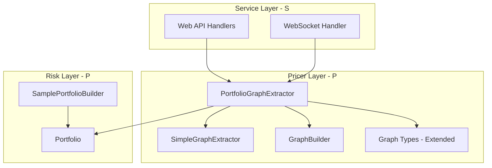
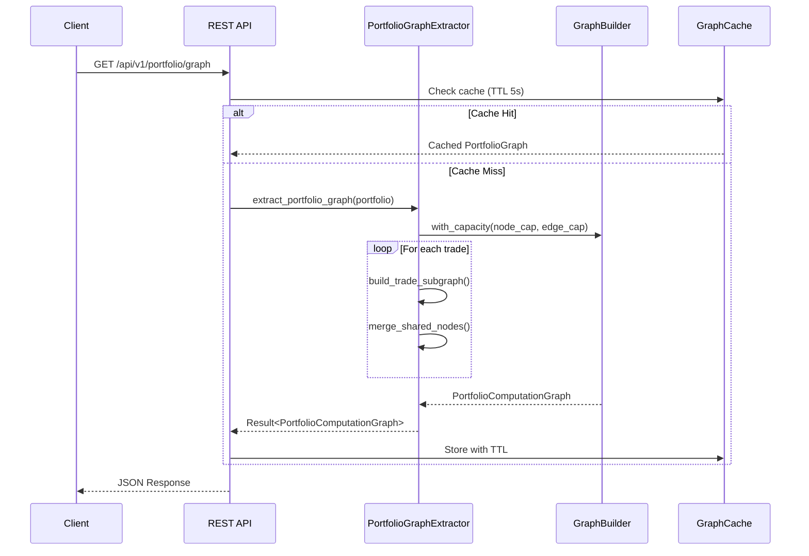
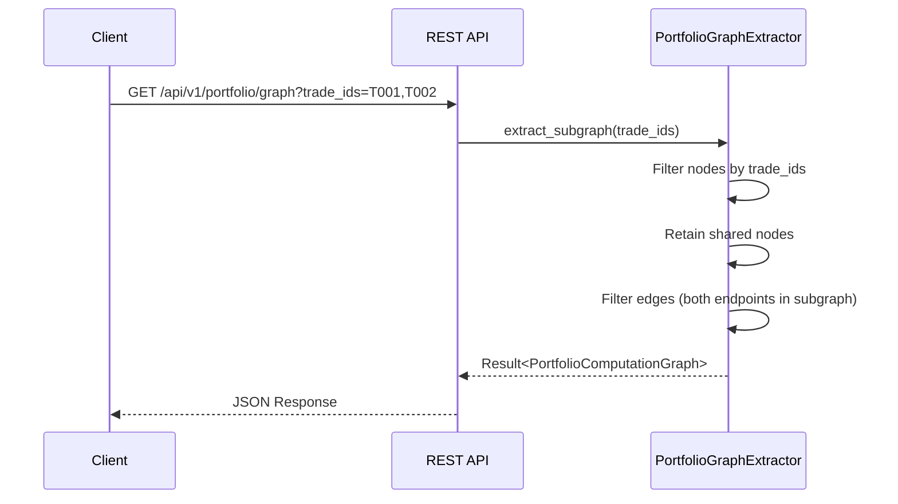

# Design Document: portfolio-graph-optimisation

## Overview

**Purpose**: 本機能は、FrictionalBankAppの計算グラフ可視化をPortfolioレベルに拡張し、複数トレードの統合グラフ表示、ノード重複排除による最適化、およびインタラクティブな約定選択機能を提供する。

**Users**: リスクアナリスト、トレーダー、開発者/デモユーザーが、ブラウザベースのWeb dashboardからPortfolio全体のAAD依存関係を可視化・分析する。

**Impact**: 既存の`pricer_pricing::graph`モジュールを拡張し、新規`PortfolioGraphExtractor`とWeb APIエンドポイントを追加。既存の単一トレードグラフ機能との後方互換性を維持。

### Goals
- Portfolio単位での計算グラフ統合と共有ノード最適化
- 複数アセットクラスを含むサンプルPortfolioの自動生成
- トレード選択によるサブグラフ動的抽出
- 100トレードのグラフを1秒以内に生成するパフォーマンス

### Non-Goals
- 実際のEnzyme AD統合（現状はシミュレーショングラフ）
- WebGL/Canvas切り替えによるフロントエンド最適化（Phase 2）
- グラフエディタ機能（読み取り専用）

## Architecture

### Existing Architecture Analysis

**現在のアーキテクチャ制約**:
- A-I-P-Sレイヤー分離: Pricer（P）はAdapter（A）やService（S）に依存不可
- `pricer_pricing::graph`モジュールはL3 Pricerレイヤーに配置
- `pricer_risk::portfolio`モジュールはL4 Riskレイヤーに配置
- Web Dashboard（`demo/gui`）はService（S）レイヤー

**維持すべきパターン**:
- `GraphExtractable`トレイト（サービス指向契約）
- `GraphBuilder`による事前割り当てメモリ管理
- D3.js互換JSON出力（`edges` → `links`、`node_type` → `type`）
- 500msタイムアウト保護

### Architecture Pattern & Boundary Map



**Architecture Integration**:
- **Selected pattern**: GraphNode拡張（既存構造体にフィールド追加）+ Composition
- **Domain boundaries**: `PortfolioGraphExtractor`はP層に配置、Portfolioへの参照のみ持つ
- **Existing patterns preserved**: `GraphBuilder`再利用、D3.js互換JSON維持
- **New components rationale**: `PortfolioGraphExtractor`でPortfolio統合ロジックをカプセル化
- **Steering compliance**: A-I-P-Sレイヤー分離、British English命名規約

### Technology Stack

| Layer | Choice / Version | Role in Feature | Notes |
|-------|------------------|-----------------|-------|
| Backend / Services | Rust + Axum | REST API、WebSocket handler | 既存パターン維持 |
| Data / Storage | In-memory HashMap | グラフキャッシュ（TTL 5秒） | `RwLock<GraphCache>` |
| Serialization | serde + serde_json | D3.js互換JSON出力 | feature gate維持 |

## System Flows

### Portfolio Graph Extraction Flow



**Key Decisions**:
- キャッシュTTLは5秒（既存パターンと同一）
- タイムアウトは500ms（Requirement 4.5）
- 共有ノード検出は`(label, node_type)`タプルでハッシュ

### Subgraph Extraction Flow



## Requirements Traceability

| Requirement | Summary | Components | Interfaces | Flows |
|-------------|---------|------------|------------|-------|
| 1.1 | Portfolio単位グラフ抽出 | PortfolioGraphExtractor | `extract_portfolio_graph()` | Portfolio Graph Extraction |
| 1.2 | サブグラフ統合 | PortfolioGraphExtractor | `merge_trade_graphs()` | Portfolio Graph Extraction |
| 1.3 | 共有ノード重複排除 | PortfolioGraphExtractor | `merge_shared_nodes()` | Portfolio Graph Extraction |
| 1.4 | ノード所属追跡 | GraphNode（拡張） | `trade_ids: Vec<String>` | - |
| 1.5 | 拡張メタデータ | PortfolioGraphMetadata | - | - |
| 2.1-2.5 | サンプルPortfolio生成 | SamplePortfolioBuilder | `build()` | - |
| 3.1-3.5 | サブグラフ抽出 | PortfolioGraphExtractor | `extract_subgraph()` | Subgraph Extraction |
| 4.1-4.5 | REST API統合 | PortfolioGraphHandler | `/api/v1/portfolio/graph` | Portfolio Graph Extraction |
| 5.1-5.5 | トレード一覧API | PortfolioTradesHandler | `/api/v1/portfolio/trades` | - |
| 6.1-6.5 | パフォーマンス最適化 | GraphBuilder, Cache | - | - |

## Components and Interfaces

| Component | Domain/Layer | Intent | Req Coverage | Key Dependencies | Contracts |
|-----------|--------------|--------|--------------|------------------|-----------|
| PortfolioGraphExtractor | Pricer/L3 | Portfolio統合グラフ抽出 | 1.1-1.5, 3.1-3.5, 6.1-6.4 | SimpleGraphExtractor (P0), GraphBuilder (P0) | Service |
| GraphNode（拡張） | Pricer/L3 | 既存GraphNodeに`trade_ids`フィールド追加 | 1.4 | - | - |
| PortfolioGraphMetadata | Pricer/L3 | 拡張メタデータ型 | 1.5 | GraphMetadata (P0) | - |
| SamplePortfolioBuilder | Risk/L4 | サンプルPortfolio生成 | 2.1-2.5 | Portfolio (P0), Trade (P1) | Service |
| PortfolioGraphHandler | Service/S | REST APIハンドラ | 4.1-4.5 | PortfolioGraphExtractor (P0), AppState (P1) | API |
| PortfolioTradesHandler | Service/S | トレード一覧APIハンドラ | 5.1-5.5 | Portfolio (P0), AppState (P1) | API |

### Pricer Layer

#### PortfolioGraphExtractor

| Field | Detail |
|-------|--------|
| Intent | Portfolio単位での計算グラフ抽出と共有ノード最適化 |
| Requirements | 1.1, 1.2, 1.3, 3.1, 3.2, 3.3, 3.4, 6.1, 6.2, 6.3, 6.4 |

**Responsibilities & Constraints**
- Portfolio内の全トレードグラフを統合した単一グラフ生成
- 共有マーケットデータノードの重複排除（`(label, node_type)`キーで検出）
- 選択トレードIDに基づくサブグラフ抽出
- 500msタイムアウト保護、100トレード1秒以内の性能保証

**Dependencies**
- Inbound: Web API handlers — グラフ抽出リクエスト (P0)
- Outbound: SimpleGraphExtractor — 単一トレードグラフ生成 (P0)
- Outbound: GraphBuilder — グラフ構築 (P0)
- External: Portfolio — トレード情報取得 (P0)

**Contracts**: Service [x] / API [ ] / Event [ ] / Batch [ ] / State [ ]

##### Service Interface

```rust
/// Portfolio計算グラフ抽出トレイト
pub trait PortfolioGraphExtractable {
    /// Portfolio全体の統合グラフを抽出
    fn extract_portfolio_graph(
        &self,
        portfolio: &Portfolio,
    ) -> Result<PortfolioComputationGraph, GraphError>;

    /// 指定トレードIDリストに基づくサブグラフを抽出
    fn extract_subgraph(
        &self,
        portfolio: &Portfolio,
        trade_ids: &[TradeId],
    ) -> Result<PortfolioComputationGraph, GraphError>;

    /// 差分更新用の変更ノードを抽出
    fn extract_portfolio_updates(
        &self,
        portfolio: &Portfolio,
    ) -> Result<Vec<GraphNodeUpdate>, GraphError>;
}

/// PortfolioGraphExtractor実装
pub struct PortfolioGraphExtractor {
    /// 単一トレード用Extractor
    inner: SimpleGraphExtractor,
    /// タイムアウト（ミリ秒）
    timeout_ms: u64,
    /// 事前割り当てキャパシティ
    builder_capacity: (usize, usize),
}

impl PortfolioGraphExtractor {
    pub fn new() -> Self;
    pub fn with_timeout(self, timeout_ms: u64) -> Self;
    pub fn with_capacity(self, node_cap: usize, edge_cap: usize) -> Self;
}
```

- Preconditions: Portfolioが有効なトレードを含む
- Postconditions: 戻り値のグラフはDAGであり、全ノードに`trade_ids`が設定済み
- Invariants: タイムアウト内に完了、または`GraphError::Timeout`を返却

**Implementation Notes**
- Integration: 既存`SimpleGraphExtractor`をコンポジションで利用
- Validation: `GraphBuilder.is_dag()`でDAG検証
- Risks: 大規模Portfolioでのメモリ使用量、Phase 2でLODモード検討

#### GraphNode（拡張）

| Field | Detail |
|-------|--------|
| Intent | 既存GraphNodeに`trade_ids`フィールドを追加してPortfolio対応 |
| Requirements | 1.4 |

**設計アプローチ**: アプローチ2（GraphNode拡張）

既存の`GraphNode`構造体を直接拡張し、新規フィールドを追加する。新規型を作成せず、単一定義で管理することでコード重複を排除し保守性を向上させる。

**Data Structure（変更後）**

```rust
/// 計算グラフのノード（Portfolio対応拡張）
#[derive(Debug, Clone)]
#[cfg_attr(feature = "serde", derive(Serialize))]
pub struct GraphNode {
    /// Unique identifier for the node
    pub id: String,

    /// Operation type performed by this node
    #[cfg_attr(feature = "serde", serde(rename = "type"))]
    pub node_type: NodeType,

    /// Human-readable label (variable name or operation description)
    pub label: String,

    /// Current computed value (None if not yet computed)
    pub value: Option<f64>,

    /// Whether this node is a sensitivity calculation target (AD seed point)
    pub is_sensitivity_target: bool,

    /// Visual grouping for colour coding
    pub group: NodeGroup,

    // ========== Portfolio対応: 新規フィールド ==========

    /// 所属トレードIDリスト（共有ノードは複数のIDを持つ）
    ///
    /// - 単一トレードグラフ: 空ベクタまたは単一要素
    /// - Portfolioグラフ: 1つ以上の要素（共有ノードは複数）
    ///
    /// serde属性により空の場合はJSONから省略され、後方互換性を維持
    #[cfg_attr(feature = "serde", serde(default, skip_serializing_if = "Vec::is_empty"))]
    pub trade_ids: Vec<String>,
}
```

**後方互換性**
- `#[serde(default)]`: デシリアライズ時にフィールドがなければ空ベクタ
- `#[serde(skip_serializing_if = "Vec::is_empty")]`: 空の場合はJSONに出力しない
- 既存の`/api/graph`エンドポイントは影響なし（`trade_ids`が空のため省略）

**利点**
- コード重複なし（単一定義）
- 型変換不要（`SimpleGraphExtractor`の戻り値をそのまま使用）
- 既存テストへの影響最小（フィールド追加のみ）
- `GraphBuilder`の変更不要

**GraphBuilder への影響**

`GraphBuilder`は`GraphNode`を直接操作するため、`trade_ids`フィールドの設定メソッドを追加:

```rust
impl GraphBuilder {
    /// ノードにトレードIDを追加
    pub fn add_trade_id(&mut self, node_id: &str, trade_id: &str) -> Option<()> {
        let node = self.get_node_mut(node_id)?;
        if !node.trade_ids.contains(&trade_id.to_string()) {
            node.trade_ids.push(trade_id.to_string());
        }
        Some(())
    }

    /// ノードのトレードIDリストを設定
    pub fn set_trade_ids(&mut self, node_id: &str, trade_ids: Vec<String>) -> Option<()> {
        let node = self.get_node_mut(node_id)?;
        node.trade_ids = trade_ids;
        Some(())
    }
}
```

#### PortfolioGraphMetadata

| Field | Detail |
|-------|--------|
| Intent | Portfolio統合グラフの拡張統計情報 |
| Requirements | 1.5 |

**Data Structure**

```rust
/// Portfolio用拡張メタデータ
#[derive(Debug, Clone, Serialize)]
pub struct PortfolioGraphMetadata {
    /// 基本メタデータ
    pub node_count: usize,
    pub edge_count: usize,
    pub depth: usize,
    pub generated_at: String,

    /// Portfolio固有メタデータ
    pub trade_count: usize,
    pub shared_node_count: usize,
    pub optimisation_ratio: f64,  // 重複排除前後のノード数比
}
```

#### PortfolioComputationGraph

| Field | Detail |
|-------|--------|
| Intent | Portfolio統合計算グラフのコンテナ |
| Requirements | 1.1, 1.2, 1.5 |

**Data Structure**

```rust
/// Portfolio統合計算グラフ
#[derive(Debug, Clone, Serialize)]
pub struct PortfolioComputationGraph {
    /// 拡張されたGraphNodeを使用（trade_idsフィールド含む）
    pub nodes: Vec<GraphNode>,
    #[serde(rename = "links")]
    pub edges: Vec<GraphEdge>,
    pub metadata: PortfolioGraphMetadata,
}
```

**Note**: `nodes`は既存の`GraphNode`型をそのまま使用。`trade_ids`フィールドが追加されているため、Portfolio情報を保持可能。

### Risk Layer

#### SamplePortfolioBuilder

| Field | Detail |
|-------|--------|
| Intent | 複数アセットクラスを含むサンプルPortfolio生成 |
| Requirements | 2.1, 2.2, 2.3, 2.4, 2.5 |

**Responsibilities & Constraints**
- 設定可能なトレード数（デフォルト10〜100件）
- 複数アセットクラス（Equity、Rates、FX）の混合
- 共有マーケットデータ（同一通貨、同一満期）を持つトレードを意図的に配置
- VanillaOption、IRS、FxOptionの少なくとも3種類を含む

**Dependencies**
- Outbound: Portfolio — 生成対象 (P0)
- Outbound: Trade — トレード生成 (P1)
- Outbound: Instrument — 商品タイプ (P1)

**Contracts**: Service [x] / API [ ] / Event [ ] / Batch [ ] / State [ ]

##### Service Interface

```rust
/// サンプルPortfolioビルダー
pub struct SamplePortfolioBuilder {
    trade_count: usize,
    equity_ratio: f64,
    rates_ratio: f64,
    fx_ratio: f64,
}

impl SamplePortfolioBuilder {
    pub fn new() -> Self;
    pub fn with_trade_count(self, count: usize) -> Self;
    pub fn with_asset_mix(self, equity: f64, rates: f64, fx: f64) -> Self;
    pub fn build(self) -> Result<Portfolio, PortfolioError>;
}
```

- Preconditions: `trade_count > 0`, アセット比率の合計が1.0
- Postconditions: 生成されたPortfolioは検証済みで、共有マーケットデータを含む
- Invariants: 最低3種類のInstrumentを含む

### Service Layer

#### PortfolioGraphHandler

| Field | Detail |
|-------|--------|
| Intent | Portfolio計算グラフREST APIハンドラ |
| Requirements | 4.1, 4.2, 4.3, 4.4, 4.5 |

**Contracts**: Service [ ] / API [x] / Event [ ] / Batch [ ] / State [ ]

##### API Contract

| Method | Endpoint | Request | Response | Errors |
|--------|----------|---------|----------|--------|
| GET | `/api/v1/portfolio/graph` | `?trade_ids=T001,T002` (optional) | `PortfolioComputationGraph` JSON | 404, 500, 504 |

**Request Parameters**:
- `trade_ids` (optional): カンマ区切りのトレードIDリスト。省略時は全トレード統合グラフ

**Response Schema**:
```json
{
  "nodes": [
    {
      "id": "T001_spot",
      "type": "input",
      "label": "spot",
      "value": 100.0,
      "is_sensitivity_target": true,
      "group": "sensitivity",
      "trade_ids": ["T001", "T002"]
    }
  ],
  "links": [
    { "source": "T001_spot", "target": "T001_op_0", "weight": null }
  ],
  "metadata": {
    "node_count": 150,
    "edge_count": 200,
    "depth": 12,
    "generated_at": "2026-01-19T12:00:00Z",
    "trade_count": 10,
    "shared_node_count": 25,
    "optimisation_ratio": 0.83
  }
}
```

**Note**: 単一トレードノードでは`trade_ids`が空のためJSONから省略される（後方互換性維持）

**Error Responses**:
- `404 Not Found`: 指定トレードIDが存在しない
- `500 Internal Server Error`: グラフ抽出失敗
- `504 Gateway Timeout`: 500msタイムアウト超過

#### PortfolioTradesHandler

| Field | Detail |
|-------|--------|
| Intent | Portfolioトレード一覧REST APIハンドラ |
| Requirements | 5.1, 5.2, 5.3 |

**Contracts**: Service [ ] / API [x] / Event [ ] / Batch [ ] / State [ ]

##### API Contract

| Method | Endpoint | Request | Response | Errors |
|--------|----------|---------|----------|--------|
| GET | `/api/v1/portfolio/trades` | - | `PortfolioTradesResponse` JSON | 500 |

**Response Schema**:
```json
{
  "trades": [
    {
      "id": "T001",
      "instrument_type": "VanillaOption",
      "currency": "USD",
      "notional": 1000000.0,
      "maturity": "2027-01-19"
    }
  ],
  "statistics": {
    "total_count": 50,
    "by_instrument_type": {
      "VanillaOption": 20,
      "IRS": 15,
      "FxOption": 15
    }
  }
}
```

#### WebSocket select_trades Event

| Field | Detail |
|-------|--------|
| Intent | トレード選択イベントによるリアルタイムサブグラフ更新 |
| Requirements | 5.4, 5.5 |

**Contracts**: Service [ ] / API [ ] / Event [x] / Batch [ ] / State [ ]

##### Event Contract

**Client → Server (select_trades)**:
```json
{
  "type": "select_trades",
  "trade_ids": ["T001", "T002", "T003"]
}
```

**Server → Client (subgraph_update)**:
```json
{
  "update_type": "subgraph_update",
  "data": {
    "nodes": [...],
    "links": [...],
    "metadata": {...}
  }
}
```

## Data Models

### Domain Model

**Aggregates**:
- `PortfolioComputationGraph`: ノード、エッジ、メタデータを含むグラフ全体
- `Portfolio`: トレード、カウンターパーティ、ネッティングセットを含むコンテナ

**Entities**:
- `GraphNode`: 一意のIDを持つ計算ノード（`trade_ids`拡張済み）
- `GraphEdge`: ソース/ターゲットノードを接続するエッジ

**Value Objects**:
- `NodeType`, `NodeGroup`: ノード分類
- `PortfolioGraphMetadata`: グラフ統計情報

**Domain Events**:
- `TradesSelected`: トレード選択イベント（WebSocket経由）
- `GraphUpdated`: グラフ更新完了イベント

**Business Rules & Invariants**:
- グラフは常にDAG（有向非巡回グラフ）
- 共有ノードの`trade_ids`は重複なし
- `optimisation_ratio` = 最適化後ノード数 / 最適化前ノード数（0 < ratio <= 1）

## Error Handling

### Error Categories and Responses

**User Errors (4xx)**:
- `GraphError::TradeNotFound(id)` → HTTP 404: 指定トレードIDが存在しない

**System Errors (5xx)**:
- `GraphError::ExtractionFailed(reason)` → HTTP 500: グラフ抽出中の内部エラー
- `GraphError::Timeout` → HTTP 504: 500msタイムアウト超過

**Monitoring**:
- グラフ抽出時間を`PerformanceMetrics.graph_times`に記録
- タイムアウト発生時はWARNログ出力

## Testing Strategy

### Unit Tests
- `PortfolioGraphExtractor::extract_portfolio_graph()` — 複数トレード統合テスト
- `PortfolioGraphExtractor::extract_subgraph()` — トレード選択フィルタリングテスト
- `merge_shared_nodes()` — 共有ノード検出・統合テスト
- `SamplePortfolioBuilder::build()` — アセットミックス生成テスト
- `PortfolioGraphMetadata` — 最適化率計算テスト
- `GraphNode.trade_ids` — 新規フィールドのserde動作テスト（空時省略確認）

### Integration Tests
- REST API `/api/v1/portfolio/graph` — エンドツーエンド統合テスト
- REST API `/api/v1/portfolio/trades` — トレード一覧取得テスト
- WebSocket `select_trades` → `subgraph_update` — リアルタイム更新テスト
- キャッシュTTL動作検証
- 既存`/api/graph`との後方互換性テスト（`trade_ids`省略確認）

### Performance Tests
- 100トレードPortfolioでの1秒以内抽出テスト（Requirement 6.1）
- 共有マーケットデータで20%ノード削減達成テスト（Requirement 6.2）
- 10,000ノードグラフでのタイムアウト動作テスト
- 並列リクエスト負荷テスト

## Performance & Scalability

**Target Metrics**:
- 100トレードPortfolioグラフ抽出: < 1秒（Requirement 6.1）
- ノード重複排除: 20%以上削減（Requirement 6.2）
- APIレスポンス: < 500ms（Requirement 4.5）

**Optimization Techniques**:
- `GraphBuilder.with_capacity()` による事前メモリ割り当て
- `HashMap<(String, NodeType), usize>` による O(1) 共有ノード検索
- `RwLock<GraphCache>` による5秒TTLキャッシュ
- `rayon::par_iter()` による並列トレード処理（Phase 2検討）

**Scaling Approaches**:
- 10,000ノード超: LODモードでの簡略化グラフ（Phase 2）
- 高負荷時: キャッシュTTL延長、レート制限

---
_Generated: 2026-01-19 (Updated: Approach 2 - GraphNode Extension)_
