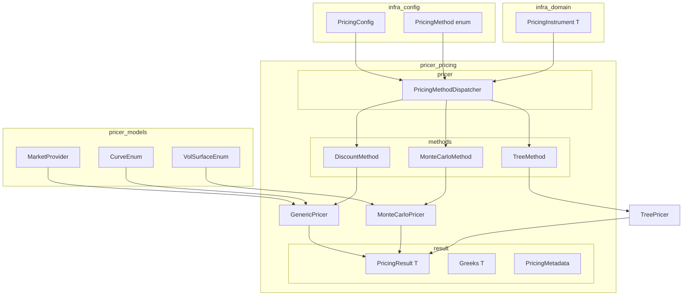
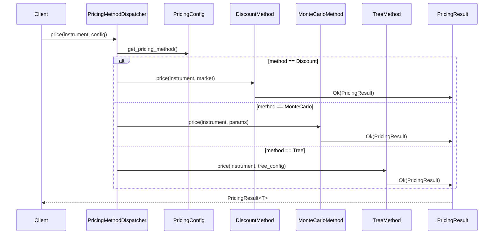
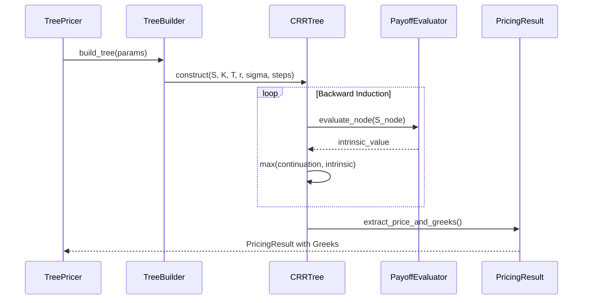

# Technical Design: pricer-pricing-architecture

## Overview

**Purpose**: `pricer_pricing` クレート（L3層）のアーキテクチャを再設計し、Pricer を中心とした統一的なプライシング構造を確立する。設定駆動型の手法選択（Discount、Monte Carlo、Tree）と統一された `PricingResult` を提供する。

**Users**: クオンツ開発者、リスクエンジニアが商品プライシングとGreeks計算に使用。

**Impact**: 既存の `generic_pricer` と `mc` モジュールを活かしつつ、新規 Tree 手法を追加し、手法選択ロジックを統合。

### Goals
- Pricer を中心とした統一インターフェースの確立
- 設定ファイルによるプライシング手法（Discount/MC/Tree）の選択
- American オプション対応のための Binomial/Trinomial Tree 実装
- 全手法で共通の `PricingResult<T>` 型による結果統一

### Non-Goals
- PDE/FDM（有限差分法）手法の実装（将来スコープ）
- 既存 `mc/` モジュールの大規模リファクタリング
- SABR Tree（確率的ボラティリティ Tree）の実装

## Architecture

### Existing Architecture Analysis

**現行構造**:
- `generic_pricer/`: Trade/Leg/Cashflow 階層の PV 計算、MarketProvider 統合
- `mc/`: MonteCarloPricer、GBM パス生成、Greeks 計算
- `enzyme/`: Enzyme AD バインディング
- `rng/`, `checkpoint/`, `path_dependent/`: MC サポートモジュール

**制約**:
- `GenericPricer` と `MonteCarloPricer` は独立、統一インターフェースなし
- `PricingMethod` enum は `infra_config` に存在（Analytical, MonteCarlo のみ）
- Tree 手法は未実装

### Architecture Pattern & Boundary Map



**Architecture Integration**:
- **Selected Pattern**: ハイブリッドアプローチ（`research.md` 参照）
- **Domain Boundaries**: `tree/` を独立モジュールとして追加、既存モジュールは維持
- **Existing Patterns Preserved**: Builder pattern、thiserror エラー型、feature flag
- **New Components**: `tree/`, `PricingMethodDispatcher`, 拡張 `PricingError`
- **Steering Compliance**: A-I-P-S 依存規則遵守（Pricer は Service/Adapter に依存しない）

### Technology Stack

| Layer | Choice / Version | Role in Feature | Notes |
|-------|------------------|-----------------|-------|
| Language | Rust stable | Tree 実装 | pricer_pricing は stable Rust |
| AD Backend | bump-and-revalue | Greeks 計算 | Enzyme AD は pricer_risk (L4) |
| Numeric | `num-traits`, `pricer_core::Float` | AD 互換数値型 | `T: Float` ジェネリクス |
| Error | `thiserror` | 構造化エラー | 既存パターン踏襲 |
| Config | `serde` | JSON/TOML 設定読込 | `infra_config` 連携 |

> **Note**: Enzyme AD は `pricer_risk::enzyme` に統合済み。本仕様の Tree 実装は stable Rust で行い、Greeks は bump-and-revalue で計算。

## System Flows

### Pricing Method Selection Flow



**Key Decisions**:
- 手法選択は `PricingConfig.pricing_method` に基づく
- 各手法は統一された `PricingResult<T>` を返却
- エラーは `PricingError` enum で統一

### Tree Pricing Flow



**Key Decisions**:
- CRR アルゴリズムによる対称ツリー構築
- Backward induction による American オプション早期行使判定
- Delta/Gamma はツリーノードから直接計算

## Requirements Traceability

| Requirement | Summary | Components | Interfaces | Flows |
|-------------|---------|------------|------------|-------|
| 1.1 | Pricer トレイト抽象化 | `PricingMethodDispatcher` | `PricingMethod` trait | Pricing Method Selection |
| 1.2 | 設定に基づく手法選択 | `PricingMethodDispatcher` | `dispatch()` | Pricing Method Selection |
| 1.3 | 共通 PricingResult | `PricingResult<T>` | - | All flows |
| 2.1 | 手法選択設定 | `PricingConfig` | `PricingMethod` enum | - |
| 2.2 | 手法固有パラメータ | `TreeConfig`, `MonteCarloParams` | Builder methods | - |
| 3.1 | YieldCurve による PV 計算 | `DiscountMethod` | `discount()` | - |
| 3.5 | 解析的 Greeks | `DiscountMethod` | `compute_greeks()` | - |
| 4.1-4.6 | MC シミュレーション | `MonteCarloMethod` | Existing `MonteCarloPricer` | - |
| 5.1 | Binomial/Trinomial Tree | `TreeMethod`, `BinomialTree` | `build()`, `price()` | Tree Pricing |
| 5.2 | American 早期行使 | `TreeMethod` | `evaluate_early_exercise()` | Tree Pricing |
| 6.1-6.5 | PricingResult 統一 | `PricingResult<T>`, `PricingMetadata` | - | All flows |
| 9.1-9.5 | エラーハンドリング | `PricingError` | Error variants | - |
| 10.1-10.6 | モジュール構造 | `tree/`, `generic_pricer/` | Module exports | - |

## Components and Interfaces

### Component Summary

| Component | Domain/Layer | Intent | Req Coverage | Key Dependencies | Contracts |
|-----------|--------------|--------|--------------|------------------|-----------|
| `PricingMethodDispatcher` | pricer/ | 手法選択とディスパッチ | 1.1, 1.2 | PricingConfig (P0) | Service |
| `DiscountMethod` | methods/ | 解析的プライシング | 3.1, 3.5 | GenericPricer (P0) | - |
| `TreeMethod` | methods/tree/ | Binomial/Trinomial Tree | 5.1, 5.2, 5.3, 5.4, 5.5 | MarketProvider (P1) | Service |
| `BinomialTree` | methods/tree/ | CRR ツリー構築 | 5.1, 5.2 | - | - |
| `TrinomialTree` | methods/tree/ | 3分木ツリー | 5.1 | - | - |
| `PricingResult<T>` | result/ | 統一結果構造 | 6.1, 6.2, 6.3, 6.4, 6.5 | - | State |
| `PricingMetadata` | result/ | 手法固有メタデータ | 6.4, 6.5 | - | State |
| `TreeConfig` | config/ | Tree 手法設定 | 2.2, 5.3 | - | - |
| `PricingError` (拡張) | error/ | 構造化エラー | 9.1, 9.2, 9.3, 9.4, 9.5 | - | - |

### pricer/ Layer

#### PricingMethodDispatcher

| Field | Detail |
|-------|--------|
| Intent | 設定に基づいてプライシング手法を選択し、適切な Pricer にディスパッチ |
| Requirements | 1.1, 1.2, 1.5 |

**Responsibilities & Constraints**
- 入力: `PricingInstrument<T>`, `PricingConfig`
- 手法選択: `PricingMethod` enum に基づく条件分岐
- 出力: `Result<PricingResult<T>, PricingError>`

**Dependencies**
- Inbound: `infra_config::PricingConfig` — 設定取得 (P0)
- Inbound: `infra_domain::trade::PricingInstrument<T>` — 商品定義 (P0)
- Outbound: `DiscountMethod` — 解析的プライシング (P1)
- Outbound: `MonteCarloMethod` — MC プライシング (P1)
- Outbound: `TreeMethod` — Tree プライシング (P1)

**Contracts**: Service [x]

##### Service Interface

```rust
/// プライシング手法ディスパッチャ
pub struct PricingMethodDispatcher<'a, T: Float> {
    market: &'a MarketProvider,
    config: &'a PricingConfig,
    _phantom: PhantomData<T>,
}

impl<'a, T: Float> PricingMethodDispatcher<'a, T> {
    /// 新規ディスパッチャを作成
    pub fn new(market: &'a MarketProvider, config: &'a PricingConfig) -> Self;

    /// 商品をプライシング
    ///
    /// # Errors
    /// - `PricingError::UnsupportedMethod` if method not supported
    /// - `PricingError::UnsupportedInstrument` if instrument not supported
    pub fn price(&self, instrument: &PricingInstrument<T>) -> Result<PricingResult<T>, PricingError>;

    /// 使用する手法を取得
    pub fn method(&self) -> PricingMethod;
}
```

- **Preconditions**: `market` が有効なマーケットデータを保持
- **Postconditions**: `PricingResult` または `PricingError` を返却
- **Invariants**: 同一入力に対して同一結果（決定論的）

**Implementation Notes**
- Integration: `l1l2-integration` feature で MarketProvider 統合
- Validation: 商品タイプと手法の互換性を検証（American → Tree 推奨）
- Risks: 手法選択ロジックの複雑化 → 手法ごとの `supports()` メソッドで委譲

### methods/tree/ Layer

#### TreeMethod

| Field | Detail |
|-------|--------|
| Intent | Binomial/Trinomial Tree によるオプションプライシング |
| Requirements | 5.1, 5.2, 5.3, 5.4, 5.5 |

**Responsibilities & Constraints**
- European/American オプションのツリーベースプライシング
- 早期行使判定（American オプション）
- Tree-based Greeks 計算（Delta, Gamma）

**Dependencies**
- Inbound: `TreeConfig` — ツリー設定 (P0)
- Inbound: `PricingInstrument<T>` — 商品定義 (P0)
- Outbound: `BinomialTree` — CRR ツリー (P1)
- Outbound: `TrinomialTree` — 3分木 (P2)
- External: `pricer_models::market::curves` — 金利カーブ (P1)

**Contracts**: Service [x]

##### Service Interface

```rust
/// Tree プライシング手法
pub struct TreeMethod<T: Float> {
    config: TreeConfig,
    _phantom: PhantomData<T>,
}

impl<T: Float> TreeMethod<T> {
    /// 設定から TreeMethod を作成
    pub fn new(config: TreeConfig) -> Self;

    /// Builder パターンで作成
    pub fn builder() -> TreeMethodBuilder<T>;

    /// オプションをプライシング
    ///
    /// # Errors
    /// - `PricingError::ConvergenceFailed` if tree does not converge
    /// - `PricingError::MissingMarketData` if market data unavailable
    pub fn price(
        &self,
        instrument: &VanillaOption<T>,
        spot: T,
        rate: T,
        volatility: T,
    ) -> Result<PricingResult<T>, PricingError>;

    /// Greeks を計算（Delta, Gamma）
    pub fn compute_greeks(
        &self,
        instrument: &VanillaOption<T>,
        spot: T,
        rate: T,
        volatility: T,
    ) -> Result<Greeks<T>, PricingError>;

    /// このインストルメントをサポートするか判定
    pub fn supports(&self, instrument: &PricingInstrument<T>) -> bool;
}
```

- **Preconditions**: `config.num_steps > 0`, `volatility > 0`
- **Postconditions**: 収束した場合のみ `Ok(PricingResult)` を返却
- **Invariants**: European オプションは Black-Scholes に収束

#### BinomialTree

| Field | Detail |
|-------|--------|
| Intent | Cox-Ross-Rubinstein (CRR) アルゴリズムによる2分木構築 |
| Requirements | 5.1, 5.2 |

**Responsibilities & Constraints**
- CRR パラメータ計算（u, d, p）
- Backward induction による価格計算
- American 早期行使の各ノード判定

**Contracts**: Service [x]

##### Service Interface

```rust
/// CRR Binomial Tree
pub struct BinomialTree<T: Float> {
    spot: T,
    strike: T,
    expiry: T,
    rate: T,
    volatility: T,
    num_steps: usize,
    is_call: bool,
    is_american: bool,
}

impl<T: Float> BinomialTree<T> {
    /// ツリーを構築
    pub fn new(
        spot: T,
        strike: T,
        expiry: T,
        rate: T,
        volatility: T,
        num_steps: usize,
        is_call: bool,
        is_american: bool,
    ) -> Result<Self, ConfigError>;

    /// 価格を計算
    pub fn price(&self) -> T;

    /// Delta を計算（ツリーから直接）
    pub fn delta(&self) -> T;

    /// Gamma を計算（ツリーから直接）
    pub fn gamma(&self) -> T;

    /// CRR パラメータを取得
    pub fn params(&self) -> CrrParams<T>;
}

/// CRR パラメータ
pub struct CrrParams<T> {
    pub u: T,      // 上昇率
    pub d: T,      // 下落率
    pub p: T,      // リスク中立確率
    pub dt: T,     // 時間ステップ
}
```

### result/ Layer

#### PricingResult<T>

| Field | Detail |
|-------|--------|
| Intent | 全手法で統一されたプライシング結果構造 |
| Requirements | 6.1, 6.2, 6.3, 6.4, 6.5 |

**Contracts**: State [x]

##### State Management

```rust
/// 統一プライシング結果
#[derive(Debug, Clone)]
pub struct PricingResult<T: Float> {
    /// 現在価値（Present Value）
    pub pv: T,

    /// 使用したプライシング手法
    pub method: PricingMethod,

    /// 計算時間（ナノ秒）
    pub computation_time_ns: u64,

    /// Greeks（オプション）
    pub greeks: Option<Greeks<T>>,

    /// 手法固有メタデータ
    pub metadata: Option<PricingMetadata>,
}

/// Greeks 構造体
#[derive(Debug, Clone, Default)]
pub struct Greeks<T: Float> {
    pub delta: Option<T>,
    pub gamma: Option<T>,
    pub vega: Option<T>,
    pub theta: Option<T>,
    pub rho: Option<T>,
}

/// 手法固有メタデータ
#[derive(Debug, Clone)]
pub enum PricingMetadata {
    /// Monte Carlo 固有
    MonteCarlo {
        num_paths: usize,
        standard_error: f64,
    },
    /// Tree 固有
    Tree {
        num_steps: usize,
        tree_type: TreeType,
    },
    /// Discount（解析的）固有
    Discount {
        model: String,
    },
}

/// Tree タイプ
#[derive(Debug, Clone, Copy, PartialEq, Eq)]
pub enum TreeType {
    Binomial,
    Trinomial,
}
```

- **State Model**: イミュータブル結果構造
- **Persistence**: メモリのみ（永続化はサービス層の責務）
- **Concurrency**: `Clone` による値複製、共有不要

### config/ Layer

#### TreeConfig

| Field | Detail |
|-------|--------|
| Intent | Tree 手法の設定パラメータ |
| Requirements | 2.2, 5.3 |

**Contracts**: State [x]

##### State Management

```rust
/// Tree プライシング設定
#[derive(Debug, Clone)]
pub struct TreeConfig {
    /// ツリーのステップ数
    pub num_steps: usize,

    /// ツリータイプ
    pub tree_type: TreeType,

    /// 収束判定の許容誤差
    pub convergence_tolerance: f64,

    /// Greeks 計算を有効化
    pub compute_greeks: bool,
}

impl Default for TreeConfig {
    fn default() -> Self {
        Self {
            num_steps: 100,
            tree_type: TreeType::Binomial,
            convergence_tolerance: 1e-6,
            compute_greeks: true,
        }
    }
}

impl TreeConfig {
    /// Builder パターン
    pub fn builder() -> TreeConfigBuilder { TreeConfigBuilder::default() }

    /// 設定を検証
    pub fn validate(&self) -> Result<(), ConfigError>;
}
```

### error/ Layer (拡張)

#### PricingError (Extended)

| Field | Detail |
|-------|--------|
| Intent | 構造化エラー型の拡張 |
| Requirements | 9.1, 9.2, 9.3, 9.4, 9.5 |

**新規バリアント**:

```rust
/// PricingError 拡張バリアント
#[derive(Debug, Clone, PartialEq, Error)]
pub enum PricingError {
    // ... 既存バリアント ...

    /// プライシング手法がサポートされていない
    #[error("Unsupported pricing method: {method} - {reason}")]
    UnsupportedMethod {
        method: String,
        reason: String,
    },

    /// 収束に失敗
    #[error("Convergence failed for {method}: {iterations} iterations, tolerance {tolerance}")]
    ConvergenceFailed {
        method: String,
        iterations: usize,
        tolerance: f64,
    },

    /// 数値不安定性
    #[error("Numerical instability in {method}: {details}")]
    NumericalInstability {
        method: String,
        details: String,
    },
}

impl PricingError {
    /// 収束エラーか判定
    pub fn is_convergence_error(&self) -> bool {
        matches!(self, Self::ConvergenceFailed { .. })
    }

    /// 数値エラーか判定
    pub fn is_numerical_error(&self) -> bool {
        matches!(self, Self::NumericalInstability { .. })
    }
}
```

## Data Models

### Domain Model

**Aggregates**:
- `PricingResult<T>`: プライシング結果の集約ルート
- `BinomialTree<T>`: ツリー計算の集約ルート

**Value Objects**:
- `Greeks<T>`: Greeks 値の集合
- `CrrParams<T>`: CRR パラメータ
- `PricingMetadata`: 手法固有メタデータ

**Business Rules**:
- American オプション: 各ノードで `max(continuation, intrinsic)` を計算
- European オプション: 最終ノードでのみ payoff 計算
- CRR 制約: `u * d = 1`（対称性）

### Logical Data Model

**PricingMethod Enum (infra_config 拡張)**:

```rust
#[derive(Debug, Clone, Copy, PartialEq, Eq, Deserialize, Serialize, Default)]
#[serde(rename_all = "snake_case")]
pub enum PricingMethod {
    #[default]
    Analytical,
    MonteCarlo,
    Tree,  // 新規追加
}
```

**TreeParams (infra_config 追加)**:

```rust
#[derive(Debug, Clone, PartialEq, Eq, Deserialize, Serialize)]
pub struct TreeParams {
    pub num_steps: usize,
    #[serde(default)]
    pub tree_type: TreeType,
}

impl Default for TreeParams {
    fn default() -> Self {
        Self {
            num_steps: 100,
            tree_type: TreeType::Binomial,
        }
    }
}
```

## Error Handling

### Error Strategy

- **Fail Fast**: 設定検証は `TreeConfig::validate()` で早期エラー
- **Graceful Degradation**: 収束失敗時は最後の有効な結果と警告を返却可能
- **Observability**: エラーにコンテキスト情報（method, iterations）を含める

### Error Categories and Responses

| Category | Error | Response |
|----------|-------|----------|
| Config | `ConfigError::InvalidModelParameter` | 400 相当、設定修正を促す |
| Market Data | `PricingError::MissingMarketData` | カーブ/サーフェス不足を通知 |
| Method | `PricingError::UnsupportedMethod` | 代替手法を提案 |
| Convergence | `PricingError::ConvergenceFailed` | ステップ数増加を提案 |
| Numerical | `PricingError::NumericalInstability` | パラメータ調整を提案 |

## Testing Strategy

### Unit Tests
- `BinomialTree::price()`: European オプションが Black-Scholes に収束
- `BinomialTree::delta()`: 解析解との誤差 < 1e-4
- `TreeConfig::validate()`: 不正パラメータでエラー
- `PricingMethodDispatcher::price()`: 手法選択ロジック

### Integration Tests
- `TreeMethod` + `MarketProvider`: カーブデータ取得とプライシング
- `PricingMethodDispatcher` + 全手法: 統一結果検証
- American vs European: 早期行使プレミアム検証

### Performance Tests
- Binomial Tree 5000 steps: < 0.5秒
- Tree Greeks 計算: bump-and-revalue 比 10x 高速化目標

## Optional Sections

### Performance & Scalability

**Target Metrics**:
- Binomial Tree 100 steps: < 1ms
- Binomial Tree 5000 steps: < 500ms
- メモリ使用量: O(n) （ノード配列のみ保持）

**Optimization Techniques**:
- 2行バッファによるメモリ最適化（全ノード保持不要）
- SIMD 最適化（将来）

### Migration Strategy

**Phase 1: Tree モジュール追加**
- `tree/` モジュール新規作成
- `PricingMethod::Tree` を `infra_config` に追加
- feature flag `tree-pricing` で段階導入

**Phase 2: Dispatcher 統合**
- `PricingMethodDispatcher` を `generic_pricer/` に追加
- 既存 `GenericPricer` からのマイグレーションパス提供

**Phase 3: 構造整理**
- `PricingResult` 統一
- モジュール再編成（`methods/` 導入検討）

---
_Generated: 2026-01-26_
_Spec: pricer-pricing-architecture_
