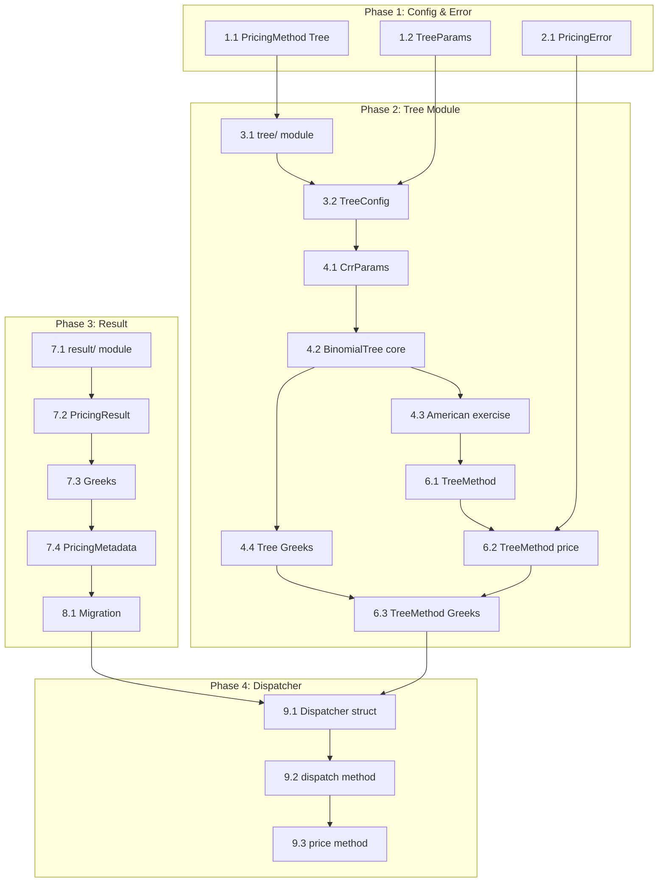

# Implementation Plan: pricer-pricing-architecture

## Overview

`pricer_pricing` クレートのアーキテクチャ再設計を段階的に実装する。Tree 手法の追加、PricingMethodDispatcher の統合、PricingResult の統一を行う。

**Implementation Approach**: TDD（テスト駆動開発）- 各タスクでテストを先に記述

**Parallel Execution**: `(P)` マークのタスクは並列実行可能

---

## Phase 1: Configuration & Error Types

### 1. PricingMethod enum 拡張 (infra_config)

- [ ] 1.1 `PricingMethod::Tree` バリアント追加 (P)
  - `infra_config/src/pricing_config.rs` に `Tree` バリアント追加
  - serde rename_all = "snake_case" で `tree` として serialize
  - テスト: JSON/TOML シリアライズ・デシリアライズ
  - _Requirements: 2.1_

- [ ] 1.2 `TreeParams` 構造体追加 (P)
  - `num_steps: usize`, `tree_type: TreeType` フィールド
  - `Default` impl: num_steps = 100, tree_type = Binomial
  - `PricingConfig` に `tree_params: Option<TreeParams>` 追加
  - バリデーション: Tree 手法選択時に tree_params 必須
  - テスト: デフォルト値、バリデーションエラー
  - _Requirements: 2.2, 2.3, 2.4_

### 2. PricingError 拡張 (pricer_pricing)

- [ ] 2.1 新規エラーバリアント追加
  - `UnsupportedMethod { method: String, reason: String }`
  - `ConvergenceFailed { method: String, iterations: usize, tolerance: f64 }`
  - `NumericalInstability { method: String, details: String }`
  - ヘルパーメソッド: `is_convergence_error()`, `is_numerical_error()`
  - テスト: エラー生成、Display trait、カテゴリ判定
  - _Requirements: 9.1, 9.2, 9.3, 9.4, 9.5_

---

## Phase 2: Tree Module Implementation

### 3. Tree モジュール基盤

- [ ] 3.1 `tree/` モジュール作成
  - `pricer_pricing/src/tree/mod.rs` 作成
  - `lib.rs` に `pub mod tree;` 追加
  - サブモジュール: `config.rs`, `binomial.rs`, `trinomial.rs`, `method.rs`
  - _Requirements: 10.1, 10.3_

- [ ] 3.2 `TreeConfig` 構造体実装
  - フィールド: `num_steps`, `tree_type`, `convergence_tolerance`, `compute_greeks`
  - `Default` impl, `TreeConfigBuilder` builder pattern
  - `validate()` メソッド: num_steps > 0 チェック
  - テスト: デフォルト値、builder、バリデーション
  - _Requirements: 2.2, 5.3_

### 4. Binomial Tree 実装

- [ ] 4.1 `CrrParams<T>` 構造体
  - フィールド: `u`, `d`, `p`, `dt`
  - CRR パラメータ計算関数: `compute_crr_params(volatility, rate, dt)`
  - テスト: 既知のパラメータ値との比較
  - _Requirements: 5.1_

- [ ] 4.2 `BinomialTree<T>` コア実装
  - コンストラクタ: `new(spot, strike, expiry, rate, volatility, num_steps, is_call, is_american)`
  - `price()` メソッド: backward induction 実装
  - European オプション: Black-Scholes 収束テスト（誤差 < 1e-4）
  - テスト: European Call/Put、ステップ数による収束
  - _Requirements: 5.1, 5.2_

- [ ] 4.3 American オプション早期行使
  - 各ノードで `max(continuation_value, intrinsic_value)` 判定
  - テスト: American > European (早期行使プレミアム)
  - _Requirements: 5.2_

- [ ] 4.4 Tree-based Greeks 計算
  - `delta()`: ツリーから直接計算
  - `gamma()`: ツリーから直接計算
  - テスト: 解析解との比較（誤差 < 1e-4）
  - _Requirements: 5.5_

### 5. Trinomial Tree 実装 (Optional)

- [ ]* 5.1 `TrinomialTree<T>` 実装
  - 3分木パラメータ計算
  - Binomial と同等のインターフェース
  - テスト: European オプション収束
  - _Requirements: 5.1_

### 6. TreeMethod 統合

- [ ] 6.1 `TreeMethod<T>` 構造体
  - `new(config: TreeConfig)` コンストラクタ
  - `builder()` パターン
  - `supports(instrument)` メソッド: VanillaOption のみサポート
  - _Requirements: 5.1, 5.3_

- [ ] 6.2 `TreeMethod::price()` 実装
  - `BinomialTree` または `TrinomialTree` に委譲
  - `PricingResult<T>` を返却
  - エラーハンドリング: `ConvergenceFailed`, `MissingMarketData`
  - テスト: 正常系、エラー系
  - _Requirements: 5.1, 5.4_

- [ ] 6.3 `TreeMethod::compute_greeks()` 実装
  - Delta, Gamma をツリーから計算
  - `Greeks<T>` を返却
  - テスト: 解析解との比較
  - _Requirements: 5.5_

---

## Phase 3: PricingResult Unification

### 7. 統一 PricingResult<T>

- [ ] 7.1 `result/` モジュール作成
  - `pricer_pricing/src/result/mod.rs` 作成
  - `lib.rs` に `pub mod result;` 追加
  - _Requirements: 10.5_

- [ ] 7.2 `PricingResult<T>` 構造体実装
  - フィールド: `pv`, `method`, `computation_time_ns`, `greeks`, `metadata`
  - `Clone`, `Debug` derive
  - テスト: 構造体生成、Clone
  - _Requirements: 6.1, 6.2, 6.3_

- [ ] 7.3 `Greeks<T>` 構造体実装
  - フィールド: `delta`, `gamma`, `vega`, `theta`, `rho` (all `Option<T>`)
  - `Default` impl
  - _Requirements: 6.2_

- [ ] 7.4 `PricingMetadata` enum 実装
  - バリアント: `MonteCarlo { num_paths, standard_error }`, `Tree { num_steps, tree_type }`, `Discount { model }`
  - _Requirements: 6.4, 6.5_

### 8. 既存 PricingResult 移行

- [ ] 8.1 `generic_pricer::PricingResult` から新規 `result::PricingResult<T>` への移行
  - 既存コードの依存関係を新規型に更新
  - 型エイリアスまたは re-export による互換性維持
  - _Requirements: 6.1, 6.3_

---

## Phase 4: PricingMethodDispatcher Integration

### 9. Dispatcher 実装

- [ ] 9.1 `PricingMethodDispatcher<T>` 構造体
  - フィールド: `market: &MarketProvider`, `config: &PricingConfig`
  - `new(market, config)` コンストラクタ
  - `method()` メソッド: 現在の手法を返却
  - _Requirements: 1.1, 1.2_

- [ ] 9.2 `dispatch()` メソッド実装
  - `PricingMethod` に基づく条件分岐
  - `Analytical` → 既存 `GenericPricer` 使用
  - `MonteCarlo` → 既存 `MonteCarloPricer` 使用
  - `Tree` → 新規 `TreeMethod` 使用
  - _Requirements: 1.2_

- [ ] 9.3 `price(instrument)` メソッド実装
  - 商品タイプと手法の互換性検証
  - 統一 `PricingResult<T>` を返却
  - エラー: `UnsupportedMethod`, `UnsupportedInstrument`
  - テスト: 各手法での正常系、エラー系
  - _Requirements: 1.1, 1.3, 1.5_

### 10. Instrument Support

- [ ] 10.1 VanillaOption → Dispatcher 統合
  - `supports()` メソッドで互換性判定
  - American → Tree 推奨（警告ログ）
  - European → Discount/MC/Tree すべてサポート
  - _Requirements: 8.1, 8.2_

- [ ] 10.2 Forward → Dispatcher 統合
  - Discount 手法を優先使用
  - _Requirements: 8.3_

---

## Phase 5: Integration & Testing

### 11. 統合テスト

- [ ] 11.1 Tree + MarketProvider 統合テスト
  - カーブデータ取得とプライシング
  - _Requirements: 7.1, 7.3_

- [ ] 11.2 Dispatcher 全手法統合テスト (P)
  - 同一商品を3手法でプライシング
  - 結果の一貫性検証（許容誤差内）
  - _Requirements: 1.1, 1.3_

- [ ] 11.3 American vs European 検証テスト
  - American オプションの早期行使プレミアム > 0
  - _Requirements: 5.2_

### 12. パフォーマンステスト

- [ ]* 12.1 Binomial Tree ベンチマーク
  - 100 steps: < 1ms
  - 5000 steps: < 500ms
  - `criterion` でベンチマーク追加
  - _Requirements: 5.3_

---

## Phase 6: Documentation & Cleanup

### 13. ドキュメント

- [ ] 13.1 モジュールドキュメント
  - `tree/mod.rs` にモジュールレベルドキュメント追加
  - 使用例コード追加
  - _Requirements: 10.1_

- [ ] 13.2 steering 更新
  - `.kiro/steering/structure.md` に `tree/` モジュール追記
  - _Requirements: 10.1_

---

## Task Dependencies

---

## Execution Notes

- **Parallel Tasks**: `(P)` マークのタスクは他の `(P)` タスクと並列実行可能
- **Optional Tasks**: `[ ]*` マークのタスクは後回し可能（テスト・最適化）
- **TDD**: 各タスクでテストを先に記述、Red → Green → Refactor

---
_Generated: 2026-01-26_
_Spec: pricer-pricing-architecture_
