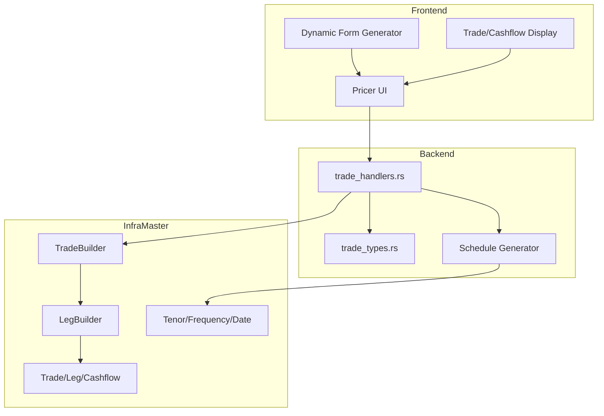
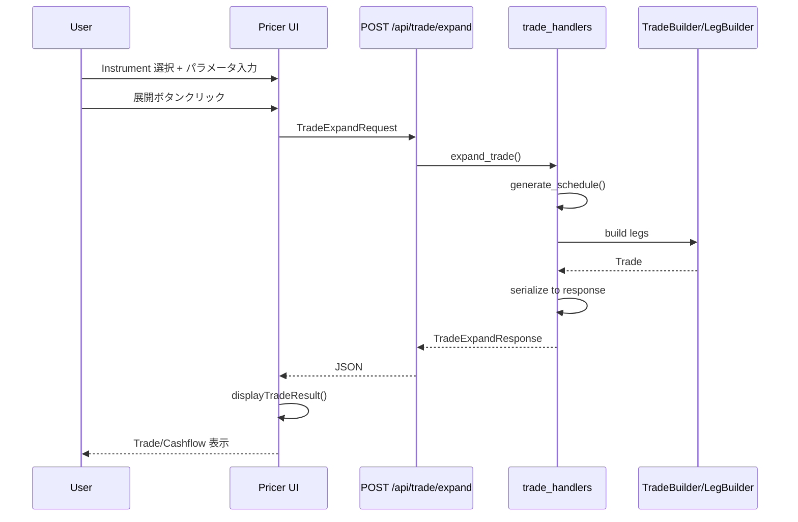
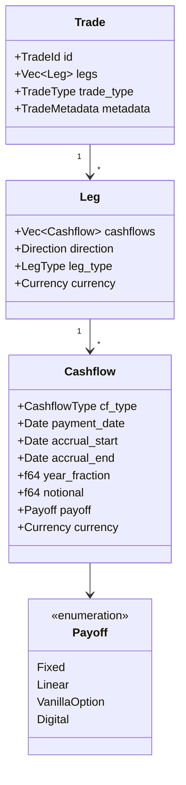

# Design Document: pricer-trade-expansion-ui

## Overview

**Purpose**: Frictional Bank Web App の Pricer 画面を拡張し、トレーダーがすべての対応 Instrument タイプを選択し、パラメータを入力してキャッシュフロー（CF）展開された Trade を生成・表示できる機能を提供する。

**Users**: トレーダーおよびリスクマネージャーが、金融商品の CF 構造を検証・分析するワークフローで利用する。

**Impact**: 現在の Pricer 画面（3 種類の Instrument のみ）を、infra_domain で定義されたすべての金融商品（15+ 種類）に拡張する。

### Goals

- すべての対応 Instrument タイプ（Rates、FX、Equity）の選択と CF 展開を可能にする
- 生成された Trade/Leg/Cashflow の詳細を視覚的に表示する
- 既存の Pricer 画面パターンとの一貫性を維持する

### Non-Goals

- プライシング（PV 計算）機能：本仕様では Trade 展開（CF 生成）のみ
- Greeks 計算：既存機能は維持するが拡張しない
- 永続化（データベース保存）：生成された Trade はセッション内のみ
- Credit/Commodity Instrument の完全実装：プレースホルダーのみ

## Architecture

### Existing Architecture Analysis

現在の Pricer 画面は以下の構造を持つ：

- **バックエンド**: `demo/gui/src/web/handlers.rs` に `price_instrument()` ハンドラ
- **型定義**: `demo/gui/src/web/pricer_types.rs` に 3 種類の Instrument（EquityVanillaOption、FxOption、IRS）
- **フロントエンド**: `demo/gui/static/index.html` と `app.js` に動的フォーム切り替えロジック
- **制約**: A-I-P-S 依存ルールに従い、Service レイヤーから Infra レイヤーへの依存のみ許可

### Architecture Pattern & Boundary Map



**Architecture Integration**:
- Selected pattern: ハイブリッドアプローチ（バックエンド新規ファイル、フロントエンド既存拡張）
- Domain boundaries: Trade 展開（新規）とプライシング（既存）を分離
- Existing patterns preserved: Axum ハンドラパターン、serde camelCase、エラーレスポンス形式
- New components rationale: Trade 展開は責務が異なるため独立モジュール化
- Steering compliance: A-I-P-S 依存ルール遵守（S → I）

### Technology Stack

| Layer | Choice / Version | Role in Feature | Notes |
|-------|------------------|-----------------|-------|
| Frontend | HTML5 / JavaScript (ES6+) | 動的フォーム生成、Trade/Cashflow 表示 | 既存 app.js 拡張 |
| Backend | Axum 0.7.x / Rust | REST API エンドポイント | 既存パターン踏襲 |
| Data | infra_domain (serde feature) | Trade/Leg/Cashflow 構造体 | 新規依存追加 |

## System Flows

### Trade 展開フロー



**Key Decisions**:
- スケジュール生成はハンドラ内で実施（infra_domain の Tenor/Frequency を使用）
- Trade 構造は infra_domain の型を直接シリアライズ

## Requirements Traceability

| Requirement | Summary | Components | Interfaces | Flows |
|-------------|---------|------------|------------|-------|
| 1.1-1.3 | Instrument セレクタ拡張 | FormGen, UI | - | - |
| 2.1-2.5 | Instrument 別入力フォーム | FormGen, UI, TradeTypes | TradeExpandRequest | - |
| 3.1-3.4 | Trade 展開機能 | TradeHandler, ScheduleGen, TradeBuilder | expand_trade() | Trade 展開フロー |
| 4.1-4.5 | Trade/Cashflow 表示 | TradeView, UI | TradeExpandResponse | - |
| 5.1-5.4 | REST API エンドポイント | TradeHandler, TradeTypes | POST /api/trade/expand | Trade 展開フロー |
| 6.1-6.3 | Instrument 一覧 API | TradeHandler, TradeTypes | GET /api/instruments | - |

## Components and Interfaces

| Component | Domain/Layer | Intent | Req Coverage | Key Dependencies | Contracts |
|-----------|--------------|--------|--------------|------------------|-----------|
| TradeHandler | Backend | Trade 展開 API 処理 | 3, 5, 6 | infra_domain (P0) | API |
| TradeTypes | Backend | API 型定義 | 2, 3, 5, 6 | serde (P0) | - |
| ScheduleGen | Backend | 支払いスケジュール生成 | 3 | infra_domain (P0) | Service |
| FormGen | Frontend | 動的フォーム生成 | 1, 2 | Instruments API (P1) | - |
| TradeView | Frontend | Trade/Cashflow 表示 | 4 | - | - |

### Backend

#### TradeHandler (trade_handlers.rs)

| Field | Detail |
|-------|--------|
| Intent | Trade 展開 API エンドポイントの処理 |
| Requirements | 3.1, 3.2, 3.3, 3.4, 5.1, 5.2, 5.3, 5.4, 6.1, 6.2, 6.3 |

**Responsibilities & Constraints**
- POST /api/trade/expand リクエストを受信し、Trade を生成
- GET /api/instruments リクエストを受信し、Instrument メタデータを返却
- infra_domain の TradeBuilder/LegBuilder を使用して CF 展開
- 入力バリデーションとエラーハンドリング

**Dependencies**
- Inbound: Axum router — HTTP リクエスト受信 (P0)
- Outbound: infra_domain::trade — Trade 構造体生成 (P0)
- External: なし

**Contracts**: API [x]

##### API Contract

| Method | Endpoint | Request | Response | Errors |
|--------|----------|---------|----------|--------|
| POST | /api/trade/expand | TradeExpandRequest | TradeExpandResponse | 400, 422, 500 |
| GET | /api/instruments | - | InstrumentsResponse | 500 |

**Implementation Notes**
- Integration: `demo/gui/src/web/mod.rs` にルート追加
- Validation: 各 Instrument タイプに応じたパラメータ検証
- Risks: スケジュール生成ロジックのバグ（月末処理）→ 単体テストで網羅

#### TradeTypes (trade_types.rs)

| Field | Detail |
|-------|--------|
| Intent | Trade 展開 API のリクエスト/レスポンス型定義 |
| Requirements | 2.1, 2.2, 2.3, 2.4, 3.3, 5.2, 5.3, 6.2, 6.3 |

**Responsibilities & Constraints**
- 全 Instrument タイプのパラメータ型を定義
- JSON シリアライズ/デシリアライズ対応（camelCase）
- TradeExpandResponse は infra_domain 型の DTO ラッパー

**Dependencies**
- Inbound: TradeHandler — 型使用 (P0)
- External: serde — JSON シリアライズ (P0)

**Contracts**: State [x]

##### State Management

```rust
// Instrument タイプ enum（拡張版）
#[derive(Debug, Clone, Copy, Serialize, Deserialize)]
#[serde(rename_all = "snake_case")]
pub enum TradeInstrumentType {
    // Rates
    Deposit,
    Fra,
    Futures,
    ParSwap,
    Ois,
    BasisSwap,
    Irs,
    // FX
    FxForward,
    FxOption,
    CrossCurrencySwap,
    // Equity
    EquityVanillaOption,
    EquityForward,
}

// =============================================================================
// Instrument Parameters (Requirements 2.1-2.4)
// =============================================================================

// Rates 系パラメータ（2.1: Deposit, FRA, Futures, ParSwap, OIS）
#[derive(Debug, Clone, Serialize, Deserialize)]
#[serde(rename_all = "camelCase")]
pub struct RatesParams {
    pub currency: String,           // 通貨コード（例: "USD", "EUR"）
    pub start_date: String,         // 開始日（ISO 8601: "2024-01-15"）
    pub tenor: String,              // 期間（例: "3M", "1Y", "5Y"）
    pub rate: f64,                  // レートまたは価格
    pub notional: f64,              // 想定元本
}

// Swap 系パラメータ（2.2: IRS, BasisSwap）
#[derive(Debug, Clone, Serialize, Deserialize)]
#[serde(rename_all = "camelCase")]
pub struct SwapParams {
    pub currency: String,
    pub start_date: String,
    pub tenor: String,
    pub notional: f64,
    pub fixed_rate: Option<f64>,    // 固定金利（IRS の場合）
    pub spread: Option<f64>,        // スプレッド（BasisSwap の場合）
    pub payment_frequency: String,  // 支払い頻度（例: "Quarterly", "SemiAnnual"）
    pub day_count: String,          // 日数計算方式（例: "Act360", "Thirty360"）
}

// FX 系パラメータ（2.3: FxForward, FxOption, CrossCurrencySwap）
#[derive(Debug, Clone, Serialize, Deserialize)]
#[serde(rename_all = "camelCase")]
pub struct FxParams {
    pub base_currency: String,      // 基軸通貨（例: "EUR"）
    pub quote_currency: String,     // クォート通貨（例: "USD"）
    pub spot_rate: f64,             // スポットレート
    pub forward_rate: Option<f64>,  // フォワードレート（Forward の場合）
    pub strike: Option<f64>,        // ストライク（Option の場合）
    pub expiry: String,             // 満期日（ISO 8601）
    pub notional: f64,
    pub option_type: Option<String>, // "call" or "put"（Option の場合）
}

// Equity 系パラメータ（2.4: VanillaOption, Forward）
#[derive(Debug, Clone, Serialize, Deserialize)]
#[serde(rename_all = "camelCase")]
pub struct EquityParams {
    pub underlying: String,         // 原資産ティッカー（例: "AAPL"）
    pub spot_price: f64,            // 現在価格
    pub strike: f64,                // 行使価格
    pub expiry: String,             // 満期日（ISO 8601）
    pub volatility: f64,            // ボラティリティ（例: 0.2 for 20%）
    pub risk_free_rate: f64,        // 無リスク金利
    pub option_type: Option<String>, // "call" or "put"（VanillaOption の場合）
    pub direction: Option<String>,  // "long" or "short"（Forward の場合）
}

// Instrument パラメータ Union（タグ付き union）
#[derive(Debug, Clone, Serialize, Deserialize)]
#[serde(tag = "type", rename_all = "snake_case")]
pub enum InstrumentParamsUnion {
    Rates(RatesParams),
    Swap(SwapParams),
    Fx(FxParams),
    Equity(EquityParams),
}

// =============================================================================
// Request / Response Types
// =============================================================================

// Trade 展開リクエスト
#[derive(Debug, Clone, Serialize, Deserialize)]
#[serde(rename_all = "camelCase")]
pub struct TradeExpandRequest {
    pub instrument_type: TradeInstrumentType,
    pub params: InstrumentParamsUnion,
}

// Trade 展開レスポンス
#[derive(Debug, Clone, Serialize, Deserialize)]
#[serde(rename_all = "camelCase")]
pub struct TradeExpandResponse {
    pub trade_id: String,
    pub trade_type: String,
    pub legs: Vec<LegDto>,
    pub metadata: TradeMetadataDto,
}

// Leg DTO
#[derive(Debug, Clone, Serialize, Deserialize)]
#[serde(rename_all = "camelCase")]
pub struct LegDto {
    pub leg_number: usize,
    pub direction: String,
    pub currency: String,
    pub leg_type: String,
    pub cashflows: Vec<CashflowDto>,
}

// Cashflow DTO
#[derive(Debug, Clone, Serialize, Deserialize)]
#[serde(rename_all = "camelCase")]
pub struct CashflowDto {
    pub payment_date: String,
    pub accrual_start: String,
    pub accrual_end: String,
    pub year_fraction: f64,
    pub notional: f64,
    pub payoff_type: String,
    pub rate: Option<f64>,
    pub spread: Option<f64>,
}
```

#### ScheduleGen (schedule_utils.rs)

| Field | Detail |
|-------|--------|
| Intent | Tenor + Frequency から支払いスケジュールを生成 |
| Requirements | 3.2 |

**Responsibilities & Constraints**
- Start Date + Tenor + Frequency から `Vec<Date>` を生成
- EndOfMonthRule を適用
- LegBuilder への入力を準備

**Dependencies**
- Inbound: TradeHandler — スケジュール生成呼び出し (P0)
- External: infra_domain::time — Tenor, Frequency, Date (P0)

**Contracts**: Service [x]

##### Service Interface

```rust
/// 支払いスケジュールを生成
///
/// # Arguments
/// * `start_date` - 開始日
/// * `tenor` - 期間（例: 5Y）
/// * `frequency` - 支払い頻度（例: Quarterly）
/// * `eom_rule` - 月末ルール
///
/// # Returns
/// 支払日のリスト（開始日含む）
pub fn generate_schedule(
    start_date: Date,
    tenor: Tenor,
    frequency: Frequency,
    eom_rule: EndOfMonthRule,
) -> Vec<Date>;
```

- Preconditions: `start_date` は有効な日付、`tenor` ≥ `frequency` の期間
- Postconditions: 結果は昇順にソートされた `Vec<Date>`、最初の要素は `start_date`
- Invariants: 結果の長さ ≥ 2（開始日と終了日）

### Frontend

#### FormGen (app.js - 動的フォーム生成)

| Field | Detail |
|-------|--------|
| Intent | Instrument タイプに応じた入力フォームを動的生成 |
| Requirements | 1.1, 1.2, 1.3, 2.1, 2.2, 2.3, 2.4, 2.5 |

**Implementation Notes**
- GET /api/instruments からメタデータを取得し、フォームを動的生成
- アセットクラス別グループ化（optgroup）
- 既存パターン（display: none/block）を踏襲
- バリデーション: 必須フィールドチェック、数値範囲検証

#### TradeView (app.js - Trade/Cashflow 表示)

| Field | Detail |
|-------|--------|
| Intent | 生成された Trade/Cashflow をカード・テーブル形式で表示 |
| Requirements | 4.1, 4.2, 4.3, 4.4, 4.5 |

**Implementation Notes**
- Trade サマリーカード: ID、Type、Leg 数、Cashflow 数
- Leg カード: 展開/折りたたみ可能、クリックで Cashflow 表示
- Cashflow テーブル: ページネーション（20 件/ページ）、ソート可能
- スタイル: 既存の glass-morphism デザインを踏襲

## Data Models

### Domain Model



**Aggregates**: Trade が集約ルート、Leg と Cashflow は Trade の一部
**Entities**: Trade（TradeId で識別）
**Value Objects**: Leg, Cashflow, Payoff
**Invariants**: Trade には最低 1 つの Leg、Leg には最低 1 つの Cashflow

### Data Contracts & Integration

**API Data Transfer**
- Request: TradeExpandRequest（JSON、camelCase）
- Response: TradeExpandResponse（JSON、camelCase）
- Validation: 必須フィールドチェック、数値範囲検証

**Date Format**
- ISO 8601 形式（YYYY-MM-DD）
- 例: "2024-01-15"

## Error Handling

### Error Strategy

| Error Type | HTTP Status | Response | Recovery |
|------------|-------------|----------|----------|
| Invalid Parameter | 400 | `{ "error": "invalid_parameter", "field": "tenor", "message": "..." }` | フィールド修正 |
| Unsupported Instrument | 422 | `{ "error": "unsupported_instrument", "message": "..." }` | 対応 Instrument 選択 |
| Schedule Generation Failed | 422 | `{ "error": "schedule_error", "message": "..." }` | パラメータ調整 |
| Internal Error | 500 | `{ "error": "internal_error", "message": "..." }` | 再試行 |

### Monitoring

- ログ: tracing クレートで INFO/ERROR レベル記録
- メトリクス: 処理時間を TradeExpandResponse.metadata.processing_time_ms に含める

## Testing Strategy

### Unit Tests

- `generate_schedule()`: 各 Tenor/Frequency 組み合わせ、月末ルール処理
- `TradeExpandRequest` デシリアライズ: 各 Instrument タイプのパラメータ
- `TradeExpandResponse` シリアライズ: 全フィールドの JSON 変換
- DTO 変換: infra_domain 型 → DTO 変換の正確性

### Integration Tests

- POST /api/trade/expand: 各 Instrument タイプで E2E
- GET /api/instruments: メタデータ取得の正確性
- エラーケース: 不正パラメータ、未対応 Instrument

### E2E/UI Tests

- Instrument 選択 → フォーム表示 → 展開 → 結果表示の一連フロー
- Cashflow テーブルのページネーション、ソート
- エラー表示（バリデーションエラー）

## Performance & Scalability

**Target Metrics**
- Trade 展開 API 応答時間: < 100ms（30Y スワップ、120 Cashflow）
- UI Cashflow 表示: ページネーション 20 件でスムーズなレンダリング

**Optimization**
- Cashflow 生成はメモリ内で完結（I/O なし）
- ページネーションで DOM 操作を最小化
