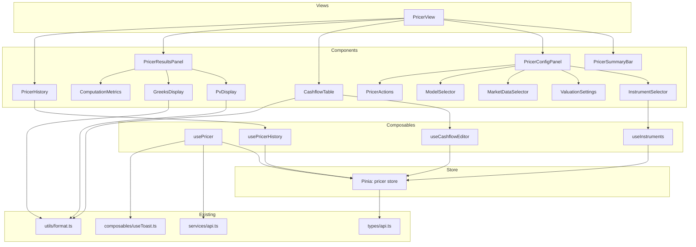
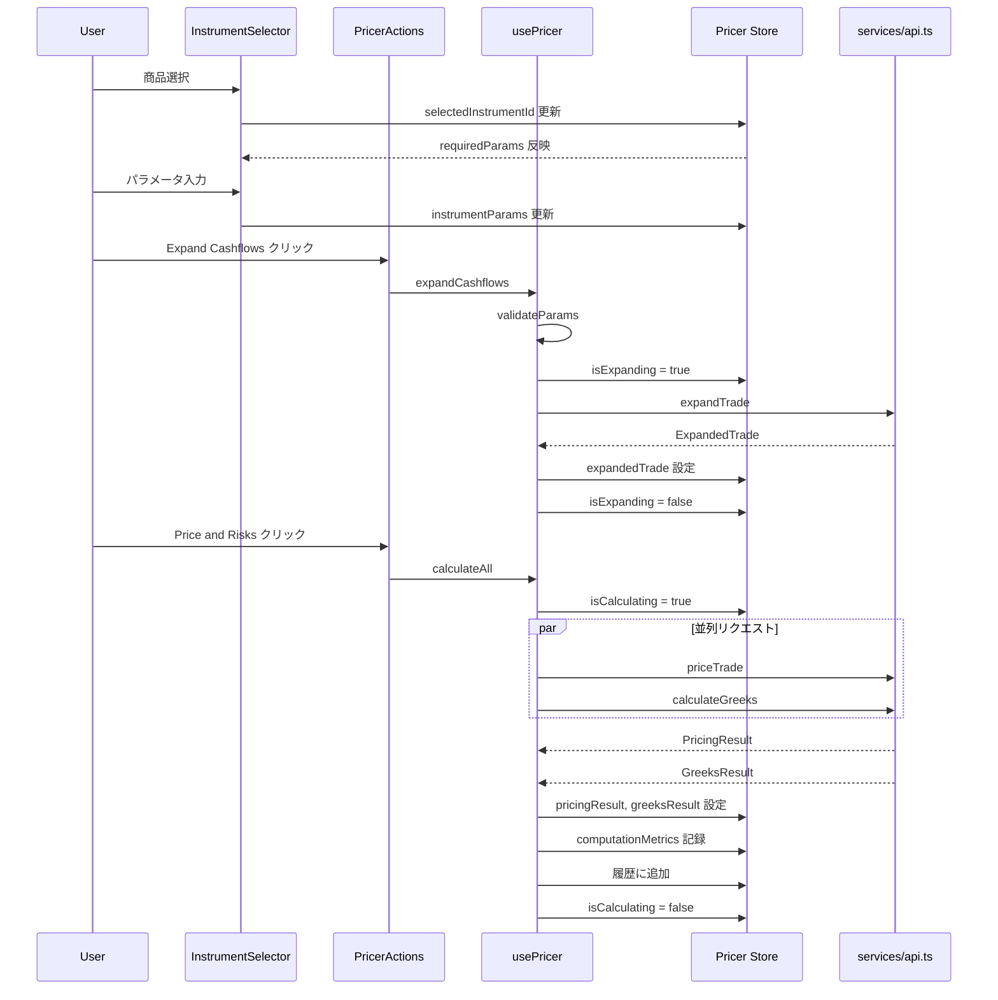

# Technical Design: pricer-view-rebuild

## Overview

**Purpose**: demo/gui の Pricer 画面を、モノリシックな単一コンポーネント（1050行）からモジュラーなコンポーネントツリー + Pinia ストア + Composables アーキテクチャに再構築する。

**Users**: トレーダー、クオンツ、リスクマネージャーが、デリバティブの価格計算・Greeks 表示・What-if 分析に使用する。

**Impact**: 既存の `PricerView.vue` を完全に置換する。バックエンド API およびルーティング設定への変更は不要。

### Goals
- モノリシック構造を 13 サブコンポーネントに分解し、各コンポーネントを 200 行以内に収める
- Pinia ストアによる状態管理の一元化と composable によるロジック分離
- 既存インフラ（`services/api.ts`, `types/api.ts`, `utils/format.ts`）の完全再利用
- 4 フェーズによる段階的実装（MVP → Greeks/メトリクス → 履歴/比較 → ポリッシュ）

## Architecture

### Existing Architecture Analysis

現行の `PricerView.vue` は以下の問題を抱えている:
- **型の再宣言**: `types/api.ts` に定義済みの 12 インターフェースをローカルに再宣言
- **API サービス未使用**: `services/api.ts` を無視し raw `fetch()` を直接使用
- **ユーティリティの重複**: `utils/format.ts` の関数をローカルに再定義
- **フラットな状態管理**: 40+ `ref()` が単一スコープに並列

既存のデザインシステム（`glass-card` スタイル、CSS 変数）とルーティング設定（`/pricer` → `PricerView`）は維持する。

### Architecture Pattern & Boundary Map



**Architecture Integration**:
- **Selected pattern**: Pinia Store + Composables ハイブリッド。ストアが状態を一元管理し、composable がドメインロジックをカプセル化
- **Domain boundaries**: View → Components（UI 表示）、Composables（ドメインロジック）、Store（状態）、Services（API 通信）
- **Existing patterns preserved**: `glass-card` デザインシステム、`<script setup lang="ts">` 記法、Toast 通知パターン、Pinia Composition API スタイル
- **Steering compliance**: S 層（Service Gateway）のフロントエンド部分。P/I/A 層への依存なし

## System Flows

### プライシングフロー



## Requirements Traceability

| Requirement | Summary | Components | Interfaces | Flows |
|-------------|---------|------------|------------|-------|
| 1.1 | 商品一覧取得・グループ化表示 | PricerView, InstrumentSelector | useInstruments, pricer store | プライシングフロー |
| 1.2 | 動的パラメータフォーム生成 | InstrumentSelector | useInstruments | - |
| 1.3 | IRS 自動選択・デフォルト設定 | PricerView | useInstruments, pricer store | プライシングフロー |
| 1.4 | バリデーションエラー表示 | InstrumentSelector | pricer store | - |
| 1.5 | 商品変更時の全状態リセット | PricerView | pricer store | - |
| 2.1 | CF 展開リクエスト・表示 | PricerActions, CashflowTable | usePricer | プライシングフロー |
| 2.2 | ローディングスケルトン | CashflowTable | pricer store | - |
| 2.3 | 空状態プレースホルダー | CashflowTable | pricer store | - |
| 2.4 | レグヘッダーバッジ | CashflowTable | - | - |
| 2.5 | CF 行の全カラム表示 | CashflowTable | - | - |
| 2.6 | メタデータフッター | CashflowTable | - | - |
| 3.1 | 想定元本インライン編集 | CashflowTable | useCashflowEditor | - |
| 3.2 | レートインライン編集 | CashflowTable | useCashflowEditor | - |
| 3.3 | 編集済みハイライト | CashflowTable | useCashflowEditor | - |
| 3.4 | Reset Edits | CashflowTable | useCashflowEditor | - |
| 3.5 | 編集済み値の pricing 反映 | usePricer | useCashflowEditor, pricer store | プライシングフロー |
| 4.1 | 評価日設定 | ValuationSettings | pricer store | - |
| 4.2 | レポーティング通貨選択 | ValuationSettings | pricer store | - |
| 4.3 | モデル設定トグル | ValuationSettings | pricer store | - |
| 4.4 | バンプサイズ設定 | ValuationSettings | pricer store | - |
| 5.1 | ディスカウントカーブ選択 | MarketDataSelector | pricer store | - |
| 5.2 | 確率モデル選択 | ModelSelector | pricer store | - |
| 5.3 | モデルパラメータ動的生成 | ModelSelector | pricer store, constants | - |
| 6.1 | 並列 pricing/greeks リクエスト | usePricer | pricer store, api.ts | プライシングフロー |
| 6.2 | Price ボタン無効化 | PricerActions | pricer store | - |
| 6.3 | 計算中スピナー | PricerActions | pricer store | - |
| 6.4 | PV 色分け表示 | PvDisplay | pricer store | - |
| 6.5 | レグ別 PV 内訳 | PvDisplay | pricer store | - |
| 6.6 | 通貨別 PV 集約 | PvDisplay | pricer store | - |
| 7.1 | Greeks 2x2 グリッド | GreeksDisplay | pricer store | - |
| 7.2 | Greeks 色分け | GreeksDisplay | - | - |
| 7.3 | Greeks 失敗時の警告 | usePricer | useToast | プライシングフロー |
| 8.1 | 計算メトリクス表示 | ComputationMetrics | pricer store | - |
| 9.1 | サマリーカード 4 枚 | PricerSummaryBar | pricer store | - |
| 9.2 | プレースホルダー表示 | PricerSummaryBar | pricer store | - |
| 10.1 | 履歴自動追加 | usePricer | usePricerHistory | プライシングフロー |
| 10.2 | 履歴リスト表示 | PricerHistory | usePricerHistory | - |
| 10.3 | 履歴からの復元 | PricerHistory | usePricerHistory, pricer store | - |
| 10.4 | PV 差分表示 | PvDisplay | pricer store | - |
| 10.5 | 比較モード | PricerHistory | usePricerHistory | - |
| 11.1 | API エラー Toast | usePricer | useToast | - |
| 11.2 | API 利用不可フォールバック | PricerView | pricer store | - |
| 11.3 | 成功 Toast | usePricer | useToast | - |
| 11.4 | バリデーション警告 Toast | usePricer | useToast | - |
| 12.1 | オーケストレータ 200 行以内 | PricerView | - | - |
| 12.2 | Pinia ストア一元管理 | pricer store | - | - |
| 12.3 | api.ts 再利用 | usePricer | api.ts | - |
| 12.4 | types/api.ts 再利用 | 全コンポーネント | types | - |
| 12.5 | format.ts 再利用 | PvDisplay, CashflowTable, GreeksDisplay | format.ts | - |
| 12.6 | 定数抽出 | constants/pricer.ts | - | - |
| 13.1 | 3 カラムグリッド | PricerView | - | - |
| 13.2 | glass-card デザイン | 全コンポーネント | - | - |
| 13.3 | API 不可フォールバック | PricerView | pricer store | - |

## Components and Interfaces

### コンポーネントサマリー

| Component | Domain | Intent | Req Coverage | Key Dependencies | Contracts |
|-----------|--------|--------|--------------|------------------|-----------|
| PricerView | View | オーケストレータ、レイアウト制御 | 1.1, 1.3, 1.5, 11.2, 12.1, 13.1-13.3 | pricer store (P0), 全子コンポーネント (P0) | State |
| PricerSummaryBar | UI | 主要指標サマリーカード | 9.1, 9.2 | pricer store (P0) | State |
| PricerConfigPanel | UI | 設定パネル wrapper | - | 子コンポーネント群 (P0) | - |
| InstrumentSelector | UI + Logic | 商品選択・パラメータ入力 | 1.1, 1.2, 1.4 | useInstruments (P0), pricer store (P0) | State |
| ValuationSettings | UI | 評価設定入力 | 4.1-4.4 | pricer store (P0) | State |
| MarketDataSelector | UI | カーブ選択 | 5.1 | pricer store (P0), constants (P1) | State |
| ModelSelector | UI + Logic | 確率モデル選択・パラメータ | 5.2, 5.3 | pricer store (P0), constants (P0) | State |
| PricerActions | UI | アクションボタン群 | 2.1, 6.1-6.3 | usePricer (P0), pricer store (P0) | State |
| PricerResultsPanel | UI | 結果表示 wrapper | - | 子コンポーネント群 (P0) | - |
| PvDisplay | UI | PV 表示・レグ内訳 | 6.4-6.6, 10.4 | pricer store (P0), format.ts (P1) | State |
| GreeksDisplay | UI | Greeks 2x2 グリッド | 7.1, 7.2 | pricer store (P0), format.ts (P1) | State |
| ComputationMetrics | UI | メトリクス表示 | 8.1 | pricer store (P0) | State |
| CashflowTable | UI + Logic | CF テーブル・編集 | 2.1-2.6, 3.1-3.4 | useCashflowEditor (P0), pricer store (P0), format.ts (P1) | State |
| PricerHistory | UI + Logic | 履歴・比較 | 10.1-10.5 | usePricerHistory (P0), pricer store (P0) | State |

### State Management Layer

#### Pinia Store: `stores/pricer.ts`

**Responsibilities & Constraints**
- 全 Pricer 関連の状態を保持する単一 store
- `defineStore('pricer', () => { ... })` の Composition API スタイル（`stores/config.ts` パターン準拠）
- ビジネスロジックは含めず、状態の読み書きに限定（ロジックは composable に委譲）

**Dependencies**
- Outbound: `types/api.ts` — 型定義 (P0)

**Contracts**: State [x]

##### State Management

State Shape:
- Instrument: instruments, selectedInstrumentId, instrumentParams
- Trade Expansion: expandedTrade
- Cashflow Edits: editedCashflows
- Pricing Results: pricingResult, greeksResult
- Valuation Settings: valuationDate, reportingCcy, useDefaults, numPaths, numSteps, seed
- Bump Sizes: rateBump, fxBump, volBump
- Market Data: selectedCurveIndex
- Stochastic Model: modelType, modelParams
- UI State: isExpanding, isCalculating, apiAvailable
- Validation: validationErrors
- Metrics: computationMetrics
- History: resultHistory, compareMode, compareIndices

Computed Getters:
- selectedInstrument, groupedInstruments, hasEdits, summaryStats, selectedModelConfig, recentHistory, pvDiff, comparedResults, changedParams, currencyAggregation

**Persistence**: なし（セッション中のみ有効）
**Concurrency**: 単一 UI スレッド、競合なし

### Composable Layer

#### `composables/useInstruments.ts`

**Intent**: 商品一覧のロード、グルーピング、選択、IRS 自動設定を管理
**Requirements**: 1.1, 1.2, 1.3, 1.5

**Responsibilities**: `onMounted` で `fetchInstruments()` 呼び出し、IRS 自動選択、商品変更時の依存状態リセット（watcher）

**Dependencies**:
- Outbound: pricer store (P0)
- External: `services/api.ts` fetchInstruments (P0)
- External: `composables/useToast.ts` (P1)

**Contracts**: Service [x]

#### `composables/usePricer.ts`

**Intent**: プライシングフロー全体のオーケストレーション（バリデーション → 展開 → 計算 → 履歴記録）
**Requirements**: 2.1, 3.5, 6.1, 7.3, 10.1, 11.1, 11.3, 11.4

**Responsibilities**: expandCashflows(), calculateAll(), resetAll(), validateParams()。エラー発生時は Toast 通知

**Dependencies**:
- Outbound: pricer store (P0), useCashflowEditor (P0), usePricerHistory (P1)
- External: `services/api.ts` (P0), `composables/useToast.ts` (P1)

**Contracts**: Service [x]

#### `composables/useCashflowEditor.ts`

**Intent**: キャッシュフローの編集状態管理とプライシングリクエスト構築
**Requirements**: 3.1, 3.2, 3.3, 3.4, 3.5

**Responsibilities**: updateCashflow(), resetEdits(), buildPricingLegs()

**Dependencies**: Outbound: pricer store (P0)

**Contracts**: Service [x]

#### `composables/usePricerHistory.ts`

**Intent**: 結果履歴の管理、復元、比較モード制御
**Requirements**: 10.1, 10.2, 10.3, 10.4, 10.5

**Responsibilities**: addToHistory()（最大 5 件）, restoreFromHistory(), toggleCompareMode()

**Dependencies**: Outbound: pricer store (P0), useToast (P2)

**Contracts**: Service [x]

### Constants Layer

#### `constants/pricer.ts`

**Intent**: Pricer 固有の定数と関連型を定義
**Requirements**: 12.6

**Responsibilities**: STOCHASTIC_MODELS, CURVE_OPTIONS 定義。Pricer 固有型: StochasticModelConfig, ModelParamDef, HistoryEntry, ValidationError, ComputationMetrics, SummaryStat, PvDiff, CompareResult, ParamChange, CurrencyAgg

### UI Component Layer

UI コンポーネントは Pinia ストアから直接状態を読み取り、composable 経由でアクションを呼び出す。

**PricerView**: オーケストレータ。`onMounted` で `useInstruments().loadInstruments()` 呼び出し。3 カラムグリッドレイアウト。API 利用不可時のフォールバック表示。200 行以内。

**PricerSummaryBar**: 評価日・商品名・PV・DV01 の 4 カードサマリー。`glass-card` スタイル。

**PricerConfigPanel / PricerResultsPanel**: 子コンポーネントのグルーピング wrapper。ロジックなし。

**InstrumentSelector**: アセットクラス別グループ化ドロップダウン + 動的パラメータフォーム。`useInstruments` 使用。バリデーションエラーは赤枠 + メッセージ。

**ValuationSettings**: 評価日、通貨、モデル設定トグル、バンプサイズ入力。ストアとの双方向バインド。

**MarketDataSelector**: ディスカウントカーブ選択。`CURVE_OPTIONS` からドロップダウン生成。

**ModelSelector**: 確率モデルタイプ選択 + 動的パラメータフォーム。`STOCHASTIC_MODELS` 使用。モデル変更時にデフォルト値リセット（watcher）。

**PricerActions**: Expand / Price & Risks / Reset ボタン。`usePricer` 使用。処理中はスピナー表示。

**PvDisplay**: トータル PV、レグ別内訳、通貨別集約、PV 差分表示。`formatCurrency` 使用。

**GreeksDisplay**: DV01, Gamma, Theta, Vega の 2x2 グリッド。正負の色分け。

**ComputationMetrics**: 処理時間、モデル、タイムスタンプの 1 行バー。

**CashflowTable**: レグ別 CF テーブル、インライン編集、ローディング/空状態。`useCashflowEditor` 使用。想定元本は K/M/B 変換。編集済みセルは `bg-warning/5` ハイライト。

**PricerHistory**: 結果履歴リスト、復元、比較モード。`usePricerHistory` 使用。最大 5 件のリスト。

## Data Models

### Domain Model

本機能はフロントエンド UI リビルドであり、新規ドメインエンティティの導入はない。既存の `types/api.ts` の型をそのまま使用する。

Pricer 固有の拡張型（`constants/pricer.ts` に定義）:
- StochasticModelConfig, ModelParamDef, HistoryEntry, ValidationError, ComputationMetrics

## Error Handling

### Error Strategy

本機能のエラーハンドリングは既存の Toast 通知パターン（`composables/useToast.ts`）に従う。

**User Errors**: パラメータバリデーション失敗 → フィールドレベルのエラー表示 + Toast 警告
**System Errors**: API リクエスト失敗 → Toast エラー通知 + 状態保持（部分的機能維持）
**Business Logic Errors**: Greeks 計算失敗 → Toast 警告 + PV 結果は有効として保持（graceful degradation）
**Infrastructure Errors**: 商品一覧取得失敗 → `apiAvailable = false` → フォールバック画面

## Testing Strategy

### 動作確認（E2E 手動テスト）
1. `/pricer` にアクセスし、商品一覧がロードされ IRS が自動選択されること
2. パラメータ入力 → Expand Cashflows → CF テーブル表示
3. Price & Risks → PV・Greeks 表示、サマリーバー更新
4. CF 編集 → 再計算 → 編集済み値が反映
5. 結果履歴のリスト表示・復元・比較モード

### ビルド検証
1. `npm run build` で本番ビルドが成功すること
2. `npx vue-tsc --noEmit` で TypeScript エラーがないこと
3. ブラウザ DevTools でコンソールエラーがないこと

## File Structure

```
demo/gui/static/src/
  components/pricer/          # 新規ディレクトリ
    InstrumentSelector.vue
    ValuationSettings.vue
    MarketDataSelector.vue
    ModelSelector.vue
    PricerActions.vue
    PvDisplay.vue
    GreeksDisplay.vue
    ComputationMetrics.vue
    CashflowTable.vue
    PricerHistory.vue
    PricerSummaryBar.vue
    PricerConfigPanel.vue
    PricerResultsPanel.vue
  composables/
    usePricer.ts              # 新規
    useInstruments.ts         # 新規
    useCashflowEditor.ts      # 新規
    usePricerHistory.ts       # 新規
  constants/
    pricer.ts                 # 新規
  stores/
    pricer.ts                 # 新規
  views/
    PricerView.vue            # 置換
```

## Implementation Phases

| Phase | Scope | Components | Composables | Requirements |
|-------|-------|------------|-------------|--------------|
| 1 (MVP) | 商品選択 → 展開 → 価格計算 → PV 表示 | PricerView, InstrumentSelector, ValuationSettings, PricerActions, PvDisplay, CashflowTable | usePricer, useInstruments, useCashflowEditor | 1-4, 6, 11, 12, 13 |
| 2 (Greeks + メトリクス) | Greeks、サマリー、カーブ/モデル選択 | GreeksDisplay, ComputationMetrics, PricerSummaryBar, MarketDataSelector, ModelSelector, PricerConfigPanel, PricerResultsPanel | - | 5, 7, 8, 9 |
| 3 (履歴 + 比較) | 結果履歴、比較モード | PricerHistory | usePricerHistory | 10 |
| 4 (ポリッシュ) | レスポンシブ、アクセシビリティ、エクスポート | 全コンポーネント改善 | - | - |
