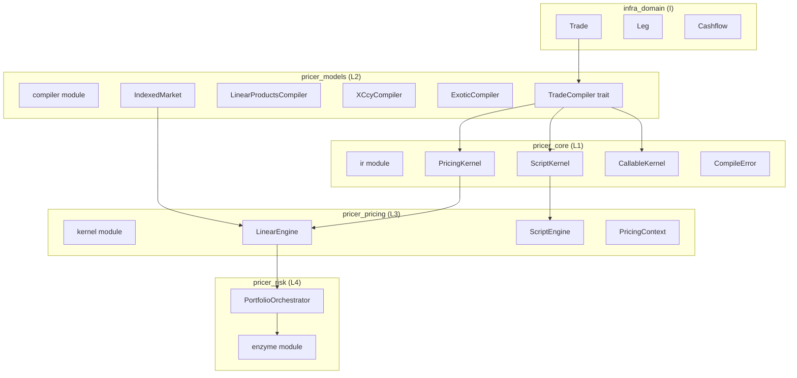
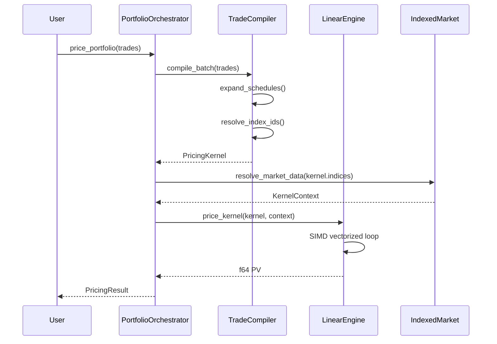
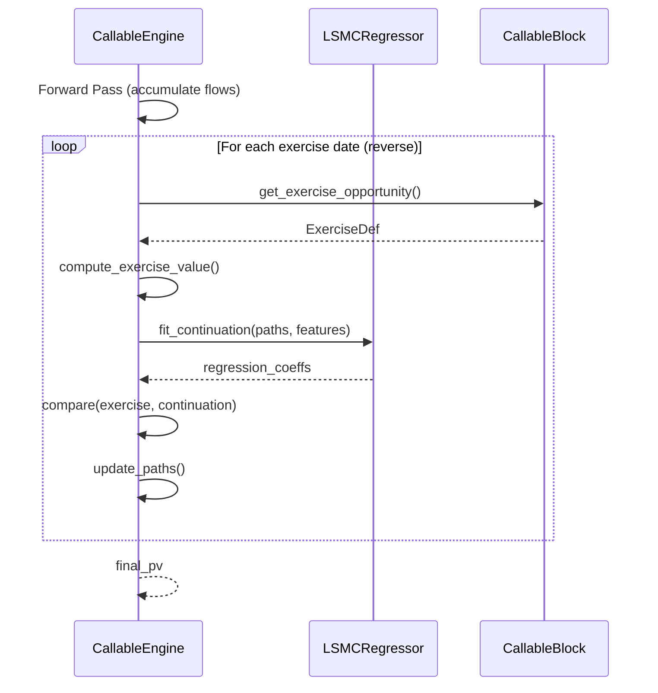

# Technical Design: pricing-kernel-ir

## Overview

**Purpose**: PricingKernel IR（中間表現）アーキテクチャは、階層的なTrade定義（`Trade → Leg → Cashflow`）をSoA（Structure of Arrays）形式の線形配列構造に変換するコンパイルフェーズを導入します。これにより、SIMD命令の活用、Enzyme自動微分との親和性向上、キャッシュ局所性の改善を実現します。

**Users**: クオンツ開発者およびシステムアーキテクトが、大規模ポートフォリオ評価で桁違いのスループット向上を得るために使用します。

**Impact**: 既存の3-stage rocketパターン（Definition → Linking → Execution）に新しいIR表現（Stage 2.5）を追加し、`price_single_trade`の代替として`price_kernel`関数を提供します。

### Goals

- 階層的Trade構造からSoA形式IRへのコンパイルパイプライン確立
- 条件分岐なしの統一プライシングループ実現
- Enzyme AD完全互換のデータレイアウト
- 10,000+トレードのバッチ評価で線形スケーリング

### Non-Goals

- 既存の`price_single_trade`関数の置き換え（共存）
- GUI/REST APIの変更
- Regulatory reporting機能（SA-CCR、FRTB）への影響

---

## Architecture

### Existing Architecture Analysis

**現在の3-Stage Rocket パターン**:
1. **Stage 1 (Definition)**: `ModelEnum`, `InstrumentEnum` in `pricer_models`
2. **Stage 2 (Linking)**: `PricingContext` binds Arc references
3. **Stage 3 (Execution)**: `price_single_trade` pure computation

**現在の制約**:
- 個別トレード評価は`match instrument`による動的ディスパッチ
- バッチ評価は`Vec<Trade>`のイテレーション（AoS形式）
- Enzyme ADはenum matchに対応するが、SoAの方が効率的

**統合ポイント**:
- `IndexedMarket<T>` パターン（`pricer_models::market`）
- `TradeSoA` 既存実装（`pricer_risk::soa`）
- `Trade/Leg/Cashflow` 定義（`infra_domain::trade`）

### Architecture Pattern & Boundary Map



**Architecture Integration**:
- **Selected pattern**: Layered Architecture with IR Compilation Phase
- **Domain boundaries**: IR定義(L1) / コンパイル(L2) / 実行(L3) / オーケストレーション(L4)
- **Existing patterns preserved**: A-I-P-S一方向フロー、3-stage rocket、IndexedMarket
- **New components rationale**: IR構造体はL1に配置し全レイヤーから参照可能に
- **Steering compliance**: 静的ディスパッチ、Enzyme互換、British English命名

### Technology Stack

| Layer | Choice / Version | Role in Feature | Notes |
|-------|------------------|-----------------|-------|
| Data Structure | `pricer_core/src/ir/` | IR型定義 | `PricingKernel`, `ScriptKernel`, `CallableKernel` |
| Compiler | `pricer_models/src/compiler/` | Trade→IR変換 | `TradeCompiler` trait実装 |
| Engine | `pricer_pricing/src/kernel/` | IR評価 | `price_kernel`, `execute_script` |
| SIMD | `#[repr(align(64))]` | 64バイトアラインメント | AVX-512最適化 |
| AD | Enzyme LLVM | 自動微分 | 既存`pricer_risk::enzyme`活用 |
| Parallelism | Rayon | バッチ並列化 | 既存パターン踏襲 |

---

## System Flows

### Trade Compilation Flow



**Key Decisions**:
- コンパイルはバッチ単位で実行（個別Trade毎ではない）
- インデックス解決はLinking段階で完了（Execution段階ではルックアップなし）
- SIMDベクトル化はLLVMに委任（明示的intrinsic不使用）

### Callable Product Backward Pass



---

## Requirements Traceability

| Requirement | Summary | Components | Interfaces | Flows |
|-------------|---------|------------|------------|-------|
| 1.1-1.10 | PricingKernel SoA構造体 | PricingKernel | - | - |
| 2.1-2.8 | TradeCompilerトレイト | TradeCompiler, LinearProductsCompiler | `compile()`, `compile_batch()` | Compilation |
| 3.1-3.6 | 線形商品コンパイル | LinearProductsCompiler | `compile_irs()`, `compile_bond()` | Compilation |
| 4.1-4.5 | X-Ccy/FX対応 | XCcyCompiler, PricingKernel | `fx_index_ids` | Compilation |
| 5.1-5.4 | CMS凸性調整 | IndexedMarket, KernelContext | `get_rate()` | Execution |
| 6.1-6.6 | ScriptKernel | ScriptKernel, ScriptEngine | `execute_script()` | Script Execution |
| 7.1-7.6 | CallableKernel | CallableKernel, CallableEngine, LSMCRegressor | `execute_callable()` | Backward Pass |
| 8.1-8.6 | プライシングエンジン | LinearEngine | `price_kernel()` | Execution |
| 9.1-9.5 | Date/Time分離 | PricingKernel | `payment_dates`, `year_fractions` | - |
| 10.1-10.7 | A-I-P-S適合 | 全コンポーネント | - | - |
| 11.1-11.6 | パフォーマンス最適化 | AlignedBuffer, LinearEngine | - | Execution |
| 12.1-12.6 | Enzyme AD互換 | PricingKernel, LinearEngine | - | - |

---

## Components and Interfaces

| Component | Domain/Layer | Intent | Req Coverage | Key Dependencies | Contracts |
|-----------|--------------|--------|--------------|------------------|-----------|
| PricingKernel | pricer_core (L1) | SoA形式キャッシュフロー表現 | 1, 4, 9 | - | State |
| ScriptKernel | pricer_core (L1) | イベント駆動IR表現 | 6 | - | State |
| CallableKernel | pricer_core (L1) | ブロック構造IR表現 | 7 | PricingKernel | State |
| CompileError | pricer_core (L1) | コンパイルエラー型 | 2, 6 | - | - |
| TradeCompiler | pricer_models (L2) | Trade→IR変換トレイト | 2, 3 | Trade, PricingKernel | Service |
| LinearProductsCompiler | pricer_models (L2) | IRS/Bond/FRAコンパイラ | 3 | TradeCompiler | Service |
| XCcyCompiler | pricer_models (L2) | X-Ccyコンパイラ | 4 | TradeCompiler | Service |
| ExoticCompiler | pricer_models (L2) | エキゾチックコンパイラ | 6, 7 | TradeCompiler, ScriptKernel, CallableKernel | Service |
| LinearEngine | pricer_pricing (L3) | PricingKernel評価 | 8, 11, 12 | PricingKernel, KernelContext | Service |
| ScriptEngine | pricer_pricing (L3) | ScriptKernel実行 | 6 | ScriptKernel | Service |
| CallableEngine | pricer_pricing (L3) | CallableKernel評価 | 7 | CallableKernel, LSMCRegressor | Service |
| KernelContext | pricer_pricing (L3) | 市場データ参照バインディング | 5, 8 | IndexedMarket | State |

---

### pricer_core (L1) - IR Module

#### PricingKernel

| Field | Detail |
|-------|--------|
| Intent | SoA形式のキャッシュフロー中間表現を保持 |
| Requirements | 1.1-1.10, 4.1, 9.1-9.5 |

**Responsibilities & Constraints**
- 線形商品のキャッシュフローをSoA形式で格納
- 全配列は同一長（キャッシュフロー数）
- SIMD最適化のため64バイトアラインメント
- Enzyme AD互換型のみ使用（primitives, arrays）

**Dependencies**
- Inbound: TradeCompiler (P0) — コンパイル出力として生成
- Outbound: LinearEngine (P0) — 評価対象として使用

**Contracts**: State [x]

##### State Management

```rust
/// SoA形式のキャッシュフロー中間表現
#[derive(Clone, Debug)]
pub struct PricingKernel {
    // --- 日付管理 (i32: Days from Unix Epoch) ---
    /// 支払日（昇順ソート済み）
    pub payment_dates: AlignedBuffer<i32>,
    /// 観測日（fixing date for floating coupons）
    pub fixing_dates: AlignedBuffer<i32>,

    // --- 静的計算係数 (f64) ---
    /// 期間係数（DayCountConventionから事前計算）
    pub year_fractions: AlignedBuffer<f64>,
    /// 想定元本
    pub notionals: AlignedBuffer<f64>,
    /// 固定スプレッド（固定クーポンまたはfloating spread）
    pub spreads: AlignedBuffer<f64>,
    /// ギアリング係数（floating leg用）
    pub gearings: AlignedBuffer<f64>,

    // --- インデックスポインタ (ID references) ---
    /// 通貨ID (0=base currency)
    pub currency_ids: Vec<u8>,
    /// 割引カーブID
    pub discount_curve_ids: Vec<u8>,
    /// フォワードインデックスID（0=fixed, >0=floating index）
    pub fwd_index_ids: Vec<u16>,
    /// FXインデックスID（0=no FX conversion）
    pub fx_index_ids: Vec<u16>,

    // --- メタデータ ---
    /// キャッシュフロー数
    pub len: usize,
    /// 元のトレード数（バッチコンパイル時）
    pub trade_count: usize,
}

/// 64バイトアラインメント付きバッファ
///
/// `std::alloc::Layout`を使用してヒープメモリのアラインメントを保証。
/// `#[repr(align)]`はスタック上の構造体にのみ有効なため、
/// カスタムアロケーションで`Vec`内部データのアラインメントを確保。
///
/// # Safety
/// - AVX-512の`vmovaps`（aligned packed single）等が安全に使用可能
/// - Enzyme ADとの互換性を維持
pub struct AlignedBuffer<T> {
    ptr: std::ptr::NonNull<T>,
    len: usize,
    cap: usize,
}

impl<T: Clone + Default> AlignedBuffer<T> {
    /// 64バイトアラインメントでメモリを確保
    pub fn with_capacity(capacity: usize) -> Self {
        use std::alloc::{Layout, alloc_zeroed};
        let layout = Layout::from_size_align(
            capacity * std::mem::size_of::<T>(),
            64, // AVX-512アラインメント
        ).expect("Invalid layout");
        // SAFETY: layout is valid, zeroed memory is safe for primitive types
        let ptr = unsafe { alloc_zeroed(layout) as *mut T };
        Self {
            ptr: std::ptr::NonNull::new(ptr).expect("Allocation failed"),
            len: 0,
            cap: capacity,
        }
    }

    pub fn from_vec(mut vec: Vec<T>) -> Self {
        let mut buf = Self::with_capacity(vec.len());
        // SAFETY: copying into aligned buffer
        unsafe {
            std::ptr::copy_nonoverlapping(vec.as_ptr(), buf.ptr.as_ptr(), vec.len());
        }
        buf.len = vec.len();
        buf
    }

    pub fn len(&self) -> usize { self.len }
    pub fn is_empty(&self) -> bool { self.len == 0 }
}

impl<T> std::ops::Deref for AlignedBuffer<T> {
    type Target = [T];
    fn deref(&self) -> &[T] {
        // SAFETY: ptr is valid for len elements
        unsafe { std::slice::from_raw_parts(self.ptr.as_ptr(), self.len) }
    }
}

impl<T> Drop for AlignedBuffer<T> {
    fn drop(&mut self) {
        use std::alloc::{Layout, dealloc};
        if self.cap > 0 {
            let layout = Layout::from_size_align(
                self.cap * std::mem::size_of::<T>(),
                64,
            ).expect("Invalid layout");
            // SAFETY: ptr was allocated with this layout
            unsafe { dealloc(self.ptr.as_ptr() as *mut u8, layout); }
        }
    }
}

// Clone, Debug実装
impl<T: Clone + Default> Clone for AlignedBuffer<T> {
    fn clone(&self) -> Self {
        let mut buf = Self::with_capacity(self.cap);
        // SAFETY: cloning into new aligned buffer
        unsafe {
            std::ptr::copy_nonoverlapping(self.ptr.as_ptr(), buf.ptr.as_ptr(), self.len);
        }
        buf.len = self.len;
        buf
    }
}

impl<T: std::fmt::Debug> std::fmt::Debug for AlignedBuffer<T> {
    fn fmt(&self, f: &mut std::fmt::Formatter<'_>) -> std::fmt::Result {
        f.debug_list().entries(self.iter()).finish()
    }
}
```

- **Persistence**: In-memory only（永続化不要）
- **Consistency**: イミュータブル（コンパイル後は変更不可）
- **Concurrency**: Read-only sharing via `&PricingKernel`

**Implementation Notes**
- `AlignedBuffer<T>`は内部でアラインメントを保証
- `serde`サポートはオプション（feature flag）
- `len`フィールドで配列長検証を簡略化

---

#### ScriptKernel

| Field | Detail |
|-------|--------|
| Intent | 経路依存型商品のイベント駆動IR表現 |
| Requirements | 6.1-6.6 |

**Responsibilities & Constraints**
- 観測日とオペレーションコードの配列として表現
- 状態遷移を線形イベント列として表現
- 実行時型ディスパッチなし

**Dependencies**
- Inbound: ExoticCompiler (P0) — コンパイル出力として生成
- Outbound: ScriptEngine (P0) — 実行対象として使用

**Contracts**: State [x]

##### State Management

```rust
/// 経路依存型商品のイベント駆動IR
#[derive(Clone, Debug)]
pub struct ScriptKernel {
    /// 観測時点（年単位、評価日からの相対時間）
    pub observation_times: Vec<f64>,
    /// オペレーションコード列
    pub ops: Vec<ScriptOp>,
    /// 定数オペランド（バリア値、ストライク等）
    pub constants: Vec<f64>,
}

/// スクリプトオペレーション
#[derive(Clone, Copy, Debug)]
pub enum ScriptOp {
    /// 固定額キャッシュフロー
    CalcFixed { amount_idx: u16 },
    /// 変動キャッシュフロー
    CalcFloat { index_id: u16, gearing_idx: u16, spread_idx: u16 },
    /// バリアチェック
    CheckBarrier { barrier_idx: u16, barrier_type: BarrierType },
    /// 累積（アジアン用）
    Accumulate,
    /// 支払
    Pay { ccy_id: u8, dc_id: u8 },
    /// 条件分岐終了
    EndIf,
}

#[derive(Clone, Copy, Debug)]
pub enum BarrierType {
    UpIn, UpOut, DownIn, DownOut,
}
```

---

#### CallableKernel

| Field | Detail |
|-------|--------|
| Intent | Callable/Bermudan商品のブロック構造IR表現 |
| Requirements | 7.1-7.6 |

**Responsibilities & Constraints**
- 行使日で区切られたブロック配列として表現
- 各ブロックはPricingKernel（コアフロー）を含む
- Forward/Backward両パスに対応

**Dependencies**
- Inbound: ExoticCompiler (P0) — コンパイル出力として生成
- Outbound: CallableEngine (P0) — 実行対象として使用
- Internal: PricingKernel (P0) — ブロック内フロー表現

**Contracts**: State [x]

##### State Management

```rust
/// Callable/Bermudan商品のブロック構造IR
#[derive(Clone, Debug)]
pub struct CallableKernel {
    /// 行使日で区切られたブロック列
    pub blocks: Vec<CallableBlock>,
    /// 基準通貨ID
    pub base_currency_id: u8,
}

/// 行使ブロック
#[derive(Clone, Debug)]
pub struct CallableBlock {
    /// ブロック開始日（days from epoch）
    pub start_date: i32,
    /// ブロック終了日（次の行使日または満期）
    pub end_date: i32,
    /// このブロック内のキャッシュフロー
    pub core_flows: PricingKernel,
    /// 行使機会（ブロック末尾、Noneならコール不可期間）
    pub exercise: Option<ExerciseDef>,
}

/// 行使定義
#[derive(Clone, Debug)]
pub struct ExerciseDef {
    /// 行使日（days from epoch）
    pub exercise_date: i32,
    /// 行使コスト（fee）
    pub exercise_cost: f64,
    /// 行使スタイル
    pub style: ExerciseStyle,
}

#[derive(Clone, Copy, Debug)]
pub enum ExerciseStyle {
    Bermudan,
    American,
}
```

---

#### CompileError

| Field | Detail |
|-------|--------|
| Intent | コンパイルエラーの構造化表現 |
| Requirements | 2.6, 2.7, 6.6 |

**Contracts**: -

```rust
/// コンパイルエラー型
#[derive(Debug, Clone, thiserror::Error)]
pub enum CompileError {
    #[error("Unsupported instrument type: {0}")]
    UnsupportedInstrument(String),

    #[error("Unknown rate index: {0}")]
    UnknownIndex(String),

    #[error("Unsupported exotic payoff: {0}")]
    UnsupportedPayoff(String),

    #[error("Invalid schedule: {0}")]
    InvalidSchedule(String),

    #[error("Missing calendar for {0}")]
    MissingCalendar(String),

    #[error("Date conversion error: {0}")]
    DateError(String),
}
```

---

### pricer_models (L2) - Compiler Module

#### TradeCompiler

| Field | Detail |
|-------|--------|
| Intent | Trade階層構造からIRへの変換トレイト定義 |
| Requirements | 2.1-2.8 |

**Responsibilities & Constraints**
- Trade → PricingKernel/ScriptKernel/CallableKernel 変換
- スケジュール展開、休日調整、YearFraction計算
- バッチコンパイルサポート

**Dependencies**
- Inbound: PortfolioOrchestrator (P0) — コンパイル呼び出し
- Outbound: infra_domain::Trade (P0) — 入力データ
- Outbound: PricingKernel, ScriptKernel, CallableKernel (P0) — 出力データ

**Contracts**: Service [x]

##### Service Interface

```rust
/// Trade→IR コンパイラトレイト
pub trait TradeCompiler {
    /// 単一Tradeをコンパイル
    fn compile(&self, trade: &Trade) -> Result<CompiledIR, CompileError>;

    /// 複数Tradeをバッチコンパイル（単一PricingKernel出力）
    fn compile_batch(&self, trades: &[Trade]) -> Result<PricingKernel, CompileError>;
}

/// コンパイル結果の列挙型
pub enum CompiledIR {
    Linear(PricingKernel),
    Script(ScriptKernel),
    Callable(CallableKernel),
}
```

- **Preconditions**: `trade`は有効な`Trade`構造体（legs非空）
- **Postconditions**: 返却される`PricingKernel`の全配列は同一長
- **Invariants**: コンパイル結果はイミュータブル

---

#### LinearProductsCompiler

| Field | Detail |
|-------|--------|
| Intent | IRS/Bond/FRA等の線形商品コンパイラ実装 |
| Requirements | 3.1-3.6 |

**Responsibilities & Constraints**
- 固定レグ/変動レグの展開
- 支払日の昇順ソート
- アモチ対応（Notional変動）

**Dependencies**
- Implements: TradeCompiler (P0)
- Outbound: infra_domain::Calendar (P1) — 休日調整

**Contracts**: Service [x]

##### Service Interface

```rust
/// 線形商品コンパイラ
pub struct LinearProductsCompiler {
    /// インデックスID解決用マッパー
    index_mapper: IndexMapper,
    /// カレンダーキャッシュ
    calendars: Arc<CalendarCache>,
}

impl LinearProductsCompiler {
    pub fn new(index_mapper: IndexMapper, calendars: Arc<CalendarCache>) -> Self;

    /// IRS専用コンパイル
    pub fn compile_irs(&self, trade: &Trade) -> Result<PricingKernel, CompileError>;

    /// Bond専用コンパイル
    pub fn compile_bond(&self, trade: &Trade) -> Result<PricingKernel, CompileError>;

    /// FRA専用コンパイル
    pub fn compile_fra(&self, trade: &Trade) -> Result<PricingKernel, CompileError>;
}

impl TradeCompiler for LinearProductsCompiler {
    fn compile(&self, trade: &Trade) -> Result<CompiledIR, CompileError> {
        match trade.trade_type {
            TradeType::Irs => Ok(CompiledIR::Linear(self.compile_irs(trade)?)),
            TradeType::Bond => Ok(CompiledIR::Linear(self.compile_bond(trade)?)),
            TradeType::Fra => Ok(CompiledIR::Linear(self.compile_fra(trade)?)),
            _ => Err(CompileError::UnsupportedInstrument(format!("{:?}", trade.trade_type))),
        }
    }

    fn compile_batch(&self, trades: &[Trade]) -> Result<PricingKernel, CompileError>;
}
```

**Implementation Notes**
- `IndexMapper`は`RateIndex`→`u16`インデックスIDマッピング
- `CalendarCache`は休日カレンダーのArcキャッシュ
- バッチコンパイルは全トレードのキャッシュフローを単一配列に連結

---

### pricer_pricing (L3) - Kernel Module

#### LinearEngine

| Field | Detail |
|-------|--------|
| Intent | PricingKernelの評価エンジン |
| Requirements | 8.1-8.6, 11.1-11.6, 12.1-12.6 |

**Responsibilities & Constraints**
- 条件分岐なしのベクトル化ループ
- SIMD最適化（LLVM auto-vectorisation）
- Enzyme AD互換

**Dependencies**
- Inbound: PortfolioOrchestrator (P0) — 評価呼び出し
- Outbound: PricingKernel (P0) — 評価対象
- Outbound: KernelContext (P0) — 市場データ参照

**Contracts**: Service [x]

##### Service Interface

```rust
/// PricingKernel評価関数（ブランチレス統一式）
///
/// # Unified Formula (Branchless)
/// ```text
/// Payoff = (L_idx × α + β) × N × τ × FX_idx
/// ```
/// - **Floating**: L_idx = MarketRate, α = Gearing, β = Spread
/// - **Fixed**: L_idx = Dummy(0.0), α = 0.0, β = FixedRate
/// - **FX**: fwd_index_ids[0]は常に0.0を返すダミーインデックス
/// - **FX**: fx_index_ids[0]は常に1.0を返すダミーインデックス
///
/// # Type Parameters
/// - `T`: Float型（f64またはDual<f64>）
/// - `C`: CurveProviderトレイト実装型
///
/// # Arguments
/// - `kernel`: コンパイル済みPricingKernel
/// - `ctx`: 市場データ参照を含むKernelContext
/// - `valuation_date`: 評価基準日（days from epoch）
///
/// # Returns
/// 現在価値（PV）
///
/// # SIMD/Enzyme Compatibility
/// - ループ内に`if`/`match`分岐なし → LLVM auto-vectorisation有効
/// - 全フィールドが連続メモリアクセス → キャッシュ効率最大化
/// - ダミーインデックス方式で固定/変動を統一処理
pub fn price_kernel<T, C>(
    kernel: &PricingKernel,
    ctx: &KernelContext<'_, C>,
    valuation_date: i32,
) -> T
where
    T: Float,
    C: CurveProvider<T>,
{
    let mut pv = T::zero();

    for i in 0..kernel.len {
        // 1. 時間計算（評価日からの年単位時間）
        let t = days_to_years(kernel.payment_dates[i] - valuation_date);

        // 2. 割引係数取得
        let df = ctx.get_discount_factor(kernel.discount_curve_ids[i], t);

        // 3. フォワードレート取得（fwd_index_ids[0]は常に0.0を返す）
        let L_idx = ctx.get_forward_rate(kernel.fwd_index_ids[i], kernel.fixing_dates[i]);

        // 4. ブランチレス統一式: (L × α + β) × N × τ
        let alpha = T::from_f64(kernel.gearings[i]);   // Floating: gearing, Fixed: 0.0
        let beta = T::from_f64(kernel.spreads[i]);     // Floating: spread, Fixed: fixedRate
        let notional = T::from_f64(kernel.notionals[i]);
        let tau = T::from_f64(kernel.year_fractions[i]);
        let flow = (L_idx * alpha + beta) * notional * tau;

        // 5. FXレート取得（fx_index_ids[0]は常に1.0を返す）
        let fx = ctx.get_fx_rate(kernel.fx_index_ids[i], t);

        // 6. PV累積: flow × DF × FX
        pv = pv + flow * df * fx;
    }

    pv
}
```

- **Preconditions**: `kernel.len > 0`, `ctx`は全インデックスIDを解決可能
- **Postconditions**: 戻り値は全キャッシュフローのPV合計
- **Invariants**: ループ内で動的メモリ割り当てなし、条件分岐なし

**Implementation Notes**
- **ダミーインデックス規約**:
  - `fwd_index_ids[0]`: 常に`T::zero()`を返す（固定フロー用）
  - `fx_index_ids[0]`: 常に`T::one()`を返す（FX変換なし）
- **Fixed Leg表現**: `gearings[i] = 0.0`, `spreads[i] = fixed_rate`
- **Floating Leg表現**: `gearings[i] = 1.0`（または指定gearing）, `spreads[i] = spread`
- ループ構造はLLVM auto-vectorisation対応（分岐排除）
- Enzyme ADはLLVM IRレベルで解析するため、静的確定の関数呼び出しが必須
- バッチ評価時は`rayon::par_iter`でトレード単位並列化

---

#### KernelContext

| Field | Detail |
|-------|--------|
| Intent | 市場データ参照のバインディング（Stage 2拡張） |
| Requirements | 5.1-5.4, 8.3 |

**Responsibilities & Constraints**
- インデックスID→市場データ参照の解決
- PricingContext相当の軽量参照型
- CMS凸性調整の透過的提供

**Dependencies**
- Inbound: PortfolioOrchestrator (P0) — コンテキスト構築
- Outbound: IndexedMarket (P0) — 市場データソース

**Contracts**: State [x]

##### State Management

```rust
/// カーブプロバイダートレイト（静的ディスパッチ用）
///
/// Enzyme ADはLLVM IRレベルで解析を行うため、関数呼び出し先が
/// 静的に確定していることが自動微分の生成成功率と速度に直結する。
/// `dyn`トレイトオブジェクトはvtable間接参照を伴うため、
/// ジェネリック型パラメータによる静的ディスパッチを採用。
pub trait CurveProvider<T: Float> {
    /// 割引係数取得
    fn discount_factor(&self, curve_id: u8, t: T) -> T;

    /// フォワードレート取得（index_id=0は常に0.0を返す）
    fn forward_rate(&self, index_id: u16, fixing_date: i32) -> T;

    /// FXレート取得（fx_id=0は常に1.0を返す）
    fn fx_rate(&self, fx_id: u16, t: T) -> T;
}

/// Kernel評価用市場データコンテキスト（静的ディスパッチ版）
///
/// # Type Parameters
/// - `C`: CurveProviderトレイト実装型（静的ディスパッチ）
///
/// # Design Rationale
/// - `dyn Trait`（トレイトオブジェクト）→ `C: CurveProvider<T>`（ジェネリック）
/// - vtable間接参照を排除し、Enzyme ADとの完全互換性を確保
/// - コンパイル時に関数呼び出し先が確定するため、インライン展開可能
#[derive(Clone, Copy)]
pub struct KernelContext<'a, C> {
    /// 市場データプロバイダー（静的ディスパッチ）
    pub provider: &'a C,
}

impl<'a, C> KernelContext<'a, C> {
    pub fn new(provider: &'a C) -> Self {
        Self { provider }
    }
}

impl<'a, T, C> KernelContext<'a, C>
where
    T: Float,
    C: CurveProvider<T>,
{
    /// 割引係数取得
    #[inline(always)]
    pub fn get_discount_factor(&self, curve_id: u8, t: T) -> T {
        self.provider.discount_factor(curve_id, t)
    }

    /// フォワードレート取得（index_id=0は常にT::zero()）
    #[inline(always)]
    pub fn get_forward_rate(&self, index_id: u16, fixing_date: i32) -> T {
        self.provider.forward_rate(index_id, fixing_date)
    }

    /// FXレート取得（fx_id=0は常にT::one()）
    #[inline(always)]
    pub fn get_fx_rate(&self, fx_id: u16, t: T) -> T {
        self.provider.fx_rate(fx_id, t)
    }
}

/// 標準的なCurveProvider実装例
///
/// IndexedMarket<T>からKernelContext用のプロバイダーを構築
pub struct MarketProvider<'a, T: Float> {
    /// 割引カーブ配列（ID順）
    pub discount_curves: &'a [DiscountCurveImpl<T>],
    /// フォワードカーブ配列（ID順、index 0はダミー）
    pub forward_curves: &'a [ForwardCurveImpl<T>],
    /// FXレート配列（ID順、index 0はダミー）
    pub fx_rates: &'a [FxRateImpl<T>],
}

impl<T: Float> CurveProvider<T> for MarketProvider<'_, T> {
    #[inline(always)]
    fn discount_factor(&self, curve_id: u8, t: T) -> T {
        self.discount_curves[curve_id as usize].df(t)
    }

    #[inline(always)]
    fn forward_rate(&self, index_id: u16, fixing_date: i32) -> T {
        // index_id=0はダミー（常に0.0を返す）
        self.forward_curves[index_id as usize].forward_rate(fixing_date)
    }

    #[inline(always)]
    fn fx_rate(&self, fx_id: u16, t: T) -> T {
        // fx_id=0はダミー（常に1.0を返す）
        self.fx_rates[fx_id as usize].spot_rate(t)
    }
}
```

- **Persistence**: In-memory, 評価期間中のみ有効
- **Consistency**: 参照型のため元データの一貫性に依存
- **Concurrency**: Read-only, 複数スレッドから安全にアクセス可能
- **Enzyme Compatibility**: 静的ディスパッチによりLLVM IR解析が成功

---

## Data Models

### Domain Model

**Aggregates**:
- `PricingKernel`: 線形商品の評価単位（トランザクション境界）
- `ScriptKernel`: 経路依存型商品の評価単位
- `CallableKernel`: コール可能商品の評価単位

**Entities**:
- `CallableBlock`: 行使日で区切られたブロック（CallableKernel内の構成要素）
- `ExerciseDef`: 行使機会の定義

**Value Objects**:
- `AlignedBuffer<T>`: アラインメント保証付き配列
- `ScriptOp`: スクリプトオペレーション
- `BarrierType`: バリアタイプ列挙
- `ExerciseStyle`: 行使スタイル列挙

**Business Rules**:
- 全SoA配列は同一長
- 支払日は昇順ソート
- インデックスID 0は「該当なし」を表す

### Logical Data Model

**PricingKernel構造**:

| Field | Type | Description | Nullable |
|-------|------|-------------|----------|
| payment_dates | `AlignedBuffer<i32>` | 支払日（epoch日数） | No |
| fixing_dates | `AlignedBuffer<i32>` | 観測日（epoch日数） | No |
| year_fractions | `AlignedBuffer<f64>` | 期間係数 | No |
| notionals | `AlignedBuffer<f64>` | 想定元本 | No |
| spreads | `AlignedBuffer<f64>` | スプレッド | No |
| gearings | `AlignedBuffer<f64>` | ギアリング | No |
| currency_ids | `Vec<u8>` | 通貨ID | No |
| discount_curve_ids | `Vec<u8>` | 割引カーブID | No |
| fwd_index_ids | `Vec<u16>` | フォワードインデックスID | No |
| fx_index_ids | `Vec<u16>` | FXインデックスID | No |

**インデックス設計**:
- `fwd_index_ids[i] == 0`: 固定フロー（フォワード参照なし）
- `fx_index_ids[i] == 0`: FX変換なし（基準通貨）

---

## Error Handling

### Error Strategy

**コンパイルエラー**:
- `CompileError`列挙型で構造化
- 早期検出（fail fast）
- 詳細なコンテキスト情報

**実行時エラー**:
- インデックス範囲外は`panic`（開発時検出）
- 本番環境ではコンパイル時検証で防止

### Error Categories and Responses

| Category | Error Type | Response |
|----------|-----------|----------|
| User Error | `UnsupportedInstrument` | 商品タイプ名を含むエラーメッセージ |
| User Error | `UnknownIndex` | インデックス名を含むエラーメッセージ |
| User Error | `UnsupportedPayoff` | ペイオフタイプ名を含むエラーメッセージ |
| System Error | `InvalidSchedule` | スケジュール詳細を含むエラーメッセージ |
| System Error | `MissingCalendar` | カレンダーID/名を含むエラーメッセージ |

### Monitoring

- コンパイル時間のメトリクス収集（large portfolio対応）
- 評価時間のメトリクス収集
- キャッシュフロー数のカウント

---

## Testing Strategy

### Unit Tests

- `PricingKernel::new()` - 配列長検証
- `AlignedBuffer<T>` - アラインメント検証
- `LinearProductsCompiler::compile_irs()` - IRS展開ロジック
- `price_kernel()` - 単純なPV計算
- `ScriptOp` - オペレーションコード実行

### Integration Tests

- Trade → PricingKernel → PV フルパイプライン
- IndexedMarket → KernelContext → price_kernel 統合
- 既存`price_single_trade`との結果一致検証
- バッチコンパイル（1000+ trades）

### Performance Tests

- 10,000 trades バッチ評価スループット
- SIMDベクトル化検証（perf stat）
- メモリ使用量プロファイリング
- Enzyme AD vs num-dual 速度比較

---

## Performance & Scalability

### Target Metrics

| Metric | Target | Measurement |
|--------|--------|-------------|
| バッチコンパイル | < 100ms for 10,000 trades | criterion benchmark |
| price_kernel | < 1μs per cashflow | criterion benchmark |
| メモリ効率 | < 100 bytes per cashflow | heaptrack |
| CPU利用率 | > 80% on 8+ cores | perf stat |

### SIMD Optimisation

- 64バイトアラインメントでAVX-512最適化
- ループ構造はLLVM auto-vectorisation対応
- `#[inline]`で関数インライン化促進

### Parallelisation

- `rayon::par_iter`でトレード単位並列化
- `KernelContext`は`Copy`でスレッド間共有
- False sharing防止のためキャッシュライン考慮

---

## Implementation Phases

### Phase 1: 基盤（MVP）

- `pricer_core/src/ir/pricing_kernel.rs`
- `pricer_core/src/ir/error.rs`
- `pricer_models/src/compiler/linear_products.rs`
- `pricer_pricing/src/kernel/linear_engine.rs`
- IRS/Bond/FRAのみ対応

### Phase 2: 拡張

- `pricer_core/src/ir/script_kernel.rs`
- `pricer_models/src/compiler/xccy_compiler.rs`
- `pricer_models/src/compiler/exotic_compiler.rs`
- `pricer_pricing/src/kernel/script_engine.rs`
- X-Ccy/CMS/Barrier/Asian対応

### Phase 3: Callable対応

- `pricer_core/src/ir/callable_kernel.rs`
- `pricer_pricing/src/kernel/callable_engine.rs`
- `pricer_pricing/src/kernel/lsmc_regressor.rs`
- Bermudan/American対応
- LSMC実装
