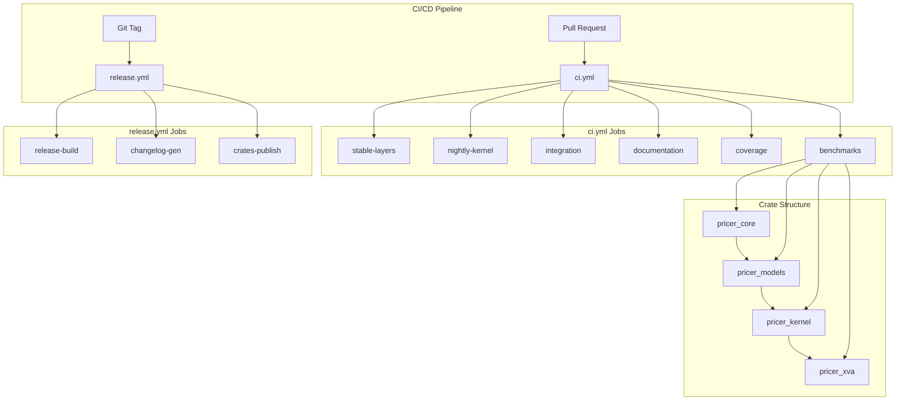
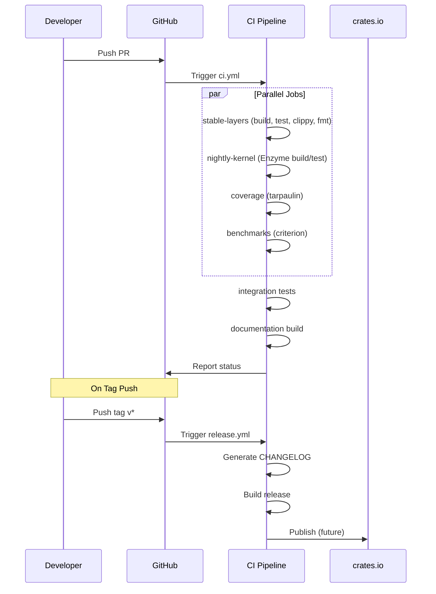

# Technical Design: Production Hardening Phase 6

## Overview

**Purpose**: Neutryx XVAプライシングライブラリを本番運用可能な状態にするため、ドキュメント整備、ベンチマーク作成、CI/CDパイプライン強化を実施する。

**Users**: ライブラリ利用者（量的金融開発者）、コントリビュータ、リリースマネージャーがドキュメント参照、性能測定、自動品質チェックを活用する。

**Impact**: 既存CI/CDパイプラインの拡張、全クレートへのベンチマーク追加、ドキュメントカバレッジ100%達成。

### Goals

- 全4クレートのAPIドキュメント100%カバレッジ達成
- Criterionベンチマークによる性能回帰検出体制構築
- 自動テスト・カバレッジ・リリースを含む完全なCI/CDパイプライン
- コントリビュータ向け開発ガイドライン整備

### Non-Goals

- crates.ioへの実際の公開（将来対応としてワークフローのみ準備）
- Windows/macOSでのEnzyme実行（L3はLinux限定）
- パフォーマンス最適化の実施（測定インフラのみ構築）

---

## Architecture

### Existing Architecture Analysis

**現行CI/CDパイプライン** (`.github/workflows/ci.yml`):
- `stable-layers`: L1/L2/L4のビルド・テスト・Clippy
- `nightly-kernel`: L3のEnzyme対応ビルド（フォールバック機構あり）
- `integration`: 全スタック統合テスト
- `docs`: ドキュメント生成（警告チェックなし）

**現行ドキュメント状況**:
- README.md: プロジェクト概要、クイックスタート完備
- CONTRIBUTING.md: SDDワークフロー中心、一般的な貢献ガイド不足
- APIドキュメント: `#![warn(missing_docs)]`（warnレベル）

**技術的制約**:
- L3（pricer_kernel）はnightly Rust + Enzyme必須
- クロスプラットフォームビルドではEnzyme無効化が必要

### Architecture Pattern & Boundary Map



**Architecture Integration**:
- **Selected pattern**: Hybrid CI/CD（ci.yml拡張 + release.yml分離）
- **Domain boundaries**: CIジョブ（ビルド・テスト）とリリースジョブ（公開）の分離
- **Existing patterns preserved**: stable/nightly分離、Enzymeフォールバック
- **New components**: coverage job、benchmarks job、release.yml
- **Steering compliance**: 4層アーキテクチャ維持、stable/nightly分離維持

### Technology Stack

| Layer | Choice / Version | Role in Feature | Notes |
|-------|------------------|-----------------|-------|
| Benchmarking | Criterion v0.7.0 | 性能測定・回帰検出 | dev-dependencies |
| Coverage | cargo-tarpaulin | テストカバレッジ測定 | Linux CI用 |
| CHANGELOG | git-cliff v2.11.0 | 変更履歴自動生成 | Conventional Commits |
| CI/CD | GitHub Actions | ビルド・テスト・リリース | 既存インフラ拡張 |
| Publishing | rust-lang/crates-io-auth-action | Trusted Publishing | 将来対応用 |

---

## System Flows

### CI/CD Pipeline Flow



---

## Requirements Traceability

| Requirement | Summary | Components | Interfaces | Flows |
|-------------|---------|------------|------------|-------|
| 1.1-1.6 | APIドキュメント | DocConfig, lib.rs設定 | `#![deny(missing_docs)]` | docs job |
| 2.1-2.5 | ユーザーガイド | README.md, docs/ | — | — |
| 3.1-3.7 | ベンチマーク | BenchmarkSuite | Criterion API | benchmarks job |
| 4.1-4.6 | CI/CD (Stable) | ci.yml拡張 | GitHub Actions | stable-layers |
| 5.1-5.5 | CI/CD (Nightly) | ci.yml既存 | GitHub Actions | nightly-kernel |
| 6.1-6.5 | 品質ゲート | CoverageConfig | tarpaulin CLI | coverage job |
| 7.1-7.5 | リリース自動化 | release.yml | git-cliff, cargo | release flow |
| 8.1-8.5 | DX向上 | CONTRIBUTING.md, templates | GitHub Templates | — |

---

## Components and Interfaces

### Summary Table

| Component | Domain/Layer | Intent | Req Coverage | Key Dependencies | Contracts |
|-----------|--------------|--------|--------------|------------------|-----------|
| DocConfig | Documentation | ドキュメント品質設定 | 1.1-1.6 | rustdoc (P0) | Config |
| BenchmarkSuite | Performance | 性能ベンチマーク | 3.1-3.7 | Criterion (P0) | Benchmark |
| CIConfig | CI/CD | ビルド・テストパイプライン | 4.1-4.6, 5.1-5.5 | GitHub Actions (P0) | Workflow |
| CoverageConfig | Quality | テストカバレッジ測定 | 6.1-6.5 | tarpaulin (P0) | Report |
| ReleaseConfig | Release | リリース自動化 | 7.1-7.5 | git-cliff (P1), cargo (P0) | Workflow |
| ContribGuide | Documentation | 貢献ガイドライン | 8.1-8.5 | — | Markdown |

---

### Documentation Layer

#### DocConfig

| Field | Detail |
|-------|--------|
| Intent | 全クレートのドキュメント品質を強制 |
| Requirements | 1.1, 1.2, 1.3, 1.4, 1.5, 1.6 |

**Responsibilities & Constraints**
- 各クレートlib.rsに`#![deny(missing_docs)]`設定
- パブリック関数に`# Examples`セクション必須
- `cargo doc --no-deps`で警告ゼロ

**Dependencies**
- Outbound: rustdoc — ドキュメント生成 (P0)

**Contracts**: Config [x]

##### Configuration Specification

```rust
// 各クレートのlib.rsに追加
#![deny(missing_docs)]
#![deny(rustdoc::broken_intra_doc_links)]
#![deny(rustdoc::private_intra_doc_links)]
```

**Implementation Notes**
- 既存`#![warn(missing_docs)]`を`deny`に変更
- CI docsジョブで`RUSTDOCFLAGS="-D warnings"`設定

---

### Performance Layer

#### BenchmarkSuite

| Field | Detail |
|-------|--------|
| Intent | 各クレートの性能特性を測定・追跡 |
| Requirements | 3.1, 3.2, 3.3, 3.4, 3.5, 3.6, 3.7 |

**Responsibilities & Constraints**
- 各クレートに`benches/`ディレクトリ作成
- Criterion v0.7.0使用、`black_box`で最適化防止
- スケーリング特性測定（問題サイズ変動）

**Dependencies**
- External: Criterion v0.7.0 — ベンチマークフレームワーク (P0)

**Contracts**: Benchmark [x]

##### Benchmark Structure

```toml
# 各クレートのCargo.toml
[dev-dependencies]
criterion = { version = "0.7", features = ["html_reports"] }

[[bench]]
name = "core_benchmarks"  # クレートごとに変更
harness = false
```

##### Benchmark Targets

| Crate | Benchmark | Target Function | Parameters |
|-------|-----------|-----------------|------------|
| pricer_core | interpolation | linear, cubic_spline, bilinear | 100, 1000, 10000 points |
| pricer_models | pricing | black_scholes_call, black_scholes_put | spot, strike, vol variations |
| pricer_kernel | monte_carlo | generate_gbm_paths | 1K, 10K, 100K paths |
| pricer_kernel | ad_comparison | enzyme_delta vs num_dual_delta | 1K, 10K paths |
| pricer_xva | portfolio | calculate_cva, calculate_exposure | 10, 100, 1000 trades |

**Implementation Notes**
- `black_box`でコンパイラ最適化を防止
- HTMLレポートを`target/criterion/`に生成
- CIでベンチマーク結果をアーティファクト保存

---

### CI/CD Layer

#### CIConfig

| Field | Detail |
|-------|--------|
| Intent | 自動ビルド・テスト・品質チェック |
| Requirements | 4.1, 4.2, 4.3, 4.4, 4.5, 4.6, 5.1, 5.2, 5.3, 5.4, 5.5 |

**Responsibilities & Constraints**
- PR時: build, test, fmt, clippy, coverage
- マージ時: ドキュメント生成・デプロイ
- クロスプラットフォーム: Linux, Windows, macOS（L1/L2/L4のみ）

**Dependencies**
- External: GitHub Actions — CI/CDプラットフォーム (P0)
- External: actions/checkout, dtolnay/rust-toolchain — 標準Actions (P0)

**Contracts**: Workflow [x]

##### CI Workflow Structure

```yaml
# .github/workflows/ci.yml 拡張
jobs:
  stable-layers:
    strategy:
      matrix:
        os: [ubuntu-latest, windows-latest, macos-latest]
    # 既存ジョブをmatrix化

  nightly-kernel:
    runs-on: ubuntu-latest
    # 既存ジョブ維持（Linux限定）

  coverage:
    runs-on: ubuntu-latest
    needs: [stable-layers]
    steps:
      - uses: actions/checkout@v4
      - name: Install tarpaulin
        run: cargo install cargo-tarpaulin
      - name: Generate coverage
        run: cargo tarpaulin --workspace --exclude pricer_kernel --out Xml
      - name: Upload to Codecov
        uses: codecov/codecov-action@v4

  benchmarks:
    runs-on: ubuntu-latest
    needs: [stable-layers]
    steps:
      - uses: actions/checkout@v4
      - name: Run benchmarks
        run: cargo bench --workspace --exclude pricer_kernel -- --noplot
      - name: Upload results
        uses: actions/upload-artifact@v4
        with:
          name: benchmark-results
          path: target/criterion/
```

**Implementation Notes**
- matrix戦略でクロスプラットフォーム対応
- nightly-kernelはubuntu-latest固定（Enzyme依存）
- coverageはL3除外（nightly依存のため）

---

### Quality Layer

#### CoverageConfig

| Field | Detail |
|-------|--------|
| Intent | テストカバレッジ測定と品質ゲート |
| Requirements | 6.1, 6.2, 6.3, 6.4, 6.5 |

**Responsibilities & Constraints**
- cargo-tarpaulinでカバレッジ測定
- Codecovへのレポートアップロード
- PRブロック条件の設定

**Dependencies**
- External: cargo-tarpaulin — カバレッジツール (P0)
- External: codecov/codecov-action — レポートアップロード (P1)

**Contracts**: Report [x]

##### Coverage Configuration

```toml
# tarpaulin.toml (オプション)
[features]
exclude = ["pricer_kernel"]  # nightly依存を除外

[report]
out = ["Xml", "Html"]
output-dir = "target/coverage"
```

**Implementation Notes**
- L3（pricer_kernel）はカバレッジ対象外（nightly依存）
- 将来的にgrcovへの移行パスを文書化

---

### Release Layer

#### ReleaseConfig

| Field | Detail |
|-------|--------|
| Intent | タグベースの自動リリース |
| Requirements | 7.1, 7.2, 7.3, 7.4, 7.5 |

**Responsibilities & Constraints**
- `v*`タグでリリースワークフロー起動
- git-cliffでCHANGELOG自動生成
- 依存順序に従ったcrates.io公開（将来対応）

**Dependencies**
- External: git-cliff v2.11.0 — CHANGELOG生成 (P1)
- External: rust-lang/crates-io-auth-action — Trusted Publishing (P1)
- External: katyo/publish-crates — ワークスペース公開 (P1)

**Contracts**: Workflow [x]

##### Release Workflow Structure

```yaml
# .github/workflows/release.yml (新規)
name: Release

on:
  push:
    tags: ['v*']

jobs:
  changelog:
    runs-on: ubuntu-latest
    steps:
      - uses: actions/checkout@v4
        with:
          fetch-depth: 0
      - name: Generate changelog
        uses: orhun/git-cliff-action@v3
        with:
          args: --latest --strip header
        env:
          OUTPUT: CHANGELOG.md

  release-build:
    runs-on: ubuntu-latest
    needs: [changelog]
    steps:
      - uses: actions/checkout@v4
      - uses: dtolnay/rust-toolchain@stable
      - run: cargo build --release --workspace --exclude pricer_kernel

  # 将来対応: crates.io公開
  # publish:
  #   runs-on: ubuntu-latest
  #   environment: release
  #   permissions:
  #     id-token: write
  #   steps:
  #     - uses: rust-lang/crates-io-auth-action@v1
  #     - run: cargo publish
```

##### CHANGELOG Configuration

```toml
# cliff.toml
[changelog]
header = "# Changelog\n\n"
body = """

### {{ group }}

- {{ commit.message | upper_first }}


"""
trim = true

[git]
conventional_commits = true
filter_unconventional = true
```

**Implementation Notes**
- Trusted Publishing設定はcrates.ioダッシュボードで行う
- 依存順序: pricer_core → pricer_models → pricer_kernel → pricer_xva

---

### Documentation Layer

#### ContribGuide

| Field | Detail |
|-------|--------|
| Intent | コントリビュータ向け開発ガイドライン |
| Requirements | 8.1, 8.2, 8.3, 8.4, 8.5 |

**Responsibilities & Constraints**
- CONTRIBUTING.md拡張（一般的な貢献ガイド追加）
- Issue/PRテンプレート作成
- ローカル開発環境セットアップ手順

**Contracts**: Markdown [x]

##### Template Structure

```
.github/
├── ISSUE_TEMPLATE/
│   ├── bug_report.md
│   ├── feature_request.md
│   └── config.yml
├── PULL_REQUEST_TEMPLATE.md
└── workflows/
    ├── ci.yml
    └── release.yml
```

##### CONTRIBUTING.md Additions

```markdown
## Development Setup

### Prerequisites
- Rust stable (for L1/L2/L4)
- Rust nightly-2025-01-15 (for L3, optional)
- Docker (recommended for Enzyme)

### Quick Start
\`\`\`bash
# Clone repository
git clone https://github.com/your-org/neutryx-rust.git
cd neutryx-rust

# Build stable crates
cargo build --workspace --exclude pricer_kernel

# Run tests
cargo test --workspace --exclude pricer_kernel

# Check formatting and lints
cargo fmt --all -- --check
cargo clippy --all-targets -- -D warnings
\`\`\`

## Pull Request Process

1. Fork the repository
2. Create feature branch (`git checkout -b feature/amazing-feature`)
3. Ensure tests pass and code is formatted
4. Create Pull Request with description
5. Wait for CI checks and review
```

---

## Testing Strategy

### Unit Tests

既存テスト構造を維持:
- 各モジュール内`#[cfg(test)]`
- `approx`で浮動小数点比較
- `proptest`でプロパティベーステスト

### Integration Tests

- stable-layers: L1/L2/L4の統合テスト
- nightly-kernel: L3単独テスト（Enzyme依存）
- full-stack: 全クレート統合（条件付き）

### Benchmark Tests

- 性能回帰検出: 前回結果との比較（Criterion標準機能）
- スケーリングテスト: 問題サイズ変動での線形性確認

### Coverage Targets

| Crate | Target Coverage | Priority |
|-------|-----------------|----------|
| pricer_core | 80%+ | High |
| pricer_models | 80%+ | High |
| pricer_kernel | 70%+ | Medium (nightly依存) |
| pricer_xva | 75%+ | High |

---

## Performance & Scalability

### Benchmark Metrics

| Metric | Target | Measurement |
|--------|--------|-------------|
| Black-Scholes pricing | < 1 μs | Criterion |
| MC path generation (1K) | < 100 μs | Criterion |
| CVA calculation (100 trades) | < 5 s | Criterion |
| Enzyme delta overhead | < 2x forward | Criterion comparison |

### CI Performance

| Metric | Target | Current |
|--------|--------|---------|
| stable-layers job | < 5 min | ~3 min |
| nightly-kernel job | < 10 min | ~5 min |
| coverage job | < 10 min | N/A |
| benchmarks job | < 15 min | N/A |

---

## Error Handling

### CI Failure Scenarios

| Scenario | Response | Recovery |
|----------|----------|----------|
| Test failure | PR block | Fix and re-push |
| Format violation | PR block | `cargo fmt` and re-push |
| Clippy warning | PR block | Fix warning and re-push |
| Coverage drop | Warning | Review changes |
| Benchmark regression | Warning | Investigate performance |
| Enzyme unavailable | Fallback build | Continue without autodiff |

### Monitoring

- GitHub Actions ログ保持: 90日
- ベンチマーク結果アーティファクト: 30日
- カバレッジレポート: Codecov統合

---

## Supporting References

### File Modifications Summary

| File | Action | Description |
|------|--------|-------------|
| `crates/*/src/lib.rs` | Modify | `warn` → `deny(missing_docs)` |
| `crates/*/Cargo.toml` | Modify | `[[bench]]`セクション追加 |
| `crates/*/benches/*.rs` | Create | Criterionベンチマーク |
| `.github/workflows/ci.yml` | Modify | coverage, benchmarks, matrix追加 |
| `.github/workflows/release.yml` | Create | リリースワークフロー |
| `.github/ISSUE_TEMPLATE/*.md` | Create | Issue テンプレート |
| `.github/PULL_REQUEST_TEMPLATE.md` | Create | PRテンプレート |
| `CONTRIBUTING.md` | Modify | 開発ガイドライン拡張 |
| `cliff.toml` | Create | git-cliff設定 |
| `tarpaulin.toml` | Create | カバレッジ設定（オプション） |

### External Tool Versions

| Tool | Version | License | Notes |
|------|---------|---------|-------|
| Criterion | 0.7.0 | Apache-2.0/MIT | ベンチマーク |
| cargo-tarpaulin | latest | Apache-2.0/MIT | カバレッジ |
| git-cliff | 2.11.0 | Apache-2.0/MIT | CHANGELOG |
| codecov-action | v4 | MIT | レポートアップロード |
