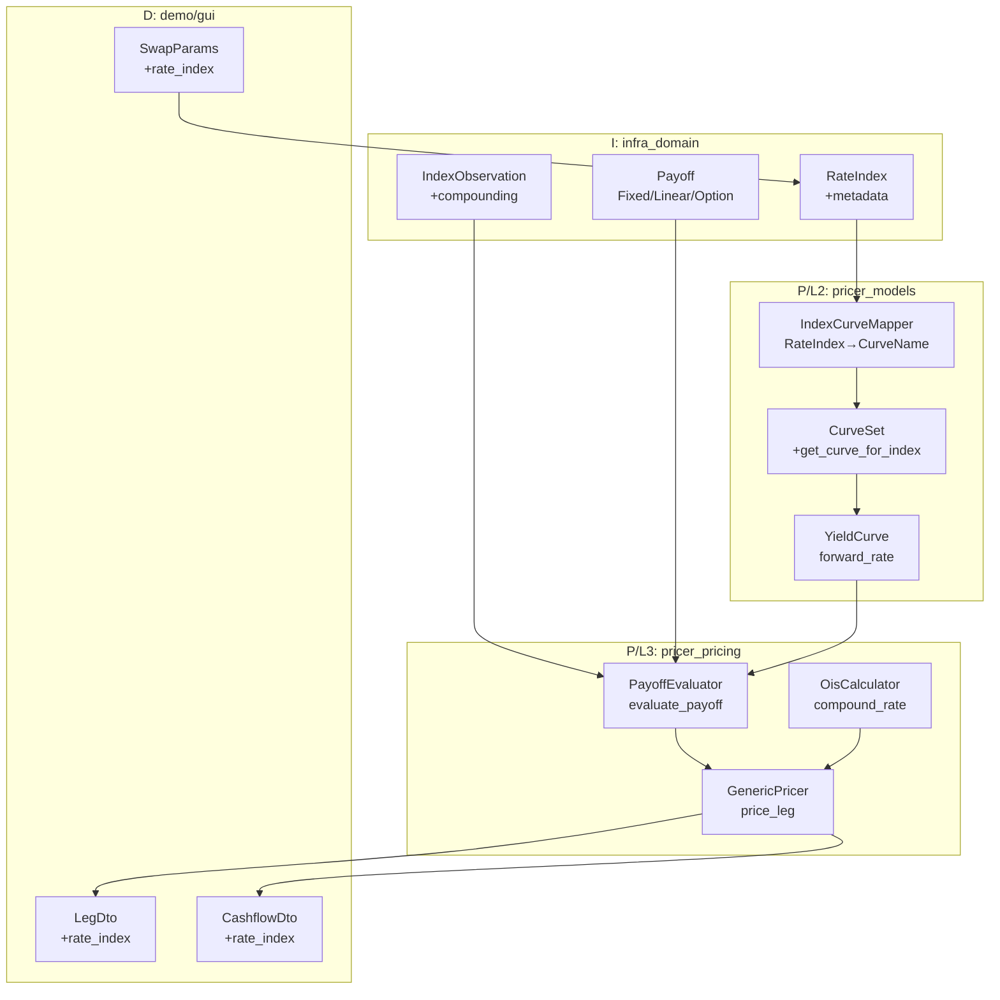
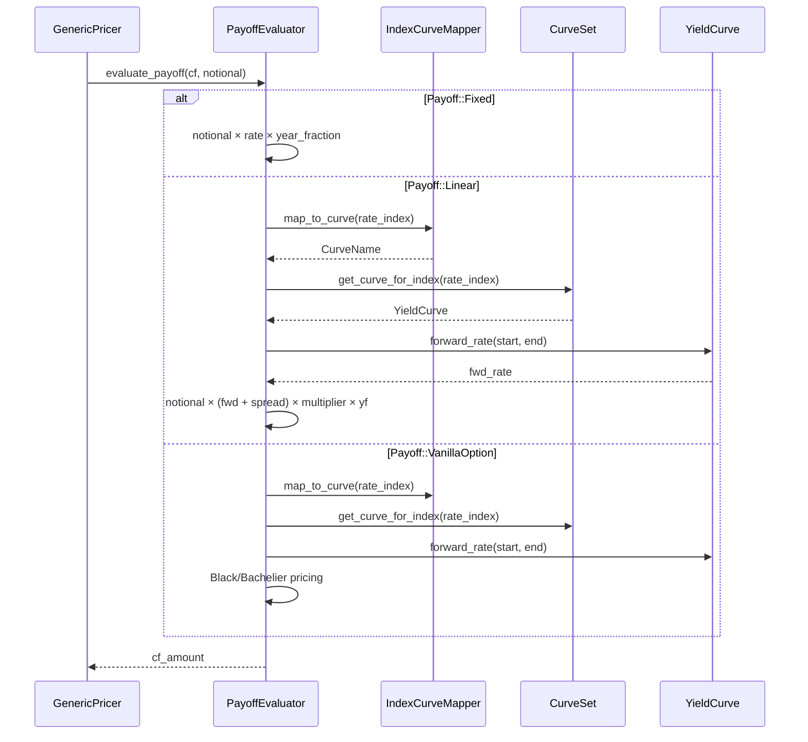
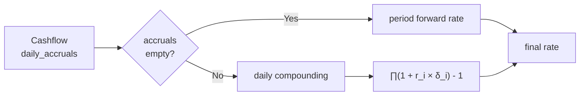
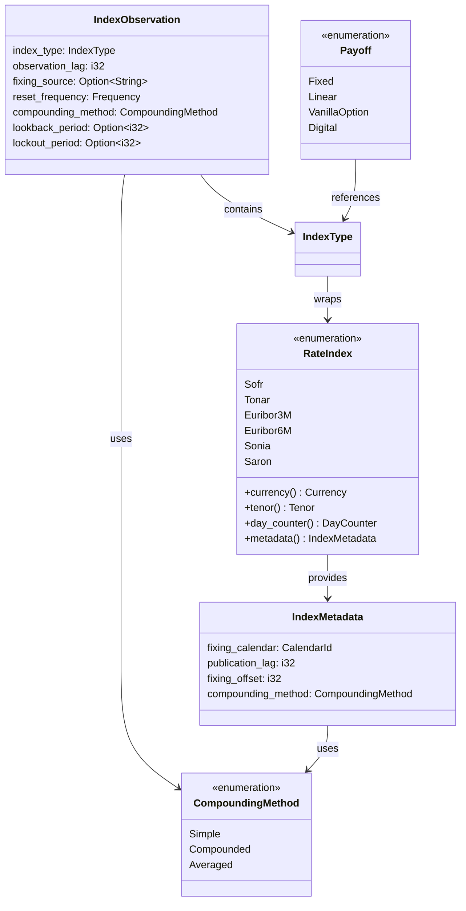

# Design Document: rate-index-pricing-integration

## Overview

**Purpose**: 本機能は、Neutryx プライシングパイプライン全体における RateIndex（金利指標）の包括的な統合を提供し、変動金利キャッシュフローの正確な評価を実現する。

**Users**: クオンツ開発者および API ユーザーが、SOFR/SONIA/EURIBOR などの金利指標に基づくスワップ、キャップ、フロア商品の正確なプライシングに使用する。

**Impact**: 現在 GenericPricer が無視している `Payoff` を正しく評価し、インデックスからカーブへのマッピングを通じてフォワードレートを取得する。4層（infra_domain → pricer_models → pricer_pricing → demo/gui）にまたがる変更となる。

### Goals

- RateIndex にフィクシングメタデータ（カレンダー、ラグ、オフセット、コンパウンディング方式）を追加
- CurveSet で RateIndex からカーブを解決可能にする
- GenericPricer で全 Payoff バリアント（Fixed, Linear, VanillaOption）を正しく評価
- OIS 複利計算（日次アクルーアル）をサポート
- Demo WebApp の入出力 DTO にインデックス情報を追加

### Non-Goals

- 新規 RateIndex バリアントの追加（TONA → TONAR 変更など）は対象外
- ボラティリティサーフェスのインデックス別管理は Phase 2 へ延期
- フィクシングデータ（過去の観測値）の永続化は対象外
- クレジットインデックス（CDX など）の統合は対象外

## Architecture

### Existing Architecture Analysis

**現状のアーキテクチャパターン**:
- A-I-P-S 一方向依存フロー（Adapter → Infra → Pricer → Service）
- 静的ディスパッチ（enum ベース）による Enzyme AD 互換性
- `Float` トレイト境界による `f64`/`Dual64` 両対応

**既存のドメイン境界**:
- `infra_domain`: 静的マスターデータ（RateIndex, IndexType, Payoff）
- `pricer_models`: マーケットデータ構造（CurveSet, YieldCurve）
- `pricer_pricing`: プライシングエンジン（GenericPricer）
- `demo/gui`: REST API と DTO

**技術的負債**:
- GenericPricer が `cf.payoff` を完全に無視し、`cf_amount = year_fraction × notional` のみ計算
- CurveSet が Currency ではなく CurveName でのみカーブを検索

### Architecture Pattern & Boundary Map



**Architecture Integration**:
- **Selected pattern**: ハイブリッドアプローチ（既存拡張 + 新規コンポーネント）
- **Domain boundaries**: infra_domain（定義）→ pricer_models（マッピング）→ pricer_pricing（評価）の責任分離
- **Existing patterns preserved**: A-I-P-S 依存フロー、静的ディスパッチ、Float トレイト境界
- **New components rationale**: PayoffEvaluator（評価ロジック分離）、IndexCurveMapper（マッピング集約）
- **Steering compliance**: 一方向依存、British English 命名

### Technology Stack

| Layer | Choice / Version | Role in Feature | Notes |
|-------|------------------|-----------------|-------|
| Core Types | infra_domain | RateIndex, IndexObservation 定義 | 既存 crate 拡張 |
| Market Data | pricer_models | IndexCurveMapper, CurveSet 拡張 | L2 レイヤー |
| Pricing Engine | pricer_pricing | PayoffEvaluator, OisCalculator | L3 レイヤー、l1l2-integration feature |
| API/DTO | demo/gui | SwapParams, LegDto, CashflowDto | web feature 必須 |
| AD Support | num-dual | Dual64 | Float トレイト経由 |

## System Flows

### Payoff Evaluation Flow



**フロー決定事項**:
- Payoff バリアントに基づく分岐は PayoffEvaluator 内で完結
- カーブ取得失敗時は `PricingError::MissingMarketData` を返却
- OIS 複利計算は `daily_accruals` が存在する場合のみ実行

### OIS Compounding Flow



## Requirements Traceability

| Requirement | Summary | Components | Interfaces | Flows |
|-------------|---------|------------|------------|-------|
| 1 | RateIndex メタデータ | RateIndex, IndexMetadata | metadata() | - |
| 2 | IndexObservation 強化 | IndexObservation, CompoundingMethod | new(), with_*() | - |
| 3 | カーブマッピング | IndexCurveMapper, CurveSet | map_to_curve(), get_curve_for_index() | - |
| 4 | フォワードレート計算 | YieldCurve | forward_rate_for_index() | - |
| 5 | Payoff 評価 | PayoffEvaluator, GenericPricer | evaluate_payoff() | Payoff Evaluation |
| 6 | OIS コンパウンディング | OisCalculator | compound_rate() | OIS Compounding |
| 7 | Cap/Floor 評価 | PayoffEvaluator | evaluate_vanilla_option() | Payoff Evaluation |
| 8 | 入力 DTO | SwapParams, RatesParams | rate_index field | - |
| 9 | 出力 DTO | LegDto, CashflowDto | rate_index field | - |
| 10 | 後方互換性 | All | 既存メソッド維持 | - |

## Components and Interfaces

| Component | Domain/Layer | Intent | Req Coverage | Key Dependencies | Contracts |
|-----------|--------------|--------|--------------|------------------|-----------|
| IndexMetadata | infra_domain | フィクシングパラメータ集約 | 1 | RateIndex | - |
| CompoundingMethod | infra_domain | コンパウンディング方式列挙 | 1, 2 | - | - |
| IndexObservation | infra_domain | 観測パラメータ拡張 | 2 | CompoundingMethod, Frequency | - |
| IndexCurveMapper | pricer_models | RateIndex→CurveName 変換 | 3 | RateIndex, CurveName | Service |
| CurveSet | pricer_models | インデックス対応カーブ取得 | 3, 4 | IndexCurveMapper, YieldCurve | Service |
| PayoffEvaluator | pricer_pricing | Payoff 評価ロジック | 5, 7 | CurveSet, IndexCurveMapper | Service |
| OisCalculator | pricer_pricing | OIS 複利計算 | 6 | DailyAccrual | Service |
| GenericPricer | pricer_pricing | 統合プライシング | 5, 6 | PayoffEvaluator, OisCalculator | Service |
| SwapParams | demo/gui | 入力 DTO | 8 | - | API |
| LegDto, CashflowDto | demo/gui | 出力 DTO | 9 | - | API |

### I: infra_domain

#### IndexMetadata

| Field | Detail |
|-------|--------|
| Intent | RateIndex のフィクシングメタデータを保持する構造体 |
| Requirements | 1 |

**Responsibilities & Constraints**
- フィクシングカレンダー、公表ラグ、フィクシングオフセット、コンパウンディング方式を保持
- RateIndex::metadata() メソッドから取得可能
- 不変（immutable）構造体

**Contracts**: Service [x]

##### Service Interface
```rust
/// フィクシングメタデータ
#[derive(Debug, Clone, Copy, PartialEq, Eq)]
pub struct IndexMetadata {
    /// フィクシングカレンダー識別子
    pub fixing_calendar: CalendarId,
    /// 公表ラグ（営業日数、正値 = 公表遅延）
    pub publication_lag: i32,
    /// フィクシングオフセット（アクルーアル開始からの営業日数）
    pub fixing_offset: i32,
    /// デフォルトのコンパウンディング方式
    pub compounding_method: CompoundingMethod,
}

impl RateIndex {
    /// このインデックスのフィクシングメタデータを返す
    #[must_use]
    pub const fn metadata(&self) -> IndexMetadata {
        match self {
            Self::Sofr => IndexMetadata {
                fixing_calendar: CalendarId::NewYork,
                publication_lag: 1,
                fixing_offset: 0,
                compounding_method: CompoundingMethod::Compounded,
            },
            Self::Sonia => IndexMetadata {
                fixing_calendar: CalendarId::London,
                publication_lag: 0,
                fixing_offset: 0,
                compounding_method: CompoundingMethod::Compounded,
            },
            // ... other indices
        }
    }
}
```

#### CompoundingMethod

| Field | Detail |
|-------|--------|
| Intent | コンパウンディング方式を列挙する |
| Requirements | 1, 2 |

**Contracts**: Service [x]

##### Service Interface
```rust
/// コンパウンディング方式
#[derive(Debug, Clone, Copy, PartialEq, Eq, Hash, Default)]
#[cfg_attr(feature = "serde", derive(serde::Serialize, serde::Deserialize))]
pub enum CompoundingMethod {
    /// 単利計算（IBOR インデックス向け）
    #[default]
    Simple,
    /// 複利計算（OIS インデックス向け）
    Compounded,
    /// 平均化（一部の先物向け）
    Averaged,
}
```

#### IndexObservation (拡張)

| Field | Detail |
|-------|--------|
| Intent | インデックス観測パラメータを保持し、OIS コンパウンディング設定をサポート |
| Requirements | 2 |

**Contracts**: Service [x]

##### Service Interface
```rust
/// インデックス観測パラメータ
#[derive(Debug, Clone, PartialEq, Eq)]
#[cfg_attr(feature = "serde", derive(serde::Serialize, serde::Deserialize))]
pub struct IndexObservation {
    /// 観測対象のインデックス
    pub index_type: IndexType,
    /// フィクシング観測のラグ日数（正値 = 期間開始前にフィクシング）
    pub observation_lag: i32,
    /// フィクシングソース
    pub fixing_source: Option<String>,
    /// リセット頻度（OIS: Daily、IBOR: 期間に応じる）
    pub reset_frequency: Frequency,
    /// コンパウンディング方式
    pub compounding_method: CompoundingMethod,
    /// ルックバック期間（営業日数、オプション）
    pub lookback_period: Option<i32>,
    /// ロックアウト期間（営業日数、オプション）
    pub lockout_period: Option<i32>,
}

impl IndexObservation {
    /// RateIndex から適切なデフォルト設定で作成
    #[must_use]
    pub fn from_rate_index(rate_index: RateIndex) -> Self {
        let metadata = rate_index.metadata();
        let reset_frequency = match rate_index.tenor() {
            Tenor::Overnight => Frequency::Daily,
            Tenor::ThreeMonths => Frequency::Quarterly,
            Tenor::SixMonths => Frequency::SemiAnnual,
            _ => Frequency::Annual,
        };
        Self {
            index_type: IndexType::Rate(rate_index),
            observation_lag: metadata.fixing_offset,
            fixing_source: None,
            reset_frequency,
            compounding_method: metadata.compounding_method,
            lookback_period: None,
            lockout_period: None,
        }
    }
}
```

### P/L2: pricer_models

#### IndexCurveMapper

| Field | Detail |
|-------|--------|
| Intent | RateIndex を CurveName にマッピングする |
| Requirements | 3 |

**Responsibilities & Constraints**
- 純粋関数として実装（状態なし）
- 全 RateIndex バリアントに対応必須
- 存在しないマッピングは `MarketDataError::UnsupportedIndex` を返す

**Dependencies**
- Inbound: CurveSet — カーブ取得時に使用 (P0)
- Outbound: なし

**Contracts**: Service [x]

##### Service Interface
```rust
/// RateIndex から CurveName へのマッピング
pub trait IndexCurveMapper {
    /// RateIndex を対応する CurveName に変換
    fn map_to_curve(&self, index: RateIndex) -> Result<CurveName, MarketDataError>;
}

/// デフォルト実装
#[derive(Debug, Clone, Default)]
pub struct DefaultIndexCurveMapper;

impl IndexCurveMapper for DefaultIndexCurveMapper {
    fn map_to_curve(&self, index: RateIndex) -> Result<CurveName, MarketDataError> {
        match index {
            RateIndex::Sofr => Ok(CurveName::Sofr),
            RateIndex::Tonar => Ok(CurveName::Tonar),
            RateIndex::Euribor3M | RateIndex::Euribor6M => Ok(CurveName::Euribor),
            RateIndex::Sonia => Ok(CurveName::Sonia),
            RateIndex::Saron => Ok(CurveName::Saron),
        }
    }
}
```

#### CurveSet (拡張)

| Field | Detail |
|-------|--------|
| Intent | RateIndex からカーブを取得する機能を追加 |
| Requirements | 3, 4 |

**Contracts**: Service [x]

##### Service Interface
```rust
impl<T: Float> CurveSet<T> {
    /// RateIndex に対応するカーブを取得
    pub fn get_curve_for_index(
        &self,
        index: RateIndex,
    ) -> Result<&CurveEnum<T>, MarketDataError> {
        let mapper = DefaultIndexCurveMapper;
        let curve_name = mapper.map_to_curve(index)?;
        self.get(&curve_name)
            .ok_or_else(|| MarketDataError::CurveNotFound(curve_name.to_string()))
    }

    /// RateIndex に対応するフォワードレートを計算
    pub fn forward_rate_for_index(
        &self,
        index: RateIndex,
        start: T,
        end: T,
    ) -> Result<T, MarketDataError>
    where
        T: Float,
    {
        let curve = self.get_curve_for_index(index)?;
        Ok(curve.forward_rate(start, end))
    }
}
```

### P/L3: pricer_pricing

#### PayoffEvaluator

| Field | Detail |
|-------|--------|
| Intent | Payoff バリアントに基づくキャッシュフロー金額の計算 |
| Requirements | 5, 7 |

**Responsibilities & Constraints**
- Payoff::Fixed, Linear, VanillaOption, Digital の評価
- Float トレイト境界による AD 互換性
- カーブ取得失敗時のエラーハンドリング

**Dependencies**
- Inbound: GenericPricer — Payoff 評価時に呼び出し (P0)
- Outbound: CurveSet — フォワードレート取得 (P0)

**Contracts**: Service [x]

##### Service Interface
```rust
/// Payoff 評価器
pub struct PayoffEvaluator<'a, T: Float> {
    curve_set: &'a CurveSet<T>,
    vol_surface: Option<&'a VolSurfaceEnum<T>>,
}

impl<'a, T: Float> PayoffEvaluator<'a, T> {
    pub fn new(curve_set: &'a CurveSet<T>) -> Self {
        Self { curve_set, vol_surface: None }
    }

    pub fn with_vol_surface(mut self, vol: &'a VolSurfaceEnum<T>) -> Self {
        self.vol_surface = Some(vol);
        self
    }

    /// Payoff を評価してキャッシュフロー金額を計算
    pub fn evaluate(
        &self,
        payoff: &Payoff,
        notional: T,
        year_fraction: T,
        start_time: T,
        end_time: T,
    ) -> Result<T, PricingError> {
        match payoff {
            Payoff::Fixed { rate } => {
                Ok(notional * T::from_f64(*rate) * year_fraction)
            }
            Payoff::Linear { index, spread, multiplier } => {
                self.evaluate_linear(index, notional, year_fraction, start_time, end_time, *spread, *multiplier)
            }
            Payoff::VanillaOption { index, strike, option_type, .. } => {
                self.evaluate_vanilla_option(index, notional, year_fraction, start_time, end_time, *strike, option_type)
            }
            Payoff::Digital { .. } => {
                // Digital は別途実装
                Ok(T::zero())
            }
        }
    }

    fn evaluate_linear(
        &self,
        index: &IndexType,
        notional: T,
        year_fraction: T,
        start_time: T,
        end_time: T,
        spread: f64,
        multiplier: f64,
    ) -> Result<T, PricingError> {
        let rate_index = index.as_rate()
            .ok_or(PricingError::UnsupportedIndexType)?;

        let fwd_rate = self.curve_set
            .forward_rate_for_index(*rate_index, start_time, end_time)
            .map_err(|e| PricingError::MissingMarketData(e.to_string()))?;

        let rate_with_spread = fwd_rate + T::from_f64(spread);
        Ok(notional * rate_with_spread * T::from_f64(multiplier) * year_fraction)
    }
}
```

#### OisCalculator

| Field | Detail |
|-------|--------|
| Intent | OIS キャッシュフローの日次複利計算 |
| Requirements | 6 |

**Contracts**: Service [x]

##### Service Interface
```rust
/// OIS 複利計算器
pub struct OisCalculator;

impl OisCalculator {
    /// 日次アクルーアルから複利レートを計算
    ///
    /// 計算式: ∏(1 + r_i × δ_i) - 1
    pub fn compound_rate<T: Float>(daily_accruals: &[DailyAccrual]) -> T {
        if daily_accruals.is_empty() {
            return T::zero();
        }

        let mut product = T::one();
        for accrual in daily_accruals {
            let rate = T::from_f64(accrual.overnight_rate);
            let day_fraction = T::from_f64(accrual.day_fraction);
            product = product * (T::one() + rate * day_fraction);
        }
        product - T::one()
    }

    /// 複利レートを年率換算
    pub fn annualized_rate<T: Float>(
        compounded_rate: T,
        total_year_fraction: T,
    ) -> T {
        if total_year_fraction <= T::zero() {
            return T::zero();
        }
        compounded_rate / total_year_fraction
    }
}
```

#### GenericPricer (拡張)

| Field | Detail |
|-------|--------|
| Intent | PayoffEvaluator を統合し、全 Payoff を正しく評価 |
| Requirements | 5, 6 |

**Implementation Notes**
- `price_leg` メソッド内で `PayoffEvaluator::evaluate` を呼び出す
- `daily_accruals` が存在する場合は `OisCalculator::compound_rate` を使用
- 既存の `get_notional_for_cashflow` メソッドは維持

### D: demo/gui

#### SwapParams, RatesParams (拡張)

| Field | Detail |
|-------|--------|
| Intent | API リクエストでインデックスを指定可能にする |
| Requirements | 8 |

**Contracts**: API [x]

##### API Contract
| Method | Endpoint | Request | Response | Errors |
|--------|----------|---------|----------|--------|
| POST | /api/trades/expand | SwapParams with rate_index | ExpandedTradeDto | 400 (Invalid rate_index) |

```rust
#[derive(Debug, Clone, Serialize, Deserialize)]
pub struct SwapParams {
    pub currency: String,
    pub notional: f64,
    pub start_date: String,
    pub end_date: String,
    pub fixed_rate: f64,
    pub payment_frequency: String,
    /// オプション: 変動レッグの金利指標（"SOFR", "EURIBOR3M" など）
    #[serde(default)]
    pub rate_index: Option<String>,
}
```

#### LegDto, CashflowDto (拡張)

| Field | Detail |
|-------|--------|
| Intent | API レスポンスにインデックス情報を含める |
| Requirements | 9 |

**Contracts**: API [x]

```rust
#[derive(Debug, Clone, Serialize, Deserialize)]
pub struct LegDto {
    pub leg_type: String,
    pub direction: String,
    pub currency: String,
    pub notional: f64,
    /// 変動レッグの場合の金利指標
    #[serde(skip_serializing_if = "Option::is_none")]
    pub rate_index: Option<String>,
    pub cashflows: Vec<CashflowDto>,
}

#[derive(Debug, Clone, Serialize, Deserialize)]
pub struct CashflowDto {
    pub cf_type: String,
    pub amount: f64,
    pub payment_date: String,
    pub start_date: String,
    pub end_date: String,
    pub year_fraction: f64,
    /// Payoff が Linear または VanillaOption の場合の金利指標
    #[serde(skip_serializing_if = "Option::is_none")]
    pub rate_index: Option<String>,
}
```

## Data Models

### Domain Model



**Aggregates and Transactional Boundaries**:
- `RateIndex` + `IndexMetadata`: 不変の静的データ、トランザクション境界なし
- `IndexObservation`: Cashflow に埋め込まれる値オブジェクト
- `Payoff`: Cashflow に埋め込まれる値オブジェクト

**Business Rules & Invariants**:
- OIS インデックス（SOFR, SONIA, SARON, TONAR）は CompoundingMethod::Compounded がデフォルト
- IBOR インデックス（EURIBOR3M, EURIBOR6M）は CompoundingMethod::Simple がデフォルト
- fixing_offset は通常 0 または負値（アクルーアル開始前にフィクシング）

### Data Contracts & Integration

**API Data Transfer**:
- rate_index フィールドは文字列（"SOFR", "EURIBOR3M" など）
- 大文字小文字を区別しない（FromStr 実装で対応済み）
- 無効な値は 400 Bad Request を返す

**Serialization Format**: JSON (serde)

## Error Handling

### Error Categories and Responses

**User Errors (4xx)**:
- `InvalidInput`: 無効な rate_index 値 → 有効な値のリストを提示
- `MissingParameter`: 必須フィールド欠落 → フィールド名を明示

**System Errors (5xx)**:
- `MissingMarketData`: カーブが存在しない → カーブ名を明示
- `MissingVolatility`: ボラティリティサーフェスが存在しない → インデックス名を明示

**Business Logic Errors (422)**:
- `UnsupportedIndexType`: サポートされていないインデックスタイプ → サポート対象を提示

### Error Types

```rust
// pricer_pricing/src/generic_pricer/error.rs
#[derive(Debug, thiserror::Error)]
pub enum PricingError {
    #[error("Missing market data: {0}")]
    MissingMarketData(String),

    #[error("Missing volatility surface for index")]
    MissingVolatility,

    #[error("Unsupported index type for payoff evaluation")]
    UnsupportedIndexType,

    #[error("Market data error: {0}")]
    MarketData(#[from] MarketDataError),
}
```

## Testing Strategy

### Unit Tests

- **RateIndex::metadata()**: 全バリアントのメタデータ値を検証
- **CompoundingMethod デフォルト**: OIS vs IBOR のデフォルト方式を検証
- **IndexObservation::from_rate_index()**: 自動設定の正確性を検証
- **IndexCurveMapper::map_to_curve()**: 全 RateIndex のマッピングを検証
- **CurveSet::get_curve_for_index()**: 存在/非存在カーブのハンドリング

### Integration Tests

- **PayoffEvaluator + CurveSet**: Linear Payoff のフォワードレート取得と計算
- **OisCalculator + DailyAccrual**: 日次複利計算の精度検証（既知の値と比較）
- **GenericPricer + PayoffEvaluator**: 全 Payoff バリアントの統合テスト
- **API → GenericPricer**: rate_index 指定から価格計算までのエンドツーエンド

### Performance Tests

- **PayoffEvaluator AD 互換性**: Dual64 での forward propagation 性能
- **OisCalculator バッチ処理**: 1000 日次アクルーアルの複利計算時間
- **GenericPricer リグレッション**: 既存テストの実行時間が 10% 以上悪化しないこと

## Optional Sections

### Performance & Scalability

**Target Metrics**:
- PayoffEvaluator::evaluate_linear: < 100ns（カーブ取得込み）
- OisCalculator::compound_rate（365 日分）: < 1μs
- GenericPricer::price_leg（10 キャッシュフロー）: < 10μs

**Optimization Techniques**:
- インライン化（`#[inline]`）を数値計算関数に適用
- 静的ディスパッチ維持（Box<dyn> 回避）
- Float トレイトの const fn 可能な部分は const fn 化

### Migration Strategy

**Phase 1: infra_domain 拡張**
- IndexMetadata, CompoundingMethod 追加
- IndexObservation 拡張（後方互換性維持）
- 既存テスト通過確認

**Phase 2: pricer_models 拡張**
- IndexCurveMapper 追加
- CurveSet 拡張
- 単体テスト追加

**Phase 3: pricer_pricing 統合**
- PayoffEvaluator 追加
- OisCalculator 追加
- GenericPricer 修正
- 統合テスト追加

**Phase 4: demo/gui 拡張**
- DTO 拡張
- ハンドラー修正
- API テスト追加

**Rollback Strategy**:
- 各フェーズは独立してリバート可能
- feature flag による段階的有効化（l1l2-integration）
