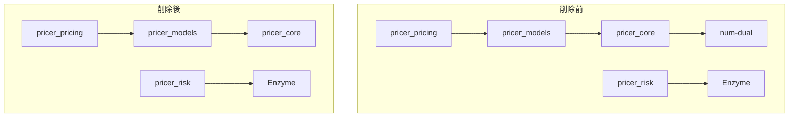

# Design Document: remove-dual-ad

## Overview

**Purpose**: Dual Number（num-dual）方式の自動微分を完全に削除し、Enzyme方式に統一することでコードベースの複雑さを削減する。

**Users**: Neutryx開発者がより簡素化されたADアーキテクチャで保守・開発を行う。

**Impact**: pricer_core、pricer_models、pricer_risk、pricer_pricingから`num-dual`依存と関連コードを削除。

### Goals
- num-dual依存の完全削除
- `num-dual-mode` feature flagの削除
- 関連テスト・ドキュメントの更新
- Enzyme + BumpRevalueによるGreeks計算への統一

### Non-Goals
- Enzyme ADの機能拡張
- 新しいADバックエンドの追加
- Greeks計算アルゴリズムの変更

## Architecture

### Existing Architecture Analysis

現在のADアーキテクチャは2つのバックエンドを持つ：

1. **num-dual（L1: pricer_core）**: Forward mode AD、検証用
2. **Enzyme（L4: pricer_risk）**: LLVM-level AD、本番用

削除対象は(1)のnum-dualバックエンド。Enzyme機能は変更なし。

### Architecture Pattern & Boundary Map



**Architecture Integration**:
- Selected pattern: 単一ADバックエンド（Enzyme + BumpRevalue fallback）
- Domain boundaries: pricer_risk/enzymeがAD機能を提供、他レイヤーはf64のみ使用
- Existing patterns preserved: A-I-P-S依存方向、L1→L2→L3→L4階層
- New components: なし（削除のみ）
- Steering compliance: コードベース簡素化、依存関係削減

### Technology Stack

| Layer | Choice / Version | Role in Feature | Notes |
|-------|------------------|-----------------|-------|
| Pricer Core (L1) | Rust stable | 削除対象 | num-dual依存削除 |
| Pricer Models (L2) | Rust stable | Feature flag削除 | num-dual-mode削除 |
| Pricer Risk (L4) | Rust nightly | 変更なし | Enzyme維持 |
| Build | Cargo workspace | Cargo.toml更新 | workspace依存削除 |
| CI/CD | GitHub Actions | workflow更新 | num-dualテスト削除 |

## Requirements Traceability

| Requirement | Summary | Components | Files |
|-------------|---------|------------|-------|
| 1.1 | dual.rs削除 | types/dual.rs | pricer_core/src/types/dual.rs |
| 1.2 | num-dual依存削除 | Cargo.toml | workspace, pricer_core |
| 1.3 | Dual<T>参照除去 | 全コンパイル確認 | workspace全体 |
| 1.4 | prelude整理 | types/mod.rs | pricer_core/src/types/mod.rs |
| 2.1 | num-dual-mode削除 | Cargo.toml | pricer_core, pricer_models |
| 2.2 | cfg条件削除 | 全.rsファイル | grep対象 |
| 2.3 | enzyme-ad統一 | 変更なし | pricer_risk維持 |
| 2.4 | default features更新 | Cargo.toml | pricer_core |
| 3.1 | Dual<f64>関数更新 | newton_raphson.rs | solve_ad削除 |
| 3.2 | NumDualモード対応 | greeks/config.rs | バリアント削除 |
| 3.3 | enzyme維持 | enzyme/* | 変更なし |
| 3.4 | pricing計算 | 変更なし | f64のみ使用 |
| 4.1 | verificationテスト更新 | tests/*.rs | 削除または変換 |
| 4.2 | テストカバレッジ維持 | テスト実行 | CI確認 |
| 4.3 | 比較テスト変換 | tests/ | BumpRevalue使用 |
| 4.4 | cargo test通過 | CI | 全テスト実行 |
| 5.1 | steering更新 | .kiro/steering/ | tech.md, structure.md, product.md |
| 5.2 | tech.md更新 | tech.md | AD Backend節 |
| 5.3 | structure.md更新 | structure.md | dual.rs削除 |
| 5.4 | product.md更新 | product.md | Dual-Mode削除 |
| 6.1 | 後方互換性 | Public API | 影響なし確認済 |
| 6.2 | CHANGELOG | CHANGELOG.md | Breaking change記載 |
| 6.3 | Enzyme維持 | enzyme/* | 変更なし |
| 6.4 | 代替実装 | 不要 | 使用箇所なし |

## Components and Interfaces

### Component Summary

| Component | Domain/Layer | Intent | Req Coverage | Files |
|-----------|--------------|--------|--------------|-------|
| DualModule | L1/types | 削除 | 1.1, 1.4 | dual.rs, mod.rs |
| CargoToml | Build | 依存削除 | 1.2, 2.1, 2.4 | Cargo.toml x3 |
| NewtonRaphson | L1/math | solve_ad削除 | 3.1 | newton_raphson.rs |
| VegaCalculator | L2/volcube | AD関数削除 | 3.1 | vega.rs |
| GreeksConfig | L4/greeks | NumDual削除 | 3.2 | config.rs |
| TestFiles | Test | 更新 | 4.1-4.4 | tests/*.rs x5 |
| CIWorkflow | CI | 更新 | 4.4 | ci.yml |
| Steering | Docs | 更新 | 5.1-5.4 | *.md x3 |
| DocComments | Docs | Dual64言及削除 | 5.1 | ~70 files |

### L1: Pricer Core

#### DualModule（削除対象）

| Field | Detail |
|-------|--------|
| Intent | num-dual型エイリアスと条件コンパイルの完全削除 |
| Requirements | 1.1, 1.4 |

**Responsibilities & Constraints**
- `types/dual.rs`ファイル削除
- `types/mod.rs`からdualモジュール参照削除
- `#[cfg(feature = "num-dual-mode")]`条件削除

**Dependencies**
- Inbound: なし
- Outbound: num-dual crate — 削除

**Files to Delete**:
- `crates/pricer_core/src/types/dual.rs`
- `crates/pricer_core/tests/dual_number.rs`

**Files to Modify**:
- `crates/pricer_core/src/types/mod.rs` — dualモジュール参照削除

#### NewtonRaphsonSolver

| Field | Detail |
|-------|--------|
| Intent | solve_ad関数の削除 |
| Requirements | 3.1 |

**Files to Modify**:
- `crates/pricer_core/src/math/solvers/newton_raphson.rs`
  - `#[cfg(feature = "num-dual-mode")]`ブロック削除
  - `solve_ad`関数削除
  - テストの`#[cfg(feature = "num-dual-mode")]`ブロック削除

### L2: Pricer Models

#### VegaCalculator

| Field | Detail |
|-------|--------|
| Intent | compute_vega_forward_ad関数の削除 |
| Requirements | 3.1 |

**Files to Modify**:
- `crates/pricer_models/src/market/volcube/vega.rs`
  - `#[cfg(feature = "num-dual-mode")]`ブロック削除
  - `compute_vega_forward_ad`関数削除

### L4: Pricer Risk

#### GreeksConfig

| Field | Detail |
|-------|--------|
| Intent | GreeksMode::NumDualバリアント削除 |
| Requirements | 3.2 |

**Files to Modify**:
- `crates/pricer_risk/src/greeks/config.rs`
  - `NumDual`バリアント削除
  - 関連ドキュメント更新

### Build Configuration

#### CargoToml

| Field | Detail |
|-------|--------|
| Intent | num-dual依存とfeature flag削除 |
| Requirements | 1.2, 2.1, 2.4 |

**Files to Modify**:

1. `Cargo.toml` (workspace root)
   - `num-dual = "0.9"` 行削除

2. `crates/pricer_core/Cargo.toml`
   - `num-dual = { workspace = true, optional = true }` 削除
   - `default = ["num-dual-mode", ...]` から `num-dual-mode` 削除
   - `num-dual-mode = ["dep:num-dual"]` 行削除

3. `crates/pricer_models/Cargo.toml`
   - `num-dual-mode = ["pricer_core/num-dual-mode"]` 行削除

### CI/CD

#### CIWorkflow

| Field | Detail |
|-------|--------|
| Intent | num-dual関連テストステップ削除 |
| Requirements | 4.4 |

**Files to Modify**:
- `.github/workflows/ci.yml`
  - Line 69: `cargo test -p pricer_core --features num-dual-mode` 削除
  - Line 155: "num-dual fallback" メッセージ更新

### Test Files

| File | Action | Requirements |
|------|--------|--------------|
| `pricer_core/tests/module_exports.rs` | `#[cfg(feature = "num-dual-mode")]`テスト削除 | 4.1 |
| `pricer_risk/src/scenarios/greeks_by_factor.rs` | `GreeksMode::NumDual`をBumpRevalueに変更 | 4.3 |
| `pricer_risk/benches/risk.rs` | `GreeksMode::NumDual`をBumpRevalueに変更 | 4.3 |
| `pricer_risk/src/greeks/tests.rs` | `GreeksMode::NumDual`をBumpRevalueに変更 | 4.3 |
| `pricer_pricing/src/generic_pricer/config.rs` | `GreeksMode::NumDual`テストをBumpRevalueに変更 | 4.3 |

### Documentation

#### DocComments（一括更新）

| Field | Detail |
|-------|--------|
| Intent | `Dual64`言及を約70ファイルから削除 |
| Requirements | 5.1 |

**Update Pattern**:
```
Before: "* `T` - Floating-point type (e.g., `f64`, `Dual64`)"
After:  "* `T` - Floating-point type (e.g., `f64`)"
```

**Target Files** (grep `Dual64`):
- `pricer_core/src/math/interpolators/*.rs`
- `pricer_core/src/math/solvers/*.rs`
- `pricer_models/src/market/curves/*.rs`
- `pricer_models/src/market/surfaces/*.rs`
- `pricer_models/src/analytical/*.rs`
- etc. (~70 files)

#### Steering Documents

| File | Changes | Requirements |
|------|---------|--------------|
| `.kiro/steering/tech.md` | "num-dual (verification mode)" 削除、AD Backend節更新 | 5.2 |
| `.kiro/steering/structure.md` | `types/dual.rs` 行削除 | 5.3 |
| `.kiro/steering/product.md` | "Dual-Mode Verification" → "Enzyme AD with analytical verification" | 5.4 |

## Error Handling

### Error Strategy

削除操作のため、新規エラーハンドリングは不要。

**検証項目**:
- `cargo build --workspace` — コンパイルエラーなし
- `cargo test --workspace` — テスト全通過
- `cargo doc --workspace` — ドキュメントビルド成功

## Testing Strategy

### Unit Tests
- `cargo test -p pricer_core` — dual関連テスト削除後も通過
- `cargo test -p pricer_models` — feature flag削除後も通過
- `cargo test -p pricer_risk` — GreeksMode更新後も通過

### Integration Tests
- `cargo test --workspace` — 全クレートでテスト通過
- CI全ターゲット（Linux, Windows, macOS）でビルド確認

### Regression Check
- GreeksMode::BumpRevalueでの計算結果が変わらないことを確認
- Enzyme機能に影響がないことを確認

## Migration Strategy

### Phase 1: Core Deletion
1. `dual.rs`とテストファイル削除
2. `types/mod.rs`更新
3. `newton_raphson.rs`のsolve_ad削除
4. `vega.rs`のcompute_vega_forward_ad削除

### Phase 2: Configuration Update
1. `Cargo.toml`（workspace, pricer_core, pricer_models）更新
2. `GreeksMode::NumDual`削除
3. テストファイル更新（4ファイル）

### Phase 3: CI/Documentation
1. `.github/workflows/ci.yml`更新
2. Steering documents更新
3. DocComments一括更新（~70ファイル）

### Phase 4: Verification
1. `cargo build --workspace`
2. `cargo test --workspace`
3. `cargo doc --workspace`
4. CI全ターゲット確認

## Supporting References

詳細な調査結果は `research.md` を参照。

---
_Generated: 2026-01-27_
