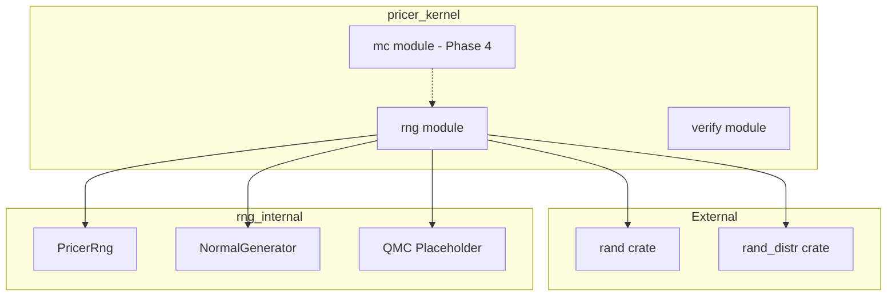
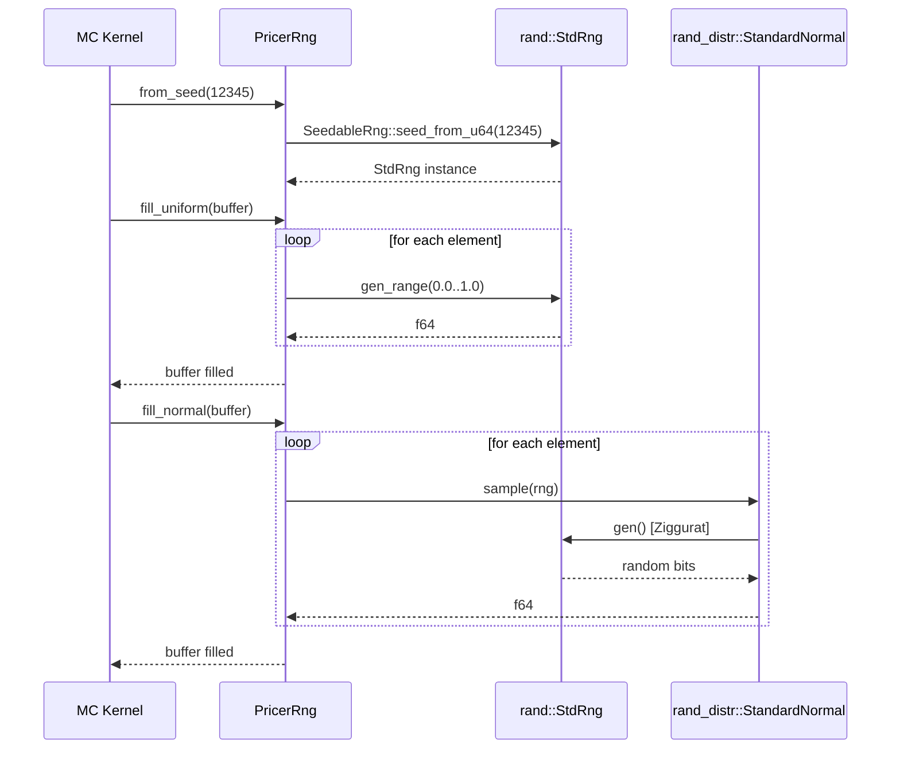
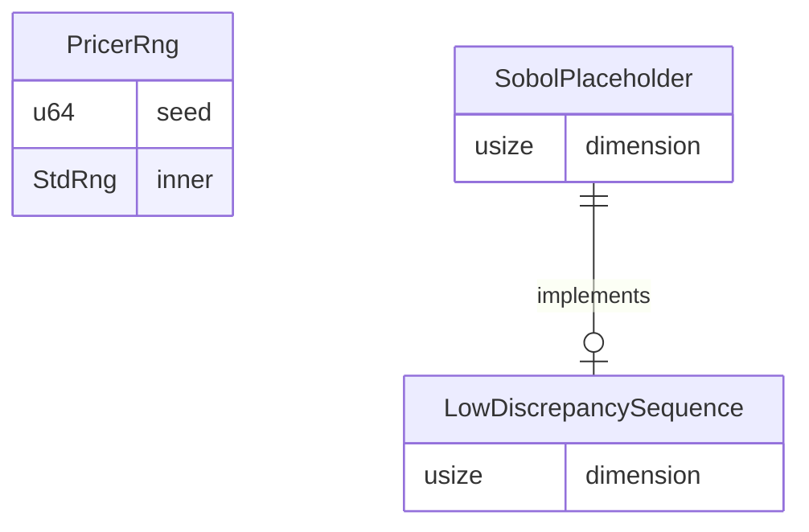

# Technical Design: RNG Infrastructure

## Overview

**Purpose**: Monte Carloシミュレーション用の乱数生成インフラストラクチャを`pricer_kernel`(Layer 3)に提供する。疑似乱数生成器(PRNG)ラッパー、正規分布生成、QMC用プレースホルダーを含む効率的なf64ベクトル生成基盤を実装する。

**Users**: Monte Carloパス生成開発者、XVA計算モジュール(Phase 4以降)、検証テスト作成者が利用する。

**Impact**: `pricer_kernel`に新規`rng`モジュールを追加。既存コードへの変更なし(グリーンフィールド実装)。

### Goals

- 再現可能なシード管理を持つPRNGラッパーの提供
- 高性能な正規分布サンプリング(最低1M samples/sec)
- ゼロアロケーションのバッチ生成API(`&mut [f64]`)
- Enzyme AD互換性を考慮した静的ディスパッチ設計
- British Englishドキュメント規約の遵守

### Non-Goals

- `pricer_core`トレイトへの依存(Phase 3.0独立原則)
- Sobolシーケンスの完全実装(プレースホルダーのみ)
- 暗号論的安全性(Monte Carlo用途では不要)
- マルチスレッド同期(呼び出し側で管理)

## Architecture

### Existing Architecture Analysis

**Layer 3 (pricer_kernel) の現状**:
- Phase 3.0で完全独立(`pricer_core`依存なし)
- `verify/`モジュールのみアクティブ
- `mc/`, `enzyme/`, `checkpoint/`はプレースホルダー

**統合ポイント**:
- `lib.rs`に`pub mod rng;`追加
- `Cargo.toml`に`rand`, `rand_distr`依存追加
- 既存`verify/`のドキュメントパターン踏襲

### Architecture Pattern & Boundary Map



**Architecture Integration**:
- **Selected pattern**: Wrapper/Adapter パターン — `rand`クレートを薄くラップし、Monte Carlo特化APIを提供
- **Domain boundaries**: RNGモジュールは乱数生成のみ担当、パス計算は`mc/`に委譲
- **Existing patterns preserved**: Phase 3.0独立原則、静的ディスパッチ、テスト共存
- **New components rationale**: PRNGラッパー(シード管理)、正規分布生成(バッチAPI)、QMCプレースホルダー(将来拡張)
- **Steering compliance**: Layer 3アーキテクチャ、British English、Enzyme互換性

### Technology Stack

| Layer | Choice / Version | Role in Feature | Notes |
|-------|------------------|-----------------|-------|
| Backend | Rust Edition 2021 (nightly-2025-01-15) | 実装言語 | pricer_kernel要件 |
| Random | rand 0.8, rand_distr 0.4 | PRNG基盤、分布サンプリング | Workspace依存として定義済み |
| Testing | proptest 1.6, approx 0.5 | 統計検証、プロパティテスト | 既存dev-dependencies |
| Benchmarking | criterion 0.5 (オプション) | 性能測定 | 性能要件検証用 |

## System Flows

### 乱数生成フロー



**Key Decisions**:
- `StdRng`をデフォルト選択(再現性重視)
- `StandardNormal`でZigguratアルゴリズム使用(高性能)
- バッファへの直接書込み(ゼロアロケーション)

## Requirements Traceability

| Requirement | Summary | Components | Interfaces | Flows |
|-------------|---------|------------|------------|-------|
| 1.1-1.6 | PRNGラッパー | PricerRng | from_seed, fill_uniform | 乱数生成フロー |
| 2.1-2.6 | 正規分布生成 | PricerRng, NormalGenerator | fill_normal | 乱数生成フロー |
| 3.1-3.4 | Sobolプレースホルダー | LowDiscrepancySequence, SobolPlaceholder | trait定義 | N/A |
| 4.1-4.5 | ベクトル効率性 | PricerRng | fill_* methods | 乱数生成フロー |
| 5.1-5.4 | モジュール独立性 | 全コンポーネント | N/A | N/A |
| 6.1-6.5 | テスト容易性 | tests module | test utilities | N/A |
| 7.1-7.5 | British English | 全コンポーネント | rustdoc | N/A |
| 8.1-8.4 | Enzyme互換性 | PricerRng | 静的ディスパッチ | N/A |

## Components and Interfaces

### Summary Table

| Component | Domain/Layer | Intent | Req Coverage | Key Dependencies | Contracts |
|-----------|--------------|--------|--------------|------------------|-----------|
| PricerRng | rng/prng | シード管理付きPRNGラッパー | 1.1-1.6, 4.1-4.5, 8.1-8.4 | rand::StdRng (P0) | Service |
| NormalGenerator | rng/normal | 正規分布バッチ生成 | 2.1-2.6 | rand_distr::StandardNormal (P0) | Service |
| LowDiscrepancySequence | rng/qmc | QMCトレイト定義 | 3.1-3.4 | None | Service |
| SobolPlaceholder | rng/qmc | Sobolスタブ実装 | 3.1-3.4 | None | Service |
| StatisticalTests | rng/tests | 統計検証ユーティリティ | 6.1-6.5 | proptest (P1), approx (P1) | N/A |

### RNG Domain

#### PricerRng

| Field | Detail |
|-------|--------|
| Intent | Monte Carlo用シード管理付きPRNGラッパー |
| Requirements | 1.1-1.6, 4.1-4.5, 8.1-8.4 |

**Responsibilities & Constraints**
- シード値からの再現可能な乱数生成
- 一様分布・正規分布のバッチ生成
- ゼロアロケーションのスライスベースAPI
- 静的ディスパッチ(Enzyme互換性)

**Dependencies**
- External: `rand::rngs::StdRng` — PRNG実装 (P0)
- External: `rand::SeedableRng` — シード管理 (P0)
- External: `rand_distr::StandardNormal` — 正規分布サンプリング (P0)

**Contracts**: Service [x] / API [ ] / Event [ ] / Batch [ ] / State [ ]

##### Service Interface

```rust
/// Monte Carlo simulation random number generator.
///
/// Provides seeded, reproducible random number generation with
/// efficient batch operations for uniform and normal distributions.
///
/// # British English Note
/// All documentation uses British English spelling conventions
/// (e.g., "initialise", "randomise", "behaviour").
pub struct PricerRng {
    inner: rand::rngs::StdRng,
}

impl PricerRng {
    /// Creates a new RNG instance initialised with the given seed.
    ///
    /// # Arguments
    /// * `seed` - 64-bit seed value for reproducibility
    ///
    /// # Examples
    /// ```rust
    /// use pricer_kernel::rng::PricerRng;
    /// let mut rng = PricerRng::from_seed(12345);
    /// ```
    pub fn from_seed(seed: u64) -> Self;

    /// Fills the buffer with uniform random values in [0, 1).
    ///
    /// # Arguments
    /// * `buffer` - Mutable slice to fill with uniform variates
    ///
    /// # Performance
    /// Zero-allocation operation; buffer must be pre-allocated.
    pub fn fill_uniform(&mut self, buffer: &mut [f64]);

    /// Fills the buffer with standard normal (mean=0, std=1) variates.
    ///
    /// Uses the ZIGNOR Ziggurat algorithm via `rand_distr::StandardNormal`.
    ///
    /// # Arguments
    /// * `buffer` - Mutable slice to fill with normal variates
    ///
    /// # Performance
    /// Achieves >1M samples/second on standard hardware.
    pub fn fill_normal(&mut self, buffer: &mut [f64]);

    /// Generates a single uniform random value in [0, 1).
    pub fn gen_uniform(&mut self) -> f64;

    /// Generates a single standard normal variate.
    pub fn gen_normal(&mut self) -> f64;

    /// Returns the current seed used for initialisation.
    pub fn seed(&self) -> u64;
}
```

- **Preconditions**: バッファは有効なメモリ領域を指す
- **Postconditions**: バッファ全要素が乱数で上書き
- **Invariants**: 同一シードからは同一シーケンスを生成

**Implementation Notes**
- Integration: `lib.rs`で`pub mod rng;`として公開
- Validation: シードは任意の`u64`値を受け入れ(バリデーション不要)
- Risks: `StdRng`アルゴリズム変更時の再現性喪失 — `rand`バージョン固定で軽減

#### NormalGenerator (Internal)

| Field | Detail |
|-------|--------|
| Intent | 正規分布バッチ生成の内部ヘルパー |
| Requirements | 2.1-2.6 |

**Responsibilities & Constraints**
- `StandardNormal`を使用したZigguratサンプリング
- 任意の平均・標準偏差への変換サポート
- PricerRng内部で使用(公開APIなし)

**Dependencies**
- External: `rand_distr::StandardNormal` — Zigguratアルゴリズム (P0)
- External: `rand_distr::Distribution` — サンプリングトレイト (P0)

**Contracts**: Service [x] (internal)

```rust
// Internal implementation detail - not part of public API
fn fill_normal_internal<R: rand::Rng>(rng: &mut R, buffer: &mut [f64]) {
    use rand_distr::{Distribution, StandardNormal};
    for value in buffer.iter_mut() {
        *value = StandardNormal.sample(rng);
    }
}
```

**Implementation Notes**
- `StandardNormal`は平均0、標準偏差1に最適化
- 一般正規分布は後処理で変換: `x * std + mean`
- ループは固定サイズ(Enzyme互換)

### QMC Domain

#### LowDiscrepancySequence

| Field | Detail |
|-------|--------|
| Intent | 準モンテカルロシーケンスの抽象インターフェース |
| Requirements | 3.1-3.4 |

**Responsibilities & Constraints**
- 低食い違いシーケンスの共通インターフェース定義
- 将来のSobol、Halton等の実装に備える
- Phase 3.1aでは実装なし(トレイト定義のみ)

**Dependencies**
- None

**Contracts**: Service [x]

##### Service Interface

```rust
/// Trait for low-discrepancy sequences used in quasi-Monte Carlo.
///
/// # Future Implementation
/// This trait will be implemented by Sobol, Halton, and other
/// low-discrepancy sequence generators in future phases.
///
/// # Warning
/// No implementations are available in Phase 3.1a.
/// Attempting to use placeholder types will result in compile-time errors.
pub trait LowDiscrepancySequence {
    /// Returns the dimensionality of the sequence.
    fn dimension(&self) -> usize;

    /// Advances the sequence and returns the next point.
    ///
    /// # Returns
    /// A slice of `dimension()` values in [0, 1).
    fn next_point(&mut self) -> &[f64];

    /// Resets the sequence to its initial state.
    fn reset(&mut self);

    /// Skips ahead by `n` points in the sequence.
    fn skip(&mut self, n: usize);
}
```

- **Preconditions**: シーケンスが初期化済み
- **Postconditions**: 次のポイントが返却、内部状態が進行
- **Invariants**: 同一シーケンスは決定論的

#### SobolPlaceholder

| Field | Detail |
|-------|--------|
| Intent | Sobolシーケンスのプレースホルダー実装 |
| Requirements | 3.1-3.4 |

**Responsibilities & Constraints**
- コンパイル時エラーで誤用防止
- 将来の実装インターフェースを示す
- PRNGと分離して管理

**Dependencies**
- Internal: `LowDiscrepancySequence` trait

**Contracts**: Service [x]

```rust
/// Placeholder for Sobol sequence generator.
///
/// # Not Implemented
/// This type exists to define the future interface for Sobol sequences.
/// All methods will panic with `unimplemented!()` if called.
///
/// # Future Plans
/// - Integration with `sobol` crate (21,201 dimensions supported)
/// - Joe-Kuo D6 parameters for high-dimensional sequences
/// - Antonov-Saleev grey code optimisation
///
/// # Example (will panic)
/// ```rust,should_panic
/// use pricer_kernel::rng::SobolPlaceholder;
/// let mut sobol = SobolPlaceholder::new(10);  // panics
/// ```
pub struct SobolPlaceholder {
    _dimension: usize,
}

impl SobolPlaceholder {
    /// Creates a placeholder (panics immediately).
    pub fn new(dimension: usize) -> Self {
        unimplemented!(
            "Sobol sequence not implemented in Phase 3.1a. \
             See research.md for future integration plans with `sobol` crate."
        );
    }
}

impl LowDiscrepancySequence for SobolPlaceholder {
    fn dimension(&self) -> usize {
        unimplemented!("Sobol sequence not implemented")
    }

    fn next_point(&mut self) -> &[f64] {
        unimplemented!("Sobol sequence not implemented")
    }

    fn reset(&mut self) {
        unimplemented!("Sobol sequence not implemented")
    }

    fn skip(&mut self, _n: usize) {
        unimplemented!("Sobol sequence not implemented")
    }
}
```

**Implementation Notes**
- `unimplemented!()`で明確なエラーメッセージ
- 構造体定義により将来の`sobol`クレート統合が容易
- ドキュメントに将来計画を記載

## Data Models

### Domain Model

**Aggregates**:
- `PricerRng`: PRNG状態の所有者、シード値を保持
- `LowDiscrepancySequence`: シーケンス状態の抽象所有者

**Value Objects**:
- `seed: u64`: 初期化シード値(不変)
- `buffer: &mut [f64]`: 出力バッファ(外部所有)

**Invariants**:
- 同一シードからは同一シーケンス生成
- バッファサイズは呼び出し側で管理
- RNG状態は単一所有者(スレッド間共有なし)

### Logical Data Model



**Structure Definition**:
- `PricerRng`は16バイト(シード) + 136バイト(StdRng状態)
- シーケンス状態はスタック/ヒープ配置可能
- バッファはスライス参照(所有権なし)

## Error Handling

### Error Strategy

RNGモジュールはpanicベースのエラー処理を採用:
- 無効な状態は`unimplemented!()`でパニック(Sobolプレースホルダー)
- バッファ操作は安全なスライス操作のみ(境界チェック自動)
- シード値は任意の`u64`を受け入れ(バリデーション不要)

### Error Categories and Responses

**User Errors**:
- Sobolプレースホルダー使用 → `unimplemented!()` panic with message
- 空バッファ渡し → 何も行わず正常終了(ループ0回)

**System Errors**:
- メモリ不足 → Rust標準のOOMハンドリング
- スタックオーバーフロー → Rust標準の処理

**Business Logic Errors**:
- 該当なし(純粋な数値計算)

### Monitoring

- デバッグビルドでシード値をログ出力可能(feature flag)
- 性能測定はCriterionベンチマークで実施

## Testing Strategy

### Unit Tests

1. **シード再現性テスト**: 同一シードから同一シーケンス生成確認
2. **一様分布範囲テスト**: 全値が[0, 1)範囲内
3. **正規分布モーメントテスト**: 平均≈0、分散≈1の検証
4. **バッファサイズテスト**: 空、1要素、大規模バッファの動作確認
5. **Sobolパニックテスト**: `should_panic`属性で`unimplemented`確認

### Integration Tests

1. **バッチ生成統合**: 複数回のfill_*呼び出しで状態進行確認
2. **モジュール公開確認**: `pricer_kernel::rng::*`からのインポート
3. **依存関係分離**: `pricer_core`非依存の確認

### Property-based Tests (proptest)

```rust
proptest! {
    #![proptest_config(ProptestConfig::with_cases(1000))]

    #[test]
    fn uniform_in_range(seed in any::<u64>(), size in 1..10000usize) {
        let mut rng = PricerRng::from_seed(seed);
        let mut buffer = vec![0.0; size];
        rng.fill_uniform(&mut buffer);
        for &v in &buffer {
            prop_assert!(v >= 0.0 && v < 1.0);
        }
    }

    #[test]
    fn normal_moments(seed in any::<u64>()) {
        let mut rng = PricerRng::from_seed(seed);
        let mut buffer = vec![0.0; 100_000];
        rng.fill_normal(&mut buffer);

        let mean: f64 = buffer.iter().sum::<f64>() / buffer.len() as f64;
        let variance: f64 = buffer.iter()
            .map(|&x| (x - mean).powi(2))
            .sum::<f64>() / buffer.len() as f64;

        prop_assert!((mean.abs()) < 0.05, "Mean should be near 0");
        prop_assert!((variance - 1.0).abs() < 0.1, "Variance should be near 1");
    }
}
```

### Performance Tests (Optional)

```rust
// benches/rng_benchmark.rs (Criterion)
fn benchmark_fill_normal(c: &mut Criterion) {
    let mut rng = PricerRng::from_seed(12345);
    let mut buffer = vec![0.0; 1_000_000];

    c.bench_function("fill_normal_1M", |b| {
        b.iter(|| rng.fill_normal(&mut buffer))
    });
}
```

**Target**: 1M samples < 1秒 (要件2.4)

## Optional Sections

### Performance & Scalability

**Target Metrics**:
- 正規分布生成: >1M samples/sec (要件2.4)
- 一様分布生成: >10M samples/sec (推定)
- メモリ: 152バイト/インスタンス(StdRng使用時)

**Optimization Techniques**:
- ゼロアロケーション: スライスベースAPI
- キャッシュ効率: 推奨バッファサイズ64KB-1MB
- 静的ディスパッチ: 具象型使用(Box禁止)

**Measurement Strategy**:
- Criterionベンチマークで継続的測定
- 大規模バッチ(1M+)での性能劣化確認

### British English Checklist

**Required Spelling Conversions**:
| American | British |
|----------|---------|
| initialize | initialise |
| randomize | randomise |
| behavior | behaviour |
| optimization | optimisation |
| color | colour |

**Documentation Requirements**:
- 全rustdocコメントでBritish English使用
- モジュールレベルドキュメントに使用規約記載
- レビュー時にチェックリスト確認

## Supporting References

**File Structure** (proposed):

```
crates/pricer_kernel/src/rng/
├── mod.rs           # Module documentation, re-exports
├── prng.rs          # PricerRng implementation
├── normal.rs        # Normal distribution helpers (internal)
├── qmc.rs           # LowDiscrepancySequence trait, SobolPlaceholder
└── tests.rs         # Test utilities, proptest integration

crates/pricer_kernel/Cargo.toml  # Add rand, rand_distr dependencies
crates/pricer_kernel/src/lib.rs  # Add `pub mod rng;`
```

**Cargo.toml Changes**:
```toml
[dependencies]
rand.workspace = true
rand_distr.workspace = true
# existing dependencies...

[dev-dependencies]
proptest.workspace = true
approx.workspace = true
# existing dev-dependencies...
```

**Research Log**: 詳細な調査結果は[research.md](./research.md)を参照。
