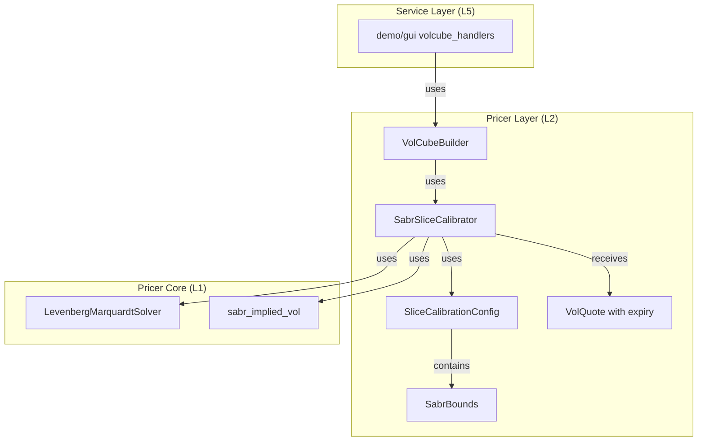
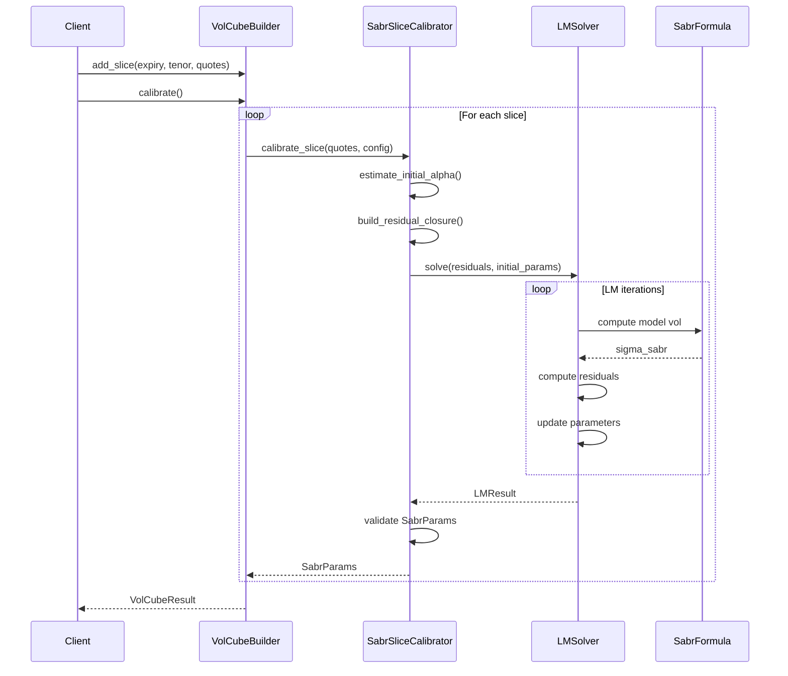

# Technical Design: SABR VolCube Crates Migration

## Overview

**Purpose**: demo/gui内のスタンドアロンSABRカリブレーション実装を`pricer_models`クレートに移行し、A-I-P-Sアーキテクチャ原則に準拠したクリーンなレイヤー分離を実現する。

**Users**: カリブレーションエンジン開発者、VolCubeユーザー、demo/gui開発者

**Impact**: pricer_modelsにSABRカリブレーション機能を追加し、demo/guiからスタンドアロン関数を削除する。

### Goals

- SABRスライスカリブレーションの完全実装（LMソルバー統合）
- VolQuote/SliceCalibrationConfigのデータ構造拡張
- demo/guiからpricer_models APIへの移行
- 50bp未満の精度でのカリブレーション

### Non-Goals

- pricer_coreのLMソルバーAPIの変更
- トレイトベースLMProblemの新規作成
- CalibrationErrorの新規バリアント追加
- VolCube全体の再設計

---

## Architecture

### Existing Architecture Analysis

**現在のアーキテクチャ違反**:
- demo/gui (L5) にビジネスロジックが存在
- pricer_coreのSABR公式・LMソルバーと重複したコード
- UIハンドラ内にカリブレーションロジックが埋め込み

**維持すべきパターン**:
- A-I-P-Sレイヤー分離（Pricer層にビジネスロジック配置）
- Slice-wiseカリブレーションパターン（`builder/vol/`）
- 静的ディスパッチ（enum）の優先

### Architecture Pattern & Boundary Map



**Architecture Integration**:
- **Selected pattern**: Slice-wise calibration（既存パターン継続）
- **Domain boundaries**: pricer_models::builder::vol がカリブレーションロジックを所有
- **Existing patterns preserved**: SliceCalibrator trait、CalibrationError
- **New components**: SabrBounds（境界制約管理）
- **Steering compliance**: A-I-P-S原則、静的ディスパッチ優先

### Technology Stack

| Layer | Choice / Version | Role in Feature | Notes |
|-------|------------------|-----------------|-------|
| Pricer Core (L1) | pricer_core | LMソルバー、SABR公式 | 既存API使用 |
| Pricer Models (L2) | pricer_models | カリブレーションロジック | 主要変更対象 |
| Service (L5) | demo/gui | APIエンドポイント | リファクタリング対象 |

---

## System Flows

### SABR Slice Calibration Flow



**Key Decisions**:
- 残差計算はクロージャで実装（LMソルバーのAPI要件）
- 初期alphaはATMボラティリティから推定
- パラメータ境界はクロージャ内でclamp適用

---

## Requirements Traceability

| Requirement | Summary | Components | Interfaces | Flows |
|-------------|---------|------------|------------|-------|
| 1.1-1.4 | VolQuote expiry拡張 | VolQuote | new(), new_without_expiry() | - |
| 2.1-2.6 | SliceCalibrationConfig拡張 | SliceCalibrationConfig, SabrBounds | default(), rates(), fx() | - |
| 3.1-3.7 | SABR残差クロージャ実装 | SabrSliceCalibrator | calibrate_slice() | Calibration Flow |
| 4.1-4.7 | SabrSliceCalibrator完全実装 | SabrSliceCalibrator | calibrate_slice() | Calibration Flow |
| 5.1-5.4 | VolCubeBuilder API更新 | VolCubeBuilder | add_quote(), add_slice(), calibrate() | - |
| 6.1-6.4 | CalibrationError活用 | SabrSliceCalibrator | - | Error handling |
| 7.1-7.5 | demo/guiリファクタリング | volcube_handlers | HTTP handlers | API Flow |
| 8.1-8.7 | テスト実装 | tests | - | - |
| 9.1-9.4 | 性能要件 | SabrSliceCalibrator | - | - |

---

## Components and Interfaces

### Component Summary

| Component | Domain/Layer | Intent | Req Coverage | Key Dependencies | Contracts |
|-----------|--------------|--------|--------------|------------------|-----------|
| VolQuote | pricer_models (L2) | ボラティリティクォート表現 | 1.1-1.4 | - | Data |
| SabrBounds | pricer_models (L2) | パラメータ境界制約定義 | 2.2-2.3 | - | Data |
| SliceCalibrationConfig | pricer_models (L2) | カリブレーション設定管理 | 2.1, 2.4-2.6 | SabrBounds | Data |
| SabrSliceCalibrator | pricer_models (L2) | SABRスライスカリブレーション | 3.1-3.7, 4.1-4.7, 6.1-6.4 | LMSolver (P0), sabr_implied_vol (P0) | Service |
| VolCubeBuilder | pricer_models (L2) | VolCube構築・カリブレーション | 5.1-5.4 | SabrSliceCalibrator (P0) | Service |
| volcube_handlers | demo/gui (L5) | HTTP APIハンドラ | 7.1-7.5 | VolCubeBuilder (P0), SliceCalibrationConfig (P1) | API |

---

### Pricer Models (L2)

#### VolQuote

| Field | Detail |
|-------|--------|
| Intent | ボラティリティクォートを表現し、SABRカリブレーションの入力データを提供 |
| Requirements | 1.1, 1.2, 1.3, 1.4 |

**Responsibilities & Constraints**
- strike、volatility、forward、expiryの4フィールドを保持
- 後方互換性のため`new_without_expiry()`を提供
- immutableなデータ構造

**Dependencies**
- Inbound: SabrSliceCalibrator — カリブレーション入力 (P0)
- Outbound: なし

**Contracts**: Data [x]

##### Data Structure
```rust
pub struct VolQuote<T: Float> {
    pub strike: T,
    pub volatility: T,
    pub forward: T,
    pub expiry: T,  // 新規追加
}

impl<T: Float> VolQuote<T> {
    /// 4パラメータコンストラクタ
    pub fn new(strike: T, volatility: T, forward: T, expiry: T) -> Self;

    /// 後方互換コンストラクタ（expiry = T::one()）
    pub fn new_without_expiry(strike: T, volatility: T, forward: T) -> Self;
}
```

---

#### SabrBounds

| Field | Detail |
|-------|--------|
| Intent | SABRパラメータ（alpha, rho, nu）の境界制約を定義 |
| Requirements | 2.2, 2.3 |

**Responsibilities & Constraints**
- alpha: (1e-6, 1.0)
- rho: (-0.99, 0.99)
- nu: (1e-6, 2.0)
- 各パラメータの最小値・最大値を保持

**Dependencies**
- Inbound: SliceCalibrationConfig — 設定の一部 (P0)
- Outbound: なし

**Contracts**: Data [x]

##### Data Structure
```rust
#[derive(Debug, Clone, Copy)]
pub struct SabrBounds<T: Float> {
    pub alpha_min: T,
    pub alpha_max: T,
    pub rho_min: T,
    pub rho_max: T,
    pub nu_min: T,
    pub nu_max: T,
}

impl<T: Float> Default for SabrBounds<T> {
    fn default() -> Self {
        Self {
            alpha_min: from_f64(1e-6),
            alpha_max: from_f64(1.0),
            rho_min: from_f64(-0.99),
            rho_max: from_f64(0.99),
            nu_min: from_f64(1e-6),
            nu_max: from_f64(2.0),
        }
    }
}

impl<T: Float> SabrBounds<T> {
    /// f64アクセサ（LMソルバー用）
    #[inline]
    pub fn alpha_min_f64(&self) -> f64 { self.alpha_min.to_f64().unwrap_or(1e-6) }
    #[inline]
    pub fn alpha_max_f64(&self) -> f64 { self.alpha_max.to_f64().unwrap_or(1.0) }
    #[inline]
    pub fn rho_min_f64(&self) -> f64 { self.rho_min.to_f64().unwrap_or(-0.99) }
    #[inline]
    pub fn rho_max_f64(&self) -> f64 { self.rho_max.to_f64().unwrap_or(0.99) }
    #[inline]
    pub fn nu_min_f64(&self) -> f64 { self.nu_min.to_f64().unwrap_or(1e-6) }
    #[inline]
    pub fn nu_max_f64(&self) -> f64 { self.nu_max.to_f64().unwrap_or(2.0) }
}
```

---

#### SliceCalibrationConfig

| Field | Detail |
|-------|--------|
| Intent | スライスカリブレーションの設定を管理（LMソルバー制御、初期値、境界） |
| Requirements | 2.1, 2.4, 2.5, 2.6 |

**Responsibilities & Constraints**
- 既存フィールド（fixed_beta, max_iterations, tolerance, initial_alpha）を維持
- 新規フィールド（initial_rho, initial_nu, lm_lambda, lm_lambda_factor, bounds）を追加
- rates()、fx()プリセットを拡張

**Dependencies**
- Inbound: SabrSliceCalibrator — カリブレーション設定 (P0)
- Outbound: SabrBounds — 境界制約 (P0)

**Contracts**: Data [x]

##### Data Structure
```rust
#[derive(Debug, Clone, Copy)]
pub struct SliceCalibrationConfig<T: Float> {
    // 既存フィールド
    pub fixed_beta: Option<T>,
    pub max_iterations: usize,
    pub tolerance: T,
    pub initial_alpha: T,

    // 新規フィールド
    pub initial_rho: T,
    pub initial_nu: T,
    pub lm_lambda: T,
    pub lm_lambda_factor: T,
    pub bounds: SabrBounds<T>,
}

impl<T: Float> Default for SliceCalibrationConfig<T> {
    fn default() -> Self {
        Self {
            fixed_beta: Some(from_f64(0.5)),
            max_iterations: 100,
            tolerance: from_f64(1e-8),
            initial_alpha: from_f64(0.03),
            initial_rho: from_f64(-0.3),
            initial_nu: from_f64(0.4),
            lm_lambda: from_f64(0.001),
            lm_lambda_factor: from_f64(10.0),
            bounds: SabrBounds::default(),
        }
    }
}

impl<T: Float> SliceCalibrationConfig<T> {
    /// β=0.5の金利スワプション用プリセット
    pub fn rates() -> Self;

    /// β=1.0のFXオプション用プリセット
    pub fn fx() -> Self;

    /// LMConfigへの変換
    pub fn to_lm_config(&self) -> LMConfig;
}
```

---

#### SabrSliceCalibrator

| Field | Detail |
|-------|--------|
| Intent | SABRパラメータ（α, ρ, ν）のスライス単位カリブレーションを実行 |
| Requirements | 3.1-3.7, 4.1-4.7, 6.1-6.4 |

**Responsibilities & Constraints**
- LevenbergMarquardtSolverを使用した最適化
- ATMクォートからの初期alpha推定
- パラメータ境界制約の適用
- SabrParams検証

**Dependencies**
- Inbound: VolCubeBuilder — スライスカリブレーション要求 (P0)
- Outbound: LevenbergMarquardtSolver — 最適化実行 (P0)
- Outbound: sabr_implied_vol — モデルボラティリティ計算 (P0)
- Outbound: SliceCalibrationConfig — 設定参照 (P0)

**Contracts**: Service [x]

##### Service Interface
```rust
impl<T: Float> SliceCalibrator<T> for SabrSliceCalibrator<T> {
    type Params = SabrParams<T>;

    fn calibrate_slice(
        &self,
        quotes: &[VolQuote<T>],
        config: &SliceCalibrationConfig<T>,
    ) -> Result<SabrParams<T>, CalibrationError>;
}
```

**Preconditions**:
- quotes.len() >= 1
- 全てのquotesが同一のforward/expiryを持つ

**Postconditions**:
- 返却されるSabrParamsはvalidate()をパス
- α > 0, -1 < ρ < 1, ν > 0

**Invariants**:
- カリブレーション結果は同じ入力で再現可能（決定論的）

##### Implementation Algorithm

```rust
fn calibrate_slice(&self, quotes: &[VolQuote<T>], config: &SliceCalibrationConfig<T>)
    -> Result<SabrParams<T>, CalibrationError>
{
    // 1. 空quotes検証
    if quotes.is_empty() {
        return Err(CalibrationError::insufficient_data(1, 0));
    }

    // 2. ATMからalpha初期推定
    let atm_quote = find_atm_quote(quotes);
    let beta = config.fixed_beta.unwrap_or(from_f64(0.5));
    let initial_alpha = estimate_alpha(atm_quote, beta);

    // 3. 共通パラメータ抽出
    let forward = quotes[0].forward.to_f64().unwrap();
    let expiry = quotes[0].expiry.to_f64().unwrap();
    let beta_f64 = beta.to_f64().unwrap();
    let bounds = &config.bounds;

    // 4. クォートをf64に変換（LMソルバー用）
    let quotes_f64: Vec<(f64, f64)> = quotes.iter()
        .map(|q| (q.strike.to_f64().unwrap(), q.volatility.to_f64().unwrap()))
        .collect();

    // 5. 境界値をf64に変換（クロージャ外で事前計算）
    let alpha_min = bounds.alpha_min_f64();
    let alpha_max = bounds.alpha_max_f64();
    let rho_min = bounds.rho_min_f64();
    let rho_max = bounds.rho_max_f64();
    let nu_min = bounds.nu_min_f64();
    let nu_max = bounds.nu_max_f64();

    // 6. 残差クロージャ構築
    let residuals = |params: &[f64]| -> Vec<f64> {
        let alpha = params[0].clamp(alpha_min, alpha_max);
        let rho = params[1].clamp(rho_min, rho_max);
        let nu = params[2].clamp(nu_min, nu_max);

        let sabr_params = SabrImpliedVolParams {
            forward, alpha, beta: beta_f64, nu, rho, maturity: expiry
        };

        quotes_f64.iter().map(|(strike, market_vol)| {
            match sabr_implied_vol(&sabr_params, *strike) {
                Ok(model_vol) => market_vol - model_vol,
                Err(_) => 1e10,  // ペナルティ
            }
        }).collect()
    };

    // 7. LMソルバー実行
    let lm_config = config.to_lm_config();
    let solver = LevenbergMarquardtSolver::new(lm_config);
    let initial_params = vec![
        initial_alpha.to_f64().unwrap(),
        config.initial_rho.to_f64().unwrap(),
        config.initial_nu.to_f64().unwrap(),
    ];

    let result = solver.solve(residuals, initial_params)
        .map_err(|e| CalibrationError::numerical_instability(e.to_string()))?;

    // 8. 収束検証
    if !result.converged {
        return Err(CalibrationError::convergence_failure(
            result.iterations, result.residual_ss
        ));
    }

    // 9. SabrParams構築・検証
    let params = SabrParams::new(
        from_f64(result.params[0]),
        beta,
        from_f64(result.params[1]),
        from_f64(result.params[2]),
    );
    params.validate()?;

    Ok(params)
}
```

**Implementation Notes**
- **Integration**: pricer_core::math::solvers::LevenbergMarquardtSolverを使用
- **Validation**: SabrParams::validate()で境界制約を検証
- **Risks**: f64変換による精度低下（許容範囲内）

---

#### VolCubeBuilder

| Field | Detail |
|-------|--------|
| Intent | 3次元VolCube（expiry × tenor × strike）の構築とカリブレーション |
| Requirements | 5.1, 5.2, 5.3, 5.4 |

**Responsibilities & Constraints**
- スライス単位のクォート管理
- 各スライスのSABRカリブレーション委譲
- VolCubeResult構築

**Dependencies**
- Inbound: volcube_handlers — VolCube構築要求 (P0)
- Outbound: SabrSliceCalibrator — スライスカリブレーション (P0)

**Contracts**: Service [x]

##### Service Interface
```rust
impl<T: Float> VolCubeBuilder<T> {
    /// 単一クォート追加
    ///
    /// 内部動作:
    /// 1. VolQuote::new(strike, volatility, forward, expiry)でクォートを構築
    /// 2. (expiry, tenor)キーでスライスを特定
    /// 3. 該当スライスにクォートを追加（スライスが存在しない場合は新規作成）
    pub fn add_quote(
        &mut self,
        expiry: T,
        tenor: T,
        strike: T,
        volatility: T,
        forward: T,
    ) -> &mut Self {
        let quote = VolQuote::new(strike, volatility, forward, expiry);
        let key = (OrderedFloat(expiry), OrderedFloat(tenor));
        self.slices.entry(key).or_insert_with(Vec::new).push(quote);
        self
    }

    /// スライス一括追加
    ///
    /// 内部動作:
    /// 1. 各quoteのexpiryを引数のexpiryで上書き（一貫性保証）
    /// 2. (expiry, tenor)キーでスライスを登録
    pub fn add_slice(
        &mut self,
        expiry: T,
        tenor: T,
        quotes: Vec<VolQuote<T>>,
    ) -> &mut Self {
        let key = (OrderedFloat(expiry), OrderedFloat(tenor));
        // 各quoteのexpiryを統一（引数expiryを使用）
        let unified_quotes: Vec<VolQuote<T>> = quotes.into_iter()
            .map(|q| VolQuote::new(q.strike, q.volatility, q.forward, expiry))
            .collect();
        self.slices.insert(key, unified_quotes);
        self
    }

    /// カリブレーション実行
    pub fn calibrate(
        &self,
        config: &SliceCalibrationConfig<T>,
    ) -> Result<VolCubeResult<T>, CalibrationError>;
}
```

##### Internal State
```rust
/// VolCubeBuilderの内部状態
struct VolCubeBuilder<T: Float> {
    /// (expiry, tenor) → Vec<VolQuote>のマッピング
    slices: BTreeMap<(OrderedFloat<T>, OrderedFloat<T>), Vec<VolQuote<T>>>,
    /// デフォルトforward（add_quote時に使用可能）
    default_forward: Option<T>,
}
```

---

### Demo/GUI (L5)

#### volcube_handlers

| Field | Detail |
|-------|--------|
| Intent | VolCubeカリブレーションのHTTP APIエンドポイント提供 |
| Requirements | 7.1, 7.2, 7.3, 7.4, 7.5 |

**Responsibilities & Constraints**
- スタンドアロン関数（`calibrate_sabr_simple`等）の削除
- pricer_models::VolCubeBuilderへの委譲
- CalibrationErrorのHTTPレスポンス変換

**Dependencies**
- Inbound: HTTP Client — API要求 (P0)
- Outbound: VolCubeBuilder — カリブレーション実行 (P0)
- Outbound: SliceCalibrationConfig — 設定構築 (P1)

**Contracts**: API [x]

##### API Contract

| Method | Endpoint | Request | Response | Errors |
|--------|----------|---------|----------|--------|
| POST | /api/volcube/calibrate | CalibrateRequest | CalibrateResponse | 400, 422, 500 |

**削除対象関数**:
- `calibrate_sabr_simple()`
- `optimize_sabr()`
- `sabr_implied_vol()`
- `black_call_price()`

**Implementation Notes**
- **Integration**: HTTPリクエストからSliceCalibrationConfigを構築
- **Validation**: リクエストパラメータのバリデーション
- **Risks**: 既存APIとの互換性（必要に応じてレスポンス形式調整）

---

## Data Models

### Domain Model

**Aggregate Root**: VolCubeBuilder
- スライス単位のクォートを管理
- カリブレーション結果（SabrParams）を(expiry, tenor)キーで保持

**Value Objects**:
- VolQuote（strike, volatility, forward, expiry）
- SabrParams（alpha, beta, rho, nu）
- SabrBounds（各パラメータの境界）

**Domain Events**: なし（同期処理）

---

## Error Handling

### Error Strategy

**既存CalibrationErrorバリアントの活用**:

| 状況 | エラーバリアント | 対応 |
|------|-----------------|------|
| quotesが空 | `InsufficientData { required: 1, provided: 0 }` | 即時エラー返却 |
| LMソルバーエラー | `NumericalInstability { message }` | エラーラップ |
| 非収束 | `ConvergenceFailure { iterations, residual }` | 結果検証 |
| 境界違反 | `BoundsViolation { ... }` | validate()で検出 |

### Monitoring

- カリブレーション時間のログ出力
- 収束イテレーション数の記録
- 残差（RMSE）の記録

---

## Testing Strategy

### Unit Tests

1. **VolQuote構築テスト**: new()とnew_without_expiry()のシグネチャ検証
2. **SabrBounds::default()テスト**: デフォルト値の検証
3. **SabrBounds f64アクセサテスト**: alpha_min_f64()等の変換精度
4. **SliceCalibrationConfig変換テスト**: to_lm_config()の正確性
5. **alpha推定テスト**: ATMボラティリティからの推定精度
6. **境界clampテスト**: パラメータ境界制約の適用

### Integration Tests

1. **単一スライスカリブレーション**: 収束とパラメータ検証
2. **複数スライスVolCube**: 各スライスの独立カリブレーション
3. **エラーハンドリング**: 空quotes、非収束、境界違反
4. **pricer_core連携**: LMソルバー・SABR公式との統合
5. **demo/gui API**: HTTPエンドポイントのE2E
6. **移行検証テスト**: 既存demo/gui calibrate_sabr_simple()との結果比較（同一入力で許容誤差1e-6以内の同一出力）

### Performance Tests

1. **収束イテレーション**: 典型的データで50回以内
2. **カリブレーション精度**: 市場volに対して50bp未満の誤差
3. **再現性**: 同一入力で同一出力

---

## Supporting References

### LMConfig変換ロジック

```rust
impl<T: Float> SliceCalibrationConfig<T> {
    pub fn to_lm_config(&self) -> LMConfig {
        LMConfig {
            tolerance: self.tolerance.to_f64().unwrap_or(1e-8),
            max_iterations: self.max_iterations,
            initial_lambda: self.lm_lambda.to_f64().unwrap_or(0.001),
            lambda_up: self.lm_lambda_factor.to_f64().unwrap_or(10.0),
            lambda_down: 1.0 / self.lm_lambda_factor.to_f64().unwrap_or(10.0),
            ..LMConfig::default()
        }
    }
}
```

---

_Generated: 2026-01-28_
_Updated: 2026-01-28_ — SabrBounds f64アクセサ追加、VolCubeBuilder.add_quote()内部動作明確化
_Specification: sabr-volcube-crates-migration_
_Phase: Design_
