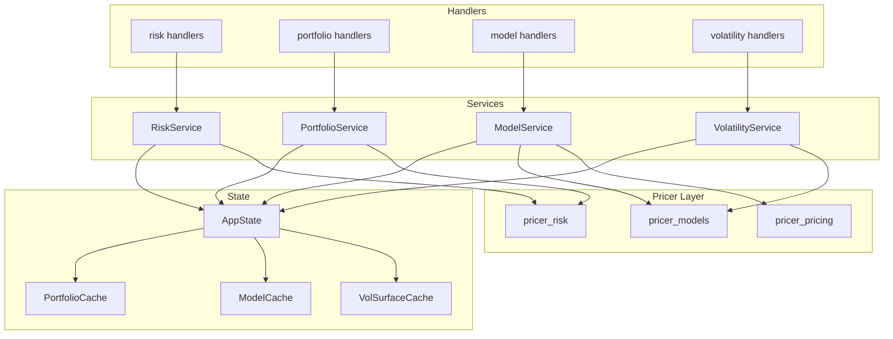
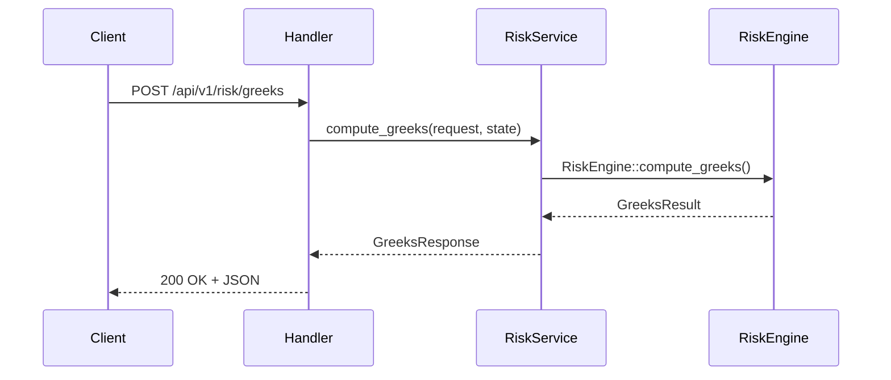
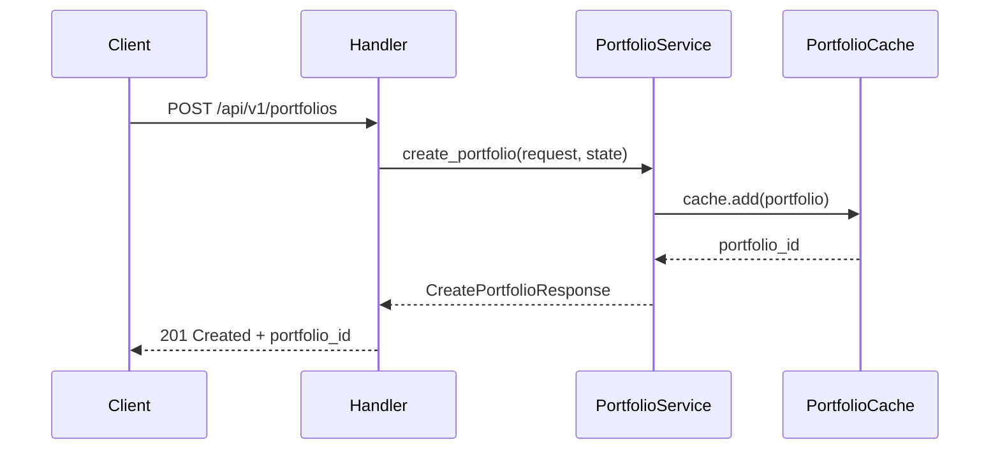
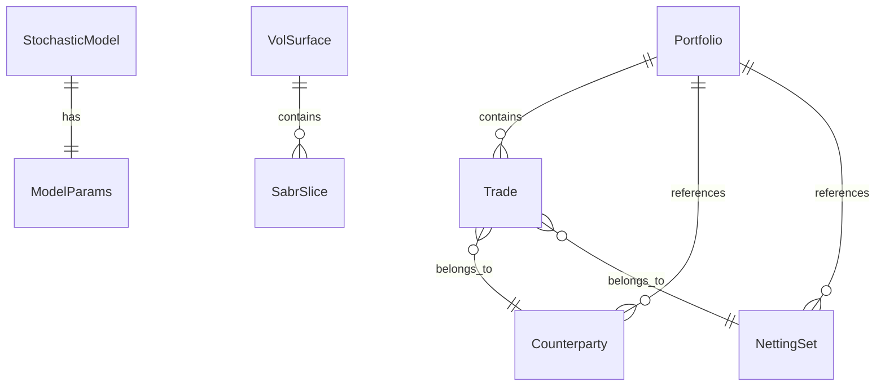

# Technical Design Document

## Overview

**Purpose**: service_gateway crate の services 層を拡充し、pricer_risk/pricer_pricing/pricer_models の機能を REST API として公開する。API 利用者（フロントエンド、バッチ処理、外部システム）が統一されたインターフェースでリスク計算、ポートフォリオ管理、モデル設定、ボラティリティ操作を実行可能にする。

**Users**:
- API 利用者（フロントエンド開発者、バッチ処理システム）
- リスクマネージャー（シナリオ分析、ポートフォリオリスク）
- クオンツ（モデル設定、価格計算比較）

**Impact**: 既存の CurveService/PricingService パターンを拡張し、4つの新サービス（RiskService, PortfolioService, ModelService, VolatilityService）を追加。既存機能への影響なし。

### Goals
- pricer_risk の Greeks 計算・シナリオ分析機能を REST API として公開
- ポートフォリオ CRUD および集計機能の提供
- 確率モデル設定・モデルベース価格計算機能の提供
- Vol Surface/Cube 構築・照会機能の提供
- Feature flags による選択的コンパイルの実現

### Non-Goals
- gRPC 実装（既存 `grpc` feature として別途対応）
- 永続化層の実装（キャッシュのみ、infra_store 連携は将来検討）
- 認証・認可機能（別途セキュリティ層で対応）

## Architecture

### Existing Architecture Analysis

現行の service_gateway は以下のパターンを採用：

- **Handler → Service → Pricer crate** の3層構造
- **thin Handler**: ビジネスロジックを含まず、Service への委譲のみ
- **static Service methods**: `pub struct XxxService;` で定義、全メソッドは静的
- **AppState**: LRU キャッシュを保持、`Arc<AppState>` で共有
- **ServerError**: 統一エラー型、`IntoResponse` 実装

### Architecture Pattern & Boundary Map



**Architecture Integration**:
- **Selected pattern**: Layered Architecture（Handler → Service → Pricer crate）
- **Domain boundaries**: 各サービスは単一の責務を持ち、対応する pricer crate のみに依存
- **Existing patterns preserved**: thin handler, static service methods, LRU cache
- **New components rationale**: 各 pricer crate の機能を独立してラップ、テスト容易性確保
- **Steering compliance**: A-I-P-S data flow（Service は Pricer layer のみに依存）

### Technology Stack

| Layer | Choice / Version | Role in Feature | Notes |
|-------|------------------|-----------------|-------|
| Backend / Services | Axum 0.7+ | REST API routing, handler | 既存と同一 |
| Backend / Services | pricer_risk | Greeks, Scenarios, Portfolio | RiskService, PortfolioService |
| Backend / Services | pricer_models | Stochastic models, Vol builders | ModelService, VolatilityService |
| Backend / Services | pricer_pricing | MonteCarloPricer, TreeMethod | ModelService（価格計算） |
| Data / Storage | lru 0.12 | LRU cache | 新規キャッシュ3種 |
| Data / Storage | parking_lot 0.12 | RwLock | スレッドセーフアクセス |
| Infrastructure | serde, serde_json | DTO serialization | 既存と同一 |

## System Flows

### Greeks Calculation Flow



### Portfolio CRUD Flow



## Requirements Traceability

| Requirement | Summary | Components | Interfaces | Flows |
|-------------|---------|------------|------------|-------|
| 1.1-1.5 | Greeks計算 | RiskService, RiskHandler | GreeksRequest/Response | Greeks Flow |
| 2.1-2.5 | シナリオ分析 | RiskService, RiskHandler | ScenarioRequest/Response | - |
| 3.1-3.6 | Portfolio CRUD | PortfolioService, PortfolioHandler, PortfolioCache | Portfolio DTOs | Portfolio CRUD Flow |
| 4.1-4.5 | Portfolio集計 | PortfolioService, PortfolioHandler | PortfolioAggregation DTOs | - |
| 5.1-5.5 | モデル設定 | ModelService, ModelHandler, ModelCache | Model DTOs | - |
| 6.1-6.5 | モデル価格計算 | ModelService, ModelHandler | ModelPricing DTOs | - |
| 7.1-7.5 | Vol Surface | VolatilityService, VolatilityHandler, VolSurfaceCache | Volatility DTOs | - |
| 8.1-8.5 | Feature Flags | Cargo.toml features | - | - |
| 9.1-9.5 | Error Domain分離 | error.rs 拡張 | ServerError variants | - |
| 10.1-10.5 | 一貫パターン | 全Services/Handlers/DTOs | - | - |
| 11.1-11.5 | AppState拡張 | AppState, 新キャッシュ | - | - |
| 12.1-12.4 | APIバージョニング | Router | - | - |

## Components and Interfaces

### Component Summary

| Component | Domain/Layer | Intent | Req Coverage | Key Dependencies | Contracts |
|-----------|--------------|--------|--------------|------------------|-----------|
| RiskService | Services | Greeks計算・シナリオ分析 | 1, 2 | pricer_risk::RiskEngine (P0) | Service, API |
| PortfolioService | Services | Portfolio CRUD・集計 | 3, 4 | pricer_risk::Portfolio (P0), PortfolioCache (P0) | Service, API |
| ModelService | Services | 確率モデル設定・価格計算 | 5, 6 | pricer_models::stochastic (P0), pricer_pricing (P1) | Service, API |
| VolatilityService | Services | Vol Surface構築・照会 | 7 | pricer_models::builder::vol (P0) | Service, API |
| PortfolioCache | State | Portfolio キャッシュ | 11 | lru (P0), parking_lot (P0) | State |
| ModelCache | State | Model キャッシュ | 11 | lru (P0), parking_lot (P0) | State |
| VolSurfaceCache | State | Vol Surface キャッシュ | 11 | lru (P0), parking_lot (P0) | State |
| ServerError (拡張) | Error | ドメインエラー統合 | 9 | thiserror (P0) | - |

---

### Services Layer

#### RiskService

| Field | Detail |
|-------|--------|
| Intent | pricer_risk の Greeks 計算・シナリオ分析機能をラップ |
| Requirements | 1.1-1.5, 2.1-2.5 |

**Responsibilities & Constraints**
- Greeks 計算（BumpAndRevalue / EnzymeAAD）の実行
- シナリオ分析（Preset / Custom）の実行
- pricer_risk::RiskEngine への委譲
- 計算時間の計測とレスポンスへの含有

**Dependencies**
- Outbound: pricer_risk::RiskEngine — Greeks/Scenario 計算 (P0)
- Outbound: pricer_risk::ScenarioEngine — シナリオ実行 (P0)

**Contracts**: Service [x] / API [x]

##### Service Interface
```rust
pub struct RiskService;

impl RiskService {
    /// Greeks 計算
    pub fn compute_greeks(
        request: &GreeksRequest,
        state: &Arc<AppState>,
    ) -> Result<GreeksResponse, ServerError>;

    /// シナリオ分析
    pub fn run_scenarios(
        request: &ScenarioRequest,
        state: &Arc<AppState>,
    ) -> Result<ScenarioResponse, ServerError>;
}
```

##### API Contract

| Method | Endpoint | Request | Response | Errors |
|--------|----------|---------|----------|--------|
| POST | /api/v1/risk/greeks | GreeksRequest | GreeksResponse | 400, 422, 500 |
| POST | /api/v1/risk/scenarios | ScenarioRequest | ScenarioResponse | 400, 422, 500 |

---

#### PortfolioService

| Field | Detail |
|-------|--------|
| Intent | Portfolio CRUD および集計機能を提供 |
| Requirements | 3.1-3.6, 4.1-4.5 |

**Responsibilities & Constraints**
- Portfolio の作成・取得・更新・削除
- PortfolioCache への永続化
- Portfolio 全体の価値・Greeks 集計
- NettingSet 別集計

**Dependencies**
- Outbound: pricer_risk::Portfolio — Portfolio 構造 (P0)
- Outbound: pricer_risk::PortfolioBuilder — Portfolio 構築 (P0)
- Outbound: pricer_risk::RiskEngine — Portfolio Greeks 計算 (P1)
- Outbound: PortfolioCache — キャッシュ (P0)

**Contracts**: Service [x] / API [x] / State [x]

##### Service Interface
```rust
pub struct PortfolioService;

impl PortfolioService {
    /// Portfolio 作成
    pub fn create_portfolio(
        request: &CreatePortfolioRequest,
        state: &Arc<AppState>,
    ) -> Result<CreatePortfolioResponse, ServerError>;

    /// Portfolio 取得
    pub fn get_portfolio(
        portfolio_id: &str,
        state: &Arc<AppState>,
    ) -> Result<GetPortfolioResponse, ServerError>;

    /// Trade 追加
    pub fn add_trades(
        portfolio_id: &str,
        request: &AddTradesRequest,
        state: &Arc<AppState>,
    ) -> Result<AddTradesResponse, ServerError>;

    /// Portfolio 削除
    pub fn delete_portfolio(
        portfolio_id: &str,
        state: &Arc<AppState>,
    ) -> Result<(), ServerError>;

    /// Portfolio 価値計算
    pub fn price_portfolio(
        portfolio_id: &str,
        state: &Arc<AppState>,
    ) -> Result<PortfolioPriceResponse, ServerError>;

    /// Portfolio Greeks 計算
    pub fn compute_portfolio_greeks(
        portfolio_id: &str,
        request: &PortfolioGreeksRequest,
        state: &Arc<AppState>,
    ) -> Result<PortfolioGreeksResponse, ServerError>;
}
```

##### API Contract

| Method | Endpoint | Request | Response | Errors |
|--------|----------|---------|----------|--------|
| POST | /api/v1/portfolios | CreatePortfolioRequest | CreatePortfolioResponse | 400, 500 |
| GET | /api/v1/portfolios/{id} | - | GetPortfolioResponse | 404, 500 |
| PUT | /api/v1/portfolios/{id}/trades | AddTradesRequest | AddTradesResponse | 400, 404, 500 |
| DELETE | /api/v1/portfolios/{id} | - | - | 404, 500 |
| POST | /api/v1/portfolios/{id}/price | - | PortfolioPriceResponse | 404, 422, 500 |
| POST | /api/v1/portfolios/{id}/greeks | PortfolioGreeksRequest | PortfolioGreeksResponse | 404, 422, 500 |

---

#### ModelService

| Field | Detail |
|-------|--------|
| Intent | 確率モデル設定・モデルベース価格計算 |
| Requirements | 5.1-5.5, 6.1-6.5 |

**Responsibilities & Constraints**
- StochasticModelEnum インスタンスの生成・キャッシュ
- GBM, Heston, HullWhite, CIR モデルのサポート
- MonteCarloPricer / TreeMethod による価格計算
- モデルパラメータのバリデーション

**Dependencies**
- Outbound: pricer_models::stochastic — StochasticModelEnum (P0)
- Outbound: pricer_pricing::mc::MonteCarloPricer — MC 価格計算 (P1)
- Outbound: pricer_pricing::tree::TreeMethod — Tree 価格計算 (P1)
- Outbound: ModelCache — キャッシュ (P0)

**Contracts**: Service [x] / API [x] / State [x]

##### Service Interface
```rust
pub struct ModelService;

impl ModelService {
    /// モデル作成
    pub fn create_model(
        request: &CreateModelRequest,
        state: &Arc<AppState>,
    ) -> Result<CreateModelResponse, ServerError>;

    /// モデル取得
    pub fn get_model(
        model_id: &str,
        state: &Arc<AppState>,
    ) -> Result<GetModelResponse, ServerError>;

    /// モデルベース価格計算
    pub fn price_with_model(
        model_id: &str,
        request: &ModelPricingRequest,
        state: &Arc<AppState>,
    ) -> Result<ModelPricingResponse, ServerError>;
}
```

##### API Contract

| Method | Endpoint | Request | Response | Errors |
|--------|----------|---------|----------|--------|
| POST | /api/v1/models | CreateModelRequest | CreateModelResponse | 400, 500 |
| GET | /api/v1/models/{id} | - | GetModelResponse | 404, 500 |
| POST | /api/v1/models/{id}/price | ModelPricingRequest | ModelPricingResponse | 400, 404, 422, 500 |

---

#### VolatilityService

| Field | Detail |
|-------|--------|
| Intent | Vol Surface/Cube 構築・照会 |
| Requirements | 7.1-7.5 |

**Responsibilities & Constraints**
- FxVolBuilder による FX Vol Surface 構築
- VolCubeBuilder による Vol Cube 構築
- 補間ボラティリティの照会
- SABR calibration 結果の返却

**Dependencies**
- Outbound: pricer_models::builder::vol::FxVolBuilder — FX Vol 構築 (P0)
- Outbound: pricer_models::builder::vol::VolCubeBuilder — Vol Cube 構築 (P0)
- Outbound: VolSurfaceCache — キャッシュ (P0)

**Contracts**: Service [x] / API [x] / State [x]

##### Service Interface
```rust
pub struct VolatilityService;

impl VolatilityService {
    /// FX Vol Surface 構築
    pub fn build_fx_vol_surface(
        request: &BuildFxVolSurfaceRequest,
        state: &Arc<AppState>,
    ) -> Result<BuildFxVolSurfaceResponse, ServerError>;

    /// Vol Cube 構築
    pub fn build_vol_cube(
        request: &BuildVolCubeRequest,
        state: &Arc<AppState>,
    ) -> Result<BuildVolCubeResponse, ServerError>;

    /// Implied Vol 照会
    pub fn get_implied_vol(
        surface_id: &str,
        request: &GetImpliedVolRequest,
        state: &Arc<AppState>,
    ) -> Result<GetImpliedVolResponse, ServerError>;
}
```

##### API Contract

| Method | Endpoint | Request | Response | Errors |
|--------|----------|---------|----------|--------|
| POST | /api/v1/volatility/fx-surface | BuildFxVolSurfaceRequest | BuildFxVolSurfaceResponse | 400, 422, 500 |
| POST | /api/v1/volatility/cube | BuildVolCubeRequest | BuildVolCubeResponse | 400, 422, 500 |
| POST | /api/v1/volatility/{id}/implied-vol | GetImpliedVolRequest | GetImpliedVolResponse | 404, 422, 500 |

---

### State Layer

#### PortfolioCache

| Field | Detail |
|-------|--------|
| Intent | Portfolio インスタンスの LRU キャッシュ |
| Requirements | 11.1 |

**State Management**
- State model: `LruCache<Uuid, PortfolioEntry>`
- Persistence: In-memory のみ（永続化なし）
- Concurrency: `parking_lot::RwLock` で保護

```rust
pub struct PortfolioEntry {
    pub portfolio: Portfolio,
    pub created_at: chrono::DateTime<chrono::Utc>,
}

pub struct PortfolioCache {
    inner: RwLock<LruCache<Uuid, PortfolioEntry>>,
}

impl PortfolioCache {
    pub fn new(capacity: usize) -> Self;
    pub fn add(&self, portfolio: Portfolio) -> Uuid;
    pub fn get(&self, id: &Uuid) -> Option<PortfolioEntry>;
    pub fn update(&self, id: &Uuid, portfolio: Portfolio) -> bool;
    pub fn remove(&self, id: &Uuid) -> Option<PortfolioEntry>;
}
```

---

#### ModelCache

| Field | Detail |
|-------|--------|
| Intent | StochasticModelEnum インスタンスの LRU キャッシュ |
| Requirements | 11.2 |

**State Management**
- State model: `LruCache<Uuid, ModelEntry>`
- Persistence: In-memory のみ
- Concurrency: `parking_lot::RwLock` で保護

```rust
pub struct ModelEntry {
    pub model_type: ModelType,
    pub params: ModelParamsDto,
    pub created_at: chrono::DateTime<chrono::Utc>,
}

pub struct ModelCache {
    inner: RwLock<LruCache<Uuid, ModelEntry>>,
}
```

---

#### VolSurfaceCache

| Field | Detail |
|-------|--------|
| Intent | Vol Surface/Cube の LRU キャッシュ |
| Requirements | 11.3 |

**State Management**
- State model: `LruCache<Uuid, VolSurfaceEntry>`
- Persistence: In-memory のみ
- Concurrency: `parking_lot::RwLock` で保護

```rust
pub struct VolSurfaceEntry {
    pub surface_type: VolSurfaceType,
    pub calibrated_params: Vec<SabrParams>,
    pub created_at: chrono::DateTime<chrono::Utc>,
}

pub struct VolSurfaceCache {
    inner: RwLock<LruCache<Uuid, VolSurfaceEntry>>,
}
```

---

### AppState Extension

```rust
pub struct AppState {
    // Existing
    pub curve_cache: CurveCache,
    pub fxvol_cache: FxVolCache,
    pub pricer: Arc<GenericPricer>,

    // New (feature-gated)
    #[cfg(feature = "risk")]
    pub portfolio_cache: PortfolioCache,

    #[cfg(feature = "models")]
    pub model_cache: ModelCache,

    #[cfg(feature = "volatility")]
    pub vol_surface_cache: VolSurfaceCache,
}
```

## Data Models

### Domain Model



### DTO Definitions

#### Risk DTOs (rest/dto/risk.rs)

```rust
#[derive(Debug, Clone, Deserialize)]
pub struct GreeksRequest {
    pub portfolio_id: String,
    pub mode: GreeksModeDto,
    pub greek_types: Vec<GreekTypeDto>,
}

#[derive(Debug, Clone, Serialize)]
pub struct GreeksResponse {
    pub portfolio_id: String,
    pub greeks: GreeksResultDto,
    pub calculation_time_ms: f64,
}

#[derive(Debug, Clone, Deserialize)]
#[serde(rename_all = "snake_case")]
pub enum GreeksModeDto {
    BumpAndRevalue,
    #[cfg(feature = "enzyme-ad")]
    EnzymeAad,
}

#[derive(Debug, Clone, Deserialize)]
pub struct ScenarioRequest {
    pub portfolio_id: String,
    pub scenarios: Vec<ScenarioDefinition>,
}

#[derive(Debug, Clone, Deserialize)]
#[serde(tag = "type", rename_all = "snake_case")]
pub enum ScenarioDefinition {
    Preset { preset_type: PresetScenarioTypeDto },
    Custom { shifts: Vec<RiskFactorShiftDto> },
}
```

#### Portfolio DTOs (rest/dto/portfolio.rs)

```rust
#[derive(Debug, Clone, Deserialize)]
pub struct CreatePortfolioRequest {
    pub name: Option<String>,
    pub counterparties: Vec<CounterpartyDto>,
    pub netting_sets: Vec<NettingSetDto>,
    pub trades: Vec<TradeDto>,
}

#[derive(Debug, Clone, Serialize)]
pub struct CreatePortfolioResponse {
    pub portfolio_id: String,
    pub trade_count: usize,
}

#[derive(Debug, Clone, Serialize)]
pub struct GetPortfolioResponse {
    pub portfolio_id: String,
    pub name: Option<String>,
    pub trade_count: usize,
    pub counterparty_count: usize,
    pub netting_set_count: usize,
    pub created_at: String,
}
```

#### Model DTOs (rest/dto/models.rs)

```rust
#[derive(Debug, Clone, Deserialize)]
#[serde(tag = "model_type", rename_all = "snake_case")]
pub enum CreateModelRequest {
    Gbm(GbmParamsDto),
    Heston(HestonParamsDto),
    HullWhite(HullWhiteParamsDto),
    Cir(CirParamsDto),
}

#[derive(Debug, Clone, Deserialize)]
pub struct ModelPricingRequest {
    pub method: PricingMethodDto,
    pub instrument: InstrumentDto,
    pub num_paths: Option<usize>,
    pub num_steps: Option<usize>,
}

#[derive(Debug, Clone, Deserialize)]
#[serde(rename_all = "snake_case")]
pub enum PricingMethodDto {
    Analytical,
    MonteCarlo,
    Tree,
}
```

#### Volatility DTOs (rest/dto/volatility.rs)

```rust
#[derive(Debug, Clone, Deserialize)]
pub struct BuildFxVolSurfaceRequest {
    pub currency_pair: String,
    pub quotes: Vec<VolQuoteDto>,
    pub fx_spot: f64,
    pub domestic_rate: f64,
    pub foreign_rate: f64,
}

#[derive(Debug, Clone, Serialize)]
pub struct BuildFxVolSurfaceResponse {
    pub surface_id: String,
    pub expiry_count: usize,
    pub sabr_params: Vec<SabrParamsDto>,
    pub calibration_time_ms: f64,
}
```

## Error Handling

### Error Strategy

ServerError を拡張し、ドメイン別 variant を追加：

```rust
#[derive(Error, Debug)]
pub enum ServerError {
    // Existing
    #[error("Pricing error: {0}")]
    Pricing(String),
    #[error("Calibration error: {0}")]
    Calibration(String),
    #[error("Invalid request: {0}")]
    InvalidRequest(String),
    #[error("Not found: {0}")]
    NotFound(String),
    #[error("Request timeout: {0}")]
    Timeout(String),
    #[error("Internal error: {0}")]
    Internal(String),

    // New domain variants
    #[error("Risk error: {0}")]
    Risk(String),
    #[error("Portfolio error: {0}")]
    Portfolio(String),
    #[error("Model error: {0}")]
    Model(String),
    #[error("Volatility error: {0}")]
    Volatility(String),
}
```

### Error Conversion

```rust
impl From<pricer_risk::RiskError> for ServerError {
    fn from(err: pricer_risk::RiskError) -> Self {
        ServerError::Risk(err.to_string())
    }
}

impl From<pricer_risk::PortfolioError> for ServerError {
    fn from(err: pricer_risk::PortfolioError) -> Self {
        ServerError::Portfolio(err.to_string())
    }
}

impl From<pricer_models::stochastic::ModelError> for ServerError {
    fn from(err: pricer_models::stochastic::ModelError) -> Self {
        ServerError::Model(err.to_string())
    }
}
```

### HTTP Status Mapping

| ServerError Variant | HTTP Status |
|---------------------|-------------|
| Risk | 422 Unprocessable Entity |
| Portfolio | 422 Unprocessable Entity |
| Model | 422 Unprocessable Entity |
| Volatility | 422 Unprocessable Entity |
| NotFound | 404 Not Found |
| InvalidRequest | 400 Bad Request |

## Testing Strategy

### Unit Tests
- RiskService: Greeks 計算（BumpAndRevalue）、シナリオ実行
- PortfolioService: CRUD 操作、集計計算
- ModelService: モデル作成、パラメータバリデーション
- VolatilityService: Surface 構築、補間
- Cache: add/get/remove/update 操作

### Integration Tests
- /api/v1/risk/greeks エンドポイント（正常系・異常系）
- /api/v1/portfolios CRUD フロー
- /api/v1/models 作成→価格計算フロー
- /api/v1/volatility Surface 構築→照会フロー

### Performance Tests
- Portfolio 価格計算（100 trades）: < 1秒
- Greeks 計算（bump-and-revalue）: < 500ms

## Optional Sections

### Feature Flags Configuration

```toml
[features]
default = ["rest"]
rest = []
grpc = []

# New features
risk = ["pricer_risk"]
models = ["pricer_models/equity", "pricer_models/rates", "pricer_pricing"]
volatility = ["pricer_models/serde"]

# Full bundle
full = ["rest", "risk", "models", "volatility"]
```

### Router Extension

```rust
fn api_v1_routes(state: Arc<AppState>) -> Router {
    let router = Router::new()
        // Existing routes
        .route("/price", post(handlers::price_instrument))
        .route("/price/batch", post(handlers::price_portfolio));

    #[cfg(feature = "risk")]
    let router = router
        .route("/risk/greeks", post(handlers::compute_greeks))
        .route("/risk/scenarios", post(handlers::run_scenarios))
        .nest("/portfolios", portfolio_routes());

    #[cfg(feature = "models")]
    let router = router.nest("/models", model_routes());

    #[cfg(feature = "volatility")]
    let router = router.nest("/volatility", volatility_routes());

    router.with_state(state)
}
```
