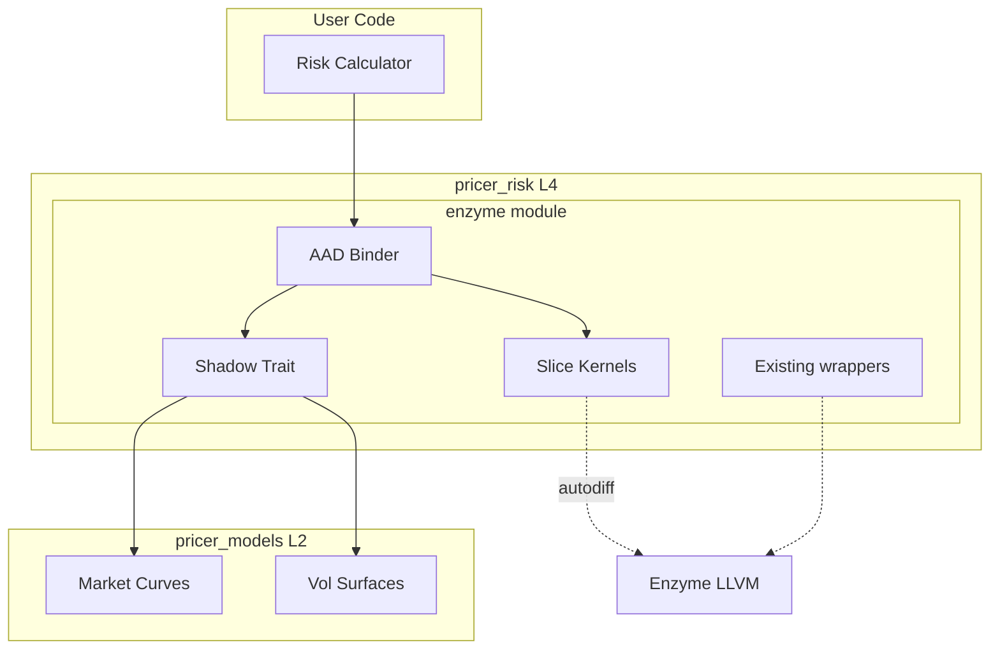
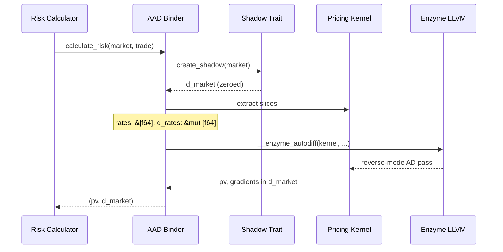
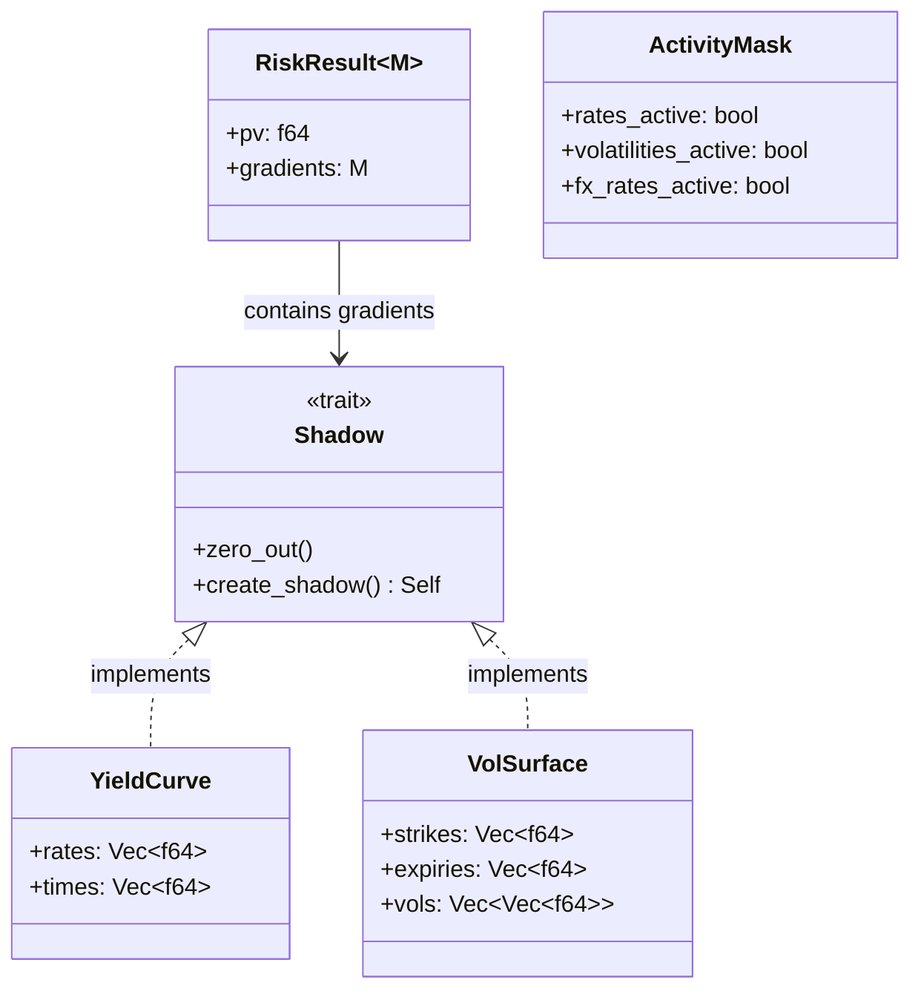

# Technical Design: shadow-object-aad

## Overview

**Purpose**: Shadow Object パターンを用いた Enzyme AAD（Automatic Adjoint Differentiation）統合を提供し、既存データ構造への変更なしに高性能な感度計算を実現する。

**Users**: クオンツ開発者、リスクエンジニアが pricer_risk レイヤーで自動微分を活用してリスク指標（Delta、Vega、Rho）を計算する。

**Impact**: 既存の enzyme モジュールをスライスベースカーネルに拡張し、マーケットデータ構造に対する勾配計算を可能にする。

### Goals

- Shadow オブジェクトによる勾配構造体の自動生成
- スライスベース（`&[f64]`）カーネルインターフェースの確立
- ゼロコピー・データ受け渡しによるパフォーマンス最適化
- 既存 pricer_risk::enzyme モジュールとの seamless 統合

### Non-Goals

- マーケットデータ構造（`Curve<T>`）へのジェネリクス追加
- Arena 方式のメモリ管理
- Forward mode AD（本仕様は Reverse mode 専用）
- proc-macro derive 実装（将来スコープ）

## Architecture

### Existing Architecture Analysis

**現行 pricer_risk::enzyme モジュール**:
- `mod.rs`: `ADMode`, `Activity` 列挙型、`gradient` 関数
- `wrappers.rs`: `#[autodiff]` マクロラッパー（スカラー引数のみ）
- `greeks.rs`: `GreeksEnzyme` トレイト、`EnzymeGreeksResult`

**制約**:
- 既存 wrappers はスカラー `f64` 引数のみ対応
- マーケットデータ構造への直接適用は未サポート
- `enzyme-ad` feature flag で分離（nightly 専用）

### Architecture Pattern & Boundary Map



**Architecture Integration**:
- **Selected pattern**: Hybrid Modules（shadow.rs + kernel.rs + binder.rs）
- **Domain boundaries**: Shadow Trait は pricer_risk 内に封じ込め、L2 マーケット構造体への impl を提供
- **Existing patterns preserved**: `Activity` 列挙型、`#[autodiff]` マクロ使用パターン、feature flag 分離
- **New components rationale**:
  - `shadow.rs`: 勾配構造体生成の責務分離
  - `kernel.rs`: スライスベースプライシング関数の分離
  - `binder.rs`: 高レベル API と低レベルカーネルの接続
- **Steering compliance**: A-I-P-S 依存方向維持、L4 が L2 に依存

### Technology Stack

| Layer | Choice / Version | Role in Feature | Notes |
|-------|------------------|-----------------|-------|
| AD Backend | Enzyme LLVM 18 | `#[autodiff]` マクロ変換 | nightly-2025-01-15 |
| Toolchain | Rust nightly | `std::autodiff` 使用 | feature = "enzyme-ad" |
| Traits | Clone + Shadow | 勾配オブジェクト生成 | 手動 impl |

## System Flows

### AAD Computation Flow



**Key Decision**: Binder がスライス抽出と Enzyme 呼び出しを仲介。ユーザーは構造体レベルで操作。

## Requirements Traceability

| Requirement | Summary | Components | Interfaces | Flows |
|-------------|---------|------------|------------|-------|
| 1.1-1.5 | Shadow Trait 定義 | ShadowTrait | `Shadow`, `create_shadow()`, `zero_out()` | - |
| 2.1-2.6 | スライスベースカーネル | SliceKernel | `pricing_kernel()`, `#[autodiff]` | AAD Computation |
| 3.1-3.7 | AAD バインダー | AadBinder | `calculate_risk()`, `RiskResult` | AAD Computation |
| 4.1-4.5 | ゼロコピー | SliceKernel, AadBinder | `as_ptr()`, `as_mut_ptr()` | AAD Computation |
| 5.1-5.5 | ジェネリクス回避 | All | 具象 `f64` 型 | - |
| 6.1-6.5 | 勾配マッピング | ShadowTrait | 同一型構造 | - |
| 7.1-7.5 | 部分微分 | AadBinder | `ActivityMask` | - |
| 8.1-8.5 | pricer_risk 統合 | All | enzyme/ module | - |

## Components and Interfaces

### Summary

| Component | Domain/Layer | Intent | Req Coverage | Key Dependencies | Contracts |
|-----------|--------------|--------|--------------|------------------|-----------|
| ShadowTrait | pricer_risk::enzyme::shadow | 勾配オブジェクト生成インターフェース | 1.1-1.5, 6.1-6.5 | Clone (P0) | Service |
| SliceKernel | pricer_risk::enzyme::kernel | スライスベースプライシング関数 | 2.1-2.6, 4.1-4.5, 5.1-5.3 | - | Service |
| AadBinder | pricer_risk::enzyme::binder | 高レベル AAD API | 3.1-3.7, 7.1-7.5, 8.1-8.5 | ShadowTrait (P0), SliceKernel (P0) | Service, State |

### pricer_risk::enzyme

#### ShadowTrait

| Field | Detail |
|-------|--------|
| Intent | 任意のマーケットデータ構造から勾配用 shadow オブジェクトを生成 |
| Requirements | 1.1, 1.2, 1.3, 1.4, 1.5, 6.1, 6.2, 6.3, 6.4, 6.5 |

**Responsibilities & Constraints**
- `Clone` bound を持つ型に対して shadow 生成メソッドを提供
- 全 `f64` フィールドと `Vec<f64>` 要素を 0.0 に初期化
- ネスト構造に対する再帰的 `zero_out()` サポート
- メモリレイアウトは元の型と同一を保証

**Dependencies**
- Inbound: Market data structures (`YieldCurve`, `VolSurface`) — Shadow impl 提供対象 (P0)
- Outbound: None
- External: `std::clone::Clone` — Rust 標準ライブラリ (P0)

**Contracts**: Service [x]

##### Service Interface

```rust
/// 勾配オブジェクト生成トレイト
///
/// # Requirements Coverage
/// - 1.1: Clone bound 要求
/// - 1.2: zero_out() による全フィールド初期化
/// - 1.3: create_shadow() による shadow 生成
/// - 1.4: 同一メモリレイアウト保証
/// - 1.5: ネスト構造サポート
pub trait Shadow: Clone {
    /// 全フィールドを 0.0 にリセット
    fn zero_out(&mut self);

    /// shadow オブジェクトを生成（clone + zero_out）
    fn create_shadow(&self) -> Self {
        let mut shadow = self.clone();
        shadow.zero_out();
        shadow
    }
}

// 基本型への実装
impl Shadow for f64 {
    fn zero_out(&mut self) { *self = 0.0; }
}

impl Shadow for Vec<f64> {
    fn zero_out(&mut self) { self.fill(0.0); }
}
```

- Preconditions: `self` は有効な初期化済みインスタンス
- Postconditions: `zero_out()` 後、全数値フィールドが 0.0
- Invariants: shadow のメモリレイアウトは元の型と同一

**Implementation Notes**
- Integration: 各マーケット構造体に対して手動 impl を提供
- Validation: `#[cfg(test)]` でゼロ初期化を検証
- Risks: ネスト構造での実装漏れ → 網羅的テスト必須

---

#### SliceKernel

| Field | Detail |
|-------|--------|
| Intent | Enzyme 互換のスライスベースプライシング関数を定義 |
| Requirements | 2.1, 2.2, 2.3, 2.4, 2.5, 2.6, 4.1, 4.2, 4.3, 4.4, 4.5, 5.1, 5.2, 5.3 |

**Responsibilities & Constraints**
- `&[f64]` スライスを引数とするプライシング関数を定義
- ヒープアロケーション禁止（hot path 内）
- 具象 `f64` 型のみ使用（ジェネリクスなし）
- `#[autodiff]` マクロで微分対象を宣言

**Dependencies**
- Inbound: AadBinder — カーネル呼び出し (P0)
- Outbound: None
- External: `std::autodiff::autodiff` — Enzyme マクロ (P0)

**Contracts**: Service [x]

##### Service Interface

```rust
use std::autodiff::autodiff;

/// スワップ価格計算カーネル
///
/// # Arguments
/// * `rates` - 割引レート（Active: 微分対象）
/// * `times` - 時間グリッド（Const: 定数）
/// * `notionals` - 想定元本（Const: 定数）
/// * `year_fractions` - 年率換算係数（Const: 定数）
/// * `output` - 計算結果（Active: シード値受け取り）
///
/// # Requirements Coverage
/// - 2.1: rates は Active input
/// - 2.2: times, notionals, year_fractions は Const input
/// - 2.3: output は &mut f64
/// - 2.4: ヒープアロケーションなし
/// - 2.5: #[autodiff] マクロ使用（#[no_mangle] 不要）
/// - 2.6: f64 のみ使用
#[cfg(feature = "enzyme-ad")]
#[autodiff(d_pricing_kernel, Reverse, Duplicated, Const, Const, Const, Duplicated)]
pub fn pricing_kernel(
    rates: &[f64],
    times: &[f64],
    notionals: &[f64],
    year_fractions: &[f64],
    output: &mut f64,
) {
    let n = rates.len();
    let mut pv = 0.0;

    for i in 0..n {
        let df = (-rates[i] * times[i]).exp();
        pv += notionals[i] * (rates[i] - 0.03) * year_fractions[i] * df;
    }

    *output = pv;
}

/// Finite difference fallback
#[cfg(not(feature = "enzyme-ad"))]
pub fn pricing_kernel(
    rates: &[f64],
    times: &[f64],
    notionals: &[f64],
    year_fractions: &[f64],
    output: &mut f64,
) {
    // 同一実装（AD なし）
}
```

- Preconditions: 全スライスは同一長さ、`output` は初期化済み
- Postconditions: `*output` に PV 値が書き込まれる
- Invariants: 関数内でヒープアロケーションなし

**Implementation Notes**
- Integration: `d_pricing_kernel` は Enzyme が自動生成
- Validation: 解析解との比較テスト
- Risks: 空スライス入力 → 長さチェック追加

---

#### AadBinder

| Field | Detail |
|-------|--------|
| Intent | Shadow オブジェクトとカーネル関数を接続し高レベル API を提供 |
| Requirements | 3.1, 3.2, 3.3, 3.4, 3.5, 3.6, 3.7, 7.1, 7.2, 7.3, 7.4, 7.5, 8.1, 8.2, 8.3, 8.4, 8.5 |

**Responsibilities & Constraints**
- マーケットデータ構造からスライスを抽出
- Shadow オブジェクトを生成し勾配バッファとして使用
- `Duplicated`/`Const` フラグで部分微分を制御
- 既存 `GreeksEnzyme` インフラとの互換性維持

**Dependencies**
- Inbound: User risk calculators — API 呼び出し (P0)
- Outbound: ShadowTrait — shadow 生成 (P0), SliceKernel — 計算実行 (P0)
- External: Market data structures (L2) — スライス抽出 (P0)

**Contracts**: Service [x] / State [x]

##### Service Interface

```rust
/// AAD 計算結果
pub struct RiskResult<M: Shadow> {
    /// Primal value (PV)
    pub pv: f64,
    /// 勾配オブジェクト（元の構造と同一型）
    pub gradients: M,
}

/// Activity マスク（部分微分制御）
///
/// # Requirements Coverage
/// - 7.1: コンポーネント単位の active/const 指定
/// - 7.5: const コンポーネントの shadow は 0.0 のまま
pub struct ActivityMask {
    pub rates_active: bool,
    pub volatilities_active: bool,
    pub fx_rates_active: bool,
}

impl Default for ActivityMask {
    fn default() -> Self {
        Self {
            rates_active: true,
            volatilities_active: true,
            fx_rates_active: true,
        }
    }
}

/// マーケットリスク計算インターフェース
///
/// # Requirements Coverage
/// - 3.1: market, trade 入力
/// - 3.2: Shadow trait で shadow 生成
/// - 3.3: スライス抽出
/// - 3.4: shadow スライスで勾配蓄積
/// - 3.5: (pv, shadow) を返却
/// - 3.6, 3.7: Activity フラグ使用
pub trait MarketRiskCalculator<M: Shadow, T> {
    fn calculate_risk(
        &self,
        market: &M,
        trade: &T,
        mask: &ActivityMask,
    ) -> RiskResult<M>;
}
```

- Preconditions: `market` は有効なマーケットデータ、`trade` は有効なトレード定義
- Postconditions: `RiskResult.gradients` に各マーケット要素の感度が格納
- Invariants: `mask` で `false` 指定された要素の勾配は 0.0

##### State Management

- State model: `RiskResult<M>` は計算結果を保持（イミュータブル）
- Persistence: なし（計算ごとに生成）
- Concurrency: `calculate_risk` は `&self` で呼び出し可能（スレッドセーフ）

**Implementation Notes**
- Integration: `GreeksEnzyme` トレイトの拡張として実装可能
- Validation: 部分微分の正確性を bump-and-revalue と比較
- Risks: 大規模マーケットでの `clone()` コスト → プロファイリング実施

## Data Models

### Domain Model



**Aggregates**: `RiskResult<M>` は計算結果の aggregate root
**Invariants**: `gradients` のメモリレイアウトは入力 `market` と同一

### Data Contracts & Integration

**API Data Transfer**
- Request: `MarketRiskCalculator::calculate_risk(market, trade, mask)`
- Response: `RiskResult<M>` with `pv: f64` and `gradients: M`

## Error Handling

### Error Strategy

```rust
/// Shadow Object AAD エラー型
#[derive(Debug, thiserror::Error)]
pub enum ShadowAadError {
    #[error("Slice length mismatch: expected {expected}, got {actual}")]
    LengthMismatch { expected: usize, actual: usize },

    #[error("Empty slice not allowed for {field}")]
    EmptySlice { field: &'static str },

    #[error("Enzyme AD not available (compile with enzyme-ad feature)")]
    EnzymeNotAvailable,
}
```

### Error Categories and Responses

- **User Errors**: `LengthMismatch`, `EmptySlice` → 入力検証で早期検出
- **System Errors**: `EnzymeNotAvailable` → finite difference fallback

## Testing Strategy

### Unit Tests

1. `Shadow::zero_out()` が全フィールドを 0.0 にすることを検証
2. `Shadow::create_shadow()` が元のオブジェクトを変更しないことを検証
3. `pricing_kernel` が正しい PV を計算することを検証（解析解比較）
4. `d_pricing_kernel` が正しい勾配を計算することを検証（finite difference 比較）
5. `ActivityMask` による部分微分の動作検証

### Integration Tests

1. `YieldCurve` に対する Delta/DV01 計算（期待値: bump-and-revalue と一致）
2. `VolSurface` に対する Vega 計算
3. 複数カーブを含むマーケットデータに対する統合リスク計算
4. `enzyme-ad` feature 有効/無効での結果一致確認

### Performance Tests

1. 1000 要素のスライスに対する AAD パフォーマンス
2. `clone()` + `zero_out()` のオーバーヘッド測定
3. Bump-and-revalue との速度比較（target: 10x 高速化）

## Optional Sections

### Performance & Scalability

**Target Metrics**:
- 1000 要素スライス: AAD < 1ms
- 勾配計算: bump-and-revalue の 1/10 以下の時間

**Optimization Techniques**:
- ゼロコピースライス抽出（`as_ptr()` 使用）
- ヒープアロケーション回避（kernel 内）
- `clone()` はシャローコピー活用（`Vec<f64>` は capacity 維持）

### Security Considerations

- **No external input**: カーネル関数はライブラリ内部でのみ呼び出し
- **Memory safety**: Enzyme 呼び出しは `unsafe` だが、境界チェック済みスライスを渡す
- **Feature isolation**: `enzyme-ad` feature で nightly 依存を分離
