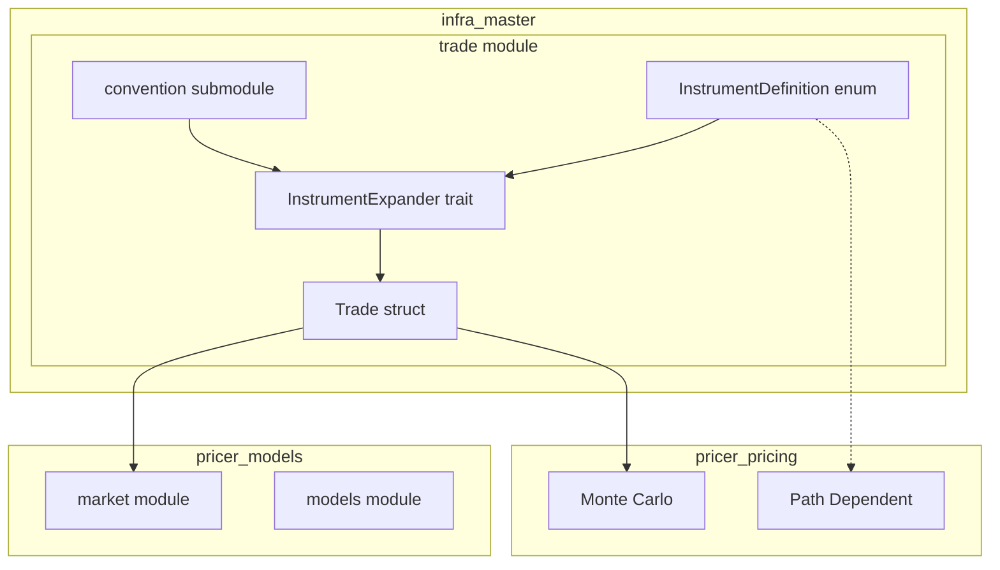
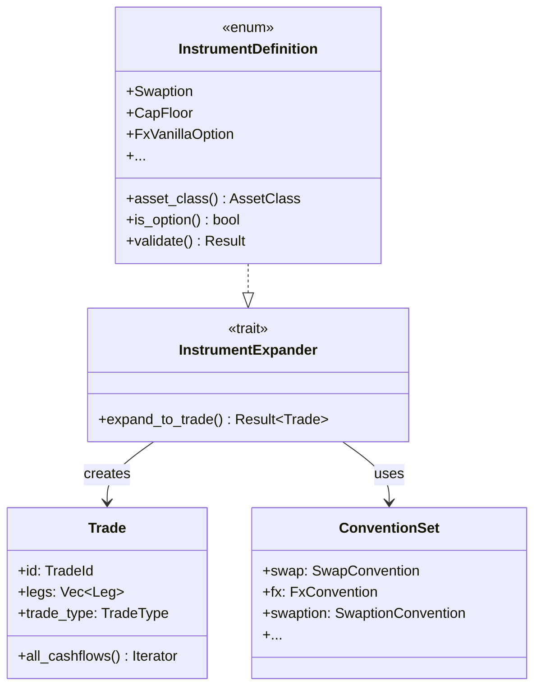
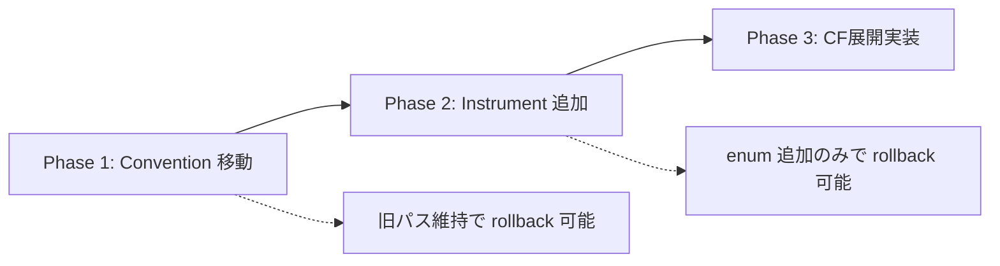

# Design Document

## Overview

**Purpose**: 本機能は、Tier-1銀行のトレーディングデスクで使用される標準的な金融商品（Rates、FX、Equity、Credit、Commodity）の包括的な定義を提供し、クオンツ開発者・トレーダーが価格計算・リスク管理パイプラインで統一されたデータ構造を利用できるようにする。

**Users**: クオンツ開発者、トレーダー、リスクマネージャーが、商品定義の作成、CF展開、価格計算ワークフローで利用する。

**Impact**: 既存の `infra_master::trade` モジュールを拡張し、`convention/` を `trade/` 配下に統合することで、Trade 関連機能の一元化を実現する。

### Goals
- 5資産クラス（Rates、FX、Equity、Credit、Commodity）の標準商品を包括的に定義
- 既存の `Trade` → `Leg` → `Cashflow` アーキテクチャとのシームレスな統合
- 型安全かつ拡張可能なデータ構造の提供
- serde による直列化対応

### Non-Goals
- 価格計算ロジック（pricer_pricing の責務）
- モデルキャリブレーション（pricer_models の責務）
- リアルタイム市場データ連携（adapter_feeds の責務）
- FpML/XML パース（adapter_fpml の責務）

## Architecture

### Existing Architecture Analysis

現在の `infra_master` 構造:

```text
infra_master/src/
├── convention/          # 市場慣行（現在の位置）
│   ├── swap.rs, fx.rs, cds.rs, ...
├── trade/               # Trade 構造
│   ├── instrument.rs    # 7種のキャリブレーション商品のみ
│   ├── trade.rs, cashflow.rs, leg.rs, ...
```

**課題**:
- `convention/` と `trade/` が分離しており、関連性が不明確
- `instrument.rs` がキャリブレーション商品のみで、取引可能商品の定義がない
- エキゾチック商品の定義が存在しない

### Architecture Pattern & Boundary Map



**Architecture Integration**:
- **Selected pattern**: Hierarchical Enum with Submodule Separation
- **Domain boundaries**: 商品定義（infra_master） ↔ 価格計算（pricer_pricing） を明確分離
- **Existing patterns preserved**: `Trade` → `Leg` → `Cashflow` CF展開パターン
- **New components rationale**:
  - `InstrumentDefinition`: 全商品を統一表現
  - `InstrumentExpander`: CF展開の抽象化
  - `trade/convention/`: 既存移動＋新規追加
- **Steering compliance**: A-I-P-S 依存ルール準拠（Infra → Pricer の一方向依存）

### Technology Stack

| Layer | Choice / Version | Role in Feature | Notes |
|-------|------------------|-----------------|-------|
| Data Types | Rust enum/struct | 商品定義、型安全なデータ表現 | Static dispatch for Enzyme compatibility |
| Serialisation | serde (feature-gated) | JSON/TOML 入出力 | `#[cfg_attr(feature = "serde", ...)]` |
| Error Handling | thiserror | 構造化エラー | 既存 `TradeError` 拡張 |
| Date/Time | chrono (via Date) | 日付計算 | 既存パターン継続 |

## Requirements Traceability

| Requirement | Summary | Components | Interfaces | Flows |
|-------------|---------|------------|------------|-------|
| 1.1-1.6 | 金利商品定義 | `instrument/rates.rs` | `InstrumentDefinition::Swaption`, etc. | CF展開 |
| 2.1-2.6 | FX商品定義 | `instrument/fx.rs` | `InstrumentDefinition::FxSpot`, etc. | CF展開 |
| 3.1-3.7 | 株式商品定義 | `instrument/equity.rs` | `InstrumentDefinition::EquityOption`, etc. | CF展開 |
| 4.1-4.5 | クレジット商品定義 | `instrument/credit.rs` | `InstrumentDefinition::Cds`, etc. | CF展開 |
| 5.1-5.6 | コモディティ商品定義 | `instrument/commodity.rs` | `InstrumentDefinition::CommodityForward`, etc. | CF展開 |
| 6.1-6.7 | CF展開機能 | `InstrumentExpander` trait | `expand_to_trade()` | InstrumentDefinition → Trade |
| 7.1-7.6 | データ構造設計 | `instrument/mod.rs` | `InstrumentDefinition`, helpers | — |
| 8.1-8.5 | テスト検証 | `tests/` | — | Unit/Property tests |

## Components and Interfaces

### Component Summary

| Component | Domain/Layer | Intent | Req Coverage | Key Dependencies | Contracts |
|-----------|--------------|--------|--------------|------------------|-----------|
| `instrument/mod.rs` | Trade | InstrumentDefinition enum と共通トレイト | 7.1-7.6 | Date, Currency, Tenor | Service |
| `instrument/rates.rs` | Trade | 金利商品バリアント定義 | 1.1-1.6 | RateIndex, SwapConvention | — |
| `instrument/fx.rs` | Trade | FX商品バリアント定義 | 2.1-2.6 | Currency, FxConvention | — |
| `instrument/equity.rs` | Trade | 株式商品バリアント定義 | 3.1-3.7 | IndexType::Equity | — |
| `instrument/credit.rs` | Trade | クレジット商品バリアント定義 | 4.1-4.5 | CdsConvention | — |
| `instrument/commodity.rs` | Trade | コモディティ商品バリアント定義 | 5.1-5.6 | IndexType::Commodity | — |
| `InstrumentExpander` | Trade | CF展開トレイト | 6.1-6.7 | Convention, TradeBuilder | Service |
| `convention/` (移動) | Trade | 市場慣行定義 | 6.7 | — | — |

### Trade / Instrument Layer

#### InstrumentDefinition

| Field | Detail |
|-------|--------|
| Intent | 全資産クラスの標準商品を統一的に表現する列挙型 |
| Requirements | 7.1, 7.2, 7.3, 7.5 |

**Responsibilities & Constraints**
- 全商品を単一 enum で表現（Enzyme 互換 static dispatch）
- 各バリアントは必要最小限のフィールドのみ保持
- serde feature で直列化対応

**Dependencies**
- Inbound: None
- Outbound: `Trade` (via `InstrumentExpander`) — CF展開 (P0)
- External: `chrono::Date`, `Currency`, `Tenor` — 基本型 (P0)

**Contracts**: Service [x]

##### Service Interface
```rust
/// 全資産クラスの標準商品定義
#[derive(Debug, Clone, PartialEq)]
#[cfg_attr(feature = "serde", derive(serde::Serialize, serde::Deserialize))]
pub enum InstrumentDefinition {
    // === Rates ===
    Swaption(Swaption),
    CapFloor(CapFloor),
    Frn(Frn),
    CmsSwap(CmsSwap),
    InflationSwap(InflationSwap),

    // === FX ===
    FxSpot(FxSpot),
    FxForward(FxForward),
    FxVanillaOption(FxVanillaOption),
    FxBarrierOption(FxBarrierOption),
    FxSwap(FxSwap),  // 短期 FX Swap (Near/Far leg)

    // === Equity ===
    EquityForward(EquityForward),
    EquityVanillaOption(EquityVanillaOption),
    EquityBarrierOption(EquityBarrierOption),
    AsianOption(AsianOption),
    LookbackOption(LookbackOption),
    EquitySwap(EquitySwap),
    BasketOption(BasketOption),

    // === Credit ===
    Cds(Cds),
    CdsIndex(CdsIndex),
    CdsOption(CdsOption),
    NtdBasket(NtdBasket),

    // === Commodity ===
    CommodityForward(CommodityForward),
    CommoditySwap(CommoditySwap),
    CommodityVanillaOption(CommodityVanillaOption),
    CommodityAsianOption(CommodityAsianOption),
    SpreadOption(SpreadOption),

    // === Existing (re-export & extend) ===
    // キャリブレーション商品を取引可能商品として拡張統合
    Deposit(Deposit),
    Fra(Fra),
    Futures(Futures),
    ParSwap(ParSwap),
    Ois(Ois),
    BasisSwap(BasisSwap),
    CrossCurrencySwap(CrossCurrencySwap),  // 長期 CCS (元本交換 + 金利支払い)
}

impl InstrumentDefinition {
    /// 資産クラスを返す
    pub fn asset_class(&self) -> AssetClass;

    /// オプション商品かどうか
    pub fn is_option(&self) -> bool;

    /// スワップ商品かどうか
    pub fn is_swap(&self) -> bool;

    /// フォワード商品かどうか
    pub fn is_forward(&self) -> bool;

    /// バリデーション
    pub fn validate(&self) -> Result<(), InstrumentError>;
}
```

**Implementation Notes**
- Integration: 既存 `Instrument` enum は `InstrumentDefinition` の一部として再利用
- Validation: 各バリアントに `validate()` メソッド実装
- Risks: enum 肥大化（50+ バリアント）→ 資産クラス別サブモジュールで管理

---

#### InstrumentExpander Trait

| Field | Detail |
|-------|--------|
| Intent | InstrumentDefinition を Trade（CF展開）に変換するトレイト |
| Requirements | 6.1, 6.2, 6.3, 6.4, 6.5, 6.6 |

**Responsibilities & Constraints**
- Convention を受け取り、適切な Cashflow 列を生成
- エラー時は `InstrumentError` を返却
- 既存 `Trade::all_cashflows()` と互換

**Dependencies**
- Inbound: `InstrumentDefinition` — 展開元 (P0)
- Outbound: `Trade`, `Leg`, `Cashflow` — 展開先 (P0)
- External: Convention modules — 市場慣行 (P0)

**Contracts**: Service [x]

##### Service Interface
```rust
/// CF展開トレイト
pub trait InstrumentExpander {
    /// Convention を用いて Trade に展開
    fn expand_to_trade(
        &self,
        trade_id: impl Into<TradeId>,
        valuation_date: Date,
        conventions: &ConventionSet,
    ) -> Result<Trade, InstrumentError>;
}

impl InstrumentExpander for InstrumentDefinition {
    fn expand_to_trade(
        &self,
        trade_id: impl Into<TradeId>,
        valuation_date: Date,
        conventions: &ConventionSet,
    ) -> Result<Trade, InstrumentError> {
        match self {
            InstrumentDefinition::Swaption(s) => s.expand(trade_id, valuation_date, conventions),
            // ... other variants
        }
    }
}
```

**Implementation Notes**
- Integration: 各バリアントが個別の `expand()` メソッドを持つ
- Validation: 展開前に `validate()` を呼び出し
- Risks: Convention 不足 → `InstrumentError::MissingConvention`

---

### Convention Submodule (移動＋拡張)

#### ConventionSet (CF展開用 Convention コンテナ)

```rust
/// CF展開に必要な Convention を集約するコンテナ
#[derive(Debug, Clone, Default)]
pub struct ConventionSet {
    // === Rates ===
    pub swap: Option<SwapConvention>,
    pub swaption: Option<SwaptionConvention>,
    pub cap_floor: Option<CapFloorConvention>,
    pub fra: Option<FraConvention>,
    pub inflation_swap: Option<InflationSwapConvention>,

    // === FX ===
    pub fx: Option<FxConvention>,
    pub fx_option: Option<FxOptionConvention>,

    // === Credit ===
    pub cds: Option<CdsConvention>,

    // === Equity ===
    pub equity: Option<EquityConvention>,

    // === Commodity ===
    pub commodity: Option<CommodityConvention>,

    // === Bond ===
    pub bond: Option<BondConvention>,
}

impl ConventionSet {
    /// 新規 ConventionSet を作成
    pub fn new() -> Self {
        Self::default()
    }

    /// 指定された Convention を取得、未設定の場合はエラー
    pub fn get_swap(&self) -> Result<&SwapConvention, InstrumentError> {
        self.swap.as_ref().ok_or_else(|| InstrumentError::MissingConvention {
            instrument_type: "Swap".into(),
        })
    }

    /// Builder pattern: SwapConvention を設定
    pub fn with_swap(mut self, conv: SwapConvention) -> Self {
        self.swap = Some(conv);
        self
    }

    // ... 他の Convention に対しても同様の get_* / with_* メソッド

    /// 標準 USD 市場の ConventionSet を返す
    pub fn usd_standard() -> Self {
        Self::new()
            .with_swap(SwapConvention::usd_sofr())
            .with_fx(FxConvention::usd_default())
            .with_cds(CdsConvention::north_american())
    }

    /// 標準 EUR 市場の ConventionSet を返す
    pub fn eur_standard() -> Self {
        Self::new()
            .with_swap(SwapConvention::eur_euribor_6m())
            .with_fx(FxConvention::eur_default())
            .with_cds(CdsConvention::european())
    }
}
```

**設計方針**:
- `Option<T>` で各 Convention を保持し、必要な Convention のみ設定可能
- `get_*()` メソッドで未設定時は `InstrumentError::MissingConvention` を返却
- Builder pattern (`with_*`) で fluent API を提供
- 標準市場プリセット（`usd_standard()`, `eur_standard()`）で利便性向上

---

#### 新規 Convention 定義

| Component | Intent | Requirements |
|-----------|--------|--------------|
| `SwaptionConvention` | Swaption 市場慣行 | 1.1 |
| `FxOptionConvention` | FX オプション市場慣行 | 2.3, 2.4 |
| `EquityConvention` | 株式商品市場慣行 | 3.1-3.7 |
| `CommodityConvention` | コモディティ市場慣行 | 5.1-5.6 |
| `InflationSwapConvention` | インフレスワップ市場慣行 | 1.5 |

##### SwaptionConvention
```rust
#[derive(Debug, Clone, PartialEq)]
#[cfg_attr(feature = "serde", derive(serde::Serialize, serde::Deserialize))]
pub struct SwaptionConvention {
    pub underlying_swap: SwapConvention,
    pub premium_settlement: SettlementConvention,
    pub exercise_settlement: SettlementConvention,
    pub premium_currency: Currency,
}
```

##### FxOptionConvention
```rust
#[derive(Debug, Clone, PartialEq)]
#[cfg_attr(feature = "serde", derive(serde::Serialize, serde::Deserialize))]
pub struct FxOptionConvention {
    pub premium_currency: PremiumCurrency,
    pub delta_convention: DeltaConvention,
    pub cut_off_time: CutOffTime,
    pub settlement_days: u32,
    pub calendar: CalendarId,
}

#[derive(Debug, Clone, Copy, PartialEq, Eq)]
pub enum PremiumCurrency {
    Base,
    Quote,
    Custom(Currency),
}

#[derive(Debug, Clone, Copy, PartialEq, Eq)]
pub enum DeltaConvention {
    SpotDelta,
    ForwardDelta,
}
```

---

## Data Models

### Domain Model



### Key Entities

#### AssetClass
```rust
#[derive(Debug, Clone, Copy, PartialEq, Eq, Hash)]
#[cfg_attr(feature = "serde", derive(serde::Serialize, serde::Deserialize))]
pub enum AssetClass {
    Rates,
    Fx,
    Equity,
    Credit,
    Commodity,
}
```

#### Rates Instruments (1.1-1.5)
```rust
#[derive(Debug, Clone, PartialEq)]
pub struct Swaption {
    pub underlying_swap_tenor: Tenor,
    pub expiry: Date,
    pub exercise_type: ExerciseType,
    pub settlement_type: SettlementType,
    pub strike: f64,
    pub notional: f64,
    pub currency: Currency,
    pub payer_receiver: PayerReceiver,
}

#[derive(Debug, Clone, PartialEq)]
pub struct CapFloor {
    pub cap_floor_type: CapFloorType,
    pub strikes: Vec<f64>,
    pub index: RateIndex,
    pub start_date: Date,
    pub tenor: Tenor,
    pub notional_schedule: NotionalSchedule,
    pub payment_frequency: Frequency,
    pub currency: Currency,
}
```

#### FX Instruments (2.1-2.6)
```rust
#[derive(Debug, Clone, PartialEq)]
pub struct FxVanillaOption {
    pub currency_pair: CurrencyPair,
    pub strike: f64,
    pub expiry: Date,
    pub delivery_date: Date,
    pub option_type: OptionType,
    pub exercise_style: ExerciseStyle,
    pub notional: f64,
    pub notional_currency: Currency,
}

#[derive(Debug, Clone, PartialEq)]
pub struct FxBarrierOption {
    pub vanilla: FxVanillaOption,
    pub barrier_level: f64,
    pub barrier_type: BarrierType,
    pub barrier_direction: BarrierDirection,
    pub rebate: Option<f64>,
}

#[derive(Debug, Clone, Copy, PartialEq, Eq)]
pub enum BarrierType {
    KnockIn,
    KnockOut,
}

#[derive(Debug, Clone, Copy, PartialEq, Eq)]
pub enum BarrierDirection {
    Up,
    Down,
}
```

#### Equity Instruments (3.1-3.7)
```rust
#[derive(Debug, Clone, PartialEq)]
pub struct AsianOption {
    pub underlying: EquityUnderlying,
    pub strike: f64,
    pub expiry: Date,
    pub option_type: OptionType,
    pub averaging_type: AveragingType,
    pub observation_frequency: Frequency,
    pub observed_values: Vec<f64>,
    pub notional: f64,
    pub currency: Currency,
}

#[derive(Debug, Clone, Copy, PartialEq, Eq)]
pub enum AveragingType {
    Arithmetic,
    Geometric,
}
```

#### Credit Instruments (4.1-4.5)
```rust
#[derive(Debug, Clone, PartialEq)]
pub struct Cds {
    pub reference_entity: String,
    pub notional: f64,
    pub spread: f64,
    pub start_date: Date,
    pub maturity: Date,
    pub recovery_rate: Option<f64>,
    pub currency: Currency,
}

#[derive(Debug, Clone, Copy, PartialEq, Eq)]
pub enum CreditEvent {
    Bankruptcy,
    FailureToPay,
    Restructuring,
    ObligationAcceleration,
    ObligationDefault,
    RepudiationMoratorium,
}
```

#### Commodity Instruments (5.1-5.6)
```rust
#[derive(Debug, Clone, PartialEq)]
pub struct CommodityForward {
    pub commodity: CommodityType,
    pub delivery_location: String,
    pub delivery_date: Date,
    pub quantity: f64,
    pub unit: QuantityUnit,
    pub forward_price: f64,
    pub currency: Currency,
}

#[derive(Debug, Clone, Copy, PartialEq, Eq)]
pub enum CommodityType {
    Energy(EnergyType),
    Metals(MetalType),
    Agriculture(AgricultureType),
}
```

---

## Error Handling

### Error Strategy

`InstrumentError` を拡張し、商品固有のエラーを追加:

```rust
#[derive(Error, Debug, Clone, PartialEq)]
pub enum InstrumentError {
    #[error("Invalid instrument parameter: {0}")]
    InvalidParameter(String),

    #[error("Missing convention for {instrument_type}")]
    MissingConvention { instrument_type: String },

    #[error("Invalid date configuration: {0}")]
    InvalidDate(String),

    #[error("Validation failed: {0}")]
    ValidationFailed(String),

    #[error("CF expansion failed: {0}")]
    ExpansionFailed(String),

    #[error(transparent)]
    TradeError(#[from] TradeError),
}
```

### Error Categories and Responses

- **User Errors (4xx equivalent)**: `InvalidParameter`, `ValidationFailed` → 明確なフィールドレベルエラー
- **System Errors**: `ExpansionFailed` → Convention 不整合、内部ロジックエラー
- **Business Logic Errors**: `MissingConvention` → 必要な Convention が未設定

---

## Testing Strategy

### Unit Tests
- 各商品バリアントの構築・バリデーション
- `is_option()`, `is_swap()`, `asset_class()` ヘルパーメソッド
- serde 往復変換（`Serialize` → `Deserialize`）

### Integration Tests
- `InstrumentExpander::expand_to_trade()` による CF 展開
- 展開結果の `Trade::all_cashflows()` 列挙
- Convention との整合性検証

### Property-Based Tests (proptest)
- 任意パラメータでの `validate()` 呼び出し
- 有効な商品は常に展開可能
- 展開後の Cashflow 数が期待値と一致

### Edge Case Tests
- ゼロノーショナル
- 同一日の開始/終了
- 空の観測値リスト（Asian）
- 負のストライク

---

## Migration Strategy

### Phase 1: Convention 移動
1. `infra_master/src/convention/` → `infra_master/src/trade/convention/` にファイルコピー
2. `trade/mod.rs` で `pub mod convention;` 追加
3. 旧パス互換性維持: `infra_master/src/lib.rs` に re-export 追加
4. deprecation 警告追加

**Re-export 実装例** (`infra_master/src/lib.rs`):
```rust
// 新パス (推奨)
pub mod trade;
pub use trade::convention;  // infra_master::convention として利用可能

// 旧パスからの re-export (deprecation 付き)
#[deprecated(since = "0.8.0", note = "Use `infra_master::trade::convention` instead")]
pub mod convention_compat {
    pub use crate::trade::convention::*;
}
```

**移行期間**: 0.8.0 で deprecation、0.9.0 で `convention_compat` 削除予定

### Phase 2: InstrumentDefinition 追加
1. `trade/instrument/` サブモジュール作成
2. 各資産クラスファイル（rates.rs, fx.rs, ...）追加
3. `InstrumentDefinition` enum 定義
4. 既存 `Instrument` バリアントを統合

### Phase 3: CF展開実装
1. `InstrumentExpander` trait 定義
2. 各バリアントに `expand()` 実装
3. Convention 拡張（Swaption, FxOption, ...）
4. テスト追加


