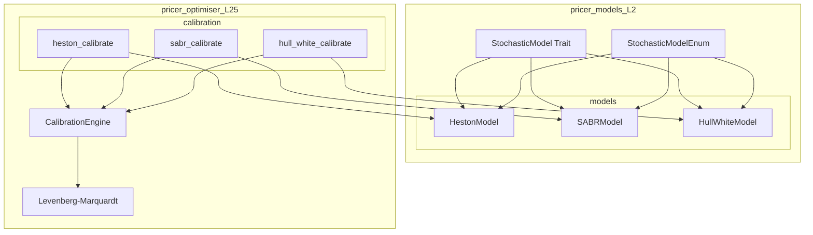

# Design Document: stochastic-models

## Overview

**Purpose**: Heston、SABR、Hull-White 確率過程モデルの完成により、Monte Carlo シミュレーションおよびキャリブレーション機能を提供する。

**Users**: クオンツ開発者が derivatives pricing library でエクイティ、金利、FX デリバティブの価格計算およびリスク管理に使用する。

**Impact**: 既存の StochasticModel トレイトアーキテクチャを拡張し、SABR の StochasticModel 実装追加、全モデルへのキャリブレーション機能追加を行う。

### Goals

- SABR モデルに StochasticModel トレイト実装を追加
- StochasticModelEnum に SABR バリアントを追加
- Heston, SABR, Hull-White の calibrate 関数を実装
- Hull-White の時間依存 θ(t) をサポート
- AD 互換性検証テストを追加

### Non-Goals

- 新規確率過程モデルの追加（CIR、GBM は対象外）
- pricer_pricing への直接的な変更（L3 は独立維持）
- GPU/CUDA 対応

---

## Architecture

### Existing Architecture Analysis

**現在の構造**:
- `StochasticModel<T>` トレイト: `evolve_step`, `initial_state`, `brownian_dim` を定義
- `StochasticModelEnum<T>`: GBM, Heston, HullWhite, CIR の静的ディスパッチ enum
- `TwoFactorState<T>`, `SingleState<T>`: 状態ベクトル型
- Heston: QE スキームで完全実装済み
- SABR: パラメータと Hagan 公式のみ、StochasticModel 未実装
- Hull-White: 基本実装済み、θ(t) は定数近似

**制約**:
- A-I-P-S アーキテクチャに準拠（P層のみ変更）
- static dispatch パターン維持
- Enzyme AD 互換性維持

### Architecture Pattern & Boundary Map



**Architecture Integration**:
- Selected pattern: ハイブリッド（既存拡張 + pricer_optimiser でキャリブレーション一元化）
- Domain boundaries: pricer_models (モデル定義) / pricer_optimiser (キャリブレーション)
- Existing patterns preserved: StochasticModel trait, StochasticModelEnum, TwoFactorState
- New components rationale: calibrate 関数は pricer_optimiser で管理（inverse problem）
- Steering compliance: A-I-P-S 準拠、static dispatch 維持

### Technology Stack

| Layer | Choice / Version | Role in Feature | Notes |
|-------|------------------|-----------------|-------|
| Language | Rust stable | pricer_models, pricer_optimiser | num-dual 互換 |
| Numeric | num-traits, num-dual | ジェネリック Float、AD | 既存依存 |
| Optimisation | pricer_optimiser | Levenberg-Marquardt | L2.5 |
| Testing | approx, proptest | 数値検証、プロパティテスト | 既存依存 |

---

## Requirements Traceability

| Requirement | Summary | Components | Interfaces | Flows |
|-------------|---------|------------|------------|-------|
| 1.1-1.5 | StochasticModel 統合 | SABRModel, StochasticModelEnum | StochasticModel trait | - |
| 2.1-2.7 | Heston 実装 | HestonModel | StochasticModel, calibrate | - |
| 3.1-3.8 | SABR 実装 | SABRModel | StochasticModel, calibrate | - |
| 4.1-4.7 | Hull-White 実装 | HullWhiteModel | StochasticModel, calibrate, ThetaFunction | - |
| 5.1-5.5 | AD 互換性 | 全モデル | smooth approximations | - |
| 6.1-6.5 | キャリブレーション | pricer_optimiser/calibration | calibrate, CalibrationError | - |
| 7.1-7.5 | テスト | tests/ | - | - |

---

## Components and Interfaces

| Component | Domain/Layer | Intent | Req Coverage | Key Dependencies | Contracts |
|-----------|--------------|--------|--------------|------------------|-----------|
| SABRModel | L2/models | SABR 確率過程の evolve_step | 1.2, 3.1-3.8 | TwoFactorState (P0) | Service |
| StochasticModelEnum | L2/models | 静的ディスパッチ enum | 1.4, 1.5 | 全モデル (P0) | Service |
| heston_calibrate | L2.5/calibration | Heston パラメータ推定 | 6.1, 6.4, 6.5 | CalibrationEngine (P0) | Service |
| sabr_calibrate | L2.5/calibration | SABR パラメータ推定 | 6.2, 6.4, 6.5 | CalibrationEngine (P0) | Service |
| hull_white_calibrate | L2.5/calibration | Hull-White パラメータ推定 | 6.3, 6.4, 6.5 | CalibrationEngine (P0) | Service |
| ThetaFunction | L2/models | 時間依存ドリフト | 4.5 | YieldCurve (P1) | Service |

### L2/models Layer

#### SABRModel StochasticModel 実装

| Field | Detail |
|-------|--------|
| Intent | SABR 確率過程の Monte Carlo パス生成 |
| Requirements | 1.2, 3.1, 3.2, 3.3, 3.4, 3.5, 3.6, 3.7 |

**Responsibilities & Constraints**
- [forward, volatility] の2因子状態を evolve_step で更新
- beta=0 (Normal), beta=1 (Lognormal) の特殊ケース処理
- 分散非負制約の維持（absorption scheme）

**Dependencies**
- Inbound: StochasticModel trait — トレイト実装 (P0)
- Inbound: TwoFactorState — 状態ベクトル (P0)
- Inbound: smooth_sqrt — AD 互換平方根 (P1)

**Contracts**: Service [x]

##### Service Interface

```rust
/// SABR StochasticModel implementation
/// Requirements: 3.1-3.7
impl<T: Float + Default> StochasticModel<T> for SABRModel<T> {
    type State = TwoFactorState<T>;
    type Params = SABRParams<T>;

    /// Evolve forward and volatility by one time step
    /// Requirement 3.3
    fn evolve_step(
        state: Self::State,
        dt: T,
        dw: &[T],
        params: &Self::Params,
    ) -> Self::State;

    /// Initial state from parameters
    fn initial_state(params: &Self::Params) -> Self::State;

    /// Returns 2 for correlated Brownian motions
    /// Requirement 3.4
    fn brownian_dim() -> usize { 2 }

    fn model_name() -> &'static str { "SABR" }
    fn num_factors() -> usize { 2 }
}
```

- Preconditions: params は検証済み、dw.len() >= 2
- Postconditions: 状態は有限値、forward >= 0, volatility >= 0
- Invariants: beta=0 → Normal dynamics, beta=1 → Lognormal dynamics

**Implementation Notes**
- Integration: StochasticModelEnum に SABR バリアント追加
- Validation: Euler-Maruyama + absorption for volatility floor
- Risks: beta 中間値での数値安定性（Log-Euler 検討）

---

#### StochasticModelEnum SABR 追加

| Field | Detail |
|-------|--------|
| Intent | SABR を静的ディスパッチ enum に追加 |
| Requirements | 1.4, 1.5, 3.8 |

**Responsibilities & Constraints**
- SABR バリアントを enum に追加
- `rates` feature flag でゲート
- 既存の match パターンを拡張

**Contracts**: Service [x]

##### Service Interface

```rust
/// Extended StochasticModelEnum with SABR
/// Requirements: 1.4, 1.5
#[derive(Clone, Debug)]
pub enum StochasticModelEnum<T: Float> {
    GBM(GBMModel<T>),
    Heston(HestonModel<T>),
    #[cfg(feature = "rates")]
    HullWhite(HullWhiteModel<T>),
    #[cfg(feature = "rates")]
    CIR(CIRModel<T>),
    #[cfg(feature = "rates")]
    SABR(SABRModel<T>),  // NEW
}
```

---

#### HullWhiteModel ThetaFunction

| Field | Detail |
|-------|--------|
| Intent | Hull-White の時間依存ドリフト θ(t) をサポート |
| Requirements | 4.5 |

**Responsibilities & Constraints**
- イールドカーブからの θ(t) 導出
- 定数 θ との後方互換性維持

**Contracts**: Service [x]

##### Service Interface

```rust
/// Time-dependent drift function for Hull-White
/// Requirement 4.5
pub enum ThetaFunction<T: Float> {
    /// Constant theta (backward compatible)
    Constant(T),
    /// Time-dependent theta from yield curve
    FromCurve {
        /// Precomputed theta values at discrete times
        values: Vec<T>,
        /// Time step for lookup
        dt: T,
    },
}

impl<T: Float> ThetaFunction<T> {
    /// Get theta at time t
    pub fn at(&self, t: T) -> T;

    /// Create from yield curve
    pub fn from_curve<C: YieldCurve<T>>(curve: &C, times: &[T]) -> Self;
}
```

---

### L2.5/calibration Layer

#### Heston Calibration

| Field | Detail |
|-------|--------|
| Intent | Vanilla option 価格から Heston パラメータを推定 |
| Requirements | 6.1, 6.4, 6.5 |

**Responsibilities & Constraints**
- Market implied volatility surface を入力
- Levenberg-Marquardt で目的関数最小化
- Feller 条件を制約として適用

**Dependencies**
- Inbound: HestonModel — パラメータ型 (P0)
- Inbound: CalibrationEngine — ソルバー (P0)
- Inbound: pricer_pricing — 価格計算（将来統合）(P1)

**Contracts**: Service [x]

##### Service Interface

```rust
/// Heston calibration from vanilla option prices
/// Requirements: 6.1, 6.5
pub fn calibrate_heston(
    market_data: &HestonCalibrationData,
    initial_guess: &HestonParams<f64>,
    config: &CalibrationConfig,
) -> Result<CalibrationResult<HestonParams<f64>>, CalibrationError>;

/// Market data for Heston calibration
pub struct HestonCalibrationData {
    /// Vanilla option prices (strike, maturity, price)
    pub options: Vec<(f64, f64, f64)>,
    /// Current spot price
    pub spot: f64,
    /// Risk-free rate
    pub rate: f64,
}

/// Calibration result with diagnostics
pub struct CalibrationResult<P> {
    /// Calibrated parameters
    pub params: P,
    /// Final residual
    pub residual: f64,
    /// Number of iterations
    pub iterations: usize,
    /// Convergence status
    pub converged: bool,
}

/// Calibration error type
/// Requirement 6.4
#[derive(Error, Debug)]
pub enum CalibrationError {
    #[error("Calibration did not converge after {iterations} iterations")]
    NonConvergence { iterations: usize, residual: f64 },
    #[error("Invalid market data: {0}")]
    InvalidMarketData(String),
    #[error("Parameter out of bounds: {0}")]
    ParameterBounds(String),
}
```

---

#### SABR Calibration

| Field | Detail |
|-------|--------|
| Intent | ATM volatility と smile データから SABR パラメータを推定 |
| Requirements | 6.2, 6.4, 6.5 |

**Contracts**: Service [x]

##### Service Interface

```rust
/// SABR calibration from ATM and smile data
/// Requirements: 6.2, 6.5
pub fn calibrate_sabr(
    market_data: &SABRCalibrationData,
    initial_guess: &SABRParams<f64>,
    config: &CalibrationConfig,
) -> Result<CalibrationResult<SABRParams<f64>>, CalibrationError>;

/// Market data for SABR calibration
pub struct SABRCalibrationData {
    /// Forward rate
    pub forward: f64,
    /// Time to expiry
    pub expiry: f64,
    /// ATM implied volatility
    pub atm_vol: f64,
    /// Smile points (delta, implied vol)
    pub smile: Vec<(f64, f64)>,
    /// Fixed beta (optional, commonly 0.5 or from regression)
    pub fixed_beta: Option<f64>,
}
```

---

#### Hull-White Calibration

| Field | Detail |
|-------|--------|
| Intent | Swaption volatility から Hull-White パラメータを推定 |
| Requirements | 6.3, 6.4, 6.5 |

**Contracts**: Service [x]

##### Service Interface

```rust
/// Hull-White calibration from swaption volatilities
/// Requirements: 6.3, 6.5
pub fn calibrate_hull_white(
    market_data: &HullWhiteCalibrationData,
    initial_guess: &HullWhiteParams<f64>,
    config: &CalibrationConfig,
) -> Result<CalibrationResult<HullWhiteParams<f64>>, CalibrationError>;

/// Market data for Hull-White calibration
pub struct HullWhiteCalibrationData {
    /// Swaption volatilities (expiry, tenor, vol)
    pub swaptions: Vec<(f64, f64, f64)>,
    /// Initial yield curve
    pub yield_curve: Box<dyn YieldCurve<f64>>,
}
```

---

## Data Models

### Domain Model

**Aggregates**:
- `SABRModel<T>`: SABR 確率過程モデル（状態: forward, volatility）
- `HestonModel<T>`: Heston 確率過程モデル（状態: spot, variance）
- `HullWhiteModel<T>`: Hull-White 金利モデル（状態: short_rate）

**Value Objects**:
- `TwoFactorState<T>`: 2因子状態ベクトル [x1, x2]
- `SingleState<T>`: 1因子状態ベクトル [x]
- `SABRParams<T>`, `HestonParams<T>`, `HullWhiteParams<T>`: パラメータ

**Business Rules**:
- 分散/volatility は常に非負
- Feller 条件: 2κθ > ξ² (Heston)
- SABR: 0 ≤ β ≤ 1, -1 < ρ < 1

---

## Error Handling

### Error Strategy

- **パラメータ検証エラー**: 構造体構築時に検証、Result 返却
- **数値エラー**: NaN/Inf 検出時に early return
- **キャリブレーション失敗**: CalibrationError で詳細情報提供

### Error Categories and Responses

**Parameter Errors** (construction):
- Invalid range → 明確なエラーメッセージ
- Feller 条件違反 → 警告ログ（soft constraint）

**Runtime Errors**:
- 負の分散 → absorption scheme で floor 適用
- キャリブレーション非収束 → NonConvergence with diagnostics

---

## Testing Strategy

### Unit Tests

- `SABRModel::evolve_step`: 期待値・分散のモーメントマッチング
- `SABRModel::brownian_dim`: 戻り値 = 2 の検証
- `ThetaFunction::from_curve`: イールドカーブからの正しい導出
- `calibrate_*`: 既知パラメータへの収束テスト

### Integration Tests

- StochasticModelEnum での SABR パス生成
- pricer_optimiser との CalibrationEngine 統合
- Feature flag `rates` での条件付きコンパイル検証

### Verification Tests

- num-dual vs 有限差分: 勾配比較（相対誤差 1e-6 以内）
- SABR Hagan 公式: Monte Carlo implied vol との比較
- Hull-White 債券価格: 解析解との比較

### Performance Tests (optional)

- evolve_step の O(1) 時間計算量確認
- 10,000 パス生成の性能ベンチマーク

---

## Non-Functional Requirements

### Performance

- `evolve_step` は O(1) 時間計算量
- 動的メモリ割当なし（fixed-size state）
- LLVM LTO 最適化対応

### Code Quality

- British English spelling (optimiser, serialisation)
- `cargo clippy --all-targets -- -D warnings` 通過
- 全 public API にドキュメントコメント

### Feature Flags

- `equity`: Heston モデル有効化
- `rates`: SABR, Hull-White モデル有効化
- `all`: 全モデル有効化
