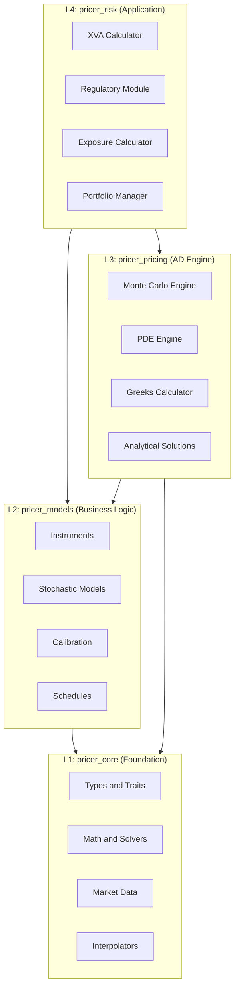
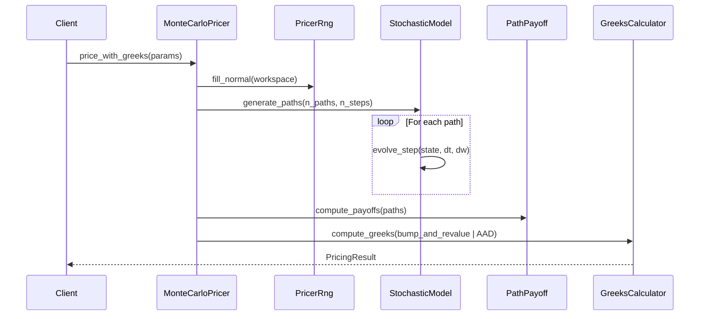
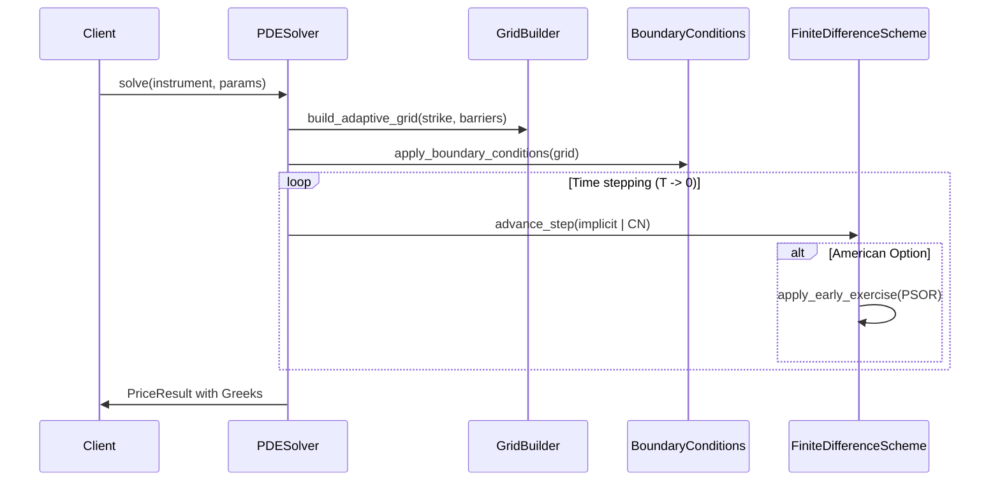
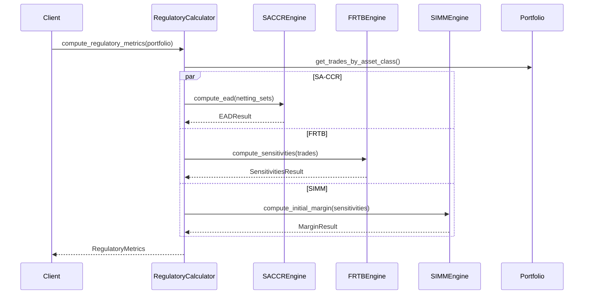
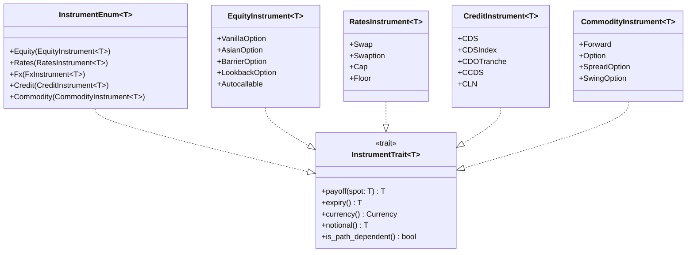
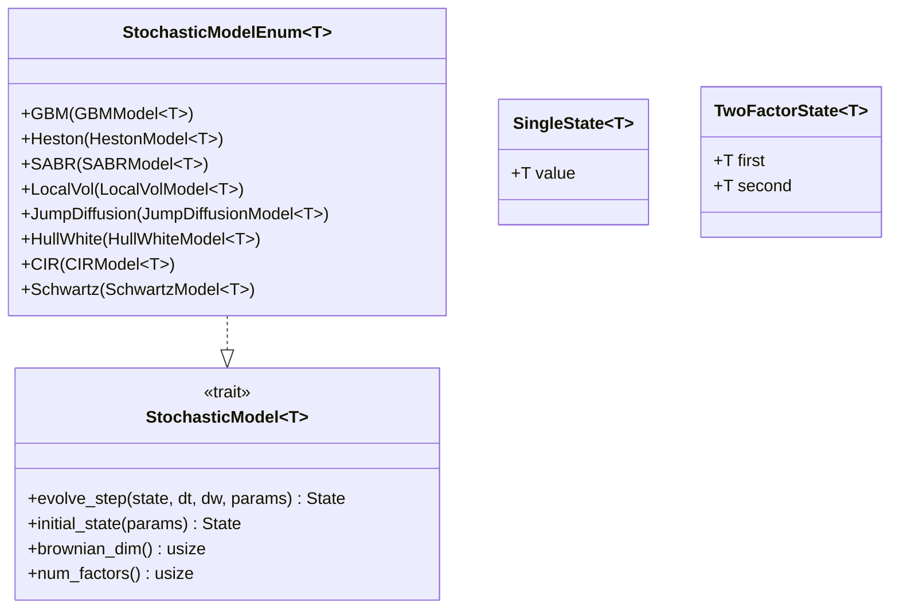

# Design Document

## Overview

**Purpose**: 本設計書は、neutryx-rustライブラリをXVA計算ライブラリからTier1銀行で本番運用可能なプロダクショングレードのプライサーへ拡張するためのアーキテクチャ設計を定義する。

**Users**: クオンツトレーダー、リスクマネージャー、クオンツアナリスト、規制対応担当者、システムインテグレーター、DevOpsエンジニアがプライシング、リスク管理、規制報告に使用する。

**Impact**: 現在の4層アーキテクチャ(pricer_core, pricer_models, pricer_pricing, pricer_risk)を維持しながら、アセットクラスの拡充(コモディティ、クレジット完全対応)、PDEエンジンの追加、規制計算モジュールの追加、Local Vol/Jump-Diffusionモデルの実装を行う。

### Goals

- 5つのアセットクラス(金利、FX、株式、コモディティ、クレジット)の包括的なプライシング機能
- PDE法による米国オプション・複雑な境界条件のプライシング
- SA-CCR、FRTB、SIMM等の規制計算機能
- Enzyme ADとの完全統合による高速Greeks計算
- 本番運用品質の信頼性・パフォーマンス(バニラオプション<10us、MC 100kパス<100ms)

### Non-Goals

- LMMモデル(将来フェーズ)
- GPU/CUDA対応(将来フェーズ)
- HPC分散計算(将来フェーズ)
- 実時間マーケットデータフィード統合

## Architecture

### Existing Architecture Analysis

現在のアーキテクチャは4層構造で、実験的なEnzyme ADコードをL3(pricer_pricing)に隔離している。

**現在の実装状況**:
- L1 (pricer_core): 完成 - 型、トレイト、スムージング、補間、マーケットデータ抽象化
- L2 (pricer_models): 概ね完成 - 商品、モデル(GBM、Heston、Hull-White、CIR)、キャリブレーション
- L3 (pricer_pricing): 概ね完成 - MCエンジン、パス依存オプション、チェックポイント、Greeks
- L4 (pricer_risk): 完成 - XVA(CVA/DVA/FVA)、エクスポージャー計算、ポートフォリオ管理

**既存ギャップ**(Gap分析結果):
- PDE法: 0% (新規実装必要)
- コモディティ: 5% (スケルトンのみ)
- 規制計算: 5% (スケルトンのみ)
- Local Vol/Jump-Diffusion: 0% (新規実装必要)
- SABR: 部分的 (キャリブレーション完成、MCパス生成未実装)

### Architecture Pattern & Boundary Map



**Architecture Integration**:
- Selected pattern: 既存の4層アーキテクチャを維持、各層内でドメイン別モジュールを追加
- Domain boundaries: アセットクラス別(equity, rates, credit, fx, commodity)とプライシング手法別(mc, pde, analytical)で分離
- Existing patterns preserved: 静的ディスパッチ(enum)、スムージング関数、AD互換型
- New components: PDEエンジン(L3)、規制計算モジュール(L4)、コモディティ/クレジット商品(L2)
- Steering compliance: Enzyme AD互換性維持、`Box<dyn Trait>`禁止、スムージング必須

### Technology Stack

| Layer | Choice / Version | Role in Feature | Notes |
|-------|------------------|-----------------|-------|
| Core Language | Rust Edition 2021 | 全コンポーネント | nightly-2025-01-15 (L3), stable (L1/L2/L4) |
| AD Backend | Enzyme LLVM 18 | L3 Greeks計算 | 実験的、フィーチャーフラグで隔離 |
| Numeric | ndarray, nalgebra | PDE行列演算 | スパース行列サポート必要 |
| Parallelization | rayon | MC/PDE並列化 | ポートフォリオレベル並列処理 |
| Testing | proptest, criterion | 品質保証 | プロパティベーステスト、ベンチマーク |

## System Flows

### Monte Carlo Pricing Flow



### PDE Engine Flow



### Regulatory Calculation Flow



## Requirements Traceability

| Requirement | Summary | Components | Interfaces | Flows |
|-------------|---------|------------|------------|-------|
| 1.1-1.8 | 金利商品 | RatesInstrument, SwapPricer | InstrumentTrait, CashflowInstrument | MC/Analytical |
| 2.1-2.8 | FX商品 | FxInstrument, FxPricer | InstrumentTrait, BarrierPayoff | MC/Analytical |
| 3.1-3.8 | 株式商品 | EquityInstrument, EquityPricer | InstrumentTrait, PathPayoff | MC/PDE/Analytical |
| 4.1-4.6 | コモディティ商品 | CommodityInstrument, CommodityModel | InstrumentTrait, SeasonalCurve | MC |
| 5.1-5.7 | クレジット商品 | CreditInstrument, CreditPricer | InstrumentTrait, HazardCurve | Analytical/MC |
| 6.1-6.7 | 解析解 | AnalyticalPricer | AnalyticalSolution trait | Analytical Flow |
| 7.1-7.8 | MC法 | MonteCarloPricer | MCConfig, PathWorkspace | MC Flow |
| 8.1-8.6 | PDE法 | PDESolver, GridBuilder | PDEConfig, BoundaryConditions | PDE Flow |
| 9.1-9.9 | 確率過程 | StochasticModelEnum, LocalVol, JumpDiffusion | StochasticModel trait | MC paths |
| 10.1-10.9 | Greeks | GreeksCalculator, AADEngine | GreeksConfig, GreeksResult | Greeks Flow |
| 11.1-11.8 | マーケットデータ | CurveSet, VolSurface, ForwardCurve | YieldCurve, VolatilitySurface | Data Flow |
| 12.1-12.8 | キャリブレーション | ModelCalibrator, GlobalOptimizer | CalibrationConfig | Calibration Flow |
| 13.1-13.8 | 信頼性 | ErrorHandler, HealthCheck | Result types | Error Flow |
| 14.1-14.8 | パフォーマンス | WorkspacePool, BatchPricer | ParallelConfig | Batch Flow |
| 15.1-15.9 | XVA拡張 | XvaCalculator (ColVA, KVA, MVA) | XvaConfig, XvaResult | XVA Flow |
| 16.1-16.8 | 規制対応 | RegulatoryCalculator, SACCREngine, FRTBEngine | RegulatoryConfig | Regulatory Flow |
| 17.1-17.8 | API設計 | PublicAPI, FFI, PyO3 | Builder patterns | API Flow |
| 18.1-18.8 | テスト | TestFramework, Benchmarks | Test traits | CI Flow |
| 19.1-19.7 | ドキュメント | DocGenerator | rustdoc | Doc Flow |
| 20.1-20.8 | デプロイメント | DockerBuilder, K8sConfig | Feature flags | Deploy Flow |

## Components and Interfaces

### Component Summary

| Component | Domain/Layer | Intent | Req Coverage | Key Dependencies | Contracts |
|-----------|--------------|--------|--------------|------------------|-----------|
| PDESolver | L3/Pricing | PDE法プライシング | 8.1-8.6 | GridBuilder (P0), Scheme (P0) | Service |
| CommodityInstrument | L2/Instruments | コモディティ商品 | 4.1-4.6 | InstrumentTrait (P0) | Service |
| CreditInstrument | L2/Instruments | クレジット商品拡張 | 5.1-5.7 | InstrumentTrait (P0), HazardCurve (P0) | Service |
| LocalVolModel | L2/Models | Local Volatility | 9.6 | VolSurface (P0), StochasticModel (P0) | Service |
| JumpDiffusionModel | L2/Models | Jump-Diffusion | 9.7 | StochasticModel (P0) | Service |
| SABRModel | L2/Models | SABR完全実装 | 9.3 | StochasticModel (P0), Calibrator (P1) | Service |
| RegulatoryCalculator | L4/Risk | 規制計算統合 | 16.1-16.8 | SACCREngine (P0), FRTBEngine (P0), SIMMEngine (P0) | Service |
| SACCREngine | L4/Risk | SA-CCR EAD計算 | 16.1-16.2 | Portfolio (P0), NettingSet (P0) | Service |
| FRTBEngine | L4/Risk | FRTB感応度計算 | 16.3 | Greeks (P0), RiskFactors (P1) | Service |
| SIMMEngine | L4/Risk | SIMM IM計算 | 16.4 | Sensitivities (P0) | Service |
| XvaExtension | L4/Risk | ColVA/KVA/MVA | 15.4-15.6 | XvaCalculator (P0), MarginModel (P1) | Service |
| BatchPricer | L3/Pricing | バッチプライシング | 14.4-14.5 | MonteCarloPricer (P0), Rayon (P0) | Service |

### L3: Pricing Engine

#### PDESolver

| Field | Detail |
|-------|--------|
| Intent | 有限差分法によるPDE解法エンジン(米国オプション、複雑な境界条件対応) |
| Requirements | 8.1, 8.2, 8.3, 8.4, 8.5, 8.6 |

**Responsibilities & Constraints**
- 有限差分法(陽的、陰的、Crank-Nicolson)によるPDE離散化
- PSOR法による米国オプション早期行使境界の処理
- ADI法による多因子モデル対応
- グリッド収束解析とRichardson外挿

**Dependencies**
- Inbound: MonteCarloPricer (verification) - P1
- Outbound: GridBuilder (grid construction) - P0
- Outbound: BoundaryConditions (BC handling) - P0
- Outbound: TridiagonalSolver (matrix solve) - P0

**Contracts**: Service [x]

##### Service Interface

```rust
/// PDE solver configuration
pub struct PDEConfig {
    /// Number of spatial grid points
    pub n_space: usize,
    /// Number of time steps
    pub n_time: usize,
    /// Finite difference scheme
    pub scheme: FiniteDifferenceScheme,
    /// Grid stretching near strike/barriers
    pub grid_stretching: GridStretchingType,
    /// Tolerance for iterative solvers
    pub tolerance: f64,
    /// Maximum iterations for PSOR
    pub max_iterations: usize,
}

/// Finite difference scheme options
pub enum FiniteDifferenceScheme {
    Explicit,
    Implicit,
    CrankNicolson,
}

/// Boundary condition types
pub enum BoundaryCondition {
    Dirichlet { value: f64 },
    Neumann { derivative: f64 },
    Absorbing,
}

/// PDE solver trait
pub trait PDESolver<T: Float> {
    type Config;
    type Result;

    /// Solve PDE for given instrument and market data
    fn solve(
        &self,
        instrument: &impl InstrumentTrait<T>,
        spot: T,
        rate: T,
        volatility: T,
        config: &Self::Config,
    ) -> Result<Self::Result, PDEError>;

    /// Solve with American exercise constraint
    fn solve_american(
        &self,
        instrument: &impl InstrumentTrait<T>,
        spot: T,
        rate: T,
        volatility: T,
        config: &Self::Config,
    ) -> Result<Self::Result, PDEError>;
}

/// PDE result with price and Greeks
pub struct PDEResult<T: Float> {
    pub price: T,
    pub delta: T,
    pub gamma: T,
    pub theta: T,
    pub grid_convergence: Option<ConvergenceMetrics>,
}
```

- Preconditions: `n_space >= 10`, `n_time >= 10`, `tolerance > 0`
- Postconditions: 結果は収束判定基準を満たす
- Invariants: グリッドは正規化され安定性条件を満たす

**Implementation Notes**
- Integration: L1のスムージング関数を境界処理に使用
- Validation: 解析解(European)との比較で収束検証
- Risks: 高ボラティリティ時の数値不安定性 - 陰的スキーム推奨

#### GridBuilder

| Field | Detail |
|-------|--------|
| Intent | 適応的グリッド構築(ストライク/バリア近傍で細分化) |
| Requirements | 8.3 |

**Contracts**: Service [x]

##### Service Interface

```rust
/// Adaptive grid builder for PDE methods
pub struct GridBuilder {
    /// Minimum spot price
    pub s_min: f64,
    /// Maximum spot price
    pub s_max: f64,
    /// Reference points for grid refinement
    pub refinement_points: Vec<f64>,
    /// Grid stretching parameters
    pub stretching: GridStretching,
}

pub enum GridStretching {
    Uniform,
    /// Sinh transformation for strike concentration
    Sinh { concentration: f64 },
    /// Custom non-uniform grid
    Custom { points: Vec<f64> },
}

impl GridBuilder {
    /// Build spatial grid with adaptive refinement
    fn build(&self, n_points: usize) -> Grid;

    /// Add refinement point (strike, barrier)
    fn add_refinement_point(&mut self, point: f64, weight: f64);
}
```

### L2: Business Logic

#### CommodityInstrument

| Field | Detail |
|-------|--------|
| Intent | コモディティデリバティブ商品(先物、オプション、スプレッド) |
| Requirements | 4.1, 4.2, 4.3, 4.4, 4.5, 4.6 |

**Responsibilities & Constraints**
- コモディティ先物/フォワードのプライシング
- コンビニエンスイールドのモデリング
- 季節性を持つフォワードカーブ対応
- スウィングオプション(複数行使権)対応

**Dependencies**
- Inbound: MonteCarloPricer (pricing) - P0
- Outbound: InstrumentTrait (trait bound) - P0
- Outbound: SeasonalForwardCurve (market data) - P0
- External: None

**Contracts**: Service [x]

##### Service Interface

```rust
/// Commodity instrument sub-enum for static dispatch
#[derive(Debug, Clone)]
pub enum CommodityInstrument<T: Float> {
    /// Commodity forward/futures
    Forward(CommodityForward<T>),
    /// Commodity option (European, Asian)
    Option(CommodityOption<T>),
    /// Spread option (crack, calendar)
    SpreadOption(CommoditySpreadOption<T>),
    /// Swing option with multiple exercise rights
    SwingOption(SwingOption<T>),
}

/// Commodity forward with convenience yield
pub struct CommodityForward<T: Float> {
    pub underlying: CommodityType,
    pub notional: T,
    pub delivery_date: T,
    pub strike: T,
    pub convenience_yield: T,
    pub currency: Currency,
}

/// Commodity types
pub enum CommodityType {
    Crude { grade: CrudeGrade },
    NaturalGas,
    Power { region: PowerRegion },
    Metals { metal: MetalType },
    Agricultural { commodity: AgricultureType },
}

/// Mean-reverting commodity model (Schwartz one-factor)
pub struct SchwartzOneFactorParams<T: Float> {
    pub spot: T,
    pub kappa: T,          // Mean reversion speed
    pub theta: T,          // Long-term mean
    pub sigma: T,          // Volatility
    pub convenience_yield: T,
}

impl<T: Float> InstrumentTrait<T> for CommodityInstrument<T> {
    fn payoff(&self, spot: T) -> T;
    fn expiry(&self) -> T;
    fn currency(&self) -> Currency;
    fn is_path_dependent(&self) -> bool;
    fn type_name(&self) -> &'static str;
}
```

#### CreditInstrument (Extension)

| Field | Detail |
|-------|--------|
| Intent | クレジットデリバティブ拡張(CDO、CCDS、CLN) |
| Requirements | 5.1, 5.2, 5.3, 5.4, 5.5, 5.6, 5.7 |

**Responsibilities & Constraints**
- CDS指数(CDX, iTraxx)対応
- 合成CDOトランシェプライシング(ベースコリレーション)
- Wrong-way riskモデリング(CCDS)
- CLN(Credit-Linked Note)対応

**Dependencies**
- Inbound: XvaCalculator (CVA/DVA) - P1
- Outbound: HazardCurve (credit curve) - P0
- Outbound: BaseCorrelation (CDO) - P1

**Contracts**: Service [x]

##### Service Interface

```rust
/// Extended credit instrument enum
#[derive(Debug, Clone)]
pub enum CreditInstrument<T: Float> {
    /// Single-name CDS (existing)
    CDS(CreditDefaultSwap<T>),
    /// CDS Index (CDX, iTraxx)
    CDSIndex(CDSIndex<T>),
    /// CDS Swaption
    CDSSwaption(CDSSwaption<T>),
    /// Synthetic CDO tranche
    CDOTranche(CDOTranche<T>),
    /// Contingent CDS (wrong-way risk)
    CCDS(ContingentCDS<T>),
    /// Credit-Linked Note
    CLN(CreditLinkedNote<T>),
}

/// CDS Index definition
pub struct CDSIndex<T: Float> {
    pub index_type: CDSIndexType,
    pub series: u32,
    pub version: u32,
    pub notional: T,
    pub spread: T,
    pub maturity: T,
    pub index_factor: T,  // Remaining factor after defaults
    pub constituents: Vec<IndexConstituent<T>>,
}

pub enum CDSIndexType {
    CDX_IG,      // North America Investment Grade
    CDX_HY,      // North America High Yield
    iTraxx_Main, // Europe Main
    iTraxx_Xover, // Europe Crossover
}

/// CDO Tranche with base correlation
pub struct CDOTranche<T: Float> {
    pub underlying_index: CDSIndexType,
    pub attachment: T,    // Lower attachment point
    pub detachment: T,    // Upper detachment point
    pub notional: T,
    pub spread: T,
    pub maturity: T,
}

/// Base correlation surface for CDO pricing
pub trait BaseCorrelationSurface<T: Float> {
    fn correlation(&self, detachment: T, maturity: T) -> T;
    fn expected_loss(&self, attachment: T, detachment: T, maturity: T) -> T;
}
```

#### LocalVolModel

| Field | Detail |
|-------|--------|
| Intent | Dupire Local Volatilityモデル(サーフェスキャリブレーション) |
| Requirements | 9.6 |

**Contracts**: Service [x]

##### Service Interface

```rust
/// Local volatility model (Dupire)
pub struct LocalVolModel<T: Float> {
    pub spot: T,
    pub rate: T,
    pub dividend: T,
    pub local_vol_surface: LocalVolSurface<T>,
}

/// Local volatility surface
pub struct LocalVolSurface<T: Float> {
    /// Strike grid
    pub strikes: Vec<T>,
    /// Time grid
    pub times: Vec<T>,
    /// Local volatility values [time_idx][strike_idx]
    pub vol_grid: Vec<Vec<T>>,
    /// Interpolation method
    pub interpolation: VolInterpolation,
}

impl<T: Float + Default> StochasticModel<T> for LocalVolModel<T> {
    type State = SingleState<T>;
    type Params = LocalVolParams<T>;

    fn evolve_step(state: Self::State, dt: T, dw: &[T], params: &Self::Params) -> Self::State;
    fn initial_state(params: &Self::Params) -> Self::State;
    fn brownian_dim() -> usize { 1 }
    fn model_name() -> &'static str { "LocalVol" }
    fn num_factors() -> usize { 1 }
}

/// Dupire formula for local volatility extraction
pub fn dupire_local_vol<T: Float>(
    implied_vol_surface: &impl VolatilitySurface<T>,
    strike: T,
    time: T,
    spot: T,
    rate: T,
    dividend: T,
) -> Result<T, CalibrationError>;
```

#### JumpDiffusionModel

| Field | Detail |
|-------|--------|
| Intent | Jump-Diffusionモデル(Merton, Kou) |
| Requirements | 9.7 |

**Contracts**: Service [x]

##### Service Interface

```rust
/// Merton jump-diffusion model parameters
pub struct MertonParams<T: Float> {
    pub spot: T,
    pub rate: T,
    pub volatility: T,          // Diffusion volatility
    pub jump_intensity: T,       // Lambda - jump frequency
    pub jump_mean: T,            // Mean of log jump size
    pub jump_std: T,             // Std of log jump size
}

/// Kou double-exponential jump-diffusion
pub struct KouParams<T: Float> {
    pub spot: T,
    pub rate: T,
    pub volatility: T,
    pub jump_intensity: T,
    pub prob_up: T,              // Probability of upward jump
    pub eta_up: T,               // Rate of upward exponential
    pub eta_down: T,             // Rate of downward exponential
}

/// Jump-diffusion model enum
pub enum JumpDiffusionModel<T: Float> {
    Merton(MertonParams<T>),
    Kou(KouParams<T>),
}

impl<T: Float + Default> StochasticModel<T> for JumpDiffusionModel<T> {
    type State = SingleState<T>;
    type Params = JumpDiffusionParams<T>;

    fn evolve_step(state: Self::State, dt: T, dw: &[T], params: &Self::Params) -> Self::State {
        // Diffusion component
        let diffusion = evolve_gbm(state, dt, dw, params);

        // Jump component (Poisson process)
        let n_jumps = sample_poisson(params.jump_intensity * dt);
        let jump_factor = compute_jump_factor(n_jumps, params);

        SingleState(diffusion.0 * jump_factor)
    }

    fn brownian_dim() -> usize { 2 }  // One for diffusion, one for jump timing
    fn model_name() -> &'static str { "JumpDiffusion" }
    fn num_factors() -> usize { 1 }
}
```

### L4: Risk/Regulatory

#### RegulatoryCalculator

| Field | Detail |
|-------|--------|
| Intent | 規制計算の統合オーケストレーター |
| Requirements | 16.1, 16.2, 16.3, 16.4, 16.5, 16.6, 16.7, 16.8 |

**Responsibilities & Constraints**
- SA-CCR、IMM、FRTB、SIMM計算の統合
- 規制レポート生成
- 監査証跡(Audit Trail)記録
- 所定のタイムグリッド・信頼水準の使用

**Dependencies**
- Inbound: None (entry point)
- Outbound: SACCREngine (SA-CCR) - P0
- Outbound: FRTBEngine (FRTB) - P0
- Outbound: SIMMEngine (SIMM) - P0
- Outbound: Portfolio (trade data) - P0

**Contracts**: Service [x]

##### Service Interface

```rust
/// Regulatory calculator configuration
pub struct RegulatoryConfig {
    /// Enabled calculation types
    pub calculations: Vec<RegulatoryCalculationType>,
    /// Reporting date
    pub as_of_date: Date,
    /// Time grid for exposure calculations
    pub time_grid: RegulatoryTimeGrid,
    /// Confidence levels
    pub confidence_level: f64,  // e.g., 0.99 for 99%
    /// Enable audit trail
    pub audit_trail: bool,
}

pub enum RegulatoryCalculationType {
    SACCR,
    IMM,
    FRTB_SA,
    FRTB_IMA,
    SIMM,
    BaselCapital,
}

/// Main regulatory calculator
pub struct RegulatoryCalculator {
    config: RegulatoryConfig,
    saccr_engine: SACCREngine,
    frtb_engine: FRTBEngine,
    simm_engine: SIMMEngine,
}

impl RegulatoryCalculator {
    /// Compute all configured regulatory metrics
    pub fn compute_all(
        &self,
        portfolio: &Portfolio,
        market_data: &MarketDataSet,
    ) -> Result<RegulatoryMetrics, RegulatoryError>;

    /// Compute SA-CCR EAD
    pub fn compute_saccr_ead(
        &self,
        portfolio: &Portfolio,
    ) -> Result<SACCRResult, RegulatoryError>;

    /// Compute FRTB sensitivities
    pub fn compute_frtb_sensitivities(
        &self,
        portfolio: &Portfolio,
        market_data: &MarketDataSet,
    ) -> Result<FRTBResult, RegulatoryError>;

    /// Compute SIMM initial margin
    pub fn compute_simm_margin(
        &self,
        sensitivities: &Sensitivities,
    ) -> Result<SIMMResult, RegulatoryError>;

    /// Generate regulatory report
    pub fn generate_report(
        &self,
        metrics: &RegulatoryMetrics,
        format: ReportFormat,
    ) -> Result<Report, RegulatoryError>;
}
```

#### SACCREngine

| Field | Detail |
|-------|--------|
| Intent | SA-CCR (Standardized Approach for Counterparty Credit Risk) EAD計算 |
| Requirements | 16.1, 16.2 |

**Contracts**: Service [x]

##### Service Interface

```rust
/// SA-CCR Engine for EAD calculation
pub struct SACCREngine {
    /// Asset class parameters
    pub asset_class_params: SACCRAssetClassParams,
}

/// SA-CCR EAD = alpha * (RC + PFE)
/// where alpha = 1.4, RC = Replacement Cost, PFE = Potential Future Exposure
pub struct SACCRResult {
    pub ead: f64,
    pub replacement_cost: f64,
    pub pfe: f64,
    pub add_on_by_asset_class: HashMap<AssetClass, f64>,
    pub multiplier: f64,
}

impl SACCREngine {
    /// Compute EAD for netting set
    pub fn compute_ead(
        &self,
        netting_set: &NettingSet,
        trades: &[Trade],
        collateral: Option<&CollateralAgreement>,
    ) -> Result<SACCRResult, SACCRError>;

    /// Compute replacement cost
    fn compute_replacement_cost(
        &self,
        trades: &[Trade],
        collateral: Option<&CollateralAgreement>,
    ) -> f64;

    /// Compute PFE add-on by asset class
    fn compute_pfe_addon(
        &self,
        trades: &[Trade],
        asset_class: AssetClass,
    ) -> f64;

    /// Compute hedging set aggregation
    fn aggregate_hedging_sets(
        &self,
        add_ons: &[f64],
        correlations: &[f64],
    ) -> f64;
}

/// SA-CCR asset class definitions
pub enum SACCRAssetClass {
    InterestRate,
    ForeignExchange,
    Credit,
    Equity,
    Commodity,
}

/// Supervisory factors by asset class
pub struct SACCRAssetClassParams {
    pub ir_supervisory_factor: f64,     // 0.50%
    pub fx_supervisory_factor: f64,      // 4.0%
    pub credit_ig_factor: f64,           // 0.38%
    pub credit_hy_factor: f64,           // 1.06%
    pub equity_single_factor: f64,       // 32%
    pub equity_index_factor: f64,        // 20%
    pub commodity_electricity_factor: f64, // 40%
    pub commodity_oil_factor: f64,       // 18%
}
```

#### FRTBEngine

| Field | Detail |
|-------|--------|
| Intent | FRTB (Fundamental Review of Trading Book) 感応度計算 |
| Requirements | 16.3 |

**Contracts**: Service [x]

##### Service Interface

```rust
/// FRTB Sensitivities Engine
pub struct FRTBEngine {
    /// Risk factor definitions
    pub risk_factors: FRTBRiskFactors,
    /// Bucket definitions
    pub buckets: FRTBBuckets,
}

/// FRTB Sensitivities (SA)
pub struct FRTBSensitivities {
    /// Delta sensitivities by risk class
    pub delta: HashMap<FRTBRiskClass, Vec<DeltaSensitivity>>,
    /// Vega sensitivities
    pub vega: HashMap<FRTBRiskClass, Vec<VegaSensitivity>>,
    /// Curvature sensitivities
    pub curvature: HashMap<FRTBRiskClass, Vec<CurvatureSensitivity>>,
}

pub enum FRTBRiskClass {
    GIRR,    // General Interest Rate Risk
    CSR_NS,  // Credit Spread Risk (Non-Securitization)
    CSR_SEC, // Credit Spread Risk (Securitization)
    EQ,      // Equity
    COMM,    // Commodity
    FX,      // Foreign Exchange
}

impl FRTBEngine {
    /// Compute all sensitivities for portfolio
    pub fn compute_sensitivities(
        &self,
        portfolio: &Portfolio,
        market_data: &MarketDataSet,
    ) -> Result<FRTBSensitivities, FRTBError>;

    /// Compute delta capital charge
    pub fn compute_delta_capital(
        &self,
        sensitivities: &FRTBSensitivities,
    ) -> f64;

    /// Compute vega capital charge
    pub fn compute_vega_capital(
        &self,
        sensitivities: &FRTBSensitivities,
    ) -> f64;

    /// Compute curvature capital charge
    pub fn compute_curvature_capital(
        &self,
        sensitivities: &FRTBSensitivities,
    ) -> f64;
}
```

#### SIMMEngine

| Field | Detail |
|-------|--------|
| Intent | ISDA SIMM (Standard Initial Margin Model) 計算 |
| Requirements | 16.4 |

**Contracts**: Service [x]

##### Service Interface

```rust
/// ISDA SIMM Engine
pub struct SIMMEngine {
    /// SIMM parameters (version-specific)
    pub params: SIMMParams,
}

/// SIMM calculation result
pub struct SIMMResult {
    pub total_margin: f64,
    pub margin_by_product_class: HashMap<SIMMProductClass, f64>,
    pub margin_by_risk_class: HashMap<SIMMRiskClass, f64>,
}

pub enum SIMMProductClass {
    RatesFX,
    Credit,
    Equity,
    Commodity,
}

pub enum SIMMRiskClass {
    InterestRate,
    CreditQualifying,
    CreditNonQualifying,
    Equity,
    Commodity,
    FX,
}

impl SIMMEngine {
    /// Compute initial margin from sensitivities
    pub fn compute_margin(
        &self,
        sensitivities: &SIMMSensitivities,
    ) -> Result<SIMMResult, SIMMError>;

    /// Compute delta margin for risk class
    fn compute_delta_margin(
        &self,
        delta: &[DeltaSensitivity],
        risk_class: SIMMRiskClass,
    ) -> f64;

    /// Compute vega margin for risk class
    fn compute_vega_margin(
        &self,
        vega: &[VegaSensitivity],
        risk_class: SIMMRiskClass,
    ) -> f64;

    /// Aggregate across buckets with correlation
    fn aggregate_buckets(
        &self,
        bucket_margins: &[f64],
        correlations: &CorrelationMatrix,
    ) -> f64;
}
```

#### XvaExtension (ColVA, KVA, MVA)

| Field | Detail |
|-------|--------|
| Intent | XVA計算拡張(ColVA、KVA、MVA) |
| Requirements | 15.4, 15.5, 15.6 |

**Contracts**: Service [x]

##### Service Interface

```rust
/// Extended XVA configuration
pub struct ExtendedXvaConfig {
    /// Base XVA config (CVA, DVA, FVA)
    pub base: XvaConfig,
    /// ColVA parameters
    pub colva: Option<ColVAParams>,
    /// KVA parameters
    pub kva: Option<KVAParams>,
    /// MVA parameters
    pub mva: Option<MVAParams>,
}

/// ColVA (Collateral Valuation Adjustment) parameters
pub struct ColVAParams {
    /// CSA terms
    pub csa: CSATerms,
    /// Collateral rate
    pub collateral_rate: f64,
    /// OIS rate
    pub ois_rate: f64,
}

/// KVA (Capital Valuation Adjustment) parameters
pub struct KVAParams {
    /// Hurdle rate (cost of equity)
    pub hurdle_rate: f64,
    /// Capital calculation method
    pub capital_method: CapitalMethod,
}

/// MVA (Margin Valuation Adjustment) parameters
pub struct MVAParams {
    /// Initial margin model
    pub im_model: InitialMarginModel,
    /// Funding cost for IM
    pub im_funding_spread: f64,
}

/// Extended XVA result
pub struct ExtendedXvaResult {
    /// Base XVA results
    pub base: PortfolioXva,
    /// Collateral VA
    pub colva: Option<f64>,
    /// Capital VA
    pub kva: Option<f64>,
    /// Margin VA
    pub mva: Option<f64>,
}

impl XvaCalculator {
    /// Compute extended XVA with ColVA, KVA, MVA
    pub fn compute_extended_xva(
        &self,
        portfolio: &Portfolio,
        config: &ExtendedXvaConfig,
        exposure_profiles: &ExposureProfiles,
        regulatory_capital: Option<&RegulatoryCapital>,
        initial_margin: Option<&InitialMarginProfile>,
    ) -> Result<ExtendedXvaResult, XvaError>;

    /// Compute ColVA
    fn compute_colva(
        &self,
        exposure: &[f64],
        csa: &CSATerms,
        params: &ColVAParams,
    ) -> f64;

    /// Compute KVA
    fn compute_kva(
        &self,
        capital_profile: &[f64],
        params: &KVAParams,
        time_grid: &[f64],
    ) -> f64;

    /// Compute MVA
    fn compute_mva(
        &self,
        im_profile: &[f64],
        params: &MVAParams,
        time_grid: &[f64],
    ) -> f64;
}
```

## Data Models

### Domain Model

**Core Aggregates**:

1. **Portfolio** (Aggregate Root)
   - Counterparty[]
   - NettingSet[]
   - Trade[]
   - CollateralAgreement[]

2. **Instrument** (Aggregate Root)
   - InstrumentEnum<T> (top-level enum)
   - EquityInstrument<T>
   - RatesInstrument<T>
   - FxInstrument<T>
   - CreditInstrument<T>
   - CommodityInstrument<T>

3. **StochasticModel** (Aggregate Root)
   - StochasticModelEnum<T>
   - GBMModel, HestonModel, SABRModel
   - LocalVolModel, JumpDiffusionModel
   - HullWhiteModel, CIRModel

4. **MarketData** (Aggregate Root)
   - CurveSet<T>
   - VolatilitySurfaceSet<T>
   - ForwardCurveSet<T>

**Domain Events**:
- MarketDataUpdated
- CalibrationCompleted
- PricingCompleted
- RegulatoryMetricsComputed

### Logical Data Model

**Instrument Hierarchy**:



**Stochastic Model Hierarchy**:



## Error Handling

### Error Strategy

各レイヤーで構造化エラー型を定義し、Result型で伝播させる。

### Error Categories and Responses

**User Errors (Validation)**:
- `InvalidParameter` - パラメータ範囲外 → 詳細メッセージと有効範囲を返却
- `MissingMarketData` - 必要なマーケットデータ不足 → 必要データリストを返却
- `InstrumentNotSupported` - 未サポート商品 → サポート商品リストを返却

**System Errors (Numerical)**:
- `ConvergenceFailure` - 数値収束失敗 → 反復回数と最終誤差を返却
- `NumericalOverflow` - オーバーフロー → NaN/Infinityフラグと入力値を返却
- `MatrixSingular` - 特異行列 → 条件数と推奨アクションを返却

**Business Logic Errors**:
- `CalibrationFailure` - キャリブレーション失敗 → 診断情報とパラメータ境界を返却
- `ArbitrageFreeViolation` - 無裁定条件違反 → 違反箇所と修正提案を返却

### Error Type Hierarchy

```rust
/// Top-level pricing error
#[derive(Debug, thiserror::Error)]
pub enum PricingError {
    #[error("Invalid parameter: {field} = {value}, expected {expected}")]
    InvalidParameter {
        field: &'static str,
        value: String,
        expected: String,
    },

    #[error("Numerical convergence failed after {iterations} iterations, error = {error}")]
    ConvergenceFailure {
        iterations: usize,
        error: f64,
    },

    #[error("PDE solver error: {0}")]
    PDEError(#[from] PDEError),

    #[error("Calibration error: {0}")]
    CalibrationError(#[from] CalibrationError),

    #[error("Regulatory calculation error: {0}")]
    RegulatoryError(#[from] RegulatoryError),
}

/// PDE-specific errors
#[derive(Debug, thiserror::Error)]
pub enum PDEError {
    #[error("Grid configuration invalid: {message}")]
    InvalidGrid { message: String },

    #[error("PSOR did not converge after {iterations} iterations")]
    PSORConvergenceFailure { iterations: usize },

    #[error("Stability condition violated: CFL = {cfl}")]
    StabilityViolation { cfl: f64 },
}

/// Regulatory calculation errors
#[derive(Debug, thiserror::Error)]
pub enum RegulatoryError {
    #[error("Missing trade classification for {trade_id}")]
    MissingClassification { trade_id: String },

    #[error("Invalid regulatory parameter: {parameter}")]
    InvalidParameter { parameter: String },

    #[error("Regulatory calculation not implemented: {calculation}")]
    NotImplemented { calculation: String },
}
```

### Monitoring

- 構造化ログ(`tracing`クレート)による全プライシング操作の記録
- エラー発生時のコンテキスト情報(入力パラメータ、中間状態)の保存
- Prometheus形式のメトリクスエクスポート(エラー率、レイテンシ分布)

## Testing Strategy

### Unit Tests

1. **PDESolver**: グリッド構築、境界条件適用、PSOR収束
2. **CommodityInstrument**: ペイオフ計算、満期取得、通貨設定
3. **LocalVolModel**: Dupire公式、evolve_step、初期状態
4. **SACCREngine**: EAD計算、アセットクラス分類、ヘッジセット集約
5. **SIMMEngine**: バケット集約、相関適用、マージン計算

### Integration Tests

1. **MC vs PDE**: ヨーロピアンオプションでMCとPDE結果の一致確認(1%以内)
2. **MC vs Analytical**: 解析解との比較検証
3. **Calibration → Pricing**: キャリブレーション結果を使用したプライシングフロー
4. **Portfolio XVA**: ポートフォリオレベルXVA計算の整合性
5. **Regulatory Flow**: SA-CCR → FRTB → SIMMの連携動作

### Performance Tests

1. **Vanilla Option Analytical**: < 10 microseconds
2. **MC 100k paths**: < 100 milliseconds
3. **PDE American Option**: < 50 milliseconds
4. **Batch 10k instruments**: < 1 second
5. **Portfolio XVA (1M paths x 100 steps)**: < 60 seconds

### Property-Based Tests

1. **Put-Call Parity**: C - P = S - K*exp(-rT)
2. **Monotonicity**: Delta in [0,1] for calls, [-1,0] for puts
3. **Convexity**: Gamma >= 0
4. **Arbitrage-Free**: Calendar spread >= 0
5. **PSOR Convergence**: American >= European

## Performance & Scalability

### Target Metrics

| Metric | Target | Measurement |
|--------|--------|-------------|
| Vanilla Analytical | < 10 us | criterion benchmark |
| MC 100k paths | < 100 ms | criterion benchmark |
| PDE American | < 50 ms | criterion benchmark |
| Greeks (AAD) | < 10x pricing | criterion benchmark |
| Batch 10k instruments | < 1 s | integration test |
| Portfolio XVA | < 60 s | integration test |

### Optimization Strategies

1. **Workspace Reuse**: Pre-allocated buffers for MC paths (existing `PathWorkspace`)
2. **Thread-Local Pools**: `ThreadLocalPool` for zero-allocation hot paths
3. **SIMD Vectorization**: `packed_simd` for path generation (future)
4. **Rayon Parallelism**: Portfolio-level parallel processing
5. **LTO + Single Codegen**: Maximum compiler optimization
6. **SoA Layout**: Structure of Arrays for cache efficiency (`TradeSoA`, `ExposureSoA`)

### Memory Budget

- MC Workspace: n_paths * n_steps * 8 bytes per path
- PDE Grid: n_space * n_time * 8 bytes
- Checkpointing: Binomial strategy for AD with configurable budget

## Migration Strategy

### Phase 1: 既存機能完成 (4週間)

1. SABR MCパス生成の完成
2. コモディティモジュールの完成(Schwartz model、季節性)
3. クレジットモジュールの完成(CDX、CDO、CCDS)

### Phase 2: PDE/Analytics (4週間)

1. PDEエンジン実装(Crank-Nicolson、PSOR)
2. Local Volatilityモデル実装
3. Jump-Diffusionモデル実装
4. 解析解拡張(American approximation)

### Phase 3: 規制計算 (4週間)

1. SA-CCRエンジン実装
2. FRTBエンジン実装
3. SIMMエンジン実装
4. XVA拡張(ColVA、KVA、MVA)

### Phase 4: 品質・運用 (4週間)

1. Python バインディング(PyO3)
2. C FFIバインディング
3. ドキュメント完成
4. ベンチマーク・CI/CD強化

### Rollback Triggers

- Phase 1: SABRキャリブレーション収束率 < 95%
- Phase 2: PDE数値誤差 > 1% (vs analytical)
- Phase 3: SA-CCR計算結果がReference実装と10%以上乖離
- Phase 4: Python bindings でメモリリーク検出
