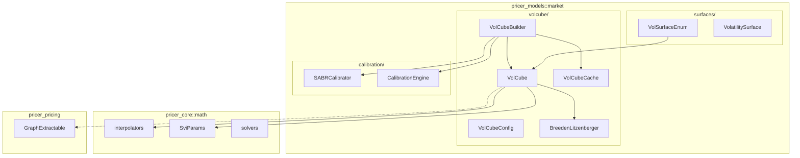
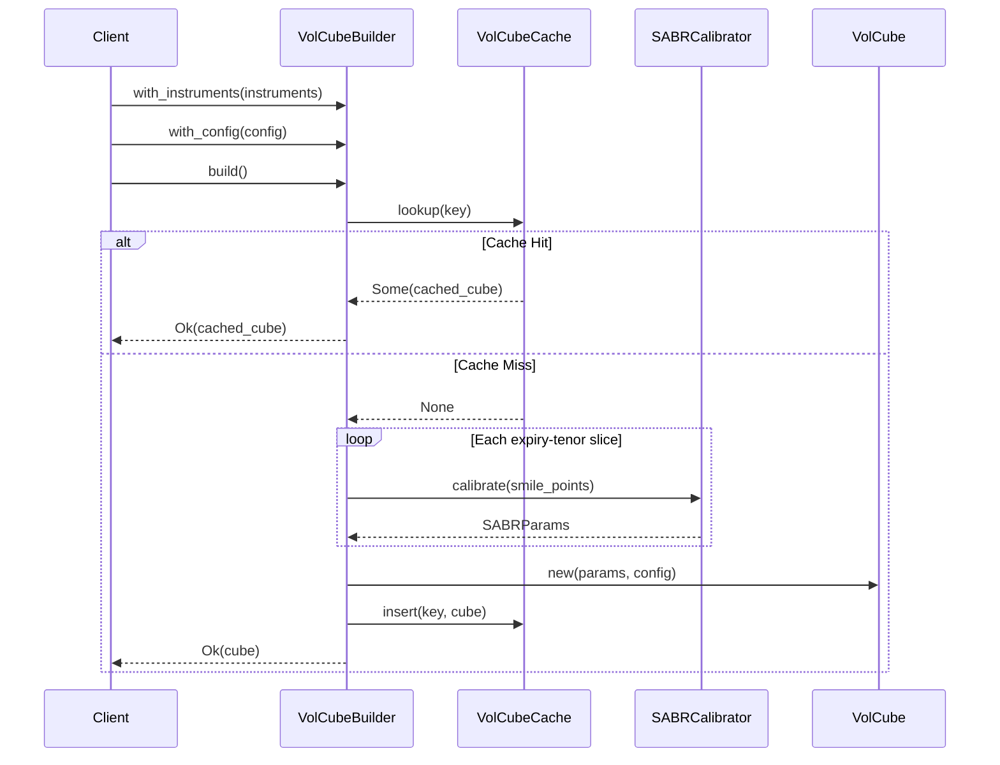
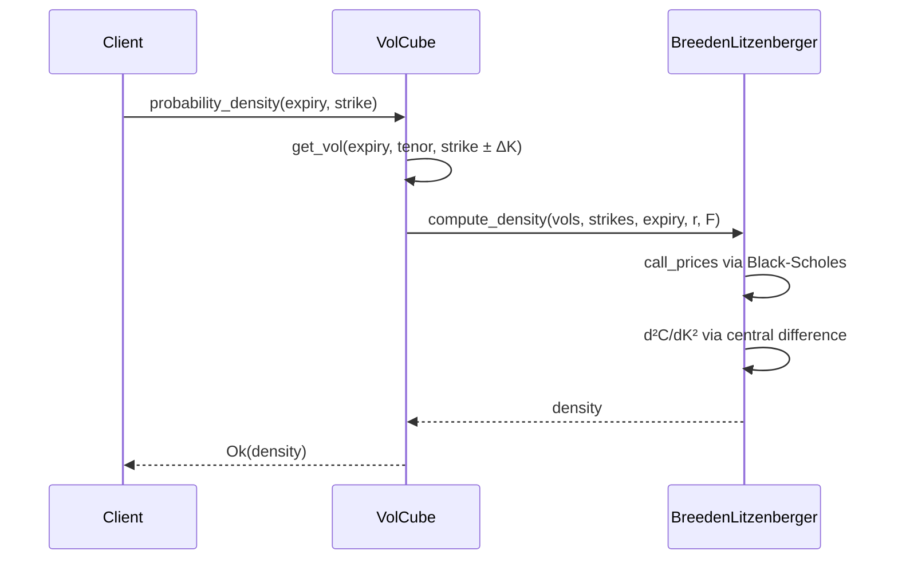
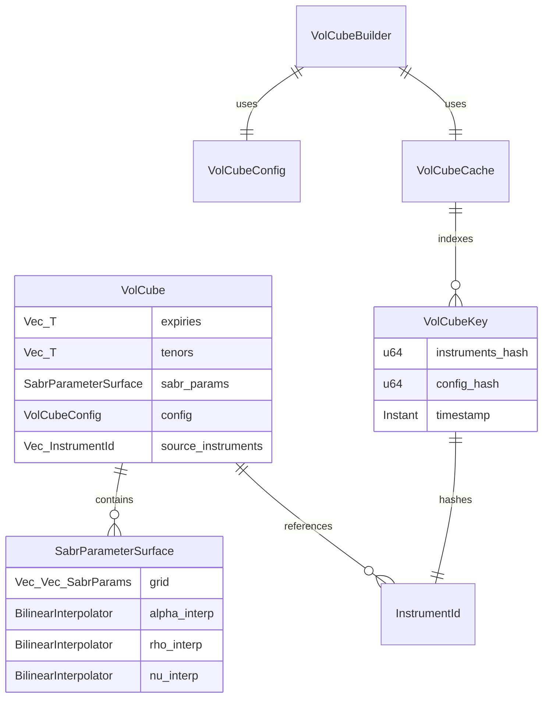

# Technical Design: volcube-calibration-engine

## Overview

**Purpose**: 本機能は3次元ボラティリティ構造（VolCube）のカリブレーションエンジンを提供し、クオンツ開発者がInstrumentリストと設定から一貫したボラティリティキューブを構築できるようにする。

**Users**: クオンツ開発者、プライシングエンジン、リスクアナリストが、Swaptionや各種オプション商品のボラティリティ補間、確率密度関数計算、感度分析に使用する。

**Impact**: 既存の2D `VolatilitySurface<T>`体系にtenor軸を追加した3D構造を導入し、`pricer_models::market`モジュールに新規`volcube/`サブモジュールを追加する。

### Goals

- 3次元ボラティリティ構造（Expiry, Tenor, Strike）の構築と補間
- SABR/SVIベースのsmile-aware補間とパラメータカリブレーション
- Breeden-Litzenberger公式による確率密度関数計算
- LRUキャッシュによる再カリブレーション回避とパフォーマンス最適化
- 計算グラフ(`GraphExtractable`)との統合

### Non-Goals

- Local Volatility / Stochastic Local Volatility モデル（将来feature flag対応）
- リアルタイムストリーミングカリブレーション（バッチ処理のみ）
- Vol Cubeの時系列永続化（`infra_store`統合は本スコープ外）

---

## Architecture

### Existing Architecture Analysis

**維持すべきパターン**:
- `VolatilitySurface<T>` trait (2D: strike, expiry)
- `VolSurfaceEnum` (static dispatch)
- `SABRCalibrator`, `CalibrationEngine` (calibration)
- `CurveResultCache<T>`, `CurveKey` (LRU cache)
- `GraphExtractable` trait (computation graph)

**拡張ポイント**:
- `VolSurfaceEnum`に`Cube`variant追加
- `pricer_models::market`に`volcube/`モジュール新設

### Architecture Pattern & Boundary Map



**Architecture Integration**:
- **Selected pattern**: ハイブリッド（新規モジュール + 既存パターン再利用）
- **Domain boundaries**: `volcube/`は3D vol cube専用、2D surfacesとは独立
- **Existing patterns preserved**: Builder pattern, LRU cache, enum static dispatch
- **New components rationale**: 3D構造はtenor軸追加により既存2D traitと非互換、独立モジュール化
- **Steering compliance**: A-I-P-S準拠、Pricer層(L2: pricer_models)に配置

### Technology Stack

| Layer | Choice / Version | Role in Feature | Notes |
|-------|------------------|-----------------|-------|
| Pricer Core | pricer_core (L1) | SviParams, interpolators, solvers | 既存再利用 |
| Pricer Models | pricer_models (L2) | volcube/, calibration/, surfaces/ | 新規モジュール配置 |
| Infra Master | infra_master | Currency, RateIndex, InstrumentId | 市場データ型参照 |
| Cache | lru, parking_lot | LRU cache, thread-safe access | 既存依存 |
| Error | thiserror | CalibrationError, MarketDataError | 既存拡張 |

---

## System Flows

### VolCube Build Flow



### Probability Density Flow



---

## Requirements Traceability

| Requirement | Summary | Components | Interfaces | Flows |
|-------------|---------|------------|------------|-------|
| 1.1, 1.2 | Instrumentリスト→VolCube構築 | VolCubeBuilder | build() | Build Flow |
| 1.3 | Builder pattern | VolCubeBuilder | with_* fluent API | - |
| 1.4 | 空リストエラー | VolCubeBuilder | CalibrationError | - |
| 1.5 | 3次元軸 | VolCube | expiry, tenor, strike | - |
| 2.1 | get_vol | VolCube | volatility() | - |
| 2.2 | Extrapolation | VolCubeConfig | ExtrapolationMethod | - |
| 2.3 | T: Float | VolCube<T> | generics | - |
| 2.4 | Send + Sync | VolCube | trait bounds | - |
| 2.5 | domain範囲 | VolCube | expiry_domain(), tenor_domain(), strike_domain() | - |
| 3.1, 3.2 | PDF/CDF | BreedenLitzenberger | probability_density(), cumulative_probability() | Density Flow |
| 3.3 | smooth approximation | BreedenLitzenberger | smoothing spline | - |
| 3.4 | 範囲外エラー | VolCube | MarketDataError | - |
| 4.1 | Instrument参照 | VolCube | source_instruments() | - |
| 4.2, 4.3 | 計算グラフ | VolCube | GraphExtractable | - |
| 4.4 | AAD感度 | VolCube | T: Float | - |
| 5.1 | キャッシュキー | VolCubeKey | hash_instruments(), hash_config() | - |
| 5.2, 5.3, 5.4 | LRUキャッシュ | VolCubeCache | lookup(), insert(), invalidate() | Build Flow |
| 5.5 | メトリクス | CacheStats | hit_rate(), entries() | - |
| 6.1-6.5 | カリブレーション設定 | VolCubeConfig | InterpolationMethod, ExtrapolationMethod, StrikeAxisType | - |
| 7.1-7.5 | エラーハンドリング | CalibrationError | NotConverged, InvalidInput, ArbitrageFreeViolation | - |
| 8.1-8.5 | A-I-P-S準拠 | 全コンポーネント | モジュール配置 | - |
| 9.1-9.5 | テスト | tests/ | proptest, criterion | - |
| 10.1-10.4 | 拡張性 | VolCubeConfig | enum dispatch, feature flags | - |

---

## Components and Interfaces

| Component | Domain/Layer | Intent | Req Coverage | Key Dependencies (P0/P1) | Contracts |
|-----------|--------------|--------|--------------|--------------------------|-----------|
| VolCube<T> | volcube | 3D vol補間と密度計算 | 1.5, 2.1-2.5, 3.1-3.4, 4.1-4.4 | SabrParameterSurface (P0), BreedenLitzenberger (P1) | Service, State |
| VolCubeBuilder<T> | volcube | VolCube構築とカリブレーション | 1.1-1.4, 7.1-7.5 | SABRCalibrator (P0), VolCubeCache (P0) | Service |
| VolCubeCache<T> | volcube | LRUキャッシュ管理 | 5.1-5.5 | lru (P0), parking_lot (P0) | Service, State |
| VolCubeConfig | volcube | カリブレーション設定 | 6.1-6.5, 10.1-10.2 | - | State |
| BreedenLitzenberger | volcube | 確率密度関数計算 | 3.1-3.3 | Black-Scholes (P0) | Service |
| VolCubeKey | volcube | キャッシュキー生成 | 5.1 | OrderedFloat (P1) | State |

### volcube/

#### VolCube<T>

| Field | Detail |
|-------|--------|
| Intent | 3次元ボラティリティ構造の補間と確率密度計算 |
| Requirements | 1.5, 2.1-2.5, 3.1-3.4, 4.1-4.4 |

**Responsibilities & Constraints**
- 3D vol cube (expiry, tenor, strike) の補間
- SABR/SVIパラメータ平面のBilinear補間 + strike軸smile計算
- Breeden-Litzenberger PDF/CDF計算
- ソースInstrument IDの保持（計算グラフ用）

**Dependencies**
- Inbound: VolCubeBuilder — 構築 (P0)
- Internal: SabrParameterSurface — パラメータ補間 (P0)
- Internal: BreedenLitzenberger — 密度計算 (P1)
- External: pricer_core::interpolators — 補間 (P0)

**Contracts**: Service [x] / State [x]

##### Service Interface
```rust
pub trait VolatilityCube<T: Float>: Send + Sync {
    /// 3D vol補間
    fn volatility(&self, expiry: T, tenor: T, strike: T) -> Result<T, MarketDataError>;

    /// 確率密度関数
    fn probability_density(&self, expiry: T, strike: T) -> Result<T, MarketDataError>;

    /// 累積確率分布
    fn cumulative_probability(&self, expiry: T, strike: T) -> Result<T, MarketDataError>;

    /// ドメイン範囲
    fn expiry_domain(&self) -> (T, T);
    fn tenor_domain(&self) -> (T, T);
    fn strike_domain(&self) -> (T, T);

    /// ソースInstrument ID
    fn source_instruments(&self) -> &[InstrumentId];
}
```
- Preconditions: expiry > 0, tenor > 0, strike > 0
- Postconditions: vol > 0, density ≥ 0
- Invariants: Arbitrage-free条件（設定時）

##### State Management
```rust
pub struct VolCube<T: Float> {
    /// SABR parameters per expiry-tenor grid
    sabr_params: SabrParameterSurface<T>,
    /// Configuration
    config: VolCubeConfig,
    /// Source instrument IDs
    source_instruments: Vec<InstrumentId>,
    /// Expiry pillars
    expiries: Vec<T>,
    /// Tenor pillars
    tenors: Vec<T>,
}
```
- Persistence: In-memory only (外部キャッシュ経由)
- Concurrency: Immutable after construction, `Send + Sync`

#### VolCubeBuilder<T>

| Field | Detail |
|-------|--------|
| Intent | Instrumentリストからのカリブレーションと構築 |
| Requirements | 1.1-1.4, 7.1-7.5 |

**Responsibilities & Constraints**
- Builder pattern fluent API
- expiry-tenor毎のSABRカリブレーション
- キャッシュlookup/insert
- バリデーションとエラーハンドリング

**Dependencies**
- Internal: SABRCalibrator — カリブレーション (P0)
- Internal: VolCubeCache — キャッシュ (P0)
- External: CalibrationEngine — 最適化 (P0)

**Contracts**: Service [x]

##### Service Interface
```rust
pub struct VolCubeBuilder<T: Float> {
    instruments: Vec<VolInstrument<T>>,
    config: VolCubeConfig,
    cache: Option<Arc<VolCubeCache<T>>>,
}

impl<T: Float> VolCubeBuilder<T> {
    pub fn new() -> Self;
    pub fn with_instruments(self, instruments: Vec<VolInstrument<T>>) -> Self;
    pub fn with_config(self, config: VolCubeConfig) -> Self;
    pub fn with_cache(self, cache: Arc<VolCubeCache<T>>) -> Self;
    pub fn build(self) -> Result<VolCube<T>, CalibrationError>;
}
```
- Preconditions: instruments.len() > 0
- Postconditions: 有効なVolCube or 詳細エラー

#### VolCubeCache<T>

| Field | Detail |
|-------|--------|
| Intent | LRUキャッシュによる再カリブレーション回避 |
| Requirements | 5.1-5.5 |

**Responsibilities & Constraints**
- thread-safe LRU cache (parking_lot::RwLock)
- ハッシュベースキー生成
- timestamp-based invalidation

**Dependencies**
- External: lru::LruCache (P0)
- External: parking_lot::RwLock (P0)

**Contracts**: Service [x] / State [x]

##### Service Interface
```rust
impl<T: Float> VolCubeCache<T> {
    pub fn new(capacity: usize) -> Self;
    pub fn lookup(&self, key: &VolCubeKey) -> Option<VolCube<T>>;
    pub fn insert(&self, key: VolCubeKey, cube: VolCube<T>);
    pub fn invalidate(&self, key: &VolCubeKey);
    pub fn clear(&self);
    pub fn stats(&self) -> CacheStats;
}
```

#### VolCubeConfig

| Field | Detail |
|-------|--------|
| Intent | カリブレーション設定の保持 |
| Requirements | 6.1-6.5, 10.1-10.2 |

**Contracts**: State [x]

##### State Management
```rust
#[derive(Debug, Clone, Default)]
pub struct VolCubeConfig {
    /// Smile interpolation method
    pub interpolation: InterpolationMethod,
    /// Extrapolation behavior
    pub extrapolation: ExtrapolationMethod,
    /// Strike axis representation
    pub strike_axis: StrikeAxisType,
    /// Optimization algorithm
    pub optimizer: OptimizerType,
    /// Arbitrage-free validation
    pub validate_arbitrage_free: bool,
    /// SABR beta (fixed or calibrated)
    pub sabr_beta: Option<f64>,
    /// Shift for shifted SABR (negative rate handling)
    pub sabr_shift: f64,
}

#[derive(Debug, Clone, Copy, Default)]
pub enum InterpolationMethod {
    #[default]
    Sabr,
    Svi,
    Linear,
    CubicSpline,
    FlatVol,
}

#[derive(Debug, Clone, Copy, Default)]
pub enum ExtrapolationMethod {
    #[default]
    Flat,
    Linear,
    Error,
}

#[derive(Debug, Clone, Copy, Default)]
pub enum StrikeAxisType {
    Absolute,
    Moneyness,
    #[default]
    LogMoneyness,
    Delta,
}

#[derive(Debug, Clone, Copy, Default)]
pub enum OptimizerType {
    #[default]
    LevenbergMarquardt,
    NelderMead,
}
```

#### BreedenLitzenberger

| Field | Detail |
|-------|--------|
| Intent | 確率密度関数の数値計算 |
| Requirements | 3.1-3.3 |

**Contracts**: Service [x]

##### Service Interface
```rust
impl BreedenLitzenberger {
    /// Compute risk-neutral probability density
    /// f(K) = e^(rT) * d²C/dK²
    pub fn probability_density<T: Float>(
        vol_cube: &impl VolatilityCube<T>,
        forward: T,
        expiry: T,
        strike: T,
        risk_free_rate: T,
        delta_k: T,
    ) -> Result<T, MarketDataError>;

    /// Compute cumulative probability
    pub fn cumulative_probability<T: Float>(
        vol_cube: &impl VolatilityCube<T>,
        forward: T,
        expiry: T,
        strike: T,
        risk_free_rate: T,
    ) -> Result<T, MarketDataError>;
}
```
- Preconditions: delta_k > 0, expiry in valid domain
- Postconditions: density ≥ 0, cumulative in [0, 1]

**Implementation Notes**
- Integration: Black-Scholes call pricing + 中心差分
- Validation: smoothing spline for numerical stability
- Risks: 二次微分の数値誤差、delta_k選択sensitivity

---

## Data Models

### Domain Model



### Logical Data Model

**VolInstrument<T>** (入力データ):
```rust
pub struct VolInstrument<T: Float> {
    pub instrument_id: InstrumentId,
    pub expiry: T,
    pub tenor: T,
    pub strike: T,
    pub implied_vol: T,
    pub forward: T,
    pub timestamp: Instant,
}
```

**SabrParams<T>** (カリブレーション結果):
```rust
pub struct SabrParams<T: Float> {
    pub alpha: T,
    pub beta: T,
    pub rho: T,
    pub nu: T,
}
```

---

## Error Handling

### Error Strategy

```rust
#[derive(Debug, thiserror::Error)]
pub enum CalibrationError {
    #[error("Calibration did not converge after {iterations} iterations, residual: {residual}")]
    NotConverged {
        iterations: usize,
        residual: f64,
        params: Vec<f64>,
    },

    #[error("Insufficient data: got {got} instruments, need at least {need}")]
    InsufficientData { got: usize, need: usize },

    #[error("Invalid input: {message}")]
    InvalidInput { message: String },

    #[error("Arbitrage-free violation: {condition} at expiry={expiry}, strike={strike}")]
    ArbitrageFreeViolation {
        condition: String,
        expiry: f64,
        strike: f64,
    },

    #[error("Market data error: {0}")]
    MarketData(#[from] MarketDataError),
}
```

### Error Categories and Responses

**User Errors (4xx equivalent)**:
- `InsufficientData` → 追加instrument要求
- `InvalidInput` → 入力バリデーションメッセージ

**System Errors (5xx equivalent)**:
- `NotConverged` → カリブレーション診断情報（iterations, residual, params）
- `MarketData` → 市場データ問題詳細

**Business Logic Errors (422 equivalent)**:
- `ArbitrageFreeViolation` → 違反条件と位置特定

### Monitoring

- カリブレーション時間メトリクス
- キャッシュヒット率追跡
- エラー種別カウント

---

## Testing Strategy

### Unit Tests
- `VolCube::volatility` — 既知SABRパラメータでの再現テスト
- `BreedenLitzenberger::probability_density` — 解析解との比較
- `VolCubeCache` — LRU eviction、thread-safety
- `VolCubeConfig::Default` — デフォルト値検証

### Integration Tests
- `VolCubeBuilder::build` — end-to-end構築フロー
- Cache hit/miss シナリオ
- 複数expiry-tenorスライスのカリブレーション

### Property-Based Tests (proptest)
- Arbitrage-free条件（Butterfly spread ≥ 0）
- Vol monotonicity in strike domain
- PDF積分 ≈ 1

### Performance Tests (criterion)
- 1000 instrument calibration throughput
- 10000 vol query latency
- Cache lookup performance

### AAD Verification
- num-dual vs enzyme consistency for volatility()
- Vega, Volga, Vanna計算精度

---

## Optional Sections

### Performance & Scalability

**Target Metrics**:
- Calibration: < 100ms per expiry-tenor slice (100 instruments)
- Vol query: < 1μs per lookup (interpolation only)
- Cache hit rate: > 90% in typical usage

**Optimization Techniques**:
- SABR parameter pre-computation
- Bilinear interpolation coefficient caching
- LRU cache with configurable capacity

### Security Considerations

- 入力バリデーション（negative vol, invalid strikes）
- メモリ使用量制限（cache capacity）
- No external network dependencies

---

_Generated: 2026-01-23_
