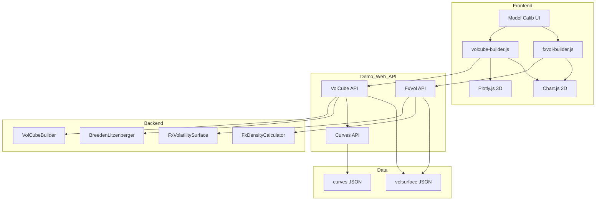
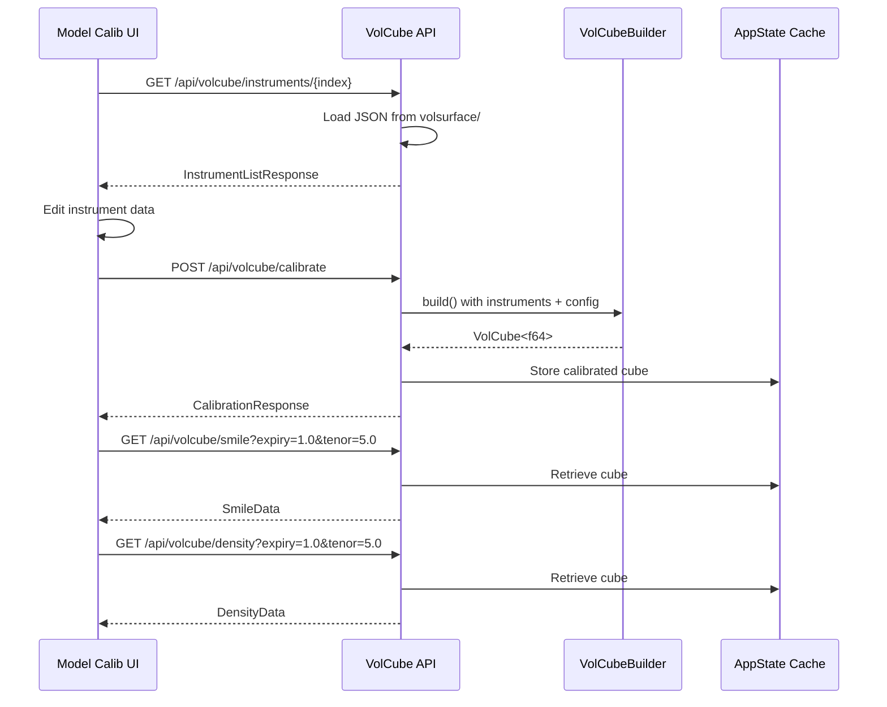
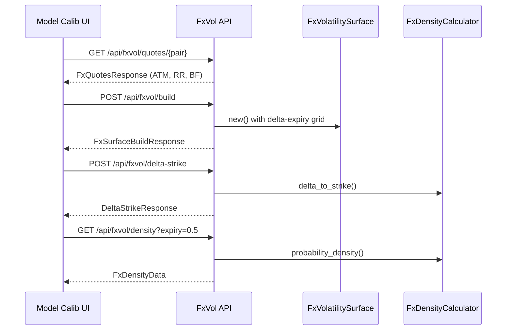
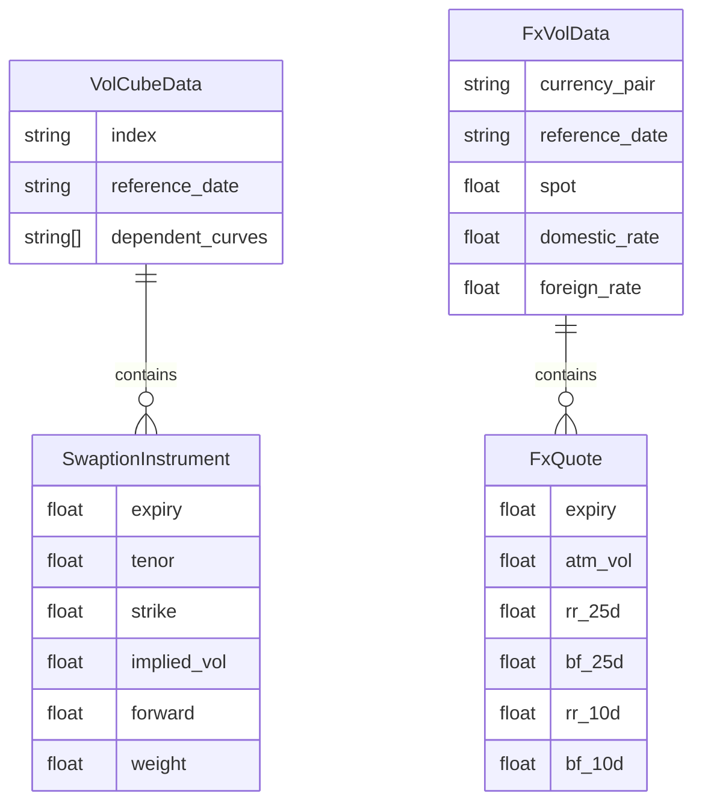

# Technical Design: volcube-calibration-ui

## Overview

**Purpose**: Demo WebAppのModel Calibration画面を拡張し、Swaption VolCube（3D）およびFX VolSurface（2D）のキャリブレーション・可視化機能を提供する。

**Users**: クオンツアナリスト、FXトレーダー、リスクマネージャーが、ボラティリティデータの入力・キャリブレーション・スマイル分析・確率密度分析を行う。

**Impact**: 既存のCurve Builder機能と並列して、ボラティリティキャリブレーション機能を追加。既存APIへの破壊的変更なし。

### Goals
- Swaption VolCube（Expiry × Tenor × Strike）のキャリブレーション・可視化
- FX VolSurface（Delta × Expiry）のRR/BF分析・確率密度計算
- 既存Curve Builder UIパターンとの一貫性維持
- Plotly.jsによる3Dサーフェスインタラクティブ可視化

### Non-Goals
- Equity VolSurface実装（将来フェーズ）
- リアルタイム市場データ連携
- キャリブレーション結果の永続化（セッション内キャッシュのみ）

## Architecture

### Existing Architecture Analysis

**Current State**:
- `demo/gui/src/web/` にCurve Builder APIが実装済み
- `pricer_models::market::volcube` にVolCubeバックエンドが完全実装
- `pricer_models::market::surfaces::fx` にFxVolatilitySurfaceが実装（確率密度未対応）
- `demo/data/input/curves/` にカーブ用JSONデータ

**Integration Points**:
- `AppState` 共有状態（curve_cache, volcube_cache追加）
- `/api/curves/*` 既存API（依存カーブ選択で連携）
- `ProblemDetails` エラーハンドリングパターン

### Architecture Pattern & Boundary Map



**Architecture Integration**:
- **Selected Pattern**: Curve Builder踏襲型（既存パターン完全踏襲）
- **Domain Boundaries**: VolCube API (`/api/volcube/*`) と FxVol API (`/api/fxvol/*`) を分離
- **Existing Patterns Preserved**: `*_types.rs`, `*_handlers.rs` 分離、`ProblemDetails` エラー
- **New Components Rationale**:
  - `volcube_types.rs`: VolCube API型定義（Swaption用）
  - `volcube_handlers.rs`: VolCube APIハンドラー
  - `fxvol_types.rs`: FxVol API型定義（FX用）
  - `fxvol_handlers.rs`: FxVol APIハンドラー
  - `fx_density.rs`: FX確率密度計算（バックエンド拡張）
- **Steering Compliance**: A-I-P-S階層維持、Static Dispatch、British English

### Technology Stack

| Layer | Choice / Version | Role in Feature | Notes |
|-------|------------------|-----------------|-------|
| Frontend | Plotly.js 2.35+ | 3Dサーフェス可視化 | CDN経由、~3MB |
| Frontend | Chart.js (既存) | 2Dスマイル/密度チャート | 既存統合維持 |
| Backend | Rust / Axum (既存) | REST APIサーバー | demo/gui/src/web |
| Data | JSON files | インストゥルメントデータ | demo/data/input/volsurface/ |

## System Flows

### VolCube Calibration Flow



### FX VolSurface Flow



## Requirements Traceability

| Requirement | Summary | Components | Interfaces | Flows |
|-------------|---------|------------|------------|-------|
| 1.1-1.10 | ボラティリティデータ管理 | VolCubeDataLoader, FxVolDataLoader | GET instruments, PUT instruments | Load/Edit |
| 2.1-2.5 | 依存カーブ統合 | DependentCurveSelector | GET /api/curves/list | Curve Selection |
| 3.1-3.6 | キャリブレーション設定 | CalibrationConfigPanel | POST /api/volcube/calibrate | Calibration |
| 4.1-4.6 | パラメータ表示 | ParameterGrid | CalibrationResponse | Results Display |
| 5.1-5.6 | スマイル可視化 | SmileChart | GET /api/volcube/smile | Smile Plot |
| 6.1-6.6 | 確率密度可視化 | DensityChart | GET /api/volcube/density | Density Plot |
| 7.1-7.6 | 3Dサーフェス | Surface3D | GET /api/volcube/surface | 3D Render |
| 8.1-8.8 | VolCube API | volcube_handlers | 7 endpoints | API |
| 9.1-9.8 | サンプルデータ | JSON files | - | Data Setup |
| 10.1-10.8 | FX専用機能 | FxSmilePanel, FxDensityCalculator | FX API | FX Analysis |
| 11.1-11.8 | FX API | fxvol_handlers | 8 endpoints | FX API |

## Components and Interfaces

### Summary

| Component | Domain/Layer | Intent | Req Coverage | Key Dependencies | Contracts |
|-----------|--------------|--------|--------------|-----------------|-----------|
| volcube_types | API Types | VolCube API型定義 | 1, 3, 4, 8 | serde | - |
| volcube_handlers | API Handlers | VolCube APIエンドポイント | 8.1-8.8 | pricer_models::volcube (P0) | API |
| fxvol_types | API Types | FxVol API型定義 | 1, 10, 11 | serde | - |
| fxvol_handlers | API Handlers | FxVol APIエンドポイント | 11.1-11.8 | pricer_models::surfaces (P0) | API |
| FxDensityCalculator | Backend | FX確率密度計算 | 10.7, 10.8 | pricer_core::math (P0) | Service |
| volcube-builder.js | Frontend | VolCube UIロジック | 1-7 | Chart.js (P1), Plotly.js (P1) | - |
| fxvol-builder.js | Frontend | FxVol UIロジック | 10 | Chart.js (P1) | - |

### API Layer

#### volcube_types.rs

| Field | Detail |
|-------|--------|
| Intent | VolCube API用Request/Response型定義 |
| Requirements | 1.5, 3.1-3.3, 4.1-4.3, 8.1-8.8 |

**Contracts**: API [x]

##### API Types

```rust
// Calibration model selection (Req 3.1)
#[derive(Debug, Clone, Copy, Serialize, Deserialize, Default)]
#[serde(rename_all = "snake_case")]
pub enum CalibrationModel {
    #[default]
    Sabr,
    Svi,
    LocalVolatility,
}

// Strike axis type (Req 3.3)
#[derive(Debug, Clone, Copy, Serialize, Deserialize, Default)]
#[serde(rename_all = "snake_case")]
pub enum StrikeAxisType {
    Absolute,
    #[default]
    Moneyness,
    LogMoneyness,
    Delta,
}

// Swaption instrument from JSON (Req 1.5)
#[derive(Debug, Clone, Serialize, Deserialize)]
#[serde(rename_all = "camelCase")]
pub struct SwaptionInstrument {
    pub expiry: f64,
    pub tenor: f64,
    pub strike: f64,
    pub implied_vol: f64,
    pub forward: f64,
    pub weight: f64,
}

// Calibration request (Req 8.4)
#[derive(Debug, Clone, Deserialize)]
#[serde(rename_all = "camelCase")]
pub struct VolCubeCalibrateRequest {
    pub index: String,
    pub instruments: Vec<SwaptionInstrument>,
    pub model: CalibrationModel,
    pub config: VolCubeConfigInput,
    pub dependent_curve_id: Option<String>,
}

// SABR parameters result (Req 4.2)
#[derive(Debug, Clone, Serialize)]
#[serde(rename_all = "camelCase")]
pub struct SabrParamsOutput {
    pub expiry: f64,
    pub tenor: f64,
    pub alpha: f64,
    pub beta: f64,
    pub rho: f64,
    pub nu: f64,
}

// Calibration response (Req 4.1-4.3)
#[derive(Debug, Clone, Serialize)]
#[serde(rename_all = "camelCase")]
pub struct VolCubeCalibrateResponse {
    pub cube_id: String,
    pub model: CalibrationModel,
    pub parameters: Vec<SabrParamsOutput>,
    pub fit_metrics: FitMetrics,
    pub processing_time_ms: f64,
}

// Smile data response (Req 5.2)
#[derive(Debug, Clone, Serialize)]
#[serde(rename_all = "camelCase")]
pub struct SmileDataResponse {
    pub expiry: f64,
    pub tenor: f64,
    pub strikes: Vec<f64>,
    pub model_vols: Vec<f64>,
    pub market_points: Vec<MarketPoint>,
}

// Density data response (Req 6.2, 6.3)
#[derive(Debug, Clone, Serialize)]
#[serde(rename_all = "camelCase")]
pub struct DensityDataResponse {
    pub expiry: f64,
    pub tenor: f64,
    pub strikes: Vec<f64>,
    pub densities: Vec<f64>,
    pub cdf: Vec<f64>,
    pub statistics: DensityStatistics,
}
```

**Implementation Notes**:
- `VolCubeConfig` → `VolCubeConfigInput` 変換でバックエンド型に接続
- RFC 7807 `ProblemDetails` をcurve_builder_typesから再利用

#### volcube_handlers.rs

| Field | Detail |
|-------|--------|
| Intent | VolCube REST APIエンドポイント実装 |
| Requirements | 8.1-8.8 |

**Dependencies**:
- Inbound: Frontend JS — API呼び出し (P0)
- Outbound: pricer_models::volcube — VolCubeBuilder, BreedenLitzenberger (P0)
- Outbound: AppState — volcube_cache (P0)

**Contracts**: API [x]

##### API Contract

| Method | Endpoint | Request | Response | Errors |
|--------|----------|---------|----------|--------|
| GET | /api/volcube/indices | - | IndicesResponse | 500 |
| GET | /api/volcube/instruments/{index} | - | InstrumentListResponse | 404, 500 |
| PUT | /api/volcube/instruments/{index} | InstrumentListRequest | InstrumentListResponse | 400, 404, 500 |
| POST | /api/volcube/calibrate | VolCubeCalibrateRequest | VolCubeCalibrateResponse | 400, 422, 500 |
| GET | /api/volcube/smile | SmileQuery | SmileDataResponse | 400, 404, 500 |
| GET | /api/volcube/density | DensityQuery | DensityDataResponse | 400, 404, 500 |
| GET | /api/volcube/surface | SurfaceQuery | SurfaceDataResponse | 400, 404, 500 |

#### fxvol_types.rs

| Field | Detail |
|-------|--------|
| Intent | FxVol API用Request/Response型定義 |
| Requirements | 1.6, 10.1-10.8, 11.1-11.8 |

**Contracts**: API [x]

##### API Types

```rust
// FX quotes from JSON (Req 1.6)
#[derive(Debug, Clone, Serialize, Deserialize)]
#[serde(rename_all = "camelCase")]
pub struct FxQuoteEntry {
    pub expiry: f64,
    pub atm_vol: f64,
    pub rr_25d: f64,
    pub bf_25d: f64,
    pub rr_10d: Option<f64>,
    pub bf_10d: Option<f64>,
}

// FX data file structure (Req 1.6)
#[derive(Debug, Clone, Serialize, Deserialize)]
#[serde(rename_all = "camelCase")]
pub struct FxVolFile {
    pub currency_pair: String,
    pub reference_date: String,
    pub spot: f64,
    pub domestic_rate: f64,
    pub foreign_rate: f64,
    pub quotes: Vec<FxQuoteEntry>,
}

// Delta-Strike conversion request (Req 10.6, 11.8)
#[derive(Debug, Clone, Deserialize)]
#[serde(rename_all = "camelCase")]
pub struct DeltaStrikeRequest {
    pub spot: f64,
    pub domestic_rate: f64,
    pub foreign_rate: f64,
    pub expiry: f64,
    pub volatility: f64,
    pub deltas: Vec<f64>,
    pub delta_type: DeltaType,
}

// Delta type for conversion
#[derive(Debug, Clone, Copy, Serialize, Deserialize, Default)]
#[serde(rename_all = "snake_case")]
pub enum DeltaType {
    #[default]
    SpotDelta,
    ForwardDelta,
    PremiumAdjusted,
}

// FX density response (Req 10.7, 10.8)
#[derive(Debug, Clone, Serialize)]
#[serde(rename_all = "camelCase")]
pub struct FxDensityResponse {
    pub expiry: f64,
    pub strikes: Vec<f64>,
    pub densities: Vec<f64>,
    pub statistics: DensityStatistics,
    pub warnings: Vec<String>,
}
```

#### fxvol_handlers.rs

| Field | Detail |
|-------|--------|
| Intent | FxVol REST APIエンドポイント実装 |
| Requirements | 11.1-11.8 |

**Dependencies**:
- Inbound: Frontend JS — API呼び出し (P0)
- Outbound: pricer_models::surfaces::fx — FxVolatilitySurface (P0)
- Outbound: FxDensityCalculator — 確率密度計算 (P0)

**Contracts**: API [x]

##### API Contract

| Method | Endpoint | Request | Response | Errors |
|--------|----------|---------|----------|--------|
| GET | /api/fxvol/pairs | - | PairsResponse | 500 |
| GET | /api/fxvol/quotes/{pair} | - | FxQuotesResponse | 404, 500 |
| PUT | /api/fxvol/quotes/{pair} | FxQuotesRequest | FxQuotesResponse | 400, 404, 500 |
| POST | /api/fxvol/build | FxSurfaceBuildRequest | FxSurfaceBuildResponse | 400, 422, 500 |
| GET | /api/fxvol/smile | FxSmileQuery | FxSmileResponse | 400, 404, 500 |
| GET | /api/fxvol/rr-bf | RrBfQuery | RrBfResponse | 400, 404, 500 |
| GET | /api/fxvol/density | FxDensityQuery | FxDensityResponse | 400, 404, 500 |
| POST | /api/fxvol/delta-strike | DeltaStrikeRequest | DeltaStrikeResponse | 400, 422, 500 |

### Backend Layer

#### FxDensityCalculator

| Field | Detail |
|-------|--------|
| Intent | FX VolSurfaceからのリスクニュートラル確率密度計算 |
| Requirements | 10.7, 10.8 |

**Responsibilities & Constraints**:
- Delta → Strike変換（Garman-Kohlhagen逆算）
- Strike軸上でのvol補間
- Breeden-Litzenberger法による数値微分でPDF計算
- 統計量計算（期待値、分散、歪度、尖度）

**Dependencies**:
- Inbound: fxvol_handlers — density計算要求 (P0)
- Outbound: FxVolatilitySurface — vol取得 (P0)
- External: pricer_core::math::distributions — 標準正規分布 (P0)

**Contracts**: Service [x]

##### Service Interface

```rust
pub struct FxDensityCalculator<'a, T: Float> {
    surface: &'a FxVolatilitySurface<T>,
    spot: T,
    domestic_rate: T,
    foreign_rate: T,
}

impl<'a, T: Float> FxDensityCalculator<'a, T> {
    pub fn new(
        surface: &'a FxVolatilitySurface<T>,
        spot: T,
        domestic_rate: T,
        foreign_rate: T,
    ) -> Self;

    /// Delta → Strike変換（Garman-Kohlhagen逆算）
    pub fn delta_to_strike(
        &self,
        delta: T,
        expiry: T,
        delta_type: DeltaType,
    ) -> Result<T, MarketDataError>;

    /// 指定Expiryでの確率密度関数
    pub fn probability_density(
        &self,
        strike: T,
        expiry: T,
    ) -> Result<T, MarketDataError>;

    /// 確率密度の統計量
    pub fn statistics(
        &self,
        expiry: T,
        strike_range: (T, T),
        num_points: usize,
    ) -> Result<DensityStatistics<T>, MarketDataError>;
}
```

- Preconditions: spot > 0, expiry > 0, 0 < delta < 1
- Postconditions: density >= 0, CDF in [0, 1]
- Invariants: ∫ density dK = 1（正規化）

**Implementation Notes**:
- 数値微分にはcentral differenceを使用（h = 0.001 * strike）
- Strike範囲外では警告付きで外挿

## Data Models

### Domain Model



### Logical Data Model

**VolCube JSON Schema** (`demo/data/input/volsurface/usd-sofr-swaption.json`):

```json
{
  "index": "usd-sofr-swaption",
  "reference_date": "2026-01-23",
  "instruments": [
    {
      "expiry": 1.0,
      "tenor": 5.0,
      "strike": 0.03,
      "implied_vol": 0.45,
      "forward": 0.035,
      "weight": 1.0
    }
  ]
}
```

**FxVol JSON Schema** (`demo/data/input/volsurface/eurusd-fx.json`):

```json
{
  "currency_pair": "EURUSD",
  "reference_date": "2026-01-23",
  "spot": 1.0850,
  "domestic_rate": 0.045,
  "foreign_rate": 0.035,
  "quotes": [
    {
      "expiry": 0.25,
      "atm_vol": 0.085,
      "rr_25d": -0.005,
      "bf_25d": 0.003,
      "rr_10d": -0.012,
      "bf_10d": 0.008
    }
  ]
}
```

## Error Handling

### Error Strategy

RFC 7807 `ProblemDetails` パターンを使用（curve_builder_typesから継承）:

```rust
// 既存ProblemDetailsを再利用
use crate::web::curve_builder_types::ProblemDetails;

// VolCube固有エラー
impl ProblemDetails {
    pub fn calibration_failed(detail: impl Into<String>) -> Self {
        Self {
            r#type: "https://api.neutryx.io/problems/calibration-failed".to_string(),
            title: "Calibration Failed".to_string(),
            status: 422,
            detail: detail.into(),
            instance: None,
        }
    }

    pub fn density_numerical_error(detail: impl Into<String>) -> Self {
        Self {
            r#type: "https://api.neutryx.io/problems/density-numerical-error".to_string(),
            title: "Density Calculation Warning".to_string(),
            status: 200, // Partial success with warnings
            detail: detail.into(),
            instance: None,
        }
    }
}
```

### Error Categories and Responses

| Category | Code | Handling |
|----------|------|----------|
| Validation (index/pair not found) | 404 | `ProblemDetails::not_found()` |
| Validation (invalid parameters) | 400 | `ProblemDetails::validation()` |
| Calibration failure | 422 | `ProblemDetails::calibration_failed()` |
| Numerical instability | 200 + warnings | Partial result with `warnings[]` |
| Internal error | 500 | `ProblemDetails::internal()` |

## Testing Strategy

### Unit Tests
- `volcube_types.rs`: Serde serialize/deserialize、enum helper methods
- `fxvol_types.rs`: FxQuoteEntry変換、DeltaType enum
- `FxDensityCalculator`: delta_to_strike、probability_density、statistics

### Integration Tests
- `/api/volcube/calibrate` → VolCubeBuilder連携
- `/api/fxvol/density` → FxDensityCalculator連携
- JSON file loading from `demo/data/input/volsurface/`

### E2E Tests
- Model Calib UI → Index選択 → データ編集 → キャリブレーション → 結果表示
- FX UI → RR/BF入力 → Delta vol変換 → 確率密度表示

## Performance & Scalability

**Target Metrics**:
- キャリブレーション: < 500ms（典型的グリッド: 10 expiry × 5 tenor × 20 strike）
- スマイルデータ取得: < 50ms
- 3Dサーフェスレンダリング: < 200ms（50×50グリッド）

**Caching Strategy**:
- `AppState::volcube_cache`: LRU cache（最大10キューブ）
- `AppState::fxvol_cache`: LRU cache（最大10サーフェス）

**Optimization**:
- バックエンド既存`VolCubeCache`活用
- フロントエンドでのグリッド解像度動的調整
