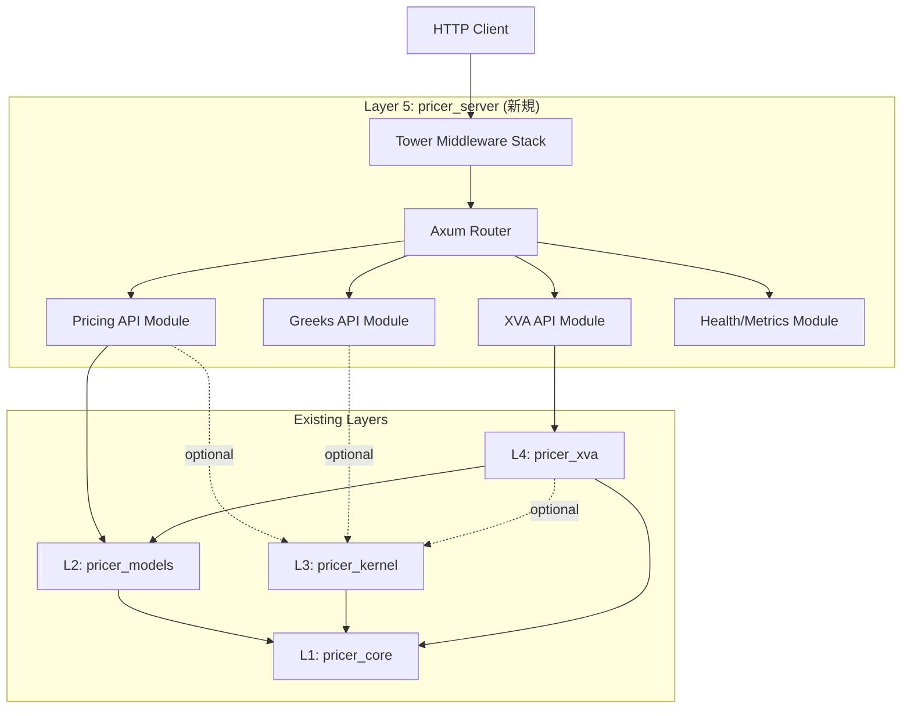
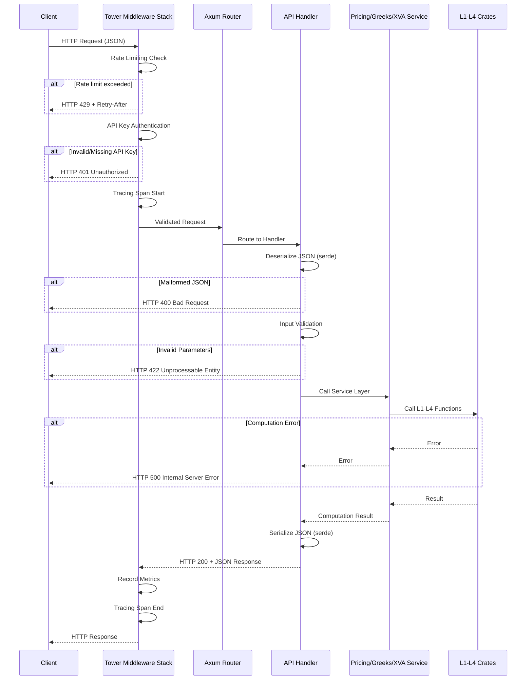
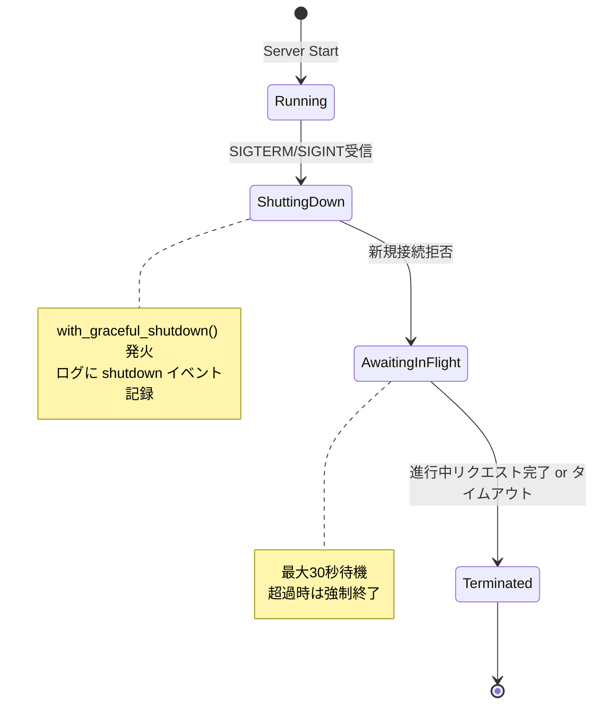
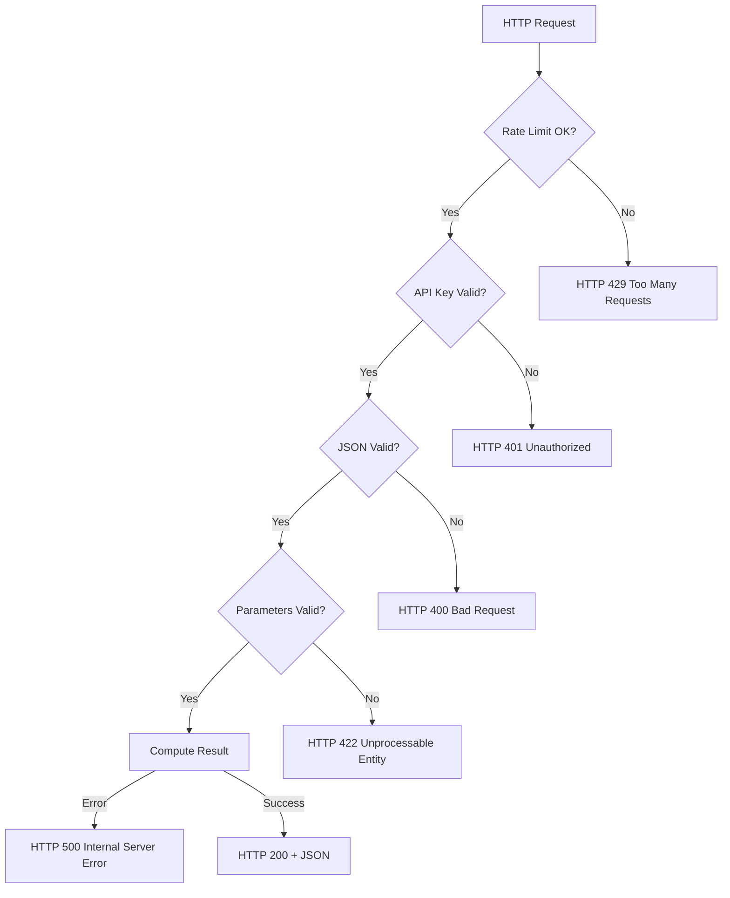

# 技術設計書: Web APIサーバー (pricer_server)

## Overview

**目的**: 本機能は、Neutryx XVA Pricing Libraryの既存計算機能をHTTP REST APIとして公開し、外部クライアントアプリケーションからのアクセスを可能にする。Layer 5 (pricer_server) として新規クレートを追加し、Axumフレームワークを使用して安定したWebサーバーを構築する。

**ユーザー**: 定量アナリスト、リスク管理者、信用リスクアナリスト、API統合開発者、インフラストラクチャ運用者が、HTTP経由でオプション価格計算、ギリシャ指標計算、XVA計算を実行するために利用する。

**Impact**: 既存の4層アーキテクチャ (L1: pricer_core, L2: pricer_models, L3: pricer_kernel, L4: pricer_xva) に新規Layer 5を追加する。stable Rustで動作し、L3 (nightly必須) をoptional feature flagとして統合する。

### Goals
- Axumベースの安定したHTTPサーバー実装 (stable Rust)
- 既存L1-L4機能のREST APIエンドポイント化 (価格計算、ギリシャ、XVA)
- JSON入出力とOpenAPI 3.0仕様の自動生成
- レート制限、API key認証、構造化ログ、Prometheusメトリクスの提供
- graceful shutdown、ヘルスチェック、環境変数ベース設定管理

### Non-Goals
- 非同期ジョブキュー/バックグラウンドタスク実行 (Phase 1では同期リクエスト/レスポンスのみ)
- データベース永続化 (ステートレス設計)
- WebSocket/Server-Sent Eventsリアルタイム通信
- マルチテナント分離 (API key認証のみ、テナント管理なし)
- フロントエンドUI提供 (Swagger UIのみ)

## Architecture

### Existing Architecture Analysis

既存システムは4層アーキテクチャで構成される:

- **L1 (pricer_core)**: 数学関数、型、トレイト、市場データ抽象化 (stable Rust)
- **L2 (pricer_models)**: 金融商品、確率モデル、分析解 (stable Rust)
- **L3 (pricer_kernel)**: Monte Carlo + Enzyme AD (nightly Rust必須)
- **L4 (pricer_xva)**: ポートフォリオ分析、XVA計算、並列処理 (stable Rust)

**Integration Points**:
- L5はL1, L2, L4に直接依存
- L3はoptional feature flag (`kernel-integration`) 経由で統合
- 既存の型 (`Currency`, `Date`, `Instrument`, `Portfolio`) をそのまま使用
- JSONシリアライゼーション用のserde derive追加

**Constraints**:
- L3 Enzyme機能はnightly必須: feature flag分離
- 既存クレートの public API変更不可: Adapter層で吸収
- pricer_kernel の `MonteCarloPricer` がnightly依存: conditional compilation

### Architecture Pattern & Boundary Map

**Selected Pattern**: Layered API Architecture (レイヤードAPIアーキテクチャ)



**Architecture Integration**:
- **Selected pattern**: Layered API - 既存4層アーキテクチャの上に新規HTTP層追加
- **Domain/feature boundaries**:
  - Pricing API: バニラ、Asian、Barrier、Lookbackオプション価格計算
  - Greeks API: デルタ、ガンマ、ベガ、セータ、ロー計算
  - XVA API: ポートフォリオCVA/DVA/FVA計算
  - Health/Metrics API: ヘルスチェック、readiness、Prometheusメトリクス
- **Existing patterns preserved**:
  - Bottom-up依存フロー (L1 ← L2 ← L3 ← L4 ← L5)
  - Static dispatch via enum (Enzyme最適化)
  - Feature flag分離 (stable/nightly)
- **New components rationale**:
  - Axum Router: 型安全なHTTPルーティング
  - Tower middleware: レート制限、認証、ログ、メトリクス
  - API Request/Response型: JSON入出力の型安全性
- **Steering compliance**:
  - Layer分離原則維持
  - Stable Rust優先 (L3のみnightly)
  - 型安全性最優先 (serde型定義必須)

### Technology Stack

| Layer | Choice / Version | Role in Feature | Notes |
|-------|------------------|-----------------|-------|
| Backend / Services | Axum 0.8.x | HTTPルーティング、リクエストハンドリング | stable Rust対応、Towerネイティブ |
| Backend / Services | tower-http 0.6.x | Middleware (CORS, tracing, compression) | TraceLayer、CorsLayerなど |
| Backend / Services | tower_governor 0.5.x | レート制限middleware | API key別制限対応 |
| Data / Serialization | serde 1.0 + serde_json 1.0 | JSON入出力、camelCase変換 | 既存workspace依存 |
| Data / Serialization | chrono 0.4 | ISO 8601日時処理 | 既存workspace依存 |
| Documentation / API | utoipa 5.x + utoipa-swagger-ui 8.x | OpenAPI 3.0/3.1仕様生成、Swagger UI | コンパイル時生成 |
| Observability / Metrics | axum-prometheus 0.8.x | Prometheus互換メトリクス | metrics.rs + metrics_exporter_prometheus |
| Observability / Logging | tracing 0.1 + tracing-subscriber 0.3 | 構造化ログ | tower-http TraceLayerと統合 |
| Infrastructure / Runtime | Tokio 1.x | 非同期runtime | Axum必須依存 |
| Security / Auth | Custom middleware | API key認証 | Authorizationヘッダーチェック |
| Configuration | config 0.14 + clap 4.x | 環境変数/TOML設定、CLI引数 | 12-factor app対応 |

**Rationale**:
- **Axum**: マクロフリー、型安全、Towerエコシステムネイティブ
- **utoipa**: Code-firstでOpenAPI自動生成、runtime overhead無し
- **tower_governor**: Towerネイティブ、複数キー抽出戦略対応
- **既存依存活用**: serde、chrono、thiserrorはworkspaceで共有

詳細な調査結果とトレードオフについては `research.md` を参照。

## System Flows

### リクエスト処理フロー



**Key Decisions**:
- Middleware stack順序: Rate Limiting → Auth → Tracing → CORS → Compression
- エラー時の早期リターン (fail fast) でリソース節約
- Metrics記録はレスポンス送信後 (レイテンシー影響最小化)

### Graceful Shutdown処理



**Key Decisions**:
- SIGTERM/SIGINT両対応 (Docker/K8s互換)
- タイムアウト設定可能 (デフォルト30秒)
- ログにshutdown理由とタイミング記録

## Requirements Traceability

| Requirement | Summary | Components | Interfaces | Flows |
|-------------|---------|------------|------------|-------|
| 1.1, 1.2, 1.3, 1.4 | Axum HTTPサーバー基本機能 | ServerConfig, AxumRouter | サーバー起動/ルーティング | リクエスト処理フロー |
| 1.5, 1.6, 1.7 | Graceful shutdown、ログ、タイムアウト | GracefulShutdownHandler, TracingMiddleware | signal listener | Shutdown処理 |
| 2.1, 2.2, 2.3, 2.4, 2.5, 2.6, 2.7 | JSON入出力、シリアライゼーション | API Request/Response型 | Serde JSON | リクエスト処理フロー |
| 3.1, 3.2, 3.3, 3.4, 3.5, 3.6, 3.7, 3.8 | オプション価格計算エンドポイント | PricingHandler, PricingService | POST /api/v1/price/* | リクエスト処理フロー |
| 4.1, 4.2, 4.3, 4.4, 4.5, 4.6, 4.7 | ギリシャ指標計算エンドポイント | GreeksHandler, GreeksService | POST /api/v1/greeks | リクエスト処理フロー |
| 5.1, 5.2, 5.3, 5.4, 5.5, 5.6, 5.7 | ポートフォリオXVA計算エンドポイント | XvaHandler, XvaService | POST /api/v1/xva/* | リクエスト処理フロー |
| 6.1, 6.2, 6.3, 6.4, 6.5, 6.6, 6.7, 6.8 | エラーハンドリングとバリデーション | ErrorHandler, ValidationMiddleware | エラーレスポンス型 | リクエスト処理フロー |
| 7.1, 7.2, 7.3, 7.4, 7.5, 7.6, 7.7 | OpenAPI仕様とドキュメンテーション | OpenApiSpec, SwaggerUI | GET /api/v1/openapi.json, GET /docs | - |
| 8.1, 8.2, 8.3, 8.4, 8.5, 8.6, 8.7 | ヘルスチェックとモニタリング | HealthHandler, MetricsHandler | GET /health, GET /ready, GET /metrics | - |
| 9.1, 9.2, 9.3, 9.4, 9.5, 9.6, 9.7, 9.8 | セキュリティとレート制限 | AuthMiddleware, RateLimitMiddleware | API key検証 | リクエスト処理フロー |
| 10.1, 10.2, 10.3, 10.4, 10.5, 10.6, 10.7, 10.8 | 設定管理とデプロイメント | ServerConfig, DockerConfig | 環境変数/TOML | - |
| 11.1, 11.2, 11.3, 11.4, 11.5, 11.6, 11.7, 11.8 | レイヤーアーキテクチャ統合 | pricer_server crate | L1-L4依存 | - |
| 12.1, 12.2, 12.3, 12.4, 12.5, 12.6, 12.7, 12.8 | テストとCI/CD統合 | 統合テスト、ユニットテスト | - | - |

## Components and Interfaces

### Component Summary

| Component | Domain/Layer | Intent | Req Coverage | Key Dependencies (P0/P1) | Contracts |
|-----------|--------------|--------|--------------|--------------------------|-----------|
| ServerConfig | Infrastructure | サーバー設定管理 (host/port/log level) | 10.1-10.4 | config (P0), clap (P1) | State |
| AxumRouter | Infrastructure | HTTPルーティング定義とmiddleware統合 | 1.2-1.4 | axum (P0), tower (P0) | Service |
| PricingHandler | API/Pricing | オプション価格計算エンドポイント | 3.1-3.8 | PricingService (P0), pricer_models (P0) | API |
| GreeksHandler | API/Greeks | ギリシャ指標計算エンドポイント | 4.1-4.7 | GreeksService (P0), pricer_kernel (P1) | API |
| XvaHandler | API/XVA | ポートフォリオXVA計算エンドポイント | 5.1-5.7 | XvaService (P0), pricer_xva (P0) | API |
| HealthHandler | Infrastructure | ヘルスチェックとreadiness | 8.1-8.2 | - | API |
| MetricsHandler | Infrastructure | Prometheusメトリクスエンドポイント | 8.3-8.4 | axum-prometheus (P0) | API |
| AuthMiddleware | Security | API key認証middleware | 9.1-9.3 | tower (P0) | Service |
| RateLimitMiddleware | Security | レート制限middleware | 9.4-9.5 | tower_governor (P0) | Service |
| TracingMiddleware | Observability | 構造化ログとspan管理 | 1.6, 8.7 | tower-http (P0), tracing (P0) | Service |
| ErrorHandler | Error Handling | グローバルエラーハンドリング | 6.1-6.8 | thiserror (P0) | State |
| OpenApiSpec | Documentation | OpenAPI仕様生成 | 7.1-7.7 | utoipa (P0) | State |
| GracefulShutdownHandler | Infrastructure | SIGTERM/SIGINT処理 | 1.5 | tokio::signal (P0) | Service |

### Infrastructure Layer

#### ServerConfig

| Field | Detail |
|-------|--------|
| Intent | サーバー起動設定を環境変数/TOML/CLI引数から読み込み、バリデーション実施 |
| Requirements | 10.1, 10.2, 10.3, 10.4, 10.7 |

**Responsibilities & Constraints**:
- 環境変数 (SERVER_HOST, SERVER_PORT, LOG_LEVEL, API_KEY_REQUIRED) からデフォルト設定読み込み
- TOML/YAML設定ファイルオプショナル対応 (--config-file引数)
- CLI引数による設定上書き (clap使用)
- 設定バリデーション (ポート範囲、ログレベル検証)
- 環境別設定 (development/staging/production) サポート

**Dependencies**:
- Inbound: main関数 → 起動時設定読み込み (P0)
- External: config crate → TOML/YAML解析 (P0)
- External: clap crate → CLI引数解析 (P1)

**Contracts**: State [x]

##### State Management
- State model:
  ```rust
  pub struct ServerConfig {
      pub host: String,              // default: "0.0.0.0"
      pub port: u16,                 // default: 8080
      pub log_level: String,         // default: "info"
      pub api_key_required: bool,    // default: false
      pub api_keys: Vec<String>,     // from env/file
      pub rate_limit_rpm: u32,       // default: 60
      pub shutdown_timeout_secs: u64,// default: 30
      pub kernel_enabled: bool,      // feature flag check
  }
  ```
- Persistence & consistency: 起動時read-only、runtime変更不可
- Concurrency strategy: Arc<ServerConfig>で複数handler間共有

**Implementation Notes**:
- Integration: 環境変数前置詞 `PRICER_` 使用 (例: PRICER_SERVER_HOST)
- Validation: ポート範囲1-65535、log level列挙型チェック
- Risks: 設定ファイル構文エラー時はデフォルト値にfallback (警告ログ)

#### AxumRouter

| Field | Detail |
|-------|--------|
| Intent | 全APIエンドポイントのルーティング定義とmiddleware stack構築 |
| Requirements | 1.2, 1.3, 1.4 |

**Responsibilities & Constraints**:
- エンドポイントグループ別Router分割 (pricing, greeks, xva, health)
- Router::merge()で統合
- Middleware適用順序: RateLimit → Auth → Tracing → CORS → Compression
- State共有 (Arc<ServerConfig>, Arc<Metrics>)

**Dependencies**:
- Inbound: main関数 → Router構築 (P0)
- Outbound: PricingHandler, GreeksHandler, XvaHandler, HealthHandler → ルーティング (P0)
- External: axum crate (P0), tower crate (P0)

**Contracts**: Service [x]

##### Service Interface
```rust
pub fn build_router(config: Arc<ServerConfig>) -> Router {
    let pricing_routes = pricing_routes();
    let greeks_routes = greeks_routes();
    let xva_routes = xva_routes();
    let health_routes = health_routes();

    Router::new()
        .merge(pricing_routes)
        .merge(greeks_routes)
        .merge(xva_routes)
        .merge(health_routes)
        .layer(/* middleware stack */)
        .with_state(config)
}
```
- Preconditions: ServerConfig validation済み
- Postconditions: 全エンドポイント登録済みRouter返却
- Invariants: Middleware適用順序固定

**Implementation Notes**:
- Integration: モジュール分割 (src/routes/pricing.rs, greeks.rs, xva.rs, health.rs)
- Validation: 起動時にroute conflict検出 (Axum自動チェック)
- Risks: Middleware順序誤りでauth bypassリスク → 統合テストで検証

#### GracefulShutdownHandler

| Field | Detail |
|-------|--------|
| Intent | SIGTERM/SIGINTシグナル受信時にgraceful shutdown実施 |
| Requirements | 1.5, 10.6 |

**Responsibilities & Constraints**:
- tokio::signal::ctrl_c() および unix::signal(SIGTERM) 監視
- 新規接続拒否、進行中リクエスト完了待機
- タイムアウト (デフォルト30秒) で強制終了
- ログにshutdownイベント記録

**Dependencies**:
- Inbound: main関数 → shutdown signal future (P0)
- External: tokio::signal (P0)

**Contracts**: Service [x]

##### Service Interface
```rust
pub async fn shutdown_signal() {
    let ctrl_c = async {
        tokio::signal::ctrl_c()
            .await
            .expect("failed to install Ctrl+C handler");
    };

    #[cfg(unix)]
    let terminate = async {
        tokio::signal::unix::signal(SignalKind::terminate())
            .expect("failed to install signal handler")
            .recv()
            .await;
    };

    #[cfg(not(unix))]
    let terminate = std::future::pending::<()>();

    tokio::select! {
        _ = ctrl_c => {},
        _ = terminate => {},
    }
    tracing::info!("shutdown signal received");
}
```
- Preconditions: Tokio runtimeアクティブ
- Postconditions: シグナル受信時にfuture完了
- Invariants: 単一シグナルで即座に完了

**Implementation Notes**:
- Integration: Axum Server::with_graceful_shutdown()に渡す
- Validation: 統合テストでSIGTERM送信確認
- Risks: Windows環境でSIGTERM未対応 → ctrl_cのみfallback

### API Layer - Pricing

#### PricingHandler

| Field | Detail |
|-------|--------|
| Intent | オプション価格計算API (バニラ、Asian、Barrier、Lookback) |
| Requirements | 3.1, 3.2, 3.3, 3.4, 3.5, 3.6, 3.7, 3.8 |

**Responsibilities & Constraints**:
- JSON Request deserialization (serde)
- 入力パラメータバリデーション (spot > 0, strike > 0, etc.)
- pricer_models分析解またはpricer_kernel Monte Carlo呼び出し
- JSON Response serialization (price, calculation_method, timestamp)
- エラーハンドリング (HTTP 400/422/500)

**Dependencies**:
- Inbound: Axum Router → POST /api/v1/price/{vanilla,asian,barrier,lookback} (P0)
- Outbound: PricingService → 計算ロジック (P0)
- External: pricer_models (P0), pricer_kernel (P1, optional)

**Contracts**: API [x]

##### API Contract

| Method | Endpoint | Request | Response | Errors |
|--------|----------|---------|----------|--------|
| POST | /api/v1/price/vanilla | VanillaPriceRequest | PriceResponse | 400, 422, 500 |
| POST | /api/v1/price/asian | AsianPriceRequest | PriceResponse | 400, 422, 500 |
| POST | /api/v1/price/barrier | BarrierPriceRequest | PriceResponse | 400, 422, 500 |
| POST | /api/v1/price/lookback | LookbackPriceRequest | PriceResponse | 400, 422, 500 |

**Request Schema (VanillaPriceRequest)**:
```rust
#[derive(Deserialize, ToSchema)]
#[serde(rename_all = "camelCase")]
pub struct VanillaPriceRequest {
    pub option_type: OptionType,   // "call" | "put"
    pub spot: f64,                 // > 0
    pub strike: f64,               // > 0
    pub maturity: f64,             // > 0 (years)
    pub risk_free_rate: f64,
    pub volatility: f64,           // > 0
    pub smoothing_epsilon: Option<f64>, // default: 1e-6
}

#[derive(Deserialize, ToSchema)]
#[serde(rename_all = "lowercase")]
pub enum OptionType {
    Call,
    Put,
}
```

**Response Schema (PriceResponse)**:
```rust
#[derive(Serialize, ToSchema)]
#[serde(rename_all = "camelCase")]
pub struct PriceResponse {
    pub price: f64,
    pub calculation_method: CalculationMethod, // "analytical" | "monte_carlo"
    pub timestamp: String, // ISO 8601 format
}

#[derive(Serialize, ToSchema)]
#[serde(rename_all = "snake_case")]
pub enum CalculationMethod {
    Analytical,
    MonteCarlo,
}
```

**Error Response Schema**:
```rust
#[derive(Serialize, ToSchema)]
#[serde(rename_all = "camelCase")]
pub struct ErrorResponse {
    pub error: String,
    pub message: String,
    pub request_id: Option<String>,
    pub timestamp: String,
}
```

**AsianPriceRequest追加フィールド**:
```rust
pub averaging_type: AveragingType,  // "arithmetic" | "geometric"
pub simulation_params: Option<SimulationParams>,
```

**BarrierPriceRequest追加フィールド**:
```rust
pub barrier_type: BarrierType,  // "up_in" | "up_out" | "down_in" | "down_out"
pub barrier: f64,               // > 0
pub simulation_params: Option<SimulationParams>,
```

**LookbackPriceRequest追加フィールド**:
```rust
pub lookback_type: LookbackType,  // "fixed_strike" | "floating_strike"
pub simulation_params: Option<SimulationParams>,
```

**SimulationParams Schema**:
```rust
#[derive(Deserialize, ToSchema)]
#[serde(rename_all = "camelCase")]
pub struct SimulationParams {
    pub num_paths: Option<usize>,   // default: 10000
    pub num_steps: Option<usize>,   // default: 100
    pub seed: Option<u64>,          // optional
}
```

**Implementation Notes**:
- Integration: バニラはpricer_models分析解、パス依存型はpricer_kernel Monte Carlo
- Validation: num-traits Floatトレイトでspot/strike > 0チェック
- Risks: pricer_kernel feature無効時、パス依存型計算でHTTP 501 Not Implemented返却

### API Layer - Greeks

#### GreeksHandler

| Field | Detail |
|-------|--------|
| Intent | オプションギリシャ指標計算API (デルタ、ガンマ、ベガ、セータ、ロー) |
| Requirements | 4.1, 4.2, 4.3, 4.4, 4.5, 4.6, 4.7 |

**Responsibilities & Constraints**:
- JSON Request deserialization
- pricer_kernel Enzyme ADまたはbump-and-revalue呼び出し
- 複数ギリシャ同時計算時にシミュレーションパス再利用
- 数値不安定時にHTTP 422返却

**Dependencies**:
- Inbound: Axum Router → POST /api/v1/greeks (P0)
- Outbound: GreeksService → 計算ロジック (P0)
- External: pricer_kernel (P0, feature flag依存)

**Contracts**: API [x]

##### API Contract

| Method | Endpoint | Request | Response | Errors |
|--------|----------|---------|----------|--------|
| POST | /api/v1/greeks | GreeksRequest | GreeksResponse | 400, 422, 500, 501 |

**Request Schema (GreeksRequest)**:
```rust
#[derive(Deserialize, ToSchema)]
#[serde(rename_all = "camelCase")]
pub struct GreeksRequest {
    // オプションパラメータ (VanillaPriceRequestと同等)
    pub option_type: OptionType,
    pub spot: f64,
    pub strike: f64,
    pub maturity: f64,
    pub risk_free_rate: f64,
    pub volatility: f64,
    pub smoothing_epsilon: Option<f64>,

    // 計算するギリシャ指定
    pub greeks_config: GreeksConfig,
    pub simulation_params: Option<SimulationParams>,
}

#[derive(Deserialize, ToSchema)]
#[serde(rename_all = "camelCase")]
pub struct GreeksConfig {
    pub delta: bool,   // default: true
    pub gamma: bool,   // default: false
    pub vega: bool,    // default: false
    pub theta: bool,   // default: false
    pub rho: bool,     // default: false
}
```

**Response Schema (GreeksResponse)**:
```rust
#[derive(Serialize, ToSchema)]
#[serde(rename_all = "camelCase")]
pub struct GreeksResponse {
    pub delta: Option<f64>,
    pub gamma: Option<f64>,
    pub vega: Option<f64>,
    pub theta: Option<f64>,
    pub rho: Option<f64>,
    pub calculation_method: CalculationMethod, // "enzyme_ad" | "bump_and_revalue"
    pub timestamp: String,
}
```

**Implementation Notes**:
- Integration: pricer_kernel::greeks::GreeksConfig マッピング
- Validation: feature "kernel-integration" 無効時はHTTP 501返却
- Risks: Enzyme未利用環境でbump-and-revalue fallback (パフォーマンス低下)

### API Layer - XVA

#### XvaHandler

| Field | Detail |
|-------|--------|
| Intent | ポートフォリオXVA計算API (CVA/DVA/FVA、エクスポージャー指標) |
| Requirements | 5.1, 5.2, 5.3, 5.4, 5.5, 5.6, 5.7 |

**Responsibilities & Constraints**:
- ポートフォリオ定義JSON deserialization (トレード、ネッティングセット、カウンターパーティ)
- pricer_xvaポートフォリオ構築とXVA計算呼び出し
- Rayon並列処理活用 (大規模ポートフォリオ)
- タイムアウト30秒制約 (超過時は部分結果返却検討)

**Dependencies**:
- Inbound: Axum Router → POST /api/v1/xva/portfolio, POST /api/v1/xva/counterparty (P0)
- Outbound: XvaService → 計算ロジック (P0)
- External: pricer_xva (P0)

**Contracts**: API [x]

##### API Contract

| Method | Endpoint | Request | Response | Errors |
|--------|----------|---------|----------|--------|
| POST | /api/v1/xva/portfolio | PortfolioXvaRequest | PortfolioXvaResponse | 400, 422, 500, 503 |
| POST | /api/v1/xva/counterparty | CounterpartyXvaRequest | CounterpartyXvaResponse | 400, 422, 500 |

**Request Schema (PortfolioXvaRequest)**:
```rust
#[derive(Deserialize, ToSchema)]
#[serde(rename_all = "camelCase")]
pub struct PortfolioXvaRequest {
    pub counterparties: Vec<CounterpartyData>,
    pub netting_sets: Vec<NettingSetData>,
    pub trades: Vec<TradeData>,
    pub time_grid: Vec<f64>,          // evaluation dates (years)
    pub simulation_params: SimulationParams,
}

#[derive(Deserialize, ToSchema)]
#[serde(rename_all = "camelCase")]
pub struct CounterpartyData {
    pub counterparty_id: String,
    pub credit_spread: f64,       // > 0
    pub recovery_rate: f64,       // 0 <= rr <= 1
}

#[derive(Deserialize, ToSchema)]
#[serde(rename_all = "camelCase")]
pub struct NettingSetData {
    pub netting_set_id: String,
    pub counterparty_id: String,
}

#[derive(Deserialize, ToSchema)]
#[serde(rename_all = "camelCase")]
pub struct TradeData {
    pub trade_id: String,
    pub instrument: InstrumentData,
    pub currency: String,          // ISO 4217
    pub counterparty_id: String,
    pub netting_set_id: String,
    pub notional: f64,
}

#[derive(Deserialize, ToSchema)]
#[serde(rename_all = "camelCase")]
pub struct InstrumentData {
    pub instrument_type: String,   // "vanilla" | "asian" | "barrier" | "lookback"
    pub params: serde_json::Value, // instrument-specific params
}
```

**Response Schema (PortfolioXvaResponse)**:
```rust
#[derive(Serialize, ToSchema)]
#[serde(rename_all = "camelCase")]
pub struct PortfolioXvaResponse {
    pub cva: f64,
    pub dva: f64,
    pub fva: f64,
    pub exposure_metrics: ExposureMetrics,
    pub timestamp: String,
}

#[derive(Serialize, ToSchema)]
#[serde(rename_all = "camelCase")]
pub struct ExposureMetrics {
    pub ee: Vec<f64>,    // Expected Exposure
    pub epe: f64,        // Expected Positive Exposure
    pub pfe: f64,        // Potential Future Exposure (95%)
    pub eepe: f64,       // Effective EPE
    pub ene: f64,        // Expected Negative Exposure
}
```

**Implementation Notes**:
- Integration: pricer_xva::PortfolioBuilder でポートフォリオ構築
- Validation: トレード数制限 (1000件上限、超過時はHTTP 413)
- Risks: 大規模ポートフォリオで30秒タイムアウト超過 → 非同期ジョブキュー検討 (Phase 2)

### Infrastructure Layer - Health & Metrics

#### HealthHandler

| Field | Detail |
|-------|--------|
| Intent | ヘルスチェックとreadiness probe提供 |
| Requirements | 8.1, 8.2, 8.5, 8.6 |

**Responsibilities & Constraints**:
- GET /health: サーバー稼働状態、依存関係チェック
- GET /ready: 初期化完了確認 (起動直後はHTTP 503)
- バージョン情報、uptime返却

**Dependencies**:
- Inbound: Axum Router → GET /health, GET /ready (P0)
- Outbound: 依存関係チェック (L1-L4 crate version確認) (P1)

**Contracts**: API [x]

##### API Contract

| Method | Endpoint | Request | Response | Errors |
|--------|----------|---------|----------|--------|
| GET | /health | None | HealthResponse | 503 |
| GET | /ready | None | ReadyResponse | 503 |

**Response Schema (HealthResponse)**:
```rust
#[derive(Serialize, ToSchema)]
#[serde(rename_all = "camelCase")]
pub struct HealthResponse {
    pub status: String,         // "healthy" | "unhealthy"
    pub version: String,        // crate version
    pub uptime_secs: u64,
    pub dependencies: DependencyStatus,
}

#[derive(Serialize, ToSchema)]
#[serde(rename_all = "camelCase")]
pub struct DependencyStatus {
    pub pricer_core: bool,
    pub pricer_models: bool,
    pub pricer_xva: bool,
    pub pricer_kernel: bool,  // feature flag依存
}
```

**Implementation Notes**:
- Integration: 起動時タイムスタンプ記録、uptimeはDuration計算
- Validation: K8s liveness/readiness probe設定例をREADMEに記載
- Risks: 依存関係チェック失敗時もHTTP 200返却 (statusフィールドで判定)

#### MetricsHandler

| Field | Detail |
|-------|--------|
| Intent | Prometheusメトリクスエンドポイント提供 |
| Requirements | 8.3, 8.4, 8.7 |

**Responsibilities & Constraints**:
- リクエスト数、レイテンシー、エラー率収集
- エンドポイント別メトリクス分離
- Prometheusテキストフォーマット出力

**Dependencies**:
- Inbound: Axum Router → GET /metrics (P0)
- External: axum-prometheus (P0), metrics_exporter_prometheus (P0)

**Contracts**: API [x]

##### API Contract

| Method | Endpoint | Request | Response | Errors |
|--------|----------|---------|----------|--------|
| GET | /metrics | None | Prometheus text format | - |

**Metrics定義**:
- `http_requests_total{method, endpoint, status}`: リクエスト総数
- `http_request_duration_seconds{method, endpoint}`: リクエストレイテンシー (histogram)
- `http_requests_in_flight{method, endpoint}`: 進行中リクエスト数 (gauge)
- `pricer_calculations_total{calculation_type}`: 計算実行回数 (pricing/greeks/xva)
- `pricer_calculation_errors_total{calculation_type}`: 計算エラー回数

**Implementation Notes**:
- Integration: axum-prometheus PrometheusMetricLayer適用
- Validation: Prometheusスクレイプ設定例をREADMEに記載
- Risks: メトリクス収集オーバーヘッド (最小限、middleware層で実装)

### Security Layer

#### AuthMiddleware

| Field | Detail |
|-------|--------|
| Intent | API key認証middleware |
| Requirements | 9.1, 9.2, 9.3 |

**Responsibilities & Constraints**:
- Authorizationヘッダーまたは X-API-Key ヘッダーからAPI key抽出
- ServerConfigのapi_keysリストと照合
- 無効/欠損時にHTTP 401返却
- API key認証無効モード対応 (api_key_required: false)

**Dependencies**:
- Inbound: Axum Router middleware stack (P0)
- Outbound: ServerConfig → api_keys読み込み (P0)
- External: tower (P0)

**Contracts**: Service [x]

##### Service Interface
```rust
pub struct AuthMiddleware {
    config: Arc<ServerConfig>,
}

impl AuthMiddleware {
    pub fn new(config: Arc<ServerConfig>) -> Self {
        Self { config }
    }

    pub fn layer() -> tower::layer::util::Identity {
        // Tower Layer implementation
    }
}
```
- Preconditions: ServerConfig初期化済み
- Postconditions: 有効API keyリクエストのみ通過
- Invariants: api_key_required=false時は全リクエスト許可

**Implementation Notes**:
- Integration: Authorizationヘッダー優先、fallbackでX-API-Key
- Validation: API keyリスト更新時はサーバー再起動必要 (Phase 1ではホットリロード未対応)
- Risks: API keyハードコーディング回避 → 環境変数/外部ファイル管理

#### RateLimitMiddleware

| Field | Detail |
|-------|--------|
| Intent | レート制限middleware (API key別またはIP別) |
| Requirements | 9.4, 9.5, 6.8 |

**Responsibilities & Constraints**:
- tower_governor使用、API key別レート制限
- 設定可能なrequests per minute (rpm)
- 制限超過時にHTTP 429 + Retry-Afterヘッダー返却
- グローバル制限とAPI key別制限の両対応

**Dependencies**:
- Inbound: Axum Router middleware stack (P0)
- Outbound: ServerConfig → rate_limit_rpm読み込み (P0)
- External: tower_governor (P0)

**Contracts**: Service [x]

##### Service Interface
```rust
pub struct RateLimitConfig {
    pub requests_per_minute: u32,
    pub burst_size: u32,
}

pub fn rate_limit_layer(config: Arc<ServerConfig>) -> GovernorLayer</* ... */> {
    // tower_governor configuration
}
```
- Preconditions: ServerConfig初期化済み
- Postconditions: rpm超過リクエストはHTTP 429
- Invariants: トークンバケットアルゴリズム (governor crate)

**Implementation Notes**:
- Integration: カスタムAPI key extractorでAuthMiddleware連携
- Validation: 負荷テストでレート制限動作確認
- Risks: 分散環境でのレート制限共有 → Phase 2でRedis統合検討

### Observability Layer

#### TracingMiddleware

| Field | Detail |
|-------|--------|
| Intent | 構造化ログとrequest span管理 |
| Requirements | 1.6, 6.7, 8.7 |

**Responsibilities & Constraints**:
- tower-http TraceLayerでリクエストspan自動生成
- tracing-subscriber JSON formatter使用
- 環境変数 (LOG_LEVEL) でログレベルフィルター
- request_id生成とログコンテキスト付与

**Dependencies**:
- Inbound: Axum Router middleware stack (P0)
- External: tower-http (P0), tracing (P0), tracing-subscriber (P0)

**Contracts**: Service [x]

##### Service Interface
```rust
pub fn tracing_layer() -> TraceLayer</* ... */> {
    TraceLayer::new_for_http()
        .make_span_with(/* custom span */)
        .on_request(/* log request */)
        .on_response(/* log response */)
        .on_failure(/* log error */)
}
```
- Preconditions: tracing-subscriber初期化済み
- Postconditions: 全リクエストにspan付与
- Invariants: request_idはUUID v4

**Implementation Notes**:
- Integration: main関数でtracing_subscriber::fmt()初期化
- Validation: ログ出力テスト (JSON形式検証)
- Risks: 本番環境でdebug level有効化によるパフォーマンス低下 → デフォルトinfo level

### Error Handling Layer

#### ErrorHandler

| Field | Detail |
|-------|--------|
| Intent | グローバルエラーハンドリングとHTTPステータスコードマッピング |
| Requirements | 6.1, 6.2, 6.3, 6.4, 6.5, 6.6, 6.7, 6.8 |

**Responsibilities & Constraints**:
- pricer_* crate エラー型をHTTPステータスコードにマッピング
- ErrorResponse JSON生成
- 本番環境で内部エラー詳細マスク (スタックトレース非公開)
- 構造化ログへのエラーコンテキスト記録

**Dependencies**:
- Inbound: 全API handler (P0)
- External: thiserror (P0)

**Contracts**: State [x]

##### State Management
- State model:
  ```rust
  #[derive(Debug, thiserror::Error)]
  pub enum ApiError {
      #[error("Invalid request: {0}")]
      BadRequest(String),             // HTTP 400

      #[error("Unauthorized: {0}")]
      Unauthorized(String),           // HTTP 401

      #[error("Not found: {0}")]
      NotFound(String),               // HTTP 404

      #[error("Validation error: {0}")]
      UnprocessableEntity(String),    // HTTP 422

      #[error("Rate limit exceeded")]
      TooManyRequests,                // HTTP 429

      #[error("Internal server error")]
      InternalServerError(String),    // HTTP 500

      #[error("Feature not implemented")]
      NotImplemented(String),         // HTTP 501

      #[error("Service unavailable")]
      ServiceUnavailable(String),     // HTTP 503
  }

  impl IntoResponse for ApiError {
      fn into_response(self) -> Response {
          // ErrorResponse JSON生成
      }
  }
  ```
- Persistence & consistency: エラーはステートレス、リクエスト毎に生成
- Concurrency strategy: スレッドセーフ (no shared state)

**Implementation Notes**:
- Integration: pricer_core::PricingError → ApiError::InternalServerError変換
- Validation: エラーレスポンステスト (全HTTPステータスコード)
- Risks: 本番環境でスタックトレース露出 → 環境変数 PRICER_ENV=production でマスク

### Documentation Layer

#### OpenApiSpec

| Field | Detail |
|-------|--------|
| Intent | OpenAPI 3.0仕様自動生成とSwagger UI提供 |
| Requirements | 7.1, 7.2, 7.3, 7.4, 7.5, 7.6, 7.7 |

**Responsibilities & Constraints**:
- utoipaマクロで全Request/Response型からスキーマ生成
- エンドポイント定義にOpenAPIアノテーション追加
- /api/v1/openapi.jsonでJSON仕様提供
- /docsでSwagger UI提供

**Dependencies**:
- Inbound: Axum Router → GET /api/v1/openapi.json, GET /docs (P0)
- External: utoipa (P0), utoipa-swagger-ui (P0)

**Contracts**: State [x]

##### State Management
- State model:
  ```rust
  use utoipa::OpenApi;

  #[derive(OpenApi)]
  #[openapi(
      paths(
          pricing::vanilla_price,
          pricing::asian_price,
          greeks::calculate_greeks,
          xva::portfolio_xva,
          // ... 全エンドポイント
      ),
      components(
          schemas(
              VanillaPriceRequest, PriceResponse,
              GreeksRequest, GreeksResponse,
              PortfolioXvaRequest, PortfolioXvaResponse,
              ErrorResponse,
              // ... 全型
          )
      ),
      tags(
          (name = "pricing", description = "Option pricing endpoints"),
          (name = "greeks", description = "Greeks calculation endpoints"),
          (name = "xva", description = "XVA calculation endpoints"),
          (name = "health", description = "Health and monitoring endpoints")
      ),
      info(
          title = "Neutryx Pricer API",
          version = "1.0.0",
          description = "REST API for XVA pricing library"
      )
  )]
  pub struct ApiDoc;
  ```
- Persistence & consistency: コンパイル時生成、runtime不変
- Concurrency strategy: スレッドセーフ (static生成)

**Implementation Notes**:
- Integration: utoipa-swagger-ui でSwagger UI埋め込み
- Validation: OpenAPI仕様検証テスト (openapi-validator使用)
- Risks: Request/Response型変更時のスキーマ更新漏れ → CI/CDでスキーマ生成確認

## Data Models

### Domain Model

**Aggregates**:
- **PricingRequest**: オプションパラメータ + 計算設定の集約
- **GreeksRequest**: オプションパラメータ + ギリシャ設定の集約
- **PortfolioXvaRequest**: カウンターパーティ + ネッティングセット + トレードの集約

**Entities**:
- TradeData: trade_id (一意識別子)
- CounterpartyData: counterparty_id (一意識別子)
- NettingSetData: netting_set_id (一意識別子)

**Value Objects**:
- OptionType (enum: Call/Put)
- CalculationMethod (enum: Analytical/MonteCarlo)
- SimulationParams (構造体: num_paths, num_steps, seed)
- ExposureMetrics (構造体: EE, EPE, PFE, EEPE, ENE)

**Business Rules & Invariants**:
- spot > 0, strike > 0, maturity > 0, volatility > 0
- 0 <= recovery_rate <= 1
- credit_spread > 0
- num_paths >= 1, num_steps >= 1
- time_grid は昇順ソート済み

### Logical Data Model

**Structure Definition**:
- サーバーはステートレス: データベース永続化なし
- リクエスト/レスポンスはJSON形式のみ
- pricer_* crate型とAPI型間のマッピング層

**Consistency & Integrity**:
- Transaction boundaries: 単一HTTPリクエスト = 単一計算トランザクション
- Cascading rules: なし (ステートレス)
- Temporal aspects: タイムスタンプはUTCのISO 8601形式

### Data Contracts & Integration

**API Data Transfer**:
- Request/Response schemas: 全てserde Deserialize/Serialize
- Validation rules: serde(deserialize_with)でカスタムバリデーション
- Serialization format: JSON (application/json)

**Cross-Service Data Management**:
- 外部システム統合: なし (Phase 1ではステートレス)
- Distributed transaction patterns: 適用外
- Eventual consistency handling: 適用外

## Error Handling

### Error Strategy

**User Errors (4xx)**:
- **HTTP 400 Bad Request**: JSON構文エラー、必須フィールド欠損 → ErrorResponse + 欠損フィールド名
- **HTTP 401 Unauthorized**: API key無効/欠損 → WWW-Authenticate ヘッダー
- **HTTP 404 Not Found**: 存在しないエンドポイント → ErrorResponse + 利用可能エンドポイント一覧
- **HTTP 422 Unprocessable Entity**: パラメータ範囲外 (spot <= 0, etc.) → ErrorResponse + 制約条件説明

**System Errors (5xx)**:
- **HTTP 500 Internal Server Error**: 計算エラー、予期しない例外 → ErrorResponse (本番環境で詳細マスク)
- **HTTP 501 Not Implemented**: kernel-integration feature無効時のギリシャ計算 → ErrorResponse + feature flag案内
- **HTTP 503 Service Unavailable**: 起動中 (/ready) または依存関係エラー (/health) → Retry-Afterヘッダー

**Business Logic Errors (422)**:
- 数値不安定 (ギリシャ計算失敗) → ErrorResponse + 推奨パラメータ範囲
- ポートフォリオバリデーション失敗 → ErrorResponse + バリデーションエラー詳細

### Error Categories and Responses



### Monitoring

- **Error Tracking**: tracing::error!でエラーログ記録、request_id付与
- **Logging**: JSON構造化ログ (timestamp, level, message, request_id, endpoint, params)
- **Health Monitoring**: /health エンドポイントで依存関係チェック、Prometheusメトリクスでエラー率

## Testing Strategy

### Unit Tests
- Request/Response serde serialization/deserialization テスト
- バリデーションロジックテスト (spot > 0, etc.)
- エラー型変換テスト (pricer_core::PricingError → ApiError)
- OpenAPIスキーマ生成テスト
- ServerConfig読み込みテスト (環境変数/TOML)

### Integration Tests
- 全APIエンドポイントリクエスト/レスポンステスト (reqwest client使用)
- レート制限動作テスト (連続リクエストでHTTP 429確認)
- API key認証テスト (有効/無効/欠損キー)
- Graceful shutdownテスト (SIGTERM送信、進行中リクエスト完了確認)
- OpenAPI仕様準拠テスト (openapi-validator)

### E2E Tests
- 価格計算エンドポイント: バニラ/Asian/Barrier/Lookback全パターン
- ギリシャ計算エンドポイント: デルタ/ガンマ/ベガ組み合わせ
- XVA計算エンドポイント: 小規模ポートフォリオ (10トレード)
- ヘルスチェック: /health, /ready, /metrics

### Performance/Load Tests
- 価格計算エンドポイント: 100 req/sec、レイテンシー < 100ms (p95)
- XVA計算エンドポイント: 大規模ポートフォリオ (100トレード) で30秒以内
- 並行リクエスト: 50同時接続、エラー率 < 1%
- レート制限: 設定rpm超過でHTTP 429即座返却

## Security Considerations

### Authentication and Authorization
- API key認証: AuthorizationヘッダーまたはX-API-Keyヘッダー
- API keyストレージ: 環境変数 (PRICER_API_KEYS="key1,key2") または設定ファイル
- 認証無効化モード: api_key_required=false (開発環境のみ)
- 将来拡張: OAuth2/JWT認証 (Phase 2)

### Data Protection
- TLS/HTTPS: リバースプロキシ (nginx/Caddy) で終端、pricer_serverはHTTPのみ
- API key秘匿: ログにAPI key記録禁止、エラーレスポンスにkey含めない
- 入力サニタイゼーション: serdeデシリアライゼーションで型安全性確保

### Security Headers
- X-Content-Type-Options: nosniff
- X-Frame-Options: DENY
- Content-Security-Policy: default-src 'self'
- Strict-Transport-Security: 31536000 (リバースプロキシ設定)

### Rate Limiting
- デフォルト: 60 req/min (設定可能)
- API key別制限とグローバル制限
- 超過時: HTTP 429 + Retry-Afterヘッダー

## Performance & Scalability

### Target Metrics
- リクエストレイテンシー: p50 < 50ms, p95 < 200ms, p99 < 500ms (価格計算)
- スループット: 100 req/sec (単一インスタンス)
- XVA計算: 100トレードポートフォリオで < 30秒
- 同時接続: 100 concurrent connections

### Scaling Approaches
- 水平スケーリング: ステートレス設計、複数インスタンスデプロイ可能
- ロードバランサー: nginx/HAProxy/AWS ALB
- レート制限共有: Phase 2でRedis統合検討
- 非同期ジョブ: Phase 2でバックグラウンドタスク (大規模XVA計算)

### Optimization Techniques
- Rayon並列処理: pricer_xvaのXVA計算で活用
- Workspace buffer再利用: pricer_kernelのMonte Carloパス生成
- JSON serialization: serde_jsonパフォーマンス最適化 (unbuffered write回避)
- Tower middleware: 軽量middleware (rate limit, auth, tracing)

## Migration Strategy

N/A (新規実装、既存システム変更なし)

## Supporting References

### Dependency Versions (Cargo.toml)

```toml
[dependencies]
# Web framework
axum = { version = "0.8", features = ["macros"] }
tokio = { version = "1", features = ["full"] }
tower = "0.5"
tower-http = { version = "0.6", features = ["trace", "cors", "compression-gzip"] }
tower_governor = "0.5"

# Serialization
serde = { workspace = true, features = ["derive"] }
serde_json = "1.0"

# OpenAPI
utoipa = { version = "5", features = ["axum_extras"] }
utoipa-swagger-ui = { version = "8", features = ["axum"] }

# Observability
tracing = "0.1"
tracing-subscriber = { version = "0.3", features = ["json", "env-filter"] }
axum-prometheus = "0.8"

# Configuration
config = "0.14"
clap = { version = "4", features = ["derive"] }

# Error handling
thiserror = { workspace = true }
anyhow = { workspace = true }

# Time
chrono = { workspace = true, features = ["serde"] }

# Pricer dependencies
pricer_core = { path = "../pricer_core" }
pricer_models = { path = "../pricer_models" }
pricer_xva = { path = "../pricer_xva" }
pricer_kernel = { path = "../pricer_kernel", optional = true }

[features]
default = []
kernel-integration = ["pricer_kernel"]

[dev-dependencies]
reqwest = { version = "0.12", features = ["json"] }
approx = { workspace = true }
proptest = { workspace = true }
```

### Environment Variables

```bash
# Server configuration
PRICER_SERVER_HOST=0.0.0.0
PRICER_SERVER_PORT=8080
PRICER_LOG_LEVEL=info  # trace/debug/info/warn/error

# Security
PRICER_API_KEY_REQUIRED=false
PRICER_API_KEYS=secret-key-1,secret-key-2

# Rate limiting
PRICER_RATE_LIMIT_RPM=60

# Shutdown
PRICER_SHUTDOWN_TIMEOUT_SECS=30

# Environment
PRICER_ENV=development  # development/staging/production
```

### Docker Configuration

**Dockerfile (stable版)**:
```dockerfile
FROM rust:1.75 as builder
WORKDIR /app
COPY . .
RUN cargo build --release --workspace --exclude pricer_kernel

FROM debian:bookworm-slim
RUN apt-get update && apt-get install -y ca-certificates && rm -rf /var/lib/apt/lists/*
COPY --from=builder /app/target/release/pricer_server /usr/local/bin/
EXPOSE 8080
CMD ["pricer_server"]
```

**Dockerfile (nightly版、kernel-integration有効)**:
```dockerfile
FROM rustlang/rust:nightly-bookworm as builder
# LLVM 18インストール
RUN wget https://apt.llvm.org/llvm.sh && chmod +x llvm.sh && ./llvm.sh 18
WORKDIR /app
COPY . .
RUN cargo build --release --features kernel-integration

FROM debian:bookworm-slim
RUN apt-get update && apt-get install -y ca-certificates libllvm18 && rm -rf /var/lib/apt/lists/*
COPY --from=builder /app/target/release/pricer_server /usr/local/bin/
EXPOSE 8080
CMD ["pricer_server"]
```

### OpenAPI Example Output

```json
{
  "openapi": "3.0.3",
  "info": {
    "title": "Neutryx Pricer API",
    "version": "1.0.0",
    "description": "REST API for XVA pricing library"
  },
  "paths": {
    "/api/v1/price/vanilla": {
      "post": {
        "tags": ["pricing"],
        "summary": "Calculate vanilla option price",
        "requestBody": {
          "content": {
            "application/json": {
              "schema": { "$ref": "#/components/schemas/VanillaPriceRequest" }
            }
          }
        },
        "responses": {
          "200": {
            "description": "Successful price calculation",
            "content": {
              "application/json": {
                "schema": { "$ref": "#/components/schemas/PriceResponse" }
              }
            }
          },
          "400": { "$ref": "#/components/responses/BadRequest" },
          "422": { "$ref": "#/components/responses/UnprocessableEntity" },
          "500": { "$ref": "#/components/responses/InternalServerError" }
        }
      }
    }
  },
  "components": {
    "schemas": {
      "VanillaPriceRequest": { "..." },
      "PriceResponse": { "..." },
      "ErrorResponse": { "..." }
    }
  }
}
```
